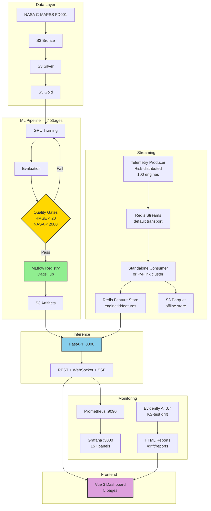
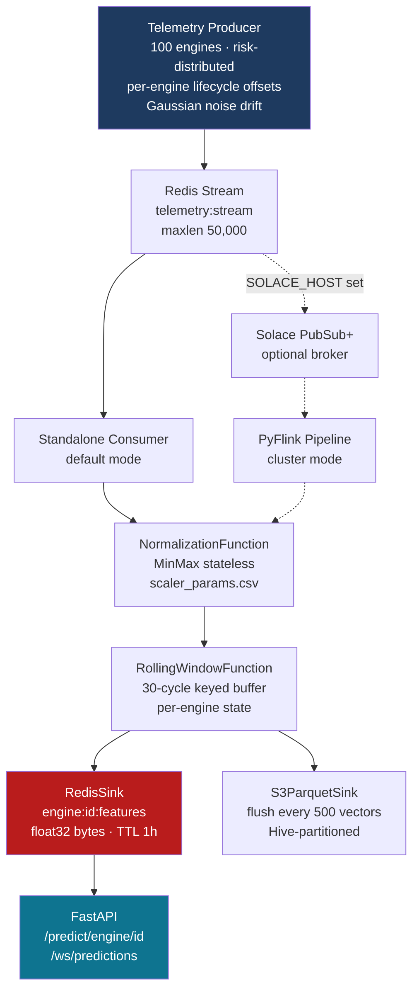

# Real-Time Aircraft Engine Predictive Maintenance System

[](https://www.python.org/)
[](https://www.tensorflow.org/)
[](https://mlflow.org/)
[](https://www.evidentlyai.com/)
[](https://vuejs.org/)
[](LICENSE)

A production-ready Machine Learning system that predicts aircraft engine **Remaining Useful Life (RUL)** using deep learning on NASA's C-MAPSS turbofan engine dataset — with a full real-time streaming pipeline, containerized deployment, on-demand retraining, and a live operations dashboard.

---

## 🎯 Project Overview

- ✅ **Automated ML Pipeline** — 7-stage modular pipeline from data ingestion to model registry
- ✅ **Deep Learning** — 3-layer GRU (128→64→32) with MC Dropout confidence estimation, trained on NASA C-MAPSS FD001
- ✅ **MLflow Integration** — Experiment tracking, model registry, versioning on DagsHub
- ✅ **S3 Data Lake** — Medallion architecture (Bronze / Silver / Gold layers)
- ✅ **FastAPI Inference** — REST + WebSocket + SSE API with Prometheus metrics
- ✅ **On-Demand Retraining** — Trigger full pipeline rerun from the dashboard, stream logs live via SSE
- ✅ **Streaming Pipeline** — Redis Streams transport (default), Solace PubSub+ optional, standalone consumer + PyFlink entry point
- ✅ **Redis Feature Store** — Online feature tensors for sub-millisecond inference reads, TTL-based expiry
- ✅ **Realistic Fleet Simulation** — Risk-distributed producer (70% LOW / 10% MED / 10% HIGH / 10% CRITICAL) with per-engine lifecycle offsets
- ✅ **Drift Detection** — Evidently AI 0.7 interactive HTML reports, KS-test per sensor, viewable in-dashboard
- ✅ **Monitoring Stack** — Prometheus + Grafana (15+ panels) + Node Exporter + Redis Exporter
- ✅ **Vue 3 Dashboard** — 5-page real-time operations UI with WebSocket streams and simulation lab
- ✅ **Full Docker Stack** — All 13 services containerized and wired in docker-compose

---

## 🏗️ High-Level Architecture



---

## 📊 Current Model Performance

| Metric | Value | Target | Status |
|--------|-------|--------|--------|
| **Test RMSE** | 14.99 cycles | < 20 | ✅ |
| **NASA Score** | 449.6 | < 2000 | ✅ |
| **Precision (Crit.)** | 91.7% | > 80% | ✅ |
| **Recall (Crit.)** | 88.0% | > 75% | ✅ |
| **F1 (Crit.)** | 0.898 | > 0.80 | ✅ |
| **Accuracy** | 95.0% | > 80% | ✅ |
| **F1 (Weighted)** | 0.950 | > 0.80 | ✅ |

> Retrain anytime via the dashboard **MLOps → Retrain Model** button or `python main.py`. Metrics update live via `/model/evaluation`.

---

## 🚀 Quick Start

### Option A — Full Docker Stack (recommended)

```bash
git clone https://github.com/nasim-raj-laskar/Real-Time-Aircraft-Engine-Predictive-Maintenance-System.git
cd Real-Time-Aircraft-Engine-Predictive-Maintenance-System

cp .env.example .env
# Fill in: AWS_ACCESS_KEY_ID, AWS_SECRET_ACCESS_KEY, AWS_S3_BUCKET, DAGSHUB_TOKEN, MLFLOW_TRACKING_URI

docker compose up -d
```

| Service | URL |
|---------|-----|
| **Dashboard** | http://localhost:5173 |
| **Inference API** | http://localhost:8000 |
| **Prometheus** | http://localhost:9090 |
| **Grafana** | http://localhost:3000 (admin/admin) |
| **Solace Manager** | http://localhost:8080 |
| **Flink Web UI** | http://localhost:8082 |

### Option B — ML Pipeline Only

```bash
uv sync
aws configure
python main.py
```

### Option C — Streaming Pipeline (local, no Flink)

```bash
# Terminal 1 — consumer
python -m streaming.pipeline.standalone_consumer

# Terminal 2 — producer (throttle once per round of 100 engines)
python -m streaming.producer.telemetry_producer --throttle 50
```

### Option D — Frontend Dev Server

```bash
cd frontend
npm install
npm run dev   # → http://localhost:5173
```

---

## 🔄 ML Pipeline (7 Stages)

```mermaid
flowchart LR
    S1[1\nData Ingestion\nS3 Bronze → local] -->
    S2[2\nData Validation\nSchema checks] -->
    S3[3\nData Transformation\nParquet + scaler] -->
    S4[4\nFeature Engineering\nSliding windows 30×11] -->
    S5[5\nModel Training\nGRU + MLflow] -->
    S6[6\nModel Evaluation\nRMSE · NASA · F1] -->
    S7[7\nModel Registry\nMLflow + S3]

    style S1 fill:#1e3a5f,color:#fff,stroke:#00d9ff
    style S2 fill:#1e3a5f,color:#fff,stroke:#00d9ff
    style S3 fill:#1e3a5f,color:#fff,stroke:#00d9ff
    style S4 fill:#1e3a5f,color:#fff,stroke:#00d9ff
    style S5 fill:#1e3a5f,color:#fff,stroke:#00d9ff
    style S6 fill:#1e3a5f,color:#fff,stroke:#00d9ff
    style S7 fill:#1e3a5f,color:#fff,stroke:#00d9ff
```



Trigger retraining from the dashboard (MLOps → Retrain Model) or via API:

```bash
curl -X POST http://localhost:8000/pipeline/run
curl -N http://localhost:8000/pipeline/logs   # SSE live log stream
```

---

## 🧠 Model Architecture

```mermaid
flowchart LR
    IN["Input\n(batch, 30, 11)"] --> G1["GRU 128\nreturn_seq=True"]
    G1 --> D1["Dropout 0.2"]
    D1 --> G2["GRU 64\nreturn_seq=True"]
    G2 --> D2["Dropout 0.2"]
    D2 --> G3["GRU 32"]
    G3 --> D3["Dropout 0.15"]
    D3 --> FC1["Dense 32\nReLU + L2"]
    FC1 --> FC2["Dense 16\nReLU + L2"]
    FC2 --> OUT["Output 1\nSigmoid → RUL ∈ [0,1]\n× 125 cycles"]

    style IN fill:#0e7490,color:#fff,stroke:none
    style OUT fill:#166534,color:#fff,stroke:none
    style D1 fill:#6b21a8,color:#fff,stroke:none
    style D2 fill:#6b21a8,color:#fff,stroke:none
    style D3 fill:#6b21a8,color:#fff,stroke:none
```



**Training:** Adam lr=0.0003, batch=256, epochs=100, early stopping patience=15, sample weighting for critical engines.

**Confidence:** MC Dropout — 30 forward passes with `training=True`, `confidence = 1 - std(preds) × 10`.

---

## 🌊 Streaming Pipeline



---

## 🖥️ Dashboard (Vue 3) — 5 Pages

| Page | Route | What it shows |
|------|-------|---------------|
| **Fleet Command Center** | `/` | Stat cards, risk pie, RUL bar chart, engine table, alerts |
| **Engine Detail** | `/engine/:id` | Risk gauge, RUL, confidence, sensor tags, metadata |
| **Pipeline Monitor** | `/pipeline` | Live topology, service health checks, telemetry feed |
| **ML Observability** | `/mlops` | Model info, GRU architecture diagram, metrics, retraining + live logs, Evidently reports |
| **Replay & Simulation Lab** | `/replay` | Synthetic telemetry, failure injection (Overheating / Pressure Drop / Vibration), live prediction feed |

WebSocket streams: `/ws/predictions` (5s), `/ws/telemetry` (2s), `/ws/alerts` (5s)

---

## 🔌 API Reference

| Method | Endpoint | Description |
|--------|----------|-------------|
| `POST` | `/predict` | Predict from normalized 30×11 array |
| `POST` | `/predict/raw` | Predict from raw sensor dict array |
| `GET`  | `/predict/engine/{id}` | Predict from Redis feature store |
| `GET`  | `/predict/stream/{id}` | Predict from push buffer |
| `POST` | `/predict/batch` | Batch predictions |
| `POST` | `/push` | Push single sensor reading to buffer |
| `GET`  | `/engines` | List all active engines |
| `GET`  | `/engines/{id}` | Engine status + last prediction |
| `GET`  | `/alerts` | Engines at or above risk threshold |
| `GET`  | `/health` | Service health |
| `GET`  | `/model/info` | Model metadata |
| `GET`  | `/model/evaluation` | Live metrics from artifacts |
| `GET`  | `/metrics` | Prometheus scrape endpoint |
| `POST` | `/pipeline/run` | Trigger full ML pipeline retraining |
| `GET`  | `/pipeline/status` | Pipeline run state |
| `GET`  | `/pipeline/logs` | SSE stream of live pipeline logs |
| `GET`  | `/drift/reports` | List Evidently HTML drift reports |
| `GET`  | `/drift/reports/{filename}` | Serve a drift report |
| `WS`   | `/ws/predictions` | Live prediction stream (5s, all Redis engines) |
| `WS`   | `/ws/telemetry` | Live telemetry metadata stream (2s) |
| `WS`   | `/ws/alerts` | Live HIGH/CRITICAL alert stream (5s) |

---

## 🛠️ Technology Stack

| Layer | Technologies |
|-------|-------------|
| **ML** | TensorFlow/Keras, NumPy, Pandas, Scikit-learn |
| **MLOps** | MLflow, DagsHub, AWS S3, Boto3 |
| **Inference** | FastAPI, Uvicorn, Redis, Pydantic, MC Dropout |
| **Streaming** | Redis Streams, Solace PubSub+ (optional), Apache Flink (PyFlink), PyArrow |
| **Frontend** | Vue 3, Vite, TypeScript, TailwindCSS, ECharts, Pinia, Vue Router |
| **Monitoring** | Prometheus, Grafana, Evidently AI 0.7, Node Exporter, Redis Exporter |
| **Infrastructure** | Docker, nginx, docker-compose |
| **Dev** | uv, Python 3.12, Node 20 |

---

## ☁️ S3 Data Lake

```
s3://aircraft-engine-data/
├── bronze/          raw FD001 files
├── silver/          processed Parquet
├── gold/            NumPy feature arrays
└── artifacts/       model.keras, scaler.pkl, metrics, plots
```

---

## 📚 Documentation

| Doc | Content |
|-----|---------|
| `docs/00_index.md` | Navigation hub + quick reference |
| `docs/01_dataset.md` | C-MAPSS dataset reference |
| `docs/02_preprocessing.md` | Preprocessing pipeline |
| `docs/03_feature_engineering.md` | Sequence building |
| `docs/04_model_training.md` | GRU + MLflow registry |
| `docs/05_inference_service.md` | Full API reference, retraining, Redis schema |
| `docs/06_streaming_pipeline.md` | Redis Streams + Solace + Flink pipeline |
| `docs/07_monitoring.md` | Prometheus + Grafana + Evidently 0.7 |
| `docs/07.1_UI.md` | Vue 3 dashboard — 5 pages, stores, WebSocket |
| `docs/08_project_structure.md` | Directory layout, Docker stack |
| `docs/09_architecture.md` | System architecture diagrams |

---

## 📊 MLflow

All training runs tracked at:
```
https://dagshub.com/nasim-raj-laskar/Real-Time-Aircraft-Engine-Predictive-Maintenance-System.mlflow/
```

---

## 📄 License

MIT — see [LICENSE](LICENSE)

---

## 📧 Contact

**Nasim Raj Laskar** — [@nasim-raj-laskar](https://github.com/nasim-raj-laskar)

MLflow experiments: [DagsHub](https://dagshub.com/nasim-raj-laskar/Real-Time-Aircraft-Engine-Predictive-Maintenance-System.mlflow/)

---

**Built with ❤️ for Production ML Systems**
