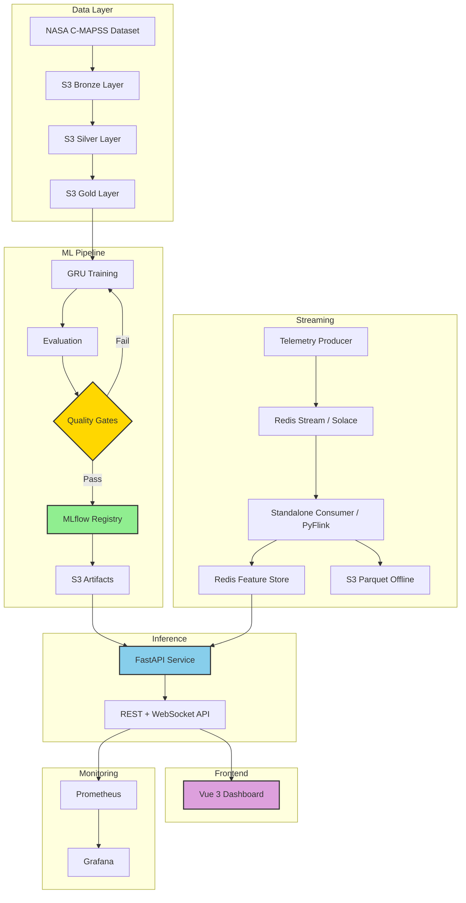

# Real-Time Aircraft Engine Predictive Maintenance System

[](https://www.python.org/)
[](https://www.tensorflow.org/)
[](https://mlflow.org/)
[](https://vuejs.org/)
[](LICENSE)

A production-ready Machine Learning system that predicts aircraft engine **Remaining Useful Life (RUL)** using deep learning on NASA's C-MAPSS turbofan engine dataset — with a full real-time streaming pipeline, containerized deployment, and a live operations dashboard.

---

## 🎯 Project Overview

- ✅ **Automated ML Pipeline** — 7-stage modular pipeline from data ingestion to model registry
- ✅ **Deep Learning** — 3-layer GRU model trained on NASA C-MAPSS FD001
- ✅ **MLflow Integration** — Experiment tracking, model registry, versioning on DagsHub
- ✅ **S3 Data Lake** — Medallion architecture (Bronze / Silver / Gold layers)
- ✅ **FastAPI Inference** — REST + WebSocket API with Prometheus metrics
- ✅ **Streaming Pipeline** — Solace PubSub+ producer, Redis Streams transport, standalone consumer, PyFlink entry point
- ✅ **Redis Feature Store** — Online feature tensors for sub-millisecond inference reads
- ✅ **Drift Detection** — Evidently AI HTML reports
- ✅ **Monitoring Stack** — Prometheus + Grafana + Node Exporter + Redis Exporter
- ✅ **Vue 3 Dashboard** — Real-time operations UI with WebSocket live updates
- ✅ **Full Docker Stack** — All services containerized and wired in docker-compose

---

## 🏗️ High-Level Architecture



---

## 📊 Current Model Performance

| Metric | Value | Target | Status |
|--------|-------|--------|--------|
| **Test RMSE** | 26.15 cycles | < 20 | ❌ |
| **NASA Score** | 2181.2 | < 2000 | ❌ |
| **Accuracy** | 75.0% | > 80% | ❌ |
| **F1 (Weighted)** | 0.643 | > 0.80 | ❌ |

> Model needs retraining — run `python main.py` to produce a new version. Metrics update live in the dashboard via `/model/evaluation`.

---

## 🚀 Quick Start

### Option A — Full Docker Stack (recommended)

```bash
git clone https://github.com/nasim-raj-laskar/Real-Time-Aircraft-Engine-Predictive-Maintenance-System.git
cd Real-Time-Aircraft-Engine-Predictive-Maintenance-System

cp .env.example .env
# Fill in AWS_ACCESS_KEY_ID, AWS_SECRET_ACCESS_KEY, DAGSHUB_TOKEN, MLFLOW_TRACKING_URI

docker compose up -d
```

| Service | URL |
|---------|-----|
| **Dashboard** | http://localhost:5173 |
| **Inference API** | http://localhost:8000 |
| **Prometheus** | http://localhost:9090 |
| **Grafana** | http://localhost:3000 |
| **Solace Manager** | http://localhost:8080 |
| **Flink Web UI** | http://localhost:8082 |

### Option B — ML Pipeline Only

```bash
uv sync
aws configure
python main.py
```

### Option C — Frontend Dev Server

```bash
# Backend must be running first
cd frontend
npm install
npm run dev   # → http://localhost:5173
```

---

## 📁 Project Structure

```
├── src/
│   ├── components/          # 7-stage ML pipeline components
│   ├── pipeline/            # Pipeline orchestration
│   ├── inference/           # FastAPI app, routes, WebSocket, predictor
│   │   ├── app.py           # FastAPI entry point
│   │   ├── routes.py        # REST endpoints
│   │   ├── ws.py            # WebSocket streams
│   │   ├── feature_store.py # Redis feature store client
│   │   ├── buffer.py        # Rolling sensor buffer
│   │   ├── metrics.py       # Prometheus metrics
│   │   └── structured_logger.py
│   ├── monitoring/          # Evidently drift detection
│   ├── cloud/               # S3 integration
│   └── utils/
│
├── streaming/
│   ├── producer/            # Telemetry producer (Redis Streams + Solace)
│   ├── pipeline/
│   │   ├── telemetry_pipeline.py   # PyFlink entry point
│   │   ├── standalone_consumer.py  # Pure Python consumer (no Flink needed)
│   │   ├── functions/       # NormalizationFunction, RollingWindowFunction
│   │   └── sinks/           # RedisSink, S3ParquetSink
│   ├── model/               # EngineEvent, FeatureVector dataclasses
│   └── config/              # solace.env
│
├── frontend/                # Vue 3 + Vite + TypeScript dashboard
│   ├── src/
│   │   ├── pages/           # FleetPage, EnginePage, PipelinePage, MLOpsPage
│   │   ├── components/      # StatCard, EngineTable, AlertsPanel, charts
│   │   ├── stores/          # Pinia: engineStore, alertStore
│   │   ├── composables/     # useWebSockets
│   │   ├── services/        # api.ts (axios), websocket.ts
│   │   └── types/           # TypeScript interfaces
│   └── ...
│
├── monitoring/
│   ├── prometheus/          # prometheus.yml, alerting_rules.yml
│   └── grafana/             # Dashboard JSON, provisioning
│
├── config/                  # YAML pipeline configs
├── artifacts/               # Generated model artifacts
├── docs/                    # Full system documentation (10 docs)
├── scripts/                 # export_scaler_params.py, install_flink.sh
├── Dockerfile               # Inference API image
├── Dockerfile.streaming     # Producer + consumer image
├── Dockerfile.frontend      # Vue build + nginx image
├── nginx.conf               # nginx reverse proxy config
├── docker-compose.yml       # Full stack orchestration
└── main.py                  # ML pipeline runner
```

---

## 🔄 ML Pipeline (7 Stages)

| Stage | Component | Output |
|-------|-----------|--------|
| 1 | Data Ingestion | Raw files from S3 Bronze |
| 2 | Data Validation | Schema + column checks |
| 3 | Data Transformation | Parquet + scaler → S3 Silver |
| 4 | Feature Engineering | NumPy sequences → S3 Gold |
| 5 | Model Training | GRU model + MLflow run |
| 6 | Model Evaluation | RMSE, NASA score, F1, plots |
| 7 | Model Registry | MLflow registry + S3 artifacts |

---

## 🧠 Model Architecture

```
Input:   (batch, 30, 11)       — 30 timesteps, 11 sensors

GRU 128  return_sequences=True
Dropout  0.2
GRU 64   return_sequences=True
Dropout  0.2
GRU 32
Dropout  0.15
Dense 32  ReLU + L2
Dense 16  ReLU + L2
Output 1  Sigmoid  →  RUL in [0, 1]  (denormalize × 125)
```

**Training:** Adam lr=0.0003, batch=256, epochs=150, early stopping, sample weighting for critical engines.

---

## 🌊 Streaming Pipeline

```
Telemetry Producer
  └─ reads FD001 rows, adds Gaussian noise each pass, loops forever
  └─ publishes to Redis Stream (default) or Solace PubSub+ (SOLACE_HOST set)

Standalone Consumer  (or PyFlink telemetry_pipeline.py for cluster mode)
  └─ NormalizationFunction   — MinMax per event, reads scaler_params.csv
  └─ RollingWindowFunction   — per-engine 30-cycle keyed buffer
  └─ RedisSink               — writes engine:{id}:features (float32 bytes)
  └─ S3ParquetSink           — flushes every FLUSH_EVERY vectors

FastAPI /predict/engine/{id}
  └─ reads engine:{id}:features from Redis
  └─ GRU forward pass → RUL + risk level
```

**Run streaming locally:**
```bash
# Terminal 1
python -m streaming.pipeline.standalone_consumer

# Terminal 2
python -m streaming.producer.telemetry_producer --throttle 50
```

---

## 🖥️ Dashboard (Vue 3)

Four pages, all live via WebSocket:

| Page | Route | What it shows |
|------|-------|---------------|
| **Fleet Command Center** | `/` | Stat cards, risk pie, RUL bar chart, engine table, alerts |
| **Engine Detail** | `/engine/:id` | Risk gauge, RUL, confidence, sensor tags, metadata |
| **Pipeline Monitor** | `/pipeline` | Topology flow, service links, live counters |
| **ML Observability** | `/mlops` | Active model info, real metrics from API, architecture |

WebSocket streams: `/ws/predictions` (5s), `/ws/telemetry` (2s), `/ws/alerts` (5s)

---

## 🔌 API Reference

| Method | Endpoint | Description |
|--------|----------|-------------|
| `POST` | `/predict` | Predict from normalized 30×11 array |
| `POST` | `/predict/raw` | Predict from raw sensor dict array |
| `GET` | `/predict/engine/{id}` | Predict from Redis feature store |
| `POST` | `/predict/batch` | Batch predictions |
| `POST` | `/push` | Push single sensor reading to buffer |
| `GET` | `/engines` | List all active engines |
| `GET` | `/engines/{id}` | Engine status + last prediction |
| `GET` | `/alerts` | Engines at or above risk threshold |
| `GET` | `/health` | Service health |
| `GET` | `/model/info` | Model metadata |
| `GET` | `/model/evaluation` | Real metrics from artifacts |
| `GET` | `/metrics` | Prometheus scrape endpoint |
| `WS` | `/ws/predictions` | Live prediction stream |
| `WS` | `/ws/telemetry` | Live telemetry metadata stream |
| `WS` | `/ws/alerts` | Live HIGH/CRITICAL alert stream |

---

## 🛠️ Technology Stack

| Layer | Technologies |
|-------|-------------|
| **ML** | TensorFlow/Keras, NumPy, Pandas, Scikit-learn |
| **MLOps** | MLflow, DagsHub, AWS S3, Boto3 |
| **Inference** | FastAPI, Uvicorn, Redis, Pydantic |
| **Streaming** | Solace PubSub+, Redis Streams, Apache Flink (PyFlink), PyArrow |
| **Frontend** | Vue 3, Vite, TypeScript, TailwindCSS, ECharts, Pinia, Vue Router |
| **Monitoring** | Prometheus, Grafana, Evidently AI, Node Exporter, Redis Exporter |
| **Infrastructure** | Docker, nginx, docker-compose |
| **Dev** | uv, Python 3.11, Node 20 |

---

## 📊 MLflow

All training runs tracked at:
```
https://dagshub.com/nasim-raj-laskar/Real-Time-Aircraft-Engine-Predictive-Maintenance-System.mlflow/
```

---

## ☁️ S3 Data Lake

```
s3://aircraft-engine-data/
├── bronze/          raw FD001 files
├── silver/          processed Parquet
├── gold/            NumPy feature arrays
└── artifacts/       model.keras, scaler.pkl, metrics, plots
```

---

## 📚 Documentation

| Doc | Content |
|-----|---------|
| `docs/00_index.md` | Navigation hub |
| `docs/01_dataset.md` | C-MAPSS dataset reference |
| `docs/02_preprocessing.md` | Preprocessing pipeline |
| `docs/03_feature_engineering.md` | Sequence building |
| `docs/04_model_training.md` | GRU + MLflow registry |
| `docs/05_inference_service.md` | FastAPI design |
| `docs/06_streaming_pipeline.md` | Solace + Flink pipeline |
| `docs/07_monitoring.md` | Prometheus + Grafana + Evidently |
| `docs/07.1_UI.md` | Vue dashboard architecture |
| `docs/08_project_structure.md` | Project layout |
| `docs/09_architecture.md` | System architecture diagrams |

---

## 📄 License

MIT — see [LICENSE](LICENSE)

---

## 📧 Contact

**Nasim Raj Laskar** — [@nasim-raj-laskar](https://github.com/nasim-raj-laskar)

MLflow experiments: [DagsHub](https://dagshub.com/nasim-raj-laskar/Real-Time-Aircraft-Engine-Predictive-Maintenance-System.mlflow/)

---

**Built with ❤️ for Production ML Systems**
