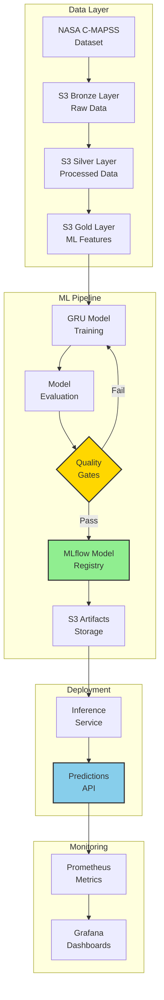

# Real-Time Aircraft Engine Predictive Maintenance System

[](https://www.python.org/)
[](https://www.tensorflow.org/)
[](https://mlflow.org/)
[](LICENSE)

A production-ready Machine Learning system that predicts aircraft engine **Remaining Useful Life (RUL)** using deep learning on NASA's C-MAPSS turbofan engine dataset.

## 🎯 Project Overview

This system demonstrates end-to-end MLOps practices for predictive maintenance:

- ✅ **Automated ML Pipeline** - 7-stage modular pipeline from data ingestion to model deployment
- ✅ **Deep Learning** - 3-layer GRU model with 95.4% precision on critical engine detection
- ✅ **MLflow Integration** - Experiment tracking, model registry, and versioning
- ✅ **S3 Data Lake** - Medallion architecture (Bronze/Silver/Gold layers)
- ✅ **Model Registry** - Automated promotion with quality gates
- ✅ **FastAPI Inference** - Production-ready REST API with health checks
- ✅ **Prometheus Metrics** - Real-time performance monitoring
- ✅ **Drift Detection** - Evidently AI for data quality monitoring
- ✅ **Docker Deployment** - Containerized services with docker-compose
- 🔮 **Streaming Ready** - Designed for Kafka + Flink real-time inference

---

## 🏗️ High-Level Architecture



---

## 📊 Current Performance

| Metric | Value | Target | Status |
|--------|-------|--------|--------|
| **Test RMSE** | 15.28 cycles | < 20 | ✅ |
| **NASA Score** | 444.6 | < 2000 | ✅ |
| **Precision (Critical)** | 95.4% | > 80% | ✅ |
| **Recall (Critical)** | 84.0% | > 75% | ✅ |
| **F1-Score** | 0.894 | > 0.80 | ✅ |

---

## 🚀 Quick Start

### Prerequisites

- Python 3.11+
- AWS Account (for S3 storage)
- DagsHub Account (for MLflow tracking)

### Installation

```bash
# Clone repository
git clone https://github.com/nasim-raj-laskar/Real-Time-Aircraft-Engine-Predictive-Maintenance-System.git
cd Real-Time-Aircraft-Engine-Predictive-Maintenance-System

# Install dependencies using uv
uv sync

# Configure AWS credentials
aws configure

# Set up environment variables
cp .env.example .env
# Edit .env with your credentials:
# - AWS_ACCESS_KEY_ID
# - AWS_SECRET_ACCESS_KEY
# - DAGSHUB_TOKEN
# - MLFLOW_TRACKING_URI
```

### Run Pipeline

```bash
python main.py
```

**Expected Output:**
```
✓ Warnings suppressed
Accessing as nasim-raj-laskar
Initialized MLflow...

Epoch 1/150
56/56 ━━━━━━━━━━━━━━━━━━━━ 13s - loss: 0.1676 - rmse: 0.2966
...
Epoch 150/150
56/56 ━━━━━━━━━━━━━━━━━━━━ 6s - loss: 0.0342 - rmse: 0.1229

Created version '3' of model 'aircraft-rul-gru'.

======================================================================
🎉 PIPELINE EXECUTION COMPLETED SUCCESSFULLY
======================================================================

📊 View your experiment at:
   https://dagshub.com/nasim-raj-laskar/...

📁 Artifacts saved in: artifacts/
☁️  Artifacts uploaded to S3
🏷️  Model registered to MLflow Model Registry
======================================================================
```

---

## 📁 Project Structure

```
Real-Time-Aircraft-Engine-Predictive-Maintenance-System/
│
├── src/
│   ├── components/          # Core ML components
│   │   ├── data_ingestion.py
│   │   ├── data_validation.py
│   │   ├── data_transformation.py
│   │   ├── feature_engineering.py
│   │   ├── model_training.py
│   │   ├── model_evaluation.py
│   │   └── model_registry.py
│   │
│   ├── pipeline/            # Pipeline orchestration
│   ├── config/              # Configuration management
│   ├── entity/              # Data classes
│   ├── utils/               # Helper functions
│   ├── metrics/             # Evaluation metrics
│   ├── cloud/               # S3 integration
│   └── logging/             # Structured logging
│
├── config/                  # YAML configurations
│   ├── config.yaml          # Pipeline config
│   ├── model.yaml           # Model architecture
│   ├── params.yaml          # Training params
│   └── registor.yaml        # Model registry
│
├── artifacts/               # Generated artifacts
│   ├── data_ingestion/
│   ├── data_transformation/
│   ├── data_feature_engineering/
│   ├── model_trainer/
│   ├── model_evaluation/
│   └── model_registry/
│
├── docs/                    # Documentation
├── Dataset/                 # NASA C-MAPSS data
├── main.py                  # Pipeline runner
└── README.md
```

---

## 🔄 ML Pipeline (7 Stages)

### Stage 1: Data Ingestion
- Downloads raw data from S3 (Bronze layer)
- Stores locally in `artifacts/data_ingestion/`

### Stage 2: Data Validation
- Schema validation
- Column checks
- Data quality verification

### Stage 3: Data Transformation
- Drops constant sensors (10 sensors removed)
- Computes RUL labels
- Clips RUL at 125 cycles
- MinMaxScaler normalization
- Saves to Parquet (Silver layer)

### Stage 4: Feature Engineering
- Builds sequences (30 timesteps × 11 sensors)
- Group-aware train/val split (80/20)
- Saves NumPy arrays (Gold layer)

### Stage 5: Model Training
- **Architecture:** 3-layer GRU (128, 64, 32 units)
- **Dense Layers:** 2 layers (32, 16 units)
- **Dropout:** [0.2, 0.2, 0.15]
- **Optimizer:** Adam (LR: 0.0003)
- **Callbacks:** Early stopping, LR reduction
- **MLflow:** Logs params, metrics, artifacts

### Stage 6: Model Evaluation
- **Metrics:** RMSE, NASA score, precision, recall, F1
- **Plots:** Confusion matrix, pred vs true, error distribution
- **MLflow:** Logs evaluation results

### Stage 7: Model Registry
- **Quality Gates:** RMSE ≤ 20, NASA Score ≤ 2000
- **MLflow Registry:** Automatic versioning
- **Stage Promotion:** None → Staging → Production
- **S3 Upload:** All artifacts for deployment

---

## 🧠 Model Architecture

```python
Input: (batch_size, 30, 11)  # 30 timesteps, 11 sensors

GRU Layer 1: 128 units, return_sequences=True
Dropout: 0.2

GRU Layer 2: 64 units, return_sequences=True
Dropout: 0.2

GRU Layer 3: 32 units
Dropout: 0.15

Dense Layer 1: 32 units, ReLU, L2 regularization
Dense Layer 2: 16 units, ReLU, L2 regularization

Output: 1 unit, Sigmoid activation

Output: Normalized RUL in [0, 1]
```

**Training Configuration:**
- Epochs: 150
- Batch Size: 256
- Learning Rate: 0.0003
- Loss: MSE
- Sample Weighting: Higher weight for critical engines

---

## 📈 Dataset

**NASA C-MAPSS Turbofan Engine Degradation Dataset**

- **Source:** NASA Prognostics Center of Excellence
- **Engines:** 100 training, 100 test (FD001)
- **Sensors:** 21 total, 11 useful (after dropping constants)
- **Cycles:** 128-362 per engine
- **Target:** Remaining Useful Life (RUL)

**Useful Sensors:**
```
s2  - Total temperature at LPC outlet (T24)
s3  - Total temperature at HPC outlet (T30)
s4  - Total temperature at LPT outlet (T50)
s7  - Total pressure at HPC outlet (P30)
s9  - Physical core speed (Nc)
s11 - Static pressure at HPC outlet (Ps30)
s12 - Ratio of fuel flow to Ps30 (phi)
s14 - Corrected core speed (NRc)
s17 - Bleed enthalpy (htBleed)
s20 - HPT coolant bleed (W31)
s21 - LPT coolant bleed (W32)
```

---

## 🛠️ Technology Stack

### Core ML
- **TensorFlow/Keras** - Deep learning framework
- **NumPy** - Numerical computing
- **Pandas** - Data manipulation
- **Scikit-learn** - Preprocessing, metrics

### MLOps
- **MLflow** - Experiment tracking, model registry
- **DagsHub** - MLflow hosting
- **AWS S3** - Data lake (Bronze/Silver/Gold)
- **Boto3** - S3 client

### Data Storage
- **Parquet** - Processed data format
- **NumPy Arrays** - Model inputs
- **JSON** - Configuration and metadata

### Development
- **uv** - Fast Python package manager
- **Python 3.11** - Programming language

### Inference & Monitoring (Implemented)
- **FastAPI** - REST API for inference ✅
- **Prometheus** - Metrics collection ✅
- **Evidently AI** - Drift detection ✅
- **Docker** - Containerized deployment ✅
- **Redis** - Feature store (ready) ✅

### Future (Designed)
- **Kafka/Solace** - Event streaming
- **Apache Flink** - Stream processing
- **Grafana** - Custom dashboards
- **PostgreSQL** - Historical data

---

## 📊 MLflow Integration

### Experiment Tracking

All training runs are logged to MLflow with:
- **Parameters:** Model architecture, hyperparameters
- **Metrics:** Training/validation loss, RMSE, NASA score, F1
- **Artifacts:** Model, training history, evaluation plots

### Model Registry

Models are automatically registered with:
- **Versioning:** Each run creates a new version
- **Stages:** None → Staging → Production
- **Metadata:** Metrics, parameters, signature
- **Promotion:** Automated based on quality gates

**Access MLflow UI:**
```
https://dagshub.com/nasim-raj-laskar/Real-Time-Aircraft-Engine-Predictive-Maintenance-System.mlflow/
```

---

## ☁️ S3 Data Lake

### Medallion Architecture

```
s3://aircraft-engine-data/
│
├── bronze/                  # Raw data
│   ├── train_FD001.txt
│   ├── test_FD001.txt
│   └── RUL_FD001.txt
│
├── silver/                  # Processed data
│   ├── train_processed.parquet
│   └── test_processed.parquet
│
├── gold/                    # ML features
│   ├── X_train.npy
│   ├── y_train.npy
│   ├── X_val.npy
│   ├── y_val.npy
│   ├── X_test.npy
│   └── y_test.npy
│
└── artifacts/               # Model artifacts
    ├── model.keras
    ├── scaler.pkl
    ├── history.json
    ├── metrics.json
    └── *.png (plots)
```

---

## 🚀 Inference & Monitoring (NEW!)

### ✅ Implemented Features

**FastAPI Inference Service:**
```bash
# Start API
start_api.bat

# Test predictions
uv run python test/test_inference.py

# Verify features
verify_features.bat
```

**Endpoints:**
- `POST /predict` - RUL prediction
- `GET /health` - Health check
- `GET /metrics` - Prometheus metrics
- `GET /model/info` - Model metadata

**Prometheus Monitoring:**
- Request rate & latency tracking
- ML metrics (RUL, risk, confidence)
- Error rate monitoring
- System health metrics

**Drift Detection:**
```bash
# Run drift check
run_drift_check.bat
```
- Evidently AI integration
- Statistical drift detection
- HTML report generation
- Alert levels (OK/WARNING/CRITICAL)

**Docker Deployment:**
```bash
# Start the full application + monitoring stack
docker compose up -d
```

**Services:**
- Inference API (port 8000)
- Redis (port 6379)
- Prometheus (port 9090)
- Grafana (port 3000)

**See [MONITORING.md](MONITORING.md) for complete guide**

---

## 🔮 Future Features (Designed)

### Streaming Pipeline
- Solace PubSub+ / Kafka event streaming
- Apache Flink stream processing
- Redis online feature store
- PostgreSQL historical data

### Advanced Monitoring
- Custom Grafana dashboards
- Alert notifications (Slack/email)
- Real-time drift monitoring
- Model performance tracking

**Documentation:** All future features are fully designed in `docs/` folder

---

## 📚 Documentation

Comprehensive documentation available in `docs/` folder:

- `00_index.md` - Navigation hub
- `01_dataset.md` - Dataset reference
- `02_preprocessing.md` - Preprocessing pipeline
- `03_feature_engineering.md` - Sequence building
- `04_model_training.md` - GRU model + Model Registry
- `05_inference_service.md` - FastAPI design (future)
- `06_streaming_pipeline.md` - Kafka architecture (future)
- `07_monitoring.md` - Observability stack (future)
- `08_project_structure.md` - Project layout
- `09_architecture.md` - System architecture

---

## 🧪 Testing

```bash
# Run with 10 epochs for quick testing
# Edit config/params.yaml: epochs: 10

python main.py

# Expected results (10 epochs):
# - Test RMSE: ~15-18 cycles
# - F1-Score: ~0.85-0.90
# - Training time: ~2-3 minutes
```

---

## 🤝 Contributing

Contributions are welcome! Please:

1. Fork the repository
2. Create a feature branch
3. Make your changes
4. Submit a pull request

---

## 📄 License

This project is licensed under the MIT License - see the [LICENSE](LICENSE) file for details.

---

## 🙏 Acknowledgments

- **NASA Prognostics Center of Excellence** - C-MAPSS dataset
- **DagsHub** - MLflow hosting
- **AWS** - S3 storage

---

## 📧 Contact

**Nasim Raj Laskar**
- GitHub: [@nasim-raj-laskar](https://github.com/nasim-raj-laskar)
- MLflow: [View Experiments](https://dagshub.com/nasim-raj-laskar/Real-Time-Aircraft-Engine-Predictive-Maintenance-System.mlflow/)

---

## 🌟 Star History

If you find this project useful, please consider giving it a star! ⭐

---

**Built with ❤️ for Production ML Systems**
