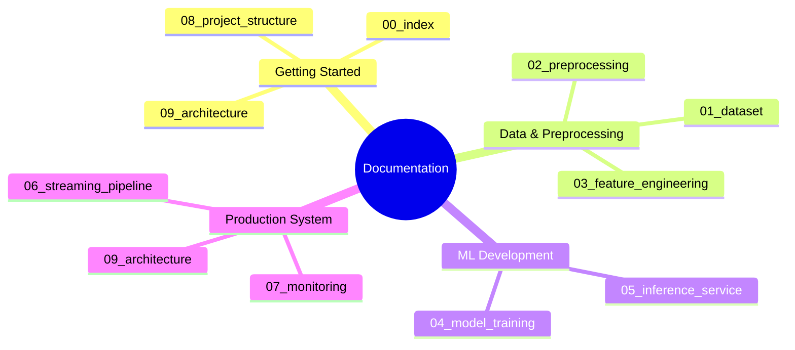
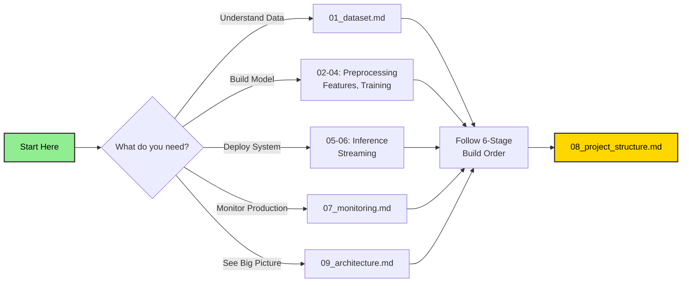

# Documentation Index

## Real-Time Aircraft Engine Predictive Maintenance System

---

## Documentation Map

---

| # | Document | What It Covers |
|---|----------|---------------|
| 00 | [Documentation Index](00_index.md) | This file - navigation and quick reference |
| 01 | [Dataset Reference](01_dataset.md) | Sub-datasets, column schema, sensor reference, RUL ground truth files |
| 02 | [Preprocessing Pipeline](02_preprocessing.md) | Sensor dropping, RUL computation, clipping, normalization, windowing, train/val split |
| 03 | [Feature Engineering](03_feature_engineering.md) | Sequence building for GRU, sliding windows, target normalization, train/val split |
| 04 | [Model Training](04_model_training.md) | GRU architecture, sample weighting, MLflow tracking, callbacks, model artifacts |
| 05 | [Inference Service](05_inference_service.md) | FastAPI API design (future implementation), Redis feature lookup, model serving, Docker setup |
| 06 | [Streaming Pipeline](06_streaming_pipeline.md) | Kafka producer simulator (future), feature engineering consumer, event schema, scaling |
| 07 | [Monitoring and Observability](07_monitoring.md) | Prometheus metrics (future), Grafana dashboards, Evidently drift detection, alerting rules |
| 08 | [Project Structure and Build Order](08_project_structure.md) | Directory layout, 6-stage pipeline, dependencies, environment setup, key design decisions |
| 09 | [System Architecture](09_architecture.md) | High-level architecture, data flow, component interactions, deployment diagrams |

---

## Quick Reference

### Dataset facts
- 4 sub-datasets (FD001–FD004), start with FD001
- 26 columns: unit, cycle, 3 operational settings, 21 sensors
- 11 useful sensors after dropping near-constant ones
- RUL must be computed from training data; test ground truth in `RUL_FD00X.txt`

### Critical preprocessing steps
1. Drop sensors: `s1, s5, s6, s8, s10, s13, s15, s16, s18, s19`
2. Compute RUL = max_cycle − current_cycle
3. Clip RUL at 125
4. Normalize with MinMaxScaler (global for FD001)
5. Build sequences with window size 30
6. Group-based train/val split (never split rows randomly)

### Target metrics
- FD001 RMSE target: < 15 cycles
- Model: GRU with 2 layers
- Training: MLflow tracking, early stopping, sample weighting

### Build sequence
Stage 1 → Data Ingestion from S3  
Stage 2 → Data Validation  
Stage 3 → Data Transformation (preprocessing & scaling)  
Stage 4 → Feature Engineering (sequence building)  
Stage 5 → Model Training (GRU)  
Stage 6 → Model Evaluation  
