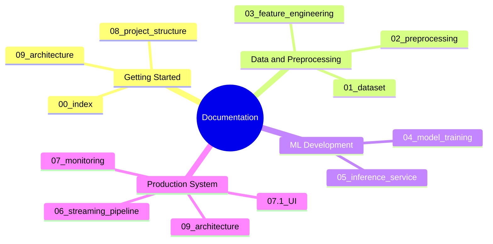
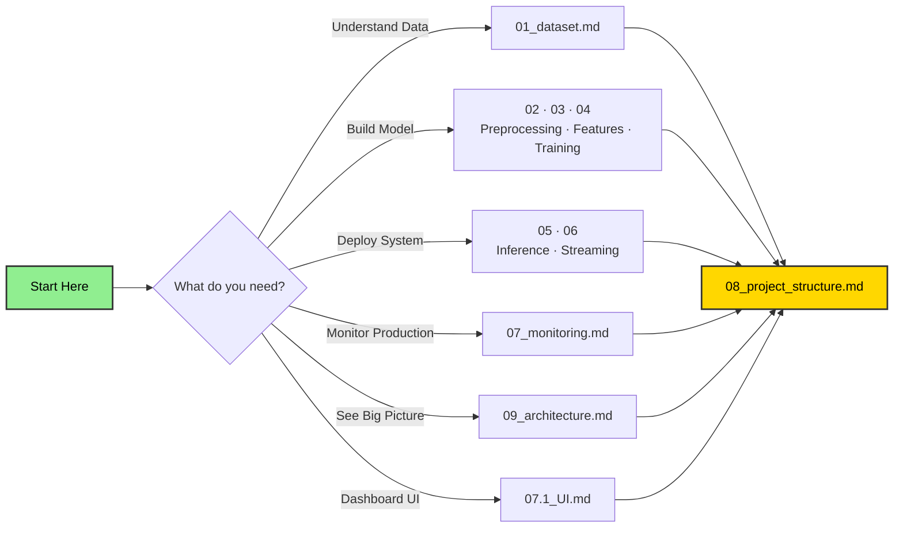

# Documentation Index

## Real-Time Aircraft Engine Predictive Maintenance System

---

## Documentation Map



---

| # | Document | What It Covers |
|---|----------|---------------|
| 00 | [Documentation Index](00_index.md) | This file — navigation and quick reference |
| 01 | [Dataset Reference](01_dataset.md) | Sub-datasets, column schema, sensor reference, RUL ground truth files |
| 02 | [Preprocessing Pipeline](02_preprocessing.md) | Sensor dropping, RUL computation, clipping, normalization, windowing, train/val split |
| 03 | [Feature Engineering](03_feature_engineering.md) | Sequence building for GRU, sliding windows, target normalization, train/val split |
| 04 | [Model Training & Registry](04_model_training.md) | GRU architecture, training, evaluation, MLflow Model Registry, promotion, S3 upload |
| 05 | [Inference Service](05_inference_service.md) | FastAPI REST + WebSocket API, Redis feature store, pipeline retraining endpoint, Docker |
| 06 | [Streaming Pipeline](06_streaming_pipeline.md) | Redis Streams transport, risk-distributed producer, standalone consumer, PyFlink entry point, Solace optional |
| 07 | [Monitoring and Observability](07_monitoring.md) | Prometheus + Grafana, Evidently drift detection (Evidently 0.7 API), alerting rules |
| 07.1 | [Dashboard UI](07.1_UI.md) | Vue 3 dashboard — 5 pages, WebSocket streams, Pinia stores, retraining UI |
| 08 | [Project Structure and Build Order](08_project_structure.md) | Directory layout, 7-stage pipeline, Docker stack, environment setup |
| 09 | [System Architecture](09_architecture.md) | High-level architecture, data flow, component interactions, deployment diagrams |

---

## Quick Reference



---

## Dataset Facts

- 4 sub-datasets (FD001–FD004), using **FD001** (single condition, single fault mode)
- 26 columns: unit, cycle, 3 operational settings, 21 sensors
- **11 useful sensors** after dropping near-constant ones
- RUL must be computed from training data; test ground truth in `RUL_FD001.txt`

## Critical Preprocessing Steps

1. Drop sensors: `s1, s5, s6, s8, s10, s13, s15, s16, s18, s19`
2. Compute RUL = max_cycle − current_cycle
3. Clip RUL at **125**
4. Normalize with MinMaxScaler (global for FD001)
5. Build sequences with **window size 30**
6. Group-based train/val split (never split rows randomly)

## Model Summary

- Architecture: 3-layer GRU (128 → 64 → 32) + Dense (32 → 16) + Sigmoid output
- Dropout: 0.2 / 0.2 / 0.15 per GRU layer
- Training: Adam lr=0.0003, batch=256, early stopping patience=15, sample weighting
- Confidence: MC Dropout — 30 forward passes, `confidence = 1 - std(preds) × 10`

## Current Performance

| Metric | Value | Target | Status |
|--------|-------|--------|--------|
| Test RMSE | 14.99 cy | < 20 | ✅ |
| NASA Score | 449.6 | < 2000 | ✅ |
| Precision (Crit.) | 91.7% | > 80% | ✅ |
| Recall (Crit.) | 88.0% | > 75% | ✅ |
| F1 (Crit.) | 0.898 | > 0.80 | ✅ |
| Accuracy | 95.0% | > 80% | ✅ |
| F1 (Weighted) | 0.950 | > 0.80 | ✅ |

## Build Sequence


## Retraining

Trigger a full pipeline rerun from the MLOps dashboard or via API:

```bash
curl -X POST http://localhost:8000/pipeline/run
curl -N http://localhost:8000/pipeline/logs   # SSE live log stream
```
