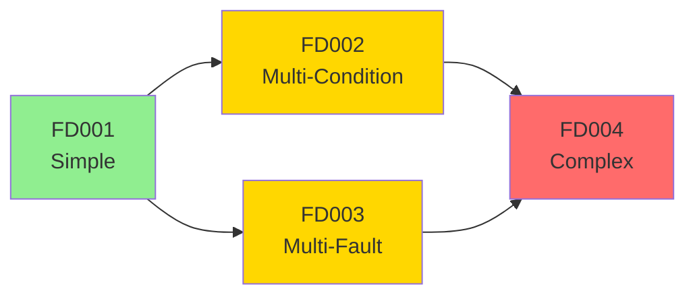
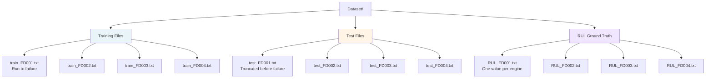
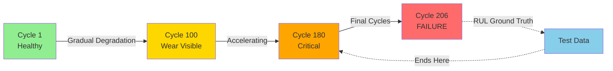

# Dataset Reference

## Source

NASA C-MAPSS (Commercial Modular Aero-Propulsion System Simulation) Turbofan Engine Degradation Dataset.

Original paper: *Damage Propagation Modeling for Aircraft Engine Run-to-Failure Simulation* — Saxena, Goebel, Simon, Eklund (PHM08, Denver, 2008).

---

## Dataset Complexity Progression



---

## Sub-Datasets Overview

| Dataset | Train Engines | Test Engines | Operating Conditions | Fault Modes |
|---------|--------------|--------------|----------------------|-------------|
| FD001   | 100          | 100          | 1 (Sea Level)        | 1 (HPC Degradation) |
| FD002   | 260          | 259          | 6                    | 1 (HPC Degradation) |
| FD003   | 100          | 100          | 1 (Sea Level)        | 2 (HPC + Fan Degradation) |
| FD004   | 249          | 248          | 6                    | 2 (HPC + Fan Degradation) |

- HPC = High Pressure Compressor
- FD001 is the simplest. FD004 is the hardest.
- Always develop and validate on FD001 first before generalizing.

---

## Cycle Statistics (Training Data)

| Dataset | Min Cycles | Max Cycles | Mean Cycles | Total Rows |
|---------|-----------|-----------|-------------|------------|
| FD001   | 128       | 362       | 206         | 20,631     |
| FD002   | 128       | 378       | 207         | 53,759     |
| FD003   | 145       | 525       | 247         | 24,720     |
| FD004   | 128       | 543       | 246         | 61,249     |

---

## File Structure



All files are space-separated, no header row, 26 columns.

---

## Column Schema

| Column Index | Name                  | Description |
|--------------|-----------------------|-------------|
| 0            | unit                  | Engine ID (1-indexed) |
| 1            | cycle                 | Flight cycle number (starts at 1 per engine) |
| 2            | operational_setting_1 | Throttle resolver angle or similar |
| 3            | operational_setting_2 | Altitude-related setting |
| 4            | operational_setting_3 | Mach number or flight condition |
| 5–25         | sensor_1 to sensor_21 | Raw sensor measurements |

Load with:

```python
cols = ['unit', 'cycle', 'os1', 'os2', 'os3'] + [f's{i}' for i in range(1, 22)]
df = pd.read_csv('train_FD001.txt', sep=' +', header=None,
                 usecols=range(26), names=cols, engine='python')
```

---

## Sensor Reference

| Sensor | Physical Meaning                        | Useful? |
|--------|-----------------------------------------|---------|
| s1     | Total temperature at fan inlet (T2)     | No — constant |
| s2     | Total temperature at LPC outlet (T24)   | Yes |
| s3     | Total temperature at HPC outlet (T30)   | Yes |
| s4     | Total temperature at LPT outlet (T50)   | Yes |
| s5     | Pressure at fan inlet (P2)              | No — constant |
| s6     | Total pressure at fan inlet (P15)       | No — near-constant |
| s7     | Total pressure at HPC outlet (P30)      | Yes |
| s8     | Physical fan speed (Nf)                 | No — near-constant |
| s9     | Physical core speed (Nc)                | Yes |
| s10    | Engine pressure ratio (epr)             | No — constant |
| s11    | Static pressure at HPC outlet (Ps30)    | Yes |
| s12    | Ratio of fuel flow to Ps30 (phi)        | Yes |
| s13    | Corrected fan speed (NRf)               | No — near-constant |
| s14    | Corrected core speed (NRc)              | Yes |
| s15    | Bypass ratio (BPR)                      | No — near-constant |
| s16    | Burner fuel-air ratio (farB)            | No — constant |
| s17    | Bleed enthalpy (htBleed)                | Yes |
| s18    | Demanded fan speed (Nf_dmd)             | No — constant |
| s19    | Demanded corrected fan speed (PCNfR_dmd)| No — constant |
| s20    | HPT coolant bleed (W31)                 | Yes |
| s21    | LPT coolant bleed (W32)                 | Yes |

Useful sensors (11 total): `s2, s3, s4, s7, s9, s11, s12, s14, s17, s20, s21`

---

## Operational Settings Behavior

| Setting | FD001/FD003 | FD002/FD004 |
|---------|-------------|-------------|
| os1     | ~0 (noise only, 158 unique values) | 6 discrete clusters |
| os2     | ~0 (noise only, 13 unique values)  | 6 discrete clusters |
| os3     | 100.0 (single value)               | 2 values |

For FD002/FD004, operating conditions cause large shifts in raw sensor values. You must normalize within each condition cluster, not globally.

---

## RUL Ground Truth Files

Each `RUL_FD00X.txt` contains one integer per line — the true remaining cycles at the last observed cycle in the corresponding test file.

```
RUL_FD001.txt: 100 values, min=7, max=145, mean=75.5
RUL_FD002.txt: 259 values, min=6, max=194, mean=81.2
RUL_FD003.txt: 100 values, min=6, max=145, mean=75.3
RUL_FD004.txt: 248 values, min=6, max=195, mean=86.6
```

---

## Engine Lifecycle Visualization



---

## Key Observations

- Engines start healthy. Degradation is gradual and monotonic.
- Sensor noise is present — raw readings are not smooth.
- Each engine has a different lifespan due to manufacturing variation and initial wear.
- The test set ends before failure — you never see the failure event in test data.
- RUL is not directly observable — it must be computed from training data and provided as ground truth for test data.
