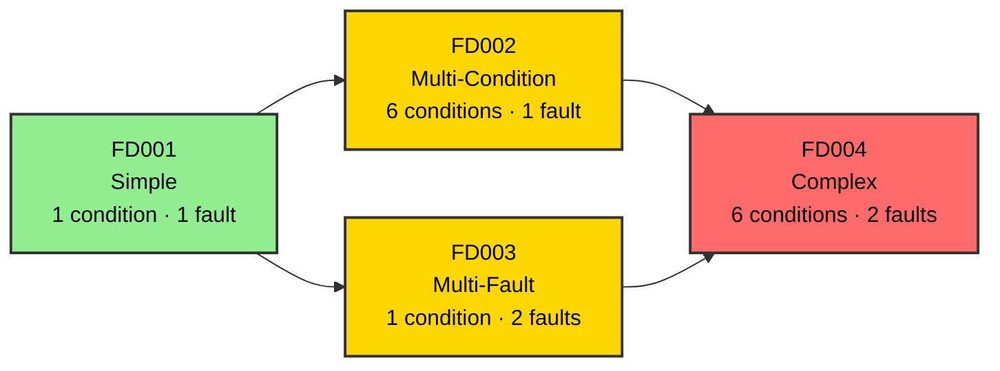
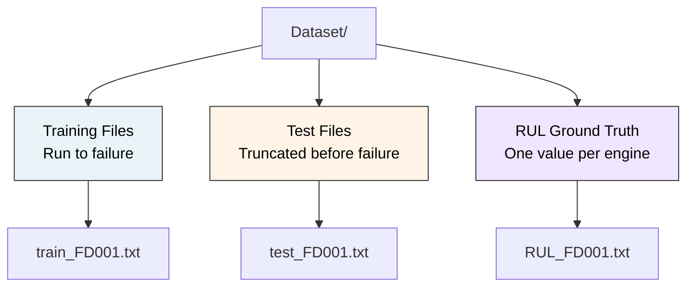
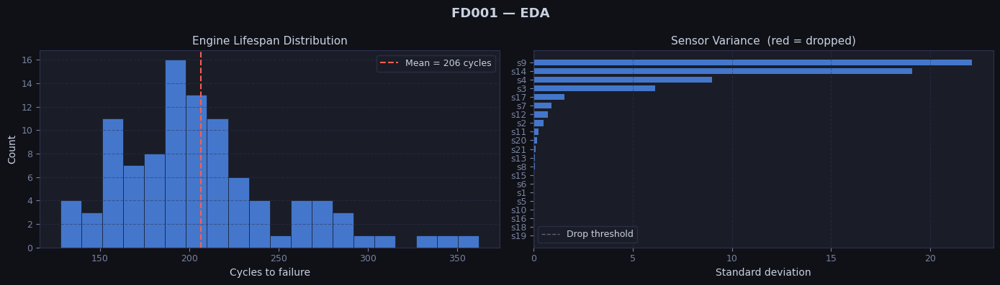

# Dataset Reference

## Source

NASA C-MAPSS (Commercial Modular Aero-Propulsion System Simulation) Turbofan Engine Degradation Dataset.

Original paper: *Damage Propagation Modeling for Aircraft Engine Run-to-Failure Simulation* — Saxena, Goebel, Simon, Eklund (PHM08, Denver, 2008).

---

## Dataset Complexity Progression

This project uses **FD001** — the simplest sub-dataset, single operating condition, single fault mode (HPC degradation). Always develop and validate on FD001 first before generalizing.

---

## Sub-Datasets Overview

| Dataset | Train Engines | Test Engines | Operating Conditions | Fault Modes |
|---------|--------------|--------------|----------------------|-------------|
| FD001   | 100          | 100          | 1 (Sea Level)        | 1 (HPC Degradation) |
| FD002   | 260          | 259          | 6                    | 1 (HPC Degradation) |
| FD003   | 100          | 100          | 1 (Sea Level)        | 2 (HPC + Fan) |
| FD004   | 249          | 248          | 6                    | 2 (HPC + Fan) |

---

## Cycle Statistics (FD001 Training Data)

| Stat | Value |
|------|-------|
| Min cycles per engine | 128 |
| Max cycles per engine | 362 |
| Mean cycles per engine | 206 |
| Total rows | 20,631 |
| Total engines | 100 |

---

## File Structure

All files are space-separated, no header row, 26 columns.

---

## Column Schema

| Index | Name | Description |
|-------|------|-------------|
| 0 | unit | Engine ID (1-indexed) |
| 1 | cycle | Flight cycle number (starts at 1 per engine) |
| 2–4 | os1, os2, os3 | Operational settings |
| 5–25 | s1 – s21 | Raw sensor measurements |

---

## Sensor Reference

| Sensor | Physical Meaning | Useful? |
|--------|-----------------|---------|
| s1 | Total temperature at fan inlet (T2) | No — constant |
| s2 | Total temperature at LPC outlet (T24) | **Yes** |
| s3 | Total temperature at HPC outlet (T30) | **Yes** |
| s4 | Total temperature at LPT outlet (T50) | **Yes** |
| s5 | Pressure at fan inlet (P2) | No — constant |
| s6 | Total pressure at fan inlet (P15) | No — near-constant |
| s7 | Total pressure at HPC outlet (P30) | **Yes** |
| s8 | Physical fan speed (Nf) | No — near-constant |
| s9 | Physical core speed (Nc) | **Yes** |
| s10 | Engine pressure ratio (epr) | No — constant |
| s11 | Static pressure at HPC outlet (Ps30) | **Yes** |
| s12 | Ratio of fuel flow to Ps30 (phi) | **Yes** |
| s13 | Corrected fan speed (NRf) | No — near-constant |
| s14 | Corrected core speed (NRc) | **Yes** |
| s15 | Bypass ratio (BPR) | No — near-constant |
| s16 | Burner fuel-air ratio (farB) | No — constant |
| s17 | Bleed enthalpy (htBleed) | **Yes** |
| s18 | Demanded fan speed (Nf_dmd) | No — constant |
| s19 | Demanded corrected fan speed (PCNfR_dmd) | No — constant |
| s20 | HPT coolant bleed (W31) | **Yes** |
| s21 | LPT coolant bleed (W32) | **Yes** |

**11 useful sensors:** `s2, s3, s4, s7, s9, s11, s12, s14, s17, s20, s21`

---

## Engine Lifecycle

---

## Key Observations

- Engines start healthy. Degradation is gradual and monotonic.
- Sensor noise is present — raw readings are not smooth.
- Each engine has a different lifespan due to manufacturing variation.
- The test set ends before failure — you never see the failure event in test data.
- RUL is not directly observable — it must be computed from training data.

## EDA

