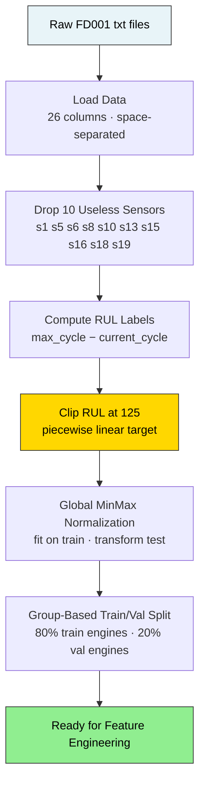
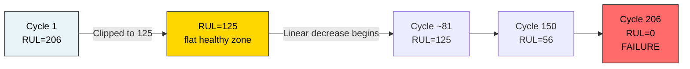
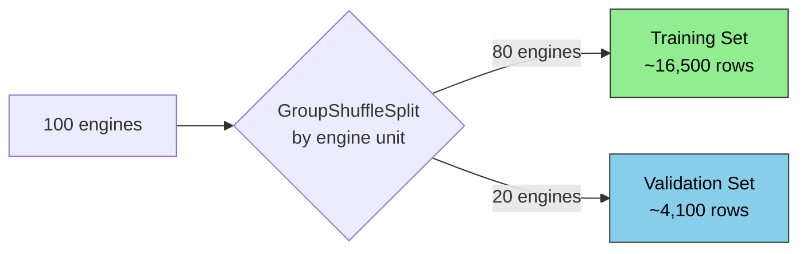

# Preprocessing Pipeline

## Overview

Raw C-MAPSS data cannot be fed directly into a model. Every step below is required and order-dependent.



---

## Step 1 — Load Raw Data

Files are space-separated with no header. 26 columns: unit, cycle, 3 operational settings, 21 sensors.

---

## Step 2 — Drop Useless Sensors

10 sensors have near-zero variance across all cycles — they carry no degradation signal and waste model capacity.

**Dropped:** `s1, s5, s6, s8, s10, s13, s15, s16, s18, s19`

**Kept (11 sensors):** `s2, s3, s4, s7, s9, s11, s12, s14, s17, s20, s21`

`os3` is also dropped for FD001/FD003 (single value = 100.0 throughout).

---

## Step 3 — Compute RUL Labels

Training files run each engine to failure, so RUL is derived from the max cycle per engine:

```
RUL = max_cycle_for_engine − current_cycle
```

For the test set, RUL at the last cycle is provided in `RUL_FD001.txt`.

---

## Step 4 — Clip RUL (Piecewise Linear Target)

Early in engine life, RUL can be 300+ cycles. The engine shows no degradation signal that far out — predicting it accurately is impossible and irrelevant.



**RUL clip = 125** — standard choice for FD001/FD002. The model focuses entirely on the degradation window.

---

## Step 5 — Normalization

**FD001 / FD003 (single operating condition):** Global MinMaxScaler fitted on training data, applied to test data. Never refit on test.

**FD002 / FD004 (6 operating conditions):** Raw sensor values shift dramatically between conditions. Cluster operating conditions with KMeans first, then normalize within each cluster. Save the KMeans model and per-condition scalers — required at inference time.

The scaler is saved to `artifacts/data_transformation/scaler.pkl` and exported to `streaming/src/main/resources/scaler_params.csv` for the streaming consumer via `scripts/export_scaler_params.py`.

---

## Step 6 — Train/Validation Split

Split by **engine ID**, not by row. Random row splits would leak future cycles of an engine into the validation set.



---

## Preprocessing Checklist

| Step | FD001 | FD002 | FD003 | FD004 |
|------|-------|-------|-------|-------|
| Drop constant sensors | ✅ | ✅ | ✅ | ✅ |
| Drop os3 | ✅ | — | ✅ | — |
| Compute RUL | ✅ | ✅ | ✅ | ✅ |
| Clip RUL at 125 | ✅ | ✅ | ✅ | ✅ |
| Global normalization | ✅ | — | ✅ | — |
| Condition clustering + per-condition norm | — | ✅ | — | ✅ |
| Group-based train/val split | ✅ | ✅ | ✅ | ✅ |

---

## Output Artifacts

```
artifacts/data_transformation/
├── processed/          train/test Parquet files
└── scaler.pkl          MinMaxScaler (fit on train only)
```
