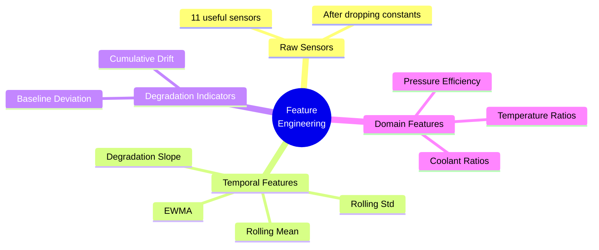
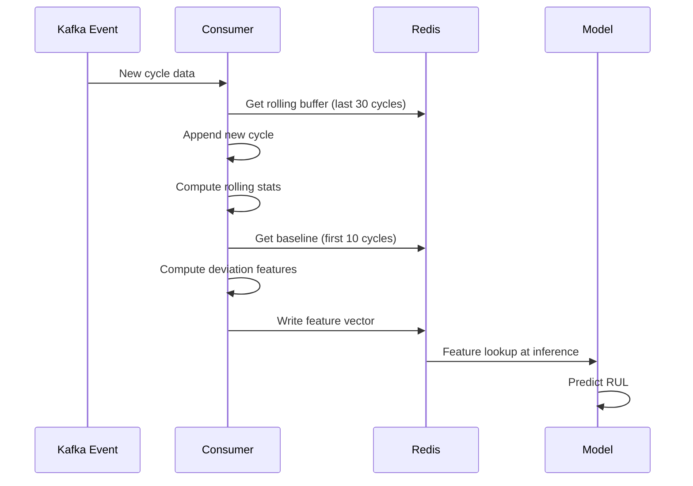

# Feature Engineering

## Overview

Raw normalized sensor readings are a weak input signal on their own. Feature engineering extracts temporal patterns that reveal degradation trends. This document covers all feature types, their rationale, and implementation.



---

## Feature Categories

### 1. Raw Sensor Readings (Baseline)

The 11 useful sensors after dropping constants:

```
s2, s3, s4, s7, s9, s11, s12, s14, s17, s20, s21
```

These alone are sufficient for a baseline model but will underperform without temporal context.

---

### 2. Rolling Statistics

Capture short and medium-term trends by computing statistics over a sliding window per engine.

```python
WINDOWS = [10, 20, 30]  # cycles

def rolling_stats(df: pd.DataFrame, sensors: list[str], windows: list[int]) -> pd.DataFrame:
    df = df.sort_values(['unit', 'cycle'])
    for w in windows:
        for s in sensors:
            grp = df.groupby('unit')[s]
            df[f'{s}_rmean_{w}'] = grp.transform(
                lambda x: x.rolling(w, min_periods=1).mean()
            )
            df[f'{s}_rstd_{w}'] = grp.transform(
                lambda x: x.rolling(w, min_periods=1).std().fillna(0)
            )
    return df
```

This adds `11 sensors × 2 stats × 3 windows = 66` features on top of the 11 raw readings.

Why multiple windows:
- Short window (10): captures recent sharp changes
- Medium window (20): smooths noise, shows trend direction
- Long window (30): captures slow degradation drift

---

### 3. Degradation Slope (Linear Trend)

The slope of a sensor over the last N cycles is a direct measure of how fast it is changing. A steepening slope signals accelerating degradation.

```python
from numpy.polynomial import polynomial as P

def rolling_slope(series: pd.Series, window: int) -> pd.Series:
    def slope(x):
        if len(x) < 2:
            return 0.0
        t = np.arange(len(x))
        return np.polyfit(t, x, 1)[0]  # coefficient of degree 1
    return series.rolling(window, min_periods=2).apply(slope, raw=True)

for s in KEEP_SENSORS:
    df[f'{s}_slope_30'] = df.groupby('unit')[s].transform(
        lambda x: rolling_slope(x, 30)
    )
```

---

### 4. Exponential Weighted Mean (EWMA)

Gives more weight to recent cycles than older ones. More sensitive to sudden changes than a simple rolling mean.

```python
ALPHAS = [0.1, 0.3]  # smoothing factors; higher = more weight on recent

for alpha in ALPHAS:
    for s in KEEP_SENSORS:
        df[f'{s}_ewm_{alpha}'] = df.groupby('unit')[s].transform(
            lambda x: x.ewm(alpha=alpha, adjust=False).mean()
        )
```

---

### 5. Cycle-Based Features

```python
# Normalized cycle position within engine life (only usable during training)
# For inference, use rolling features instead — max_cycle is unknown
df['cycle_norm'] = df.groupby('unit')['cycle'].transform(
    lambda x: x / x.max()
)
```

Note: `cycle_norm` uses max cycle which is unknown at inference time. Use it only as an auxiliary training signal or replace with a proxy like cumulative sensor deviation.

---

### 6. Cross-Sensor Interaction Features

Some sensor ratios are physically meaningful for turbofan degradation:

```python
# Temperature ratio: HPC outlet / LPC outlet — rises as HPC degrades
df['temp_ratio'] = df['s3'] / (df['s2'] + 1e-8)

# Pressure efficiency proxy
df['pressure_ratio'] = df['s7'] / (df['s11'] + 1e-8)

# Coolant bleed ratio
df['bleed_ratio'] = df['s20'] / (df['s21'] + 1e-8)
```

Use these cautiously — they can introduce instability if a denominator sensor is near zero after normalization.

---

### 7. Cumulative Deviation from Healthy Baseline

Compute each engine's healthy baseline (first N cycles) and track cumulative deviation:

```python
BASELINE_CYCLES = 10

def cumulative_deviation(df: pd.DataFrame, sensors: list[str]) -> pd.DataFrame:
    baselines = (
        df[df['cycle'] <= BASELINE_CYCLES]
        .groupby('unit')[sensors]
        .mean()
        .rename(columns={s: f'{s}_baseline' for s in sensors})
    )
    df = df.merge(baselines, on='unit', how='left')
    for s in sensors:
        df[f'{s}_dev'] = df[s] - df[f'{s}_baseline']
        df.drop(columns=[f'{s}_baseline'], inplace=True)
    return df

train = cumulative_deviation(train, KEEP_SENSORS)
```

This is one of the strongest single features — it directly measures how far the engine has drifted from its healthy state.

---

## Feature Set Summary

| Feature Group | Count | Notes |
|---------------|-------|-------|
| Raw sensors | 11 | After dropping constants |
| Rolling mean (3 windows) | 33 | Windows: 10, 20, 30 |
| Rolling std (3 windows) | 33 | Windows: 10, 20, 30 |
| Degradation slope | 11 | Window: 30 |
| EWMA (2 alphas) | 22 | Alphas: 0.1, 0.3 |
| Cross-sensor ratios | 3 | temp_ratio, pressure_ratio, bleed_ratio |
| Cumulative deviation | 11 | From healthy baseline |
| **Total** | **124** | |

For LSTM: use only raw sensors (11) — the network learns temporal patterns itself. Rolling features are for tree models.

---

## Feature Importance (Expected)

Based on published C-MAPSS research, the highest-signal sensors are:

1. `s11` (Ps30 — static pressure at HPC outlet) — most correlated with HPC degradation
2. `s12` (phi — fuel flow ratio) — rises as efficiency drops
3. `s4` (T50 — LPT outlet temperature) — rises with degradation
4. `s9` (Nc — core speed) — changes with load and wear
5. `s14` (NRc — corrected core speed)

Validate this on your data using XGBoost feature importance after training.

---

## Feature Engineering for Streaming Inference

In the real-time pipeline, features must be computed incrementally as new cycles arrive.



For each new Kafka event (one cycle):
1. Append to engine's rolling buffer in Redis (keep last 30 cycles)
2. Compute rolling mean/std/slope on the buffer
3. Retrieve healthy baseline from Redis (set at engine startup)
4. Compute deviation features
5. Assemble feature vector → pass to model

```python
# Redis key structure
# engine:{id}:buffer  → list of last 30 cycle sensor readings (JSON)
# engine:{id}:baseline → mean of first 10 cycles (JSON)
```

The feature computation logic must be identical between training and inference — this is the core value of a feature store.
