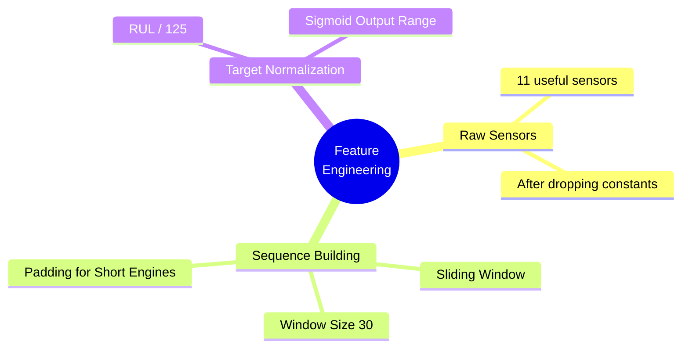
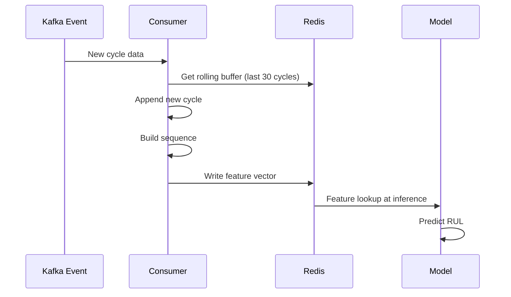

# Feature Engineering

## Overview

The current implementation focuses on **sequence building** for the GRU model. Raw normalized sensor readings are transformed into sliding window sequences that capture temporal patterns.



---

## Current Implementation

### 1. Raw Sensor Readings

The 11 useful sensors after dropping constants:

```
s2, s3, s4, s7, s9, s11, s12, s14, s17, s20, s21
```

These are used directly as input features for the GRU model.

---

### 2. Sequence Building for GRU

The core feature engineering step is creating sliding window sequences:

```python
WINDOW_SIZE = 30  # cycles

def build_sequences(df, feature_cols, window_size=30):
    X, y = [], []
    
    for _, engine_df in df.groupby('unit'):
        engine_df = engine_df.sort_values('cycle')
        data = engine_df[feature_cols].values
        labels = engine_df['RUL'].values
        
        # Sliding window
        for i in range(len(data) - window_size + 1):
            X.append(data[i:i+window_size])
            y.append(labels[i+window_size-1])
    
    return np.array(X, dtype=np.float32), np.array(y, dtype=np.float32)
```

This creates sequences of shape `(n_samples, 30, 11)` where:
- 30 = window size (timesteps)
- 11 = number of sensors (features)

---

### 3. Test Set Sequence Building

For test data, only the **last window** per engine is used:

```python
def build_last_sequences(df, feature_cols, window_size=30):
    X, y = [], []
    
    for _, engine_df in df.groupby('unit'):
        engine_df = engine_df.sort_values('cycle')
        data = engine_df[feature_cols].values
        
        if len(data) >= window_size:
            X.append(data[-window_size:])
        else:
            # Pad with zeros if engine has fewer than window_size cycles
            pad = np.zeros((window_size - len(data), len(feature_cols)))
            X.append(np.vstack([pad, data]))
        
        y.append(engine_df['RUL'].iloc[-1])
    
    return np.array(X, dtype=np.float32), np.array(y, dtype=np.float32)
```

---

### 4. Target Normalization

RUL values are normalized to [0, 1] for the sigmoid output:

```python
RUL_CLIP = 125

y_train = (y_train_raw / RUL_CLIP).astype(np.float32)
y_val = (y_val_raw / RUL_CLIP).astype(np.float32)
y_test = np.clip(y_test_raw, 0, RUL_CLIP).astype(np.float32)
```

---

## Implementation Details

The feature engineering is implemented in `src/components/feature_engineering.py`:

```python
class FeatureEngineering:
    def __init__(self, config: DataFeatureEngineeringConfig):
        self.config = config  # window_size=30, rul_clip=125
    
    def build_sequences(self, df, feature_cols):
        X, y = [], []
        for _, eng in df.groupby('unit'):
            eng = eng.sort_values('cycle')
            data = eng[feature_cols].values
            labels = eng['RUL'].values
            
            for i in range(len(data) - self.config.window_size + 1):
                X.append(data[i:i+self.config.window_size])
                y.append(labels[i+self.config.window_size-1])
        
        return np.array(X, dtype=np.float32), np.array(y, dtype=np.float32)
    
    def build_last_sequences(self, df, feature_cols):
        X, y = [], []
        for _, eng in df.groupby('unit'):
            eng = eng.sort_values('cycle')
            data = eng[feature_cols].values
            
            if len(data) >= self.config.window_size:
                X.append(data[-self.config.window_size:])
            else:
                pad = np.zeros((self.config.window_size - len(data), len(feature_cols)))
                X.append(np.vstack([pad, data]))
            
            y.append(eng['RUL'].iloc[-1])
        
        return np.array(X, dtype=np.float32), np.array(y, dtype=np.float32)
```

---

## Configuration

Feature engineering parameters are defined in `config/features.yaml`:

```yaml
features:
  window_size: 30
  test_size: 0.2
  random_state: 42
```

And in `config/transform.yaml`:

```yaml
rul_clip: 125
```

---

## Data Split Strategy

Train/validation split is done at the **engine level** to prevent data leakage:

```python
from sklearn.model_selection import GroupShuffleSplit

gss = GroupShuffleSplit(n_splits=1, test_size=0.2, random_state=42)
train_idx, val_idx = next(gss.split(train_df, groups=train_df['unit']))

train_split = train_df.iloc[train_idx]
val_split = train_df.iloc[val_idx]
```

This ensures that all cycles from a single engine stay together in either train or validation set.

---

## Output Artifacts

The feature engineering stage produces:

```
artifacts/data_feature_engineering/
├── X_train.npy              # Training sequences (n_train, 30, 11)
├── y_train.npy              # Training labels (n_train,)
├── X_val.npy                # Validation sequences (n_val, 30, 11)
├── y_val.npy                # Validation labels (n_val,)
├── X_test.npy               # Test sequences (n_test, 30, 11)
├── y_test.npy               # Test labels (n_test,)
└── feature_config.json      # Metadata
```

`feature_config.json` contains:
```json
{
  "window_size": 30,
  "features": ["s2", "s3", "s4", "s7", "s9", "s11", "s12", "s14", "s17", "s20", "s21"],
  "rul_clip": 125,
  "scaler_path": "artifacts/scaler.pkl"
}
```

---

## Pipeline Execution

Run feature engineering:

```bash
python main.py  # Runs all stages including feature engineering
```

Or run individually:

```python
from src.pipeline.feature_engineering_pipeline import FeatureEngineeringPipeline

pipeline = FeatureEngineeringPipeline()
pipeline.initiate_feature_engineering()
```

---

## Future Enhancements

For improved model performance, consider adding:

### Rolling Statistics
```python
# Rolling mean/std over windows [10, 20, 30]
for w in [10, 20, 30]:
    for s in sensors:
        df[f'{s}_rmean_{w}'] = df.groupby('unit')[s].transform(
            lambda x: x.rolling(w, min_periods=1).mean()
        )
```

### Degradation Slope
```python
# Linear trend over last 30 cycles
def rolling_slope(series, window=30):
    def slope(x):
        if len(x) < 2:
            return 0.0
        t = np.arange(len(x))
        return np.polyfit(t, x, 1)[0]
    return series.rolling(window, min_periods=2).apply(slope, raw=True)
```

### Baseline Deviation
```python
# Deviation from healthy baseline (first 10 cycles)
baseline = df[df['cycle'] <= 10].groupby('unit')[sensors].mean()
df = df.merge(baseline, on='unit', suffixes=('', '_baseline'))
for s in sensors:
    df[f'{s}_dev'] = df[s] - df[f'{s}_baseline']
```

These features would be beneficial for tree-based models (XGBoost, LightGBM) but are not necessary for the current GRU implementation, which learns temporal patterns automatically.

---

## Feature Engineering for Streaming (Future)

For real-time inference, features must be computed incrementally:



Redis key structure:
```
engine:{id}:buffer  → list of last 30 cycle sensor readings (JSON)
engine:{id}:features → feature vector for inference
```
