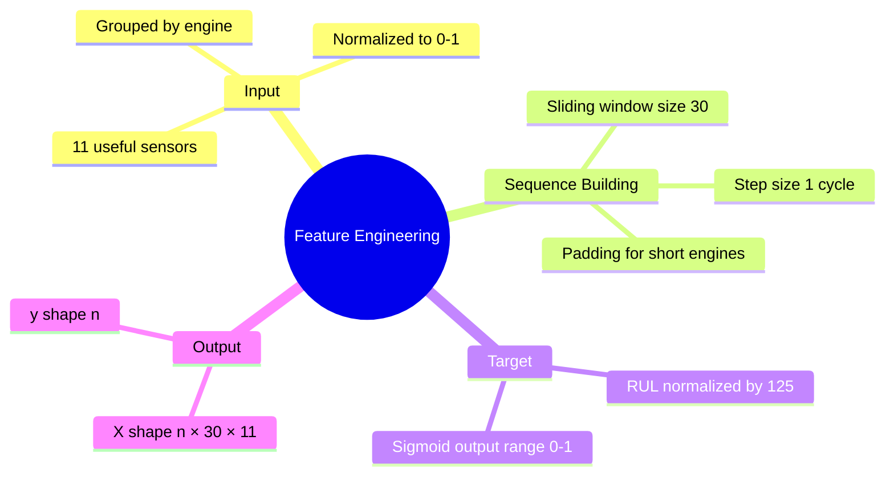
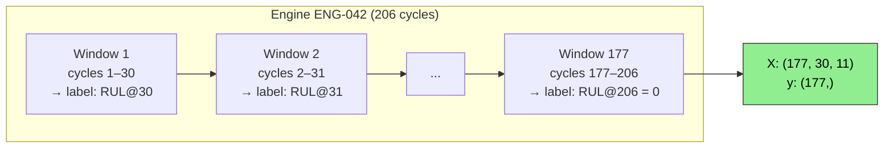
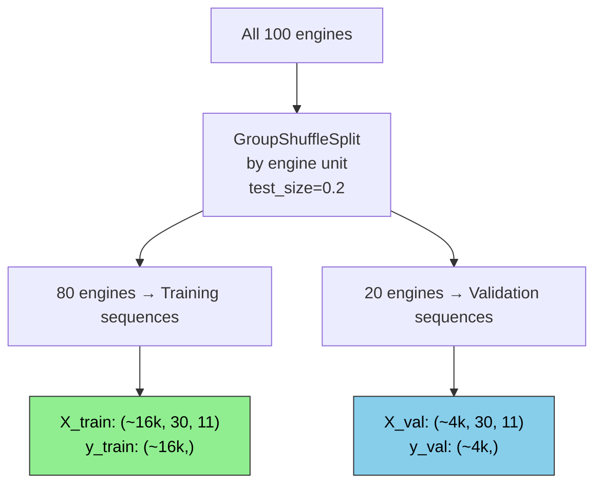
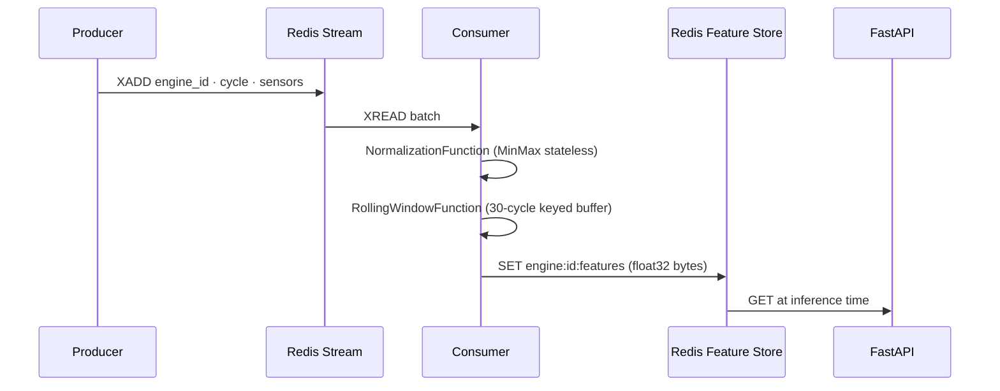

# Feature Engineering

## Overview

The feature engineering stage transforms preprocessed sensor data into sliding window sequences ready for GRU input.



---

## Sliding Window Sequences

The core step: for each engine, slide a window of 30 cycles across its history. Each window becomes one training sample.



**Output shape per engine:** `(n_cycles - window_size + 1, 30, 11)`

---

## Test Set — Last Window Only

For test data, only the **last 30 cycles** per engine are used (the model predicts RUL at the most recent observation).

Engines with fewer than 30 cycles are zero-padded at the front.

---

## Target Normalization

RUL values are normalized to `[0, 1]` to match the Sigmoid output:

```
y_normalized = RUL / 125
```

At inference, denormalize: `RUL_cycles = model_output × 125`

---

## Data Split Strategy



Engines stay intact — all cycles from one engine go to either train or val, never split across both.

---

## Configuration

| Parameter | Value | Location |
|-----------|-------|----------|
| window_size | 30 | `config/features.yaml` |
| test_size | 0.2 | `config/features.yaml` |
| rul_clip | 125 | `config/transform.yaml` |

---

## Output Artifacts

```
artifacts/data_feature_engineering/
├── X_train.npy          (n_train, 30, 11)
├── y_train.npy          (n_train,)
├── X_val.npy            (n_val, 30, 11)
├── y_val.npy            (n_val,)
├── X_test.npy           (n_test, 30, 11)
├── y_test.npy           (n_test,)
└── feature_config.json  window_size, features list, rul_clip, scaler_path
```

---

## Streaming Feature Engineering

In the real-time pipeline, features are built incrementally per engine:



The `RollingWindowFunction` maintains a per-engine deque of the last 30 normalized sensor rows. When the buffer reaches 30 entries it emits a `FeatureVector` identical in shape to `X_test` — the same model reads both.
