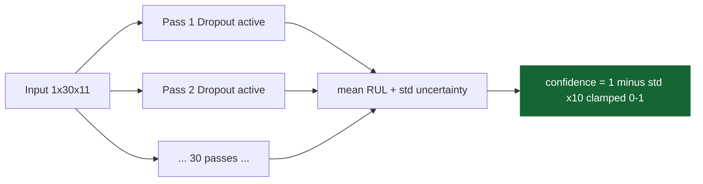
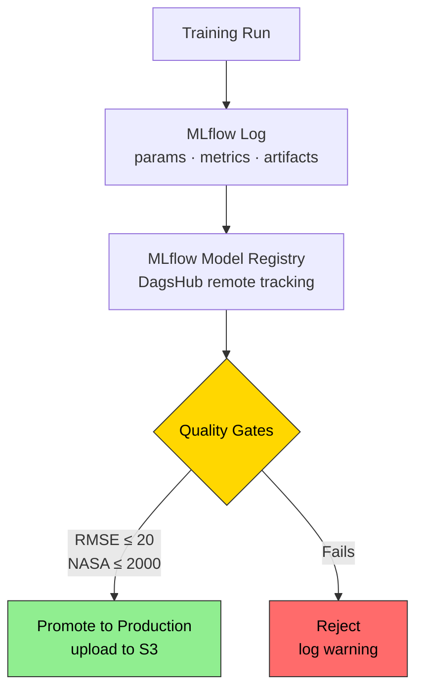
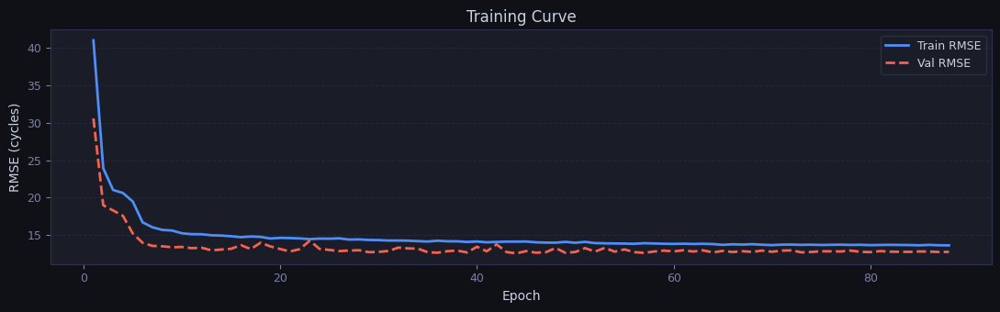
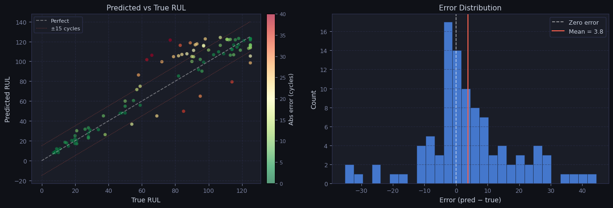
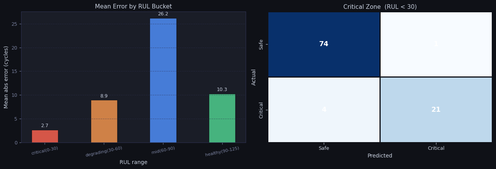
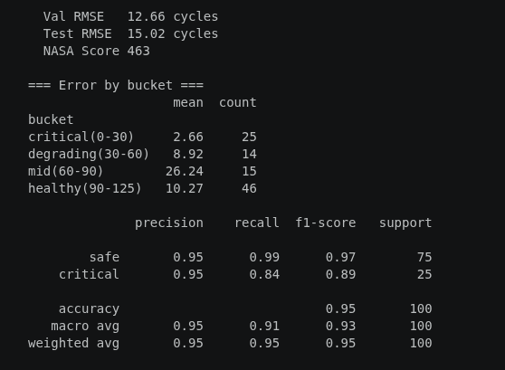
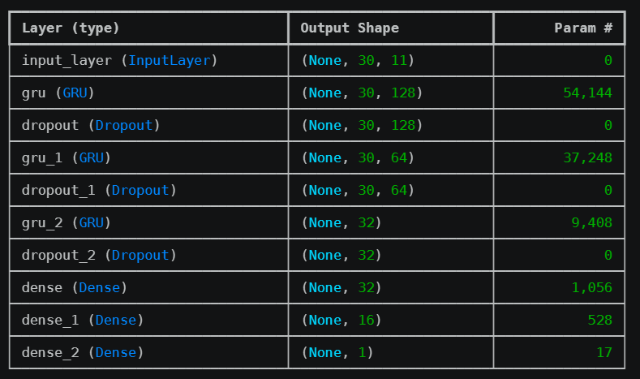

# Model Training & Registry

## Architecture

```mermaid
flowchart LR
    IN["Input\n(batch, 30, 11)"] --> G1["GRU 128\nreturn_seq=True"]
    G1 --> D1["Dropout 0.2"]
    D1 --> G2["GRU 64\nreturn_seq=True"]
    G2 --> D2["Dropout 0.2"]
    D2 --> G3["GRU 32"]
    G3 --> D3["Dropout 0.15"]
    D3 --> FC1["Dense 32\nReLU + L2"]
    FC1 --> FC2["Dense 16\nReLU + L2"]
    FC2 --> OUT["Output 1\nSigmoid\nRUL ∈ [0,1]"]

    style IN fill:#0e7490,color:#fff,stroke:none
    style OUT fill:#166534,color:#fff,stroke:none
    style D1 fill:#6b21a8,color:#fff,stroke:none
    style D2 fill:#6b21a8,color:#fff,stroke:none
    style D3 fill:#6b21a8,color:#fff,stroke:none
```



**3-layer GRU** — deeper than the 2-layer variant in early drafts. The third GRU layer (32 units) adds a compression stage before the dense head, improving generalization on the degradation tail.

---

## Training Configuration

| Parameter | Value | Location |
|-----------|-------|----------|
| Optimizer | Adam | `config/params.yaml` |
| Learning rate | 0.0003 | `config/params.yaml` |
| Batch size | 256 | `config/params.yaml` |
| Epochs | 100 | `config/params.yaml` |
| Early stopping patience | 15 | `config/params.yaml` |
| ReduceLR patience | 7 | `config/params.yaml` |
| ReduceLR factor | 0.5 | `config/params.yaml` |
| Min LR | 0.000001 | `config/params.yaml` |
| GRU units | [128, 64, 32] | `config/model.yaml` |
| Dense units | [32, 16] | `config/model.yaml` |
| Dropout rates | [0.2, 0.2, 0.15] | `config/model.yaml` |
| L2 regularization | 0.001 | `config/model.yaml` |

**Sample weighting:** Higher weight for samples near failure — `weight = 1.0 + 1.5 × y_normalized`. This prevents the model from ignoring the critical degradation zone.

---

## MC Dropout Confidence

At inference, 30 forward passes are run with `training=True` (dropout active):



Higher variance across passes = lower confidence. No separate ensemble needed.

---

## Risk Levels

| Risk Score | Level | Meaning |
|-----------|-------|---------|
| 0.0 – 0.3 | LOW | Healthy, no action |
| 0.3 – 0.6 | MEDIUM | Monitor closely |
| 0.6 – 0.8 | HIGH | Schedule maintenance |
| 0.8 – 1.0 | CRITICAL | Imminent failure |

`risk = 1 − (RUL / 125)` — derived directly from predicted RUL.

---

## MLflow Integration



All runs tracked at: `https://dagshub.com/nasim-raj-laskar/Real-Time-Aircraft-Engine-Predictive-Maintenance-System.mlflow/`

---

## Promotion Thresholds

| Metric | Threshold | Config |
|--------|-----------|--------|
| RMSE | ≤ 20.0 cycles | `config/registor.yaml` |
| NASA Score | ≤ 2000.0 | `config/registor.yaml` |

Both must pass. If either fails, the model is not registered and a warning is logged.

---

## Current Performance

| Metric | Value | Target | Status |
|--------|-------|--------|--------|
| Test RMSE | 14.99 cy | < 20 | ✅ |
| NASA Score | 449.6 | < 2000 | ✅ |
| Precision (Crit.) | 91.7% | > 80% | ✅ |
| Recall (Crit.) | 88.0% | > 75% | ✅ |
| F1 (Crit.) | 0.898 | > 0.80 | ✅ |
| Accuracy | 95.0% | > 80% | ✅ |
| F1 (Weighted) | 0.950 | > 0.80 | ✅ |

**Training curve:**



**Prediction vs True RUL and Error Distribution:**



**Confusion Matrix and Mean Error by RUL Bucket:**



**Classification Report:**



**Model Layer Summary:**



---

## Output Artifacts

```
artifacts/model_trainer/
├── model.keras          trained Keras model
└── history.json         loss + rmse per epoch

artifacts/model_evaluation/
├── metrics.json         RMSE, NASA score, classification report
├── confusion_matrix.png
├── pred_vs_true.png
└── error_distribution.png

artifacts/
├── model.keras          symlink / copy for inference service
└── scaler.pkl           MinMaxScaler for inference

s3://aircraft-engine-data/artifacts/
└── (all of the above, uploaded after successful promotion)
```

---

## Running the Pipeline

```bash
# Full 7-stage pipeline
python main.py

# Or trigger from dashboard
curl -X POST http://localhost:8000/pipeline/run
curl -N http://localhost:8000/pipeline/logs
```
