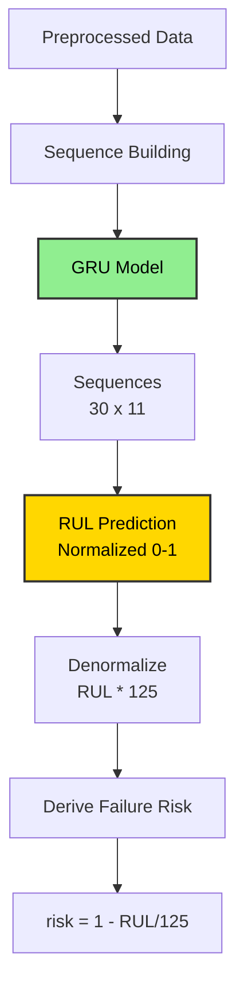
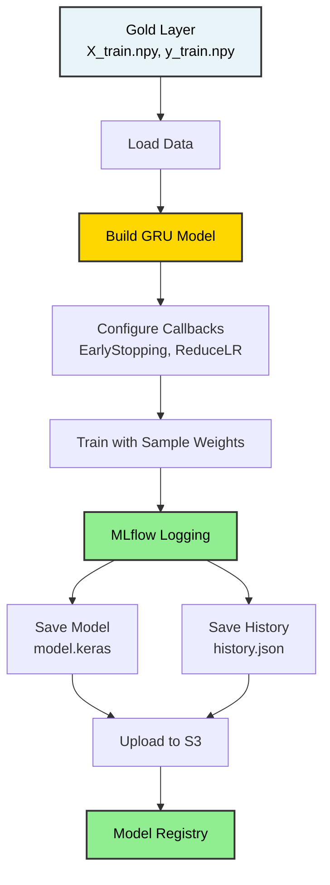
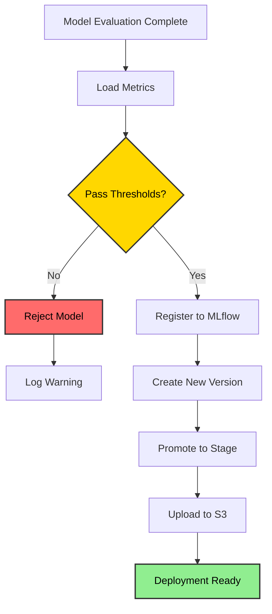

# Model Selection and Training

## Current Implementation

The project uses a **GRU (Gated Recurrent Unit)** model for RUL prediction. This is a deep learning approach that processes temporal sequences of sensor data.

## Prediction Target

The system predicts:

| Output | Type | Description |
|--------|------|-------------|
| RUL | Regression | Remaining flight cycles before failure (normalized to [0,1]) |

Failure risk can be derived from RUL: `risk = 1 - RUL`



---

## Model Architecture

The implemented model is a **multi-layer GRU** with the following architecture:

```python
Input: (batch_size, 30, 11)  # 30 timesteps, 11 sensors
│
GRU Layer 1: 128 units, return_sequences=True
Dropout: 0.3
│
GRU Layer 2: 64 units, return_sequences=False
Dropout: 0.3
│
Dense Layer 1: 32 units, ReLU, L2 regularization
Dense Layer 2: 16 units, ReLU, L2 regularization
│
Output: 1 unit, Sigmoid activation
│
Output: Normalized RUL in [0, 1]
```

### Key Configuration

```yaml
# From config/model.yaml
gru_units: [128, 64]
dense_units: [32, 16]
dropout_rates: [0.3, 0.3]
l2_regularization: 0.001
learning_rate: 0.001
batch_size: 256
epochs: 100
```

### Training Features

- **Sample Weighting**: Higher weight for samples near failure
  ```python
  sample_weights = 1.0 + 1.5 * y_train
  ```
- **Early Stopping**: Patience of 15 epochs on validation loss
- **Learning Rate Reduction**: Factor 0.5, patience 5 epochs
- **Optimizer**: Adam with initial LR 0.001

---

## Training Pipeline Implementation

The training is implemented in `src/components/model_training.py`:

```python
class ModelTrainer:
    def build_model(self, window_size, n_features):
        inp = tf.keras.Input(shape=(window_size, n_features))
        x = inp
        
        # GRU layers
        for i, units in enumerate(self.config.gru_units):
            return_sequences = i < len(self.config.gru_units) - 1
            x = layers.GRU(units, return_sequences=return_sequences)(x)
            x = layers.Dropout(self.config.dropout_rates[i])(x)
        
        # Dense layers
        for units in self.config.dense_units:
            x = layers.Dense(
                units, 
                activation='relu',
                kernel_regularizer=regularizers.l2(self.config.l2_regularization)
            )(x)
        
        # Output
        out = layers.Dense(1, activation='sigmoid')(x)
        
        model = models.Model(inp, out)
        model.compile(
            optimizer=tf.keras.optimizers.Adam(learning_rate=self.config.learning_rate),
            loss='mse',
            metrics=[tf.keras.metrics.RootMeanSquaredError(name='rmse')]
        )
        return model
```

---

## MLflow Integration

All training runs are logged to MLflow:

```python
with mlflow.start_run():
    # Log hyperparameters
    mlflow.log_params({
        "epochs": config.epochs,
        "batch_size": config.batch_size,
        "learning_rate": config.learning_rate,
        "gru_units": config.gru_units,
        "dense_units": config.dense_units,
        "dropout_rates": config.dropout_rates,
        "l2_regularization": config.l2_regularization,
        "window_size": window_size,
        "n_features": n_features,
    })
    
    # Train model
    history = model.fit(...)
    
    # Log metrics
    mlflow.log_metrics({
        "train_loss": history.history["loss"][-1],
        "train_rmse": history.history["rmse"][-1],
        "val_loss": history.history["val_loss"][-1],
        "val_rmse": history.history["val_rmse"][-1],
    })
    
    # Log artifacts
    mlflow.log_artifact("artifacts/model_trainer/history.json")
```

---

## Deriving Failure Risk from RUL

Failure risk is computed from the predicted RUL:

```python
RUL_CLIP = 125

def rul_to_risk(rul_pred: float) -> float:
    """Returns failure probability in [0, 1]."""
    return float(np.clip(1.0 - (rul_pred / RUL_CLIP), 0.0, 1.0))
```

Risk interpretation:
- `0.0 – 0.3` → Healthy, no action
- `0.3 – 0.6` → Monitor closely
- `0.6 – 0.8` → Schedule maintenance
- `0.8 – 1.0` → Imminent failure, ground aircraft

---

## Model Artifacts

After training, the following artifacts are saved:

```
artifacts/model_trainer/
├── model.keras              # Trained Keras model
└── history.json            # Training history (loss, metrics per epoch)

artifacts/data_feature_engineering/
└── feature_config.json     # Feature metadata (window_size, sensor list)

artifacts/data_transformation/
└── scaler.pkl              # MinMaxScaler for inference
```

All artifacts are also uploaded to S3 for versioning and deployment.

---

## Training Pipeline Execution

Run the complete pipeline:

```bash
python main.py
```

Or run training stage individually:

```python
from src.pipeline.model_trainer_pipeline import ModelTrainingPipeline

pipeline = ModelTrainingPipeline()
pipeline.initiate_model_training()
```

Note: Model training stage is currently commented out in `main.py` to allow running other stages independently.

---

## Training Pipeline Summary




---

## Model Registry and Deployment

After training and evaluation, models are automatically registered to MLflow Model Registry with quality gates.

### Promotion Policy

Models must meet these criteria to be promoted:

```yaml
# config/registor.yaml
registered_model_name: aircraft-rul-gru

promotion_thresholds:
  rmse: 20.0          # Max acceptable RMSE (cycles)
  nasa_score: 2000.0  # Max acceptable NASA score

stage: Production     # Target stage after promotion
```

**Decision Logic:**
```python
if rmse <= 20.0 AND nasa_score <= 2000.0:
    ✅ PROMOTE to Production
else:
    ❌ REJECT (model not good enough)
```

---

### Registry Workflow



---

### Model Versioning

Each training run creates a new version:

```
aircraft-rul-gru
├── Version 1 (RMSE: 18.5, Stage: Archived)
├── Version 2 (RMSE: 16.2, Stage: Staging)
└── Version 3 (RMSE: 15.3, Stage: Production) ← Current
```

**Accessing Models:**

```python
import mlflow

# Load latest production model
model = mlflow.tensorflow.load_model(
    model_uri="models:/aircraft-rul-gru/Production"
)

# Load specific version
model = mlflow.tensorflow.load_model(
    model_uri="models:/aircraft-rul-gru/3"
)
```

---

### S3 Artifact Upload

All artifacts are uploaded to S3 after successful promotion:

```
s3://aircraft-engine-data/artifacts/
├── model.keras                    # Trained model
├── history.json                   # Training history
├── metrics.json                   # Evaluation metrics
├── results.parquet                # Prediction results
├── confusion_matrix.png           # Confusion matrix plot
├── pred_vs_true.png              # Prediction vs true plot
└── error_distribution.png        # Error distribution plot
```

---

### Deployment Workflow

**1. Automated Registration (via pipeline):**
```bash
python main.py
# → Model registered to MLflow
# → Artifacts uploaded to S3
```

**2. Download for Deployment:**
```bash
aws s3 cp s3://aircraft-engine-data/artifacts/model.keras ./model.keras
aws s3 cp s3://aircraft-engine-data/artifacts/scaler.pkl ./scaler.pkl
```

**3. Load in Inference Service:**
```python
# In FastAPI app
model = tf.keras.models.load_model("model.keras")
scaler = joblib.load("scaler.pkl")

@app.post("/predict")
async def predict(data: SensorData):
    X = preprocess(data.sensor_data)
    rul_pred = model.predict(X) * 125
    return {"rul": rul_pred, "risk": 1 - rul_pred/125}
```

---

### Promotion Scenarios

**Scenario 1: Model Passes ✅**
```
Metrics:
  RMSE: 15.28 ≤ 20.0 ✅
  NASA Score: 444.6 ≤ 2000.0 ✅

Actions:
  ✓ Register to MLflow
  ✓ Create version 3
  ✓ Promote to Production
  ✓ Upload to S3

Result: Model deployed!
```

**Scenario 2: Model Fails ❌**
```
Metrics:
  RMSE: 25.5 > 20.0 ❌
  NASA Score: 3500 > 2000.0 ❌

Actions:
  ✗ Skip registration
  ✗ Skip promotion
  ✗ Skip S3 upload

Result: Model rejected, retrain needed
```

---

### Configuration

**config/config.yaml:**
```yaml
model_registry:
  root_dir: artifacts/model_registry
  model_path: artifacts/model_trainer/model.keras
  gold_dir: artifacts/data_feature_engineering
  metrics_path: artifacts/model_evaluation/metrics.json
  s3_artifact_prefix: artifacts/
```

**config/registor.yaml:**
```yaml
registered_model_name: aircraft-rul-gru

promotion_thresholds:
  rmse: 20.0
  nasa_score: 2000.0

stage: Production
```

---

### Best Practices

**1. Threshold Tuning:**
```yaml
# Conservative (fewer deployments, higher quality)
rmse: 15.0
nasa_score: 1000.0

# Balanced (current)
rmse: 20.0
nasa_score: 2000.0

# Aggressive (more deployments, accept lower quality)
rmse: 25.0
nasa_score: 3000.0
```

**2. Model Rollback:**
```python
# Rollback to previous version if production model fails
client.transition_model_version_stage(
    name="aircraft-rul-gru",
    version=2,  # Previous good version
    stage="Production"
)
```

**3. A/B Testing:**
```python
# Champion vs Challenger
model_a = mlflow.tensorflow.load_model("models:/aircraft-rul-gru/2")
model_b = mlflow.tensorflow.load_model("models:/aircraft-rul-gru/3")

# Route 90% to A, 10% to B
if random.random() < 0.9:
    prediction = model_a.predict(X)
else:
    prediction = model_b.predict(X)
```

---

### Troubleshooting

**Issue: Model Not Registered**

*Cause:* Failed promotion thresholds

*Solution:*
```bash
# Check metrics
cat artifacts/model_evaluation/metrics.json

# Adjust thresholds in config/registor.yaml
# Or retrain with more epochs
```

**Issue: S3 Upload Failed**

*Cause:* AWS credentials not configured

*Solution:*
```bash
aws configure
# OR
export AWS_ACCESS_KEY_ID=your_key
export AWS_SECRET_ACCESS_KEY=your_secret
```

---

## Summary

The complete training and deployment pipeline ensures:
- ✅ Automated quality gates prevent bad models from reaching production
- ✅ All artifacts are versioned and tracked in MLflow
- ✅ Models are stored in S3 for deployment
- ✅ Clear promotion path from training to production
- ✅ Easy rollback if issues occur

**Run the complete pipeline:**
```bash
python main.py
```
