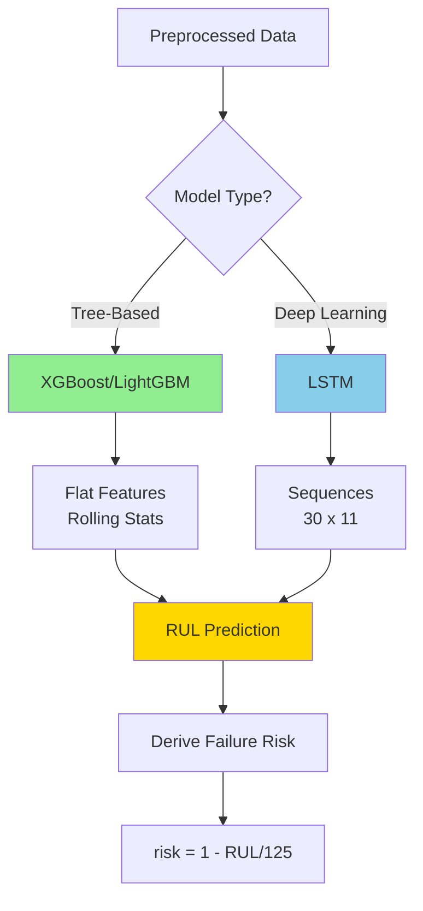
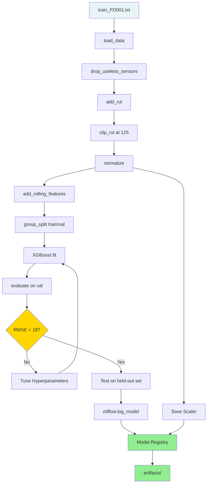

# Model Selection and Training

## Prediction Targets

The system produces two outputs:

| Output | Type | Description |
|--------|------|-------------|
| RUL | Regression | Remaining flight cycles before failure |
| Failure Risk | Classification or derived | Probability of failure within N cycles |

Start with RUL regression. Failure risk can be derived from RUL without a separate model.



---

## Evaluation Metrics

### Primary — RMSE

```python
from sklearn.metrics import mean_squared_error
import numpy as np

rmse = np.sqrt(mean_squared_error(y_true, y_pred))
```

Lower is better. Published baselines for FD001: RMSE ~12–18 cycles for strong models.

### Secondary — NASA Asymmetric Score

The original competition scoring function penalizes late predictions (underestimating RUL) more than early predictions. This reflects the real cost: missing a failure is worse than a false alarm.

```python
def nasa_score(y_true: np.ndarray, y_pred: np.ndarray) -> float:
    d = y_pred - y_true
    scores = np.where(d < 0, np.exp(-d / 13) - 1, np.exp(d / 10) - 1)
    return float(np.sum(scores))
```

Lower is better. Report both RMSE and NASA score.

---

## Model Progression

### Stage 1 — XGBoost (Recommended Baseline)

Start here. Fast to train, interpretable, strong out-of-the-box performance.

Input: flattened feature vector per cycle row (rolling stats + raw sensors)

```python
import xgboost as xgb
from sklearn.model_selection import GroupShuffleSplit

FEATURE_COLS = [c for c in train.columns if c not in ['unit', 'cycle', 'RUL', 'condition']]

X_train = train[FEATURE_COLS].values
y_train = train['RUL'].values

model = xgb.XGBRegressor(
    n_estimators=300,
    max_depth=6,
    learning_rate=0.05,
    subsample=0.8,
    colsample_bytree=0.8,
    random_state=42,
    n_jobs=-1
)
model.fit(X_train, y_train)
```

Expected FD001 RMSE: ~14–18 cycles with rolling features.

### Stage 2 — LightGBM

Faster than XGBoost on larger datasets (FD002/FD004). Often slightly better RMSE.

```python
import lightgbm as lgb

model = lgb.LGBMRegressor(
    n_estimators=500,
    num_leaves=63,
    learning_rate=0.03,
    subsample=0.8,
    colsample_bytree=0.8,
    random_state=42,
    n_jobs=-1
)
model.fit(X_train, y_train)
```

### Stage 3 — LSTM

Best for FD003/FD004 where multi-fault degradation creates non-linear patterns that tree models miss.

Input shape: `(n_samples, window=30, n_features=11)`

```python
import torch
import torch.nn as nn

class LSTMRegressor(nn.Module):
    def __init__(self, input_size=11, hidden_size=64, num_layers=2, dropout=0.2):
        super().__init__()
        self.lstm = nn.LSTM(
            input_size, hidden_size, num_layers,
            batch_first=True, dropout=dropout
        )
        self.fc = nn.Linear(hidden_size, 1)

    def forward(self, x):
        out, _ = self.lstm(x)
        return self.fc(out[:, -1, :]).squeeze(1)  # last timestep output
```

Training loop:

```python
from torch.utils.data import DataLoader, TensorDataset

X_t = torch.FloatTensor(X_train)  # (N, 30, 11)
y_t = torch.FloatTensor(y_train)

dataset = TensorDataset(X_t, y_t)
loader  = DataLoader(dataset, batch_size=256, shuffle=True)

model = LSTMRegressor()
optimizer = torch.optim.Adam(model.parameters(), lr=1e-3)
criterion = nn.MSELoss()

for epoch in range(50):
    model.train()
    for xb, yb in loader:
        optimizer.zero_grad()
        loss = criterion(model(xb), yb)
        loss.backward()
        optimizer.step()
```

Expected FD001 RMSE: ~12–15 cycles.

---

## Hyperparameter Tuning

Use Optuna for automated search. Example for XGBoost:

```python
import optuna

def objective(trial):
    params = {
        'n_estimators': trial.suggest_int('n_estimators', 100, 500),
        'max_depth': trial.suggest_int('max_depth', 3, 9),
        'learning_rate': trial.suggest_float('learning_rate', 0.01, 0.2, log=True),
        'subsample': trial.suggest_float('subsample', 0.6, 1.0),
        'colsample_bytree': trial.suggest_float('colsample_bytree', 0.6, 1.0),
    }
    model = xgb.XGBRegressor(**params, random_state=42, n_jobs=-1)
    model.fit(X_tr, y_tr)
    preds = model.predict(X_val)
    return np.sqrt(mean_squared_error(y_val, preds))

study = optuna.create_study(direction='minimize')
study.optimize(objective, n_trials=50)
```

---

## Deriving Failure Risk from RUL

No separate classifier needed. Failure risk is a monotonic function of predicted RUL:

```python
RUL_CLIP = 125
CRITICAL_THRESHOLD = 30  # cycles — tune based on maintenance lead time

def rul_to_risk(rul_pred: float) -> float:
    """Returns failure probability in [0, 1]."""
    return float(np.clip(1.0 - (rul_pred / RUL_CLIP), 0.0, 1.0))

def is_critical(rul_pred: float) -> bool:
    return rul_pred <= CRITICAL_THRESHOLD
```

Risk interpretation:
- `0.0 – 0.3` → Healthy, no action
- `0.3 – 0.6` → Monitor closely
- `0.6 – 0.8` → Schedule maintenance
- `0.8 – 1.0` → Imminent failure, ground aircraft

---

## Model Comparison Table

| Model | Input Type | FD001 RMSE (expected) | Training Time | Inference Latency | Best For |
|-------|-----------|----------------------|---------------|-------------------|----------|
| XGBoost | Flat features | 14–18 | Fast (< 1 min) | < 1ms | Baseline, FD001/FD002 |
| LightGBM | Flat features | 13–17 | Very fast | < 1ms | FD002/FD004 (large data) |
| LSTM | Sequences (30×11) | 12–15 | Medium (5–15 min) | 2–5ms | FD003/FD004 (multi-fault) |
| Transformer | Sequences | 11–14 | Slow | 5–10ms | Advanced, optional |

---

## MLflow Experiment Tracking

Log every training run:

```python
import mlflow

with mlflow.start_run(run_name="xgboost_fd001_v1"):
    mlflow.log_params(model.get_params())
    mlflow.log_metric("rmse", rmse)
    mlflow.log_metric("nasa_score", score)
    mlflow.xgboost.log_model(model, artifact_path="model")
    mlflow.log_artifact("artifacts/scaler_FD001.pkl")
```

Model registry promotion:

```
Staging → validate RMSE < threshold on held-out test set
Production → deploy to inference service
```

---

## Training Pipeline Summary


