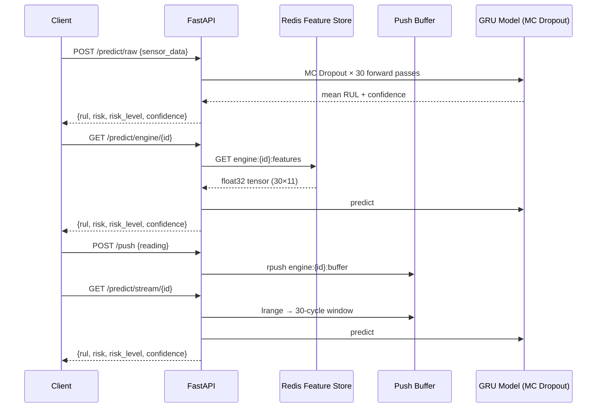

# Inference Service

## Overview

The inference service is a FastAPI application that serves the trained GRU model for real-time RUL predictions. It supports three prediction pathways, WebSocket streaming, Prometheus metrics, structured logging, and on-demand pipeline retraining.



---

## Prediction Pathways

| Pathway | Endpoint | Data Source | Use Case |
|---------|----------|-------------|----------|
| Normalized array | `POST /predict` | Request body (30×11 float array) | Direct model access |
| Raw sensors | `POST /predict/raw` | Request body (30 dicts of raw values) | Pre-scaler input |
| Redis feature store | `GET /predict/engine/{id}` | `engine:{id}:features` written by streaming consumer | Live streaming pipeline |
| Push buffer | `GET /predict/stream/{id}` | `engine:{id}:buffer` written by `POST /push` | Replay / simulation |
| Batch | `POST /predict/batch` | List of normalized arrays | Bulk inference |

---

## Full API Reference

| Method | Endpoint | Description |
|--------|----------|-------------|
| `POST` | `/predict` | Predict from normalized 30×11 array |
| `POST` | `/predict/raw` | Predict from raw sensor dict array |
| `GET`  | `/predict/engine/{id}` | Predict from Redis feature store (streaming pathway) |
| `GET`  | `/predict/stream/{id}` | Predict from push buffer (replay pathway) |
| `POST` | `/predict/batch` | Batch predictions |
| `POST` | `/push` | Push single raw sensor reading into per-engine buffer |
| `GET`  | `/engines` | List all active engines (buffer + Redis) |
| `GET`  | `/engines/{id}` | Engine status + last prediction |
| `GET`  | `/alerts` | Engines at or above risk threshold |
| `GET`  | `/health` | Service health + uptime |
| `GET`  | `/model/info` | Model metadata (type, shape, sensors, version) |
| `GET`  | `/model/evaluation` | Live metrics from `artifacts/model_evaluation/metrics.json` |
| `GET`  | `/metrics` | Prometheus scrape endpoint |
| `POST` | `/pipeline/run` | Trigger full ML pipeline retraining (non-blocking) |
| `GET`  | `/pipeline/status` | Current pipeline run state |
| `GET`  | `/pipeline/logs` | SSE stream of live pipeline log output |
| `GET`  | `/drift/reports` | List Evidently HTML drift reports |
| `GET`  | `/drift/reports/{filename}` | Serve a specific drift report HTML |
| `WS`   | `/ws/predictions` | Live prediction stream (5s interval, all Redis engines) |
| `WS`   | `/ws/telemetry` | Live telemetry metadata stream (2s interval) |
| `WS`   | `/ws/alerts` | Live HIGH/CRITICAL alert stream (5s interval) |

---

## Confidence via MC Dropout

Predictions use Monte Carlo Dropout (30 forward passes with `training=True`) to estimate uncertainty:

```python
preds = [model(X, training=True).numpy()[0][0] for _ in range(30)]
mean       = float(np.mean(preds))
confidence = float(max(0.0, min(1.0, 1.0 - np.std(preds) * 10)))
```

Higher variance across passes → lower confidence. This gives a meaningful uncertainty estimate without a separate ensemble.

---

## Pipeline Retraining

The inference container can trigger a full 7-stage ML pipeline rerun:

```bash
# Trigger (non-blocking — returns immediately)
curl -X POST http://localhost:8000/pipeline/run

# Poll status
curl http://localhost:8000/pipeline/status
# {"status": "running", "started_at": "...", "log_file": "...", "exit_code": null}

# Stream logs via SSE
curl -N http://localhost:8000/pipeline/logs
```

The pipeline runs `main.py` as a subprocess. Logs are written to `logs/pipeline_<timestamp>.log` and streamed line-by-line via Server-Sent Events. On completion, `status` transitions to `success` or `failed` and `exit_code` is set.

Returns `409 Conflict` if a run is already in progress.

---

## Redis Key Schema

| Key | Type | Written by | Read by |
|-----|------|-----------|---------|
| `engine:{id}:features` | bytes (float32) | Streaming consumer | `/predict/engine/{id}`, `/ws/predictions` |
| `engine:{id}:meta` | hash | Streaming consumer | `/ws/telemetry` |
| `engine:{id}:buffer` | list (JSON) | `POST /push` | `/predict/stream/{id}` |

TTL on all keys: 3600s (configurable via `redis.yaml`).

---

## Prometheus Metrics

| Metric | Type | Labels |
|--------|------|--------|
| `prediction_requests_total` | Counter | `engine_id`, `risk_level` |
| `prediction_latency_seconds` | Histogram | — |
| `predicted_rul_cycles` | Histogram | — |
| `failure_risk_score` | Histogram | — |
| `prediction_confidence` | Histogram | — |
| `critical_engines_total` | Counter | — |
| `prediction_errors_total` | Counter | `error_type` |
| `model_load_time_seconds` | Gauge | — |
| `active_engines_total` | Gauge | — |

---

## Docker Deployment

```yaml
# docker-compose.yml (inference-api service)
inference-api:
  build:
    context: .
    dockerfile: Dockerfile
  ports:
    - "8000:8000"
  volumes:
    - ./artifacts:/app/artifacts   # writable — retraining writes here
    - ./logs:/app/logs
    - ./reports:/app/reports
  environment:
    REDIS_URL: redis://redis:6379/0
  depends_on:
    redis:
      condition: service_healthy
```

`artifacts/` is mounted **read-write** so that pipeline retraining can write new model artifacts, evaluation metrics, and validation status files directly into the host directory.

---

## Testing

```bash
# Health
curl http://localhost:8000/health

# Predict from raw sensors
curl -X POST http://localhost:8000/predict/raw \
  -H "Content-Type: application/json" \
  -d '{"engine_id": "ENG-001", "sensor_data": [{"s2":641,"s3":1590,...}, ...]}'

# Push buffer + stream predict
curl -X POST http://localhost:8000/push \
  -H "Content-Type: application/json" \
  -d '{"engine_id": "ENG-SIM-1", "reading": {"s2":0.52,"s3":0.61,...}}'

curl http://localhost:8000/predict/stream/ENG-SIM-1

# Trigger retraining
curl -X POST http://localhost:8000/pipeline/run

# List drift reports
curl http://localhost:8000/drift/reports
```

---

## Deployment Checklist

- [x] Model artifacts in `artifacts/model_trainer/model.keras`
- [x] Scaler in `artifacts/data_transformation/scaler.pkl`
- [x] Feature config in `artifacts/data_feature_engineering/feature_config.json`
- [x] Redis running and reachable
- [x] `artifacts/` volume mounted read-write (required for retraining)
- [x] `reports/` volume mounted (required for drift report serving)
- [x] `logs/` volume mounted (required for log streaming)
- [x] Health endpoint returns 200
- [x] `/ws/predictions` WebSocket streams predictions
