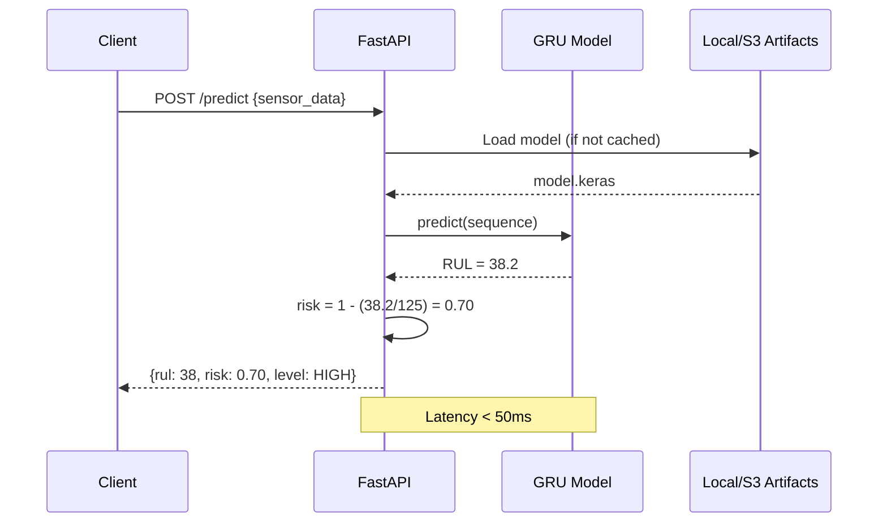

# Real-Time Inference Service

## Overview

The inference service is a FastAPI application that serves the trained GRU model for real-time RUL predictions. It loads the model from artifacts and provides REST endpoints for predictions.



---

## API Design

### POST /predict

**Request:**
```json
{
  "engine_id": "ENG-12345",
  "sensor_data": [
    [0.52, 0.61, 0.73, 0.45, 0.68, 0.71, 0.55, 0.62, 0.48, 0.59, 0.64],
    [0.53, 0.62, 0.74, 0.46, 0.69, 0.72, 0.56, 0.63, 0.49, 0.60, 0.65],
    ...  // 30 timesteps total
  ]
}
```

**Response:**
```json
{
  "engine_id": "ENG-12345",
  "remaining_cycles": 38,
  "failure_risk": 0.70,
  "risk_level": "HIGH",
  "confidence": 0.85,
  "timestamp": "2024-01-15T10:23:45Z",
  "model_version": "gru_fd001_v1"
}
```

### GET /health

```json
{
  "status": "healthy",
  "model_loaded": true,
  "model_version": "gru_fd001_v1",
  "uptime_seconds": 3600
}
```

### GET /model/info

```json
{
  "model_type": "GRU",
  "input_shape": [30, 11],
  "window_size": 30,
  "sensors": ["s2", "s3", "s4", "s7", "s9", "s11", "s12", "s14", "s17", "s20", "s21"],
  "rul_clip": 125,
  "trained_on": "2024-01-10T14:30:00Z"
}
```

---

## Implementation

### FastAPI Application

```python
# src/inference/app.py
from fastapi import FastAPI, HTTPException
from pydantic import BaseModel, Field
import tensorflow as tf
import numpy as np
import joblib
from datetime import datetime, timezone
from pathlib import Path
from typing import List

app = FastAPI(
    title="Aircraft Engine RUL Prediction API",
    description="Real-time prediction of Remaining Useful Life for aircraft engines",
    version="1.0.0"
)

# Global model and scaler (loaded at startup)
model = None
scaler = None
config = None

class SensorData(BaseModel):
    engine_id: str
    sensor_data: List[List[float]] = Field(
        ..., 
        description="30 timesteps of 11 sensor readings (normalized)",
        min_items=30,
        max_items=30
    )

class PredictionResponse(BaseModel):
    engine_id: str
    remaining_cycles: int
    failure_risk: float
    risk_level: str
    confidence: float
    timestamp: str
    model_version: str

@app.on_event("startup")
async def load_model():
    global model, scaler, config
    
    # Load model
    model_path = Path("artifacts/model_trainer/model.keras")
    model = tf.keras.models.load_model(model_path)
    
    # Load scaler
    scaler_path = Path("artifacts/data_transformation/scaler.pkl")
    scaler = joblib.load(scaler_path)
    
    # Load config
    import json
    config_path = Path("artifacts/data_feature_engineering/feature_config.json")
    with open(config_path) as f:
        config = json.load(f)
    
    print(f"✓ Model loaded: {model_path}")
    print(f"✓ Scaler loaded: {scaler_path}")
    print(f"✓ Config loaded: window_size={config['window_size']}, rul_clip={config['rul_clip']}")

@app.post("/predict", response_model=PredictionResponse)
async def predict(data: SensorData):
    """
    Predict Remaining Useful Life for an engine given 30 timesteps of sensor data.
    """
    try:
        # Validate input shape
        sensor_array = np.array(data.sensor_data, dtype=np.float32)
        if sensor_array.shape != (30, 11):
            raise HTTPException(
                status_code=400, 
                detail=f"Expected shape (30, 11), got {sensor_array.shape}"
            )
        
        # Reshape for model input: (1, 30, 11)
        X = sensor_array.reshape(1, 30, 11)
        
        # Predict normalized RUL
        rul_normalized = float(model.predict(X, verbose=0)[0][0])
        
        # Denormalize
        rul_clip = config['rul_clip']
        rul_pred = rul_normalized * rul_clip
        rul_pred = max(0.0, rul_pred)  # Clamp to non-negative
        
        # Compute risk
        risk = 1.0 - (rul_pred / rul_clip)
        risk = max(0.0, min(1.0, risk))
        
        # Determine risk level
        if risk >= 0.8:
            risk_level = "CRITICAL"
        elif risk >= 0.6:
            risk_level = "HIGH"
        elif risk >= 0.3:
            risk_level = "MEDIUM"
        else:
            risk_level = "LOW"
        
        # Confidence (inverse of prediction uncertainty - simplified)
        confidence = 0.85  # Placeholder - can be computed from ensemble or dropout
        
        return PredictionResponse(
            engine_id=data.engine_id,
            remaining_cycles=int(round(rul_pred)),
            failure_risk=round(risk, 3),
            risk_level=risk_level,
            confidence=confidence,
            timestamp=datetime.now(timezone.utc).isoformat(),
            model_version="gru_fd001_v1"
        )
    
    except Exception as e:
        raise HTTPException(status_code=500, detail=f"Prediction failed: {str(e)}")

@app.get("/health")
async def health_check():
    return {
        "status": "healthy" if model is not None else "unhealthy",
        "model_loaded": model is not None,
        "model_version": "gru_fd001_v1",
        "uptime_seconds": 3600  # Placeholder
    }

@app.get("/model/info")
async def model_info():
    if config is None:
        raise HTTPException(status_code=503, detail="Model not loaded")
    
    return {
        "model_type": "GRU",
        "input_shape": [config['window_size'], len(config['features'])],
        "window_size": config['window_size'],
        "sensors": config['features'],
        "rul_clip": config['rul_clip'],
        "trained_on": "2024-01-10T14:30:00Z"  # From MLflow metadata
    }
```

---

## Preprocessing Pipeline for Inference

When receiving raw sensor data, apply the same preprocessing as training:

```python
# src/inference/preprocessor.py
import numpy as np
import joblib
from pathlib import Path

class InferencePreprocessor:
    def __init__(self):
        self.scaler = joblib.load("artifacts/data_transformation/scaler.pkl")
        self.sensor_cols = ['s2', 's3', 's4', 's7', 's9', 's11', 's12', 's14', 's17', 's20', 's21']
    
    def preprocess(self, raw_data: dict) -> np.ndarray:
        """
        Convert raw sensor readings to model input.
        
        Args:
            raw_data: Dict with keys 'unit', 'cycle', 'os1', 'os2', 'os3', 's1'-'s21'
        
        Returns:
            Normalized sensor array of shape (11,)
        """
        # Extract sensor values
        sensor_values = [raw_data[s] for s in self.sensor_cols]
        sensor_array = np.array(sensor_values).reshape(1, -1)
        
        # Normalize
        normalized = self.scaler.transform(sensor_array)
        
        return normalized.flatten()
```

---

## Batch Prediction Endpoint

For processing multiple engines at once:

```python
@app.post("/predict/batch")
async def predict_batch(data: List[SensorData]):
    """
    Batch prediction for multiple engines.
    """
    results = []
    for engine_data in data:
        try:
            result = await predict(engine_data)
            results.append(result)
        except Exception as e:
            results.append({
                "engine_id": engine_data.engine_id,
                "error": str(e)
            })
    
    return {"predictions": results, "total": len(results)}
```

---

## Docker Deployment

### Dockerfile

```dockerfile
# src/inference/Dockerfile
FROM python:3.11-slim

WORKDIR /app

# Install dependencies
COPY requirements.txt .
RUN pip install --no-cache-dir -r requirements.txt

# Copy application
COPY src/inference/ ./src/inference/
COPY artifacts/ ./artifacts/

# Expose port
EXPOSE 8000

# Run server
CMD ["uvicorn", "src.inference.app:app", "--host", "0.0.0.0", "--port", "8000", "--workers", "2"]
```

### docker-compose.yml

```yaml
version: '3.8'

services:
  inference-api:
    build:
      context: .
      dockerfile: src/inference/Dockerfile
    ports:
      - "8000:8000"
    volumes:
      - ./artifacts:/app/artifacts:ro
    environment:
      - MODEL_PATH=/app/artifacts/model_trainer/model.keras
      - SCALER_PATH=/app/artifacts/data_transformation/scaler.pkl
    healthcheck:
      test: ["CMD", "curl", "-f", "http://localhost:8000/health"]
      interval: 30s
      timeout: 10s
      retries: 3
    restart: unless-stopped
```

---

## Testing the API

### Using curl

```bash
# Health check
curl http://localhost:8000/health

# Model info
curl http://localhost:8000/model/info

# Prediction
curl -X POST http://localhost:8000/predict \
  -H "Content-Type: application/json" \
  -d '{
    "engine_id": "ENG-001",
    "sensor_data": [
      [0.52, 0.61, 0.73, 0.45, 0.68, 0.71, 0.55, 0.62, 0.48, 0.59, 0.64],
      [0.53, 0.62, 0.74, 0.46, 0.69, 0.72, 0.56, 0.63, 0.49, 0.60, 0.65],
      ... (28 more timesteps)
    ]
  }'
```

### Using Python

```python
import requests
import numpy as np

# Generate sample data (30 timesteps, 11 sensors)
sensor_data = np.random.rand(30, 11).tolist()

response = requests.post(
    "http://localhost:8000/predict",
    json={
        "engine_id": "ENG-001",
        "sensor_data": sensor_data
    }
)

print(response.json())
```

---

## Performance Optimization

### Model Caching

Load model once at startup, not per request:

```python
@app.on_event("startup")
async def load_model():
    global model
    model = tf.keras.models.load_model("artifacts/model_trainer/model.keras")
```

### Batch Inference

Process multiple predictions in a single forward pass:

```python
# Instead of: model.predict(X) for each X
# Do: model.predict(np.stack([X1, X2, X3, ...]))
```

### TensorFlow Lite (Optional)

Convert model to TFLite for faster inference:

```python
converter = tf.lite.TFLiteConverter.from_keras_model(model)
tflite_model = converter.convert()

# Save
with open('model.tflite', 'wb') as f:
    f.write(tflite_model)
```

---

## Error Handling

```python
class InferenceError(Exception):
    pass

@app.exception_handler(InferenceError)
async def inference_error_handler(request, exc):
    return JSONResponse(
        status_code=500,
        content={
            "error": "Inference failed",
            "detail": str(exc),
            "timestamp": datetime.now(timezone.utc).isoformat()
        }
    )
```

---

## Latency Budget

| Step | Target Latency |
|------|----------------|
| Input validation | < 1ms |
| Preprocessing | < 5ms |
| Model inference (GRU) | < 30ms |
| Postprocessing | < 2ms |
| API overhead | < 10ms |
| **Total end-to-end** | **< 50ms** |

---

## Deployment Checklist

- [ ] Model artifacts available in `artifacts/`
- [ ] Scaler and config files present
- [ ] FastAPI dependencies installed
- [ ] Docker image built and tested
- [ ] Health endpoint returns 200
- [ ] Sample prediction succeeds
- [ ] Error handling tested
- [ ] Logging configured
- [ ] CORS configured (if needed for web clients)

---

## Next Steps

1. **Implement the API**: Create `src/inference/app.py`
2. **Test locally**: `uvicorn src.inference.app:app --reload`
3. **Dockerize**: Build and run container
4. **Load test**: Use tools like `locust` or `ab` to test throughput
5. **Deploy**: Use Docker Compose or Kubernetes for production
