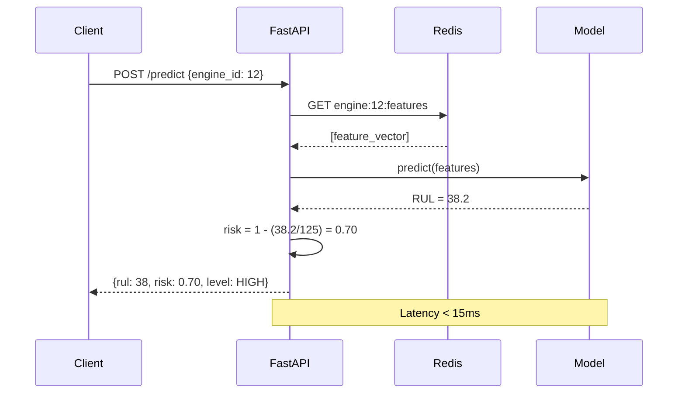
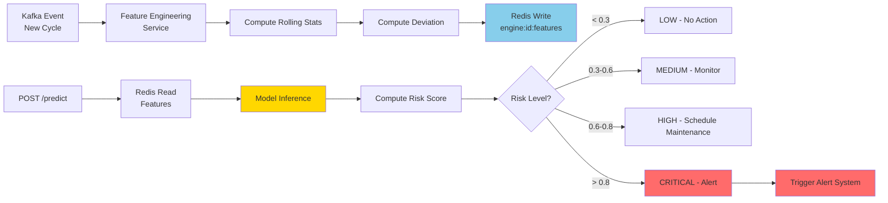

# Real-Time Inference Service

## Overview

The inference service is a FastAPI application that:
1. Receives a request for an engine ID
2. Fetches the latest engineered features from Redis
3. Loads the model and runs prediction
4. Returns RUL and failure risk



---

## API Contract

### POST /predict

Request:
```json
{
  "engine_id": 12
}
```

Response:
```json
{
  "engine_id": 12,
  "remaining_cycles": 38,
  "failure_risk": 0.70,
  "risk_level": "HIGH",
  "timestamp": "2024-01-15T10:23:45Z"
}
```

### GET /health

```json
{ "status": "ok", "model_version": "xgboost_fd001_v3" }
```

### GET /engines/{engine_id}/history

Returns last N predictions for trend visualization.

---

## Service Implementation

```python
# inference/app.py
from fastapi import FastAPI, HTTPException
from pydantic import BaseModel
import mlflow.xgboost
import redis
import json
import numpy as np
from datetime import datetime, timezone

app = FastAPI(title="Aircraft Engine RUL Prediction")

# Load model and scaler at startup
model  = mlflow.xgboost.load_model("models:/xgboost_fd001/Production")
scaler = joblib.load("artifacts/scaler_FD001.pkl")
r      = redis.Redis(host="localhost", port=6379, decode_responses=True)

RUL_CLIP = 125
FEATURE_COLS = json.load(open("artifacts/feature_cols.json"))

class PredictRequest(BaseModel):
    engine_id: int

@app.post("/predict")
def predict(req: PredictRequest):
    key = f"engine:{req.engine_id}:features"
    raw = r.get(key)
    if raw is None:
        raise HTTPException(status_code=404, detail=f"No features found for engine {req.engine_id}")

    features = np.array(json.loads(raw)).reshape(1, -1)
    rul_pred  = float(model.predict(features)[0])
    rul_pred  = max(0.0, rul_pred)  # clamp negatives

    risk = round(1.0 - (rul_pred / RUL_CLIP), 3)
    risk = max(0.0, min(1.0, risk))

    risk_level = (
        "CRITICAL" if risk >= 0.8 else
        "HIGH"     if risk >= 0.6 else
        "MEDIUM"   if risk >= 0.3 else
        "LOW"
    )

    return {
        "engine_id": req.engine_id,
        "remaining_cycles": round(rul_pred, 1),
        "failure_risk": risk,
        "risk_level": risk_level,
        "timestamp": datetime.now(timezone.utc).isoformat()
    }
```

---

## Feature Store Integration

The inference service reads pre-computed features from Redis. The feature engineering service writes them.

### Redis Key Schema

```
engine:{id}:features    → JSON array of feature values (matches FEATURE_COLS order)
engine:{id}:buffer      → JSON list of last 30 raw sensor readings (for rolling computation)
engine:{id}:baseline    → JSON dict of healthy baseline sensor means
engine:{id}:last_cycle  → integer, last processed cycle number
engine:{id}:predictions → Redis list of last 100 (rul, risk, timestamp) tuples
```

### Feature Write (Feature Engineering Service)

```python
def write_features(engine_id: int, feature_vector: np.ndarray, r: redis.Redis):
    r.set(
        f"engine:{engine_id}:features",
        json.dumps(feature_vector.tolist()),
        ex=3600  # expire after 1 hour of inactivity
    )
```

---

## Inference Flow (End-to-End)



---

## Latency Budget

| Step | Target Latency |
|------|---------------|
| Redis feature read | < 1ms |
| Model inference (XGBoost) | < 2ms |
| Model inference (LSTM) | < 5ms |
| API overhead | < 5ms |
| Total end-to-end | < 15ms |

---

## Model Loading Strategy

Load model once at startup, not per request:

```python
from contextlib import asynccontextmanager

@asynccontextmanager
async def lifespan(app: FastAPI):
    # Startup
    app.state.model  = mlflow.xgboost.load_model("models:/xgboost_fd001/Production")
    app.state.scaler = joblib.load("artifacts/scaler_FD001.pkl")
    yield
    # Shutdown — cleanup if needed

app = FastAPI(lifespan=lifespan)
```

For model updates without downtime, use a background thread that polls MLflow for new Production versions every 5 minutes and hot-swaps the model reference.

---

## Error Handling

| Scenario | Behavior |
|----------|----------|
| Engine ID not in Redis | 404 with message |
| Stale features (> 1 hour old) | 503 with staleness warning |
| Model prediction fails | 500, log to CloudWatch |
| Redis connection lost | 503, circuit breaker pattern |

---

## Docker Setup

```dockerfile
# inference/Dockerfile
FROM python:3.11-slim
WORKDIR /app
COPY requirements.txt .
RUN pip install -r requirements.txt
COPY . .
CMD ["uvicorn", "app:app", "--host", "0.0.0.0", "--port", "8000", "--workers", "2"]
```

```yaml
# docker-compose.yml (inference service section)
inference:
  build: ./inference
  ports:
    - "8000:8000"
  environment:
    - REDIS_HOST=redis
    - MLFLOW_TRACKING_URI=http://mlflow:5000
  depends_on:
    - redis
    - mlflow
```
