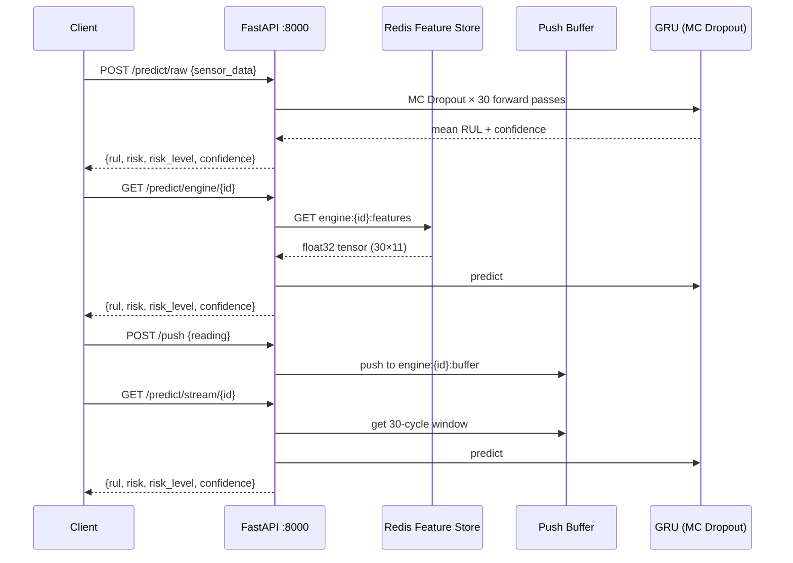
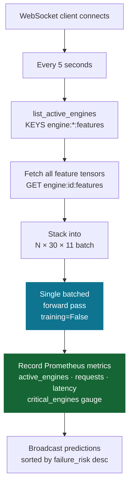
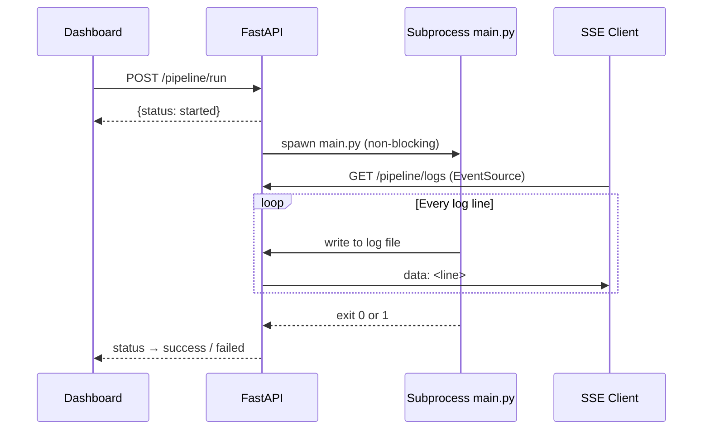

# Inference Service

## Overview

FastAPI application serving the trained GRU model for real-time RUL predictions. Three prediction pathways, WebSocket streaming, Prometheus metrics, structured logging, and on-demand pipeline retraining.



---

## Prediction Pathways

| Pathway | Endpoint | Data Source | Use Case |
|---------|----------|-------------|----------|
| Normalized array | `POST /predict` | Request body (30×11 float array) | Direct model access |
| Raw sensors | `POST /predict/raw` | Request body (30 dicts of raw values) | Pre-scaler input |
| Redis feature store | `GET /predict/engine/{id}` | `engine:{id}:features` written by streaming consumer | Live streaming pipeline |
| Push buffer | `GET /predict/stream/{id}` | `engine:{id}:buffer` written by `POST /push` | Replay / simulation lab |
| Batch | `POST /predict/batch` | List of normalized arrays | Bulk inference |

---

## Full API Reference

| Method | Endpoint | Description |
|--------|----------|-------------|
| `POST` | `/predict` | Predict from normalized 30×11 array |
| `POST` | `/predict/raw` | Predict from raw sensor dict array |
| `GET`  | `/predict/engine/{id}` | Predict from Redis feature store (streaming pathway) |
| `GET`  | `/predict/stream/{id}` | Predict from push buffer (replay pathway) |
| `POST` | `/predict/batch` | Batch predictions |
| `POST` | `/push` | Push single raw sensor reading into per-engine buffer |
| `GET`  | `/engines` | List all active engines (buffer + Redis) |
| `GET`  | `/engines/{id}` | Engine status + last prediction |
| `GET`  | `/alerts` | Engines at or above risk threshold |
| `GET`  | `/health` | Service health + uptime |
| `GET`  | `/model/info` | Model metadata (type, shape, sensors, version) |
| `GET`  | `/model/evaluation` | Live metrics from `artifacts/model_evaluation/metrics.json` |
| `GET`  | `/metrics` | Prometheus scrape endpoint |
| `POST` | `/pipeline/run` | Trigger full ML pipeline retraining (non-blocking) |
| `GET`  | `/pipeline/status` | Current pipeline run state |
| `GET`  | `/pipeline/logs` | SSE stream of live pipeline log output |
| `GET`  | `/drift/reports` | List Evidently HTML drift reports |
| `GET`  | `/drift/reports/{filename}` | Serve a specific drift report HTML |
| `WS`   | `/ws/predictions` | Live prediction stream (5s interval, all Redis engines) |
| `WS`   | `/ws/telemetry` | Live telemetry metadata stream (2s interval) |
| `WS`   | `/ws/alerts` | Live HIGH/CRITICAL alert stream (5s interval) |

---

## WebSocket Batch Prediction Loop

The `/ws/predictions` endpoint runs a batched TF forward pass every 5 seconds across all active engines — O(1) model calls regardless of fleet size:



---

## Pipeline Retraining



Returns `409 Conflict` if a run is already in progress.

---

## Redis Key Schema

| Key | Type | Written by | Read by |
|-----|------|-----------|---------|
| `engine:{id}:features` | bytes (float32) | Streaming consumer | `/predict/engine/{id}`, `/ws/predictions` |
| `engine:{id}:meta` | hash | Streaming consumer | `/ws/telemetry` |
| `engine:{id}:buffer` | list (JSON) | `POST /push` | `/predict/stream/{id}` |

TTL on all keys: **3600s** (configurable via `config/redis.yaml`).

---

## Prometheus Metrics

| Metric | Type | Labels | Notes |
|--------|------|--------|-------|
| `prediction_requests_total` | Counter | `engine_id`, `risk_level` | Incremented by WS batch loop |
| `prediction_latency_seconds` | Histogram | — | Timed on each batch forward pass |
| `predicted_rul_cycles` | Histogram | — | Distribution of predicted RUL values |
| `failure_risk_score` | Histogram | — | Distribution of risk scores |
| `prediction_confidence` | Histogram | — | Distribution of confidence scores |
| `critical_engines_total` | **Gauge** | — | Current count of CRITICAL engines (set each WS cycle) |
| `prediction_errors_total` | Counter | `error_type` | |
| `model_load_time_seconds` | Gauge | — | Set once at startup |
| `active_engines_total` | Gauge | — | Set each WS cycle |

> `critical_engines_total` is a **Gauge** (not Counter) — it reflects the current number of CRITICAL engines, not a running total. This prevents the metric from growing unboundedly as the fleet cycles through risk levels.

---

## Docker Deployment

```yaml
inference-api:
  build: { context: ., dockerfile: Dockerfile }
  ports: ["8000:8000"]
  volumes:
    - ./artifacts:/app/artifacts   # rw — retraining writes here
    - ./logs:/app/logs
    - ./reports:/app/reports
  environment:
    REDIS_URL: redis://redis:6379/0
  depends_on:
    redis: { condition: service_healthy }
```

`artifacts/` is mounted **read-write** so that pipeline retraining can write new model artifacts directly into the host directory without rebuilding the container.
