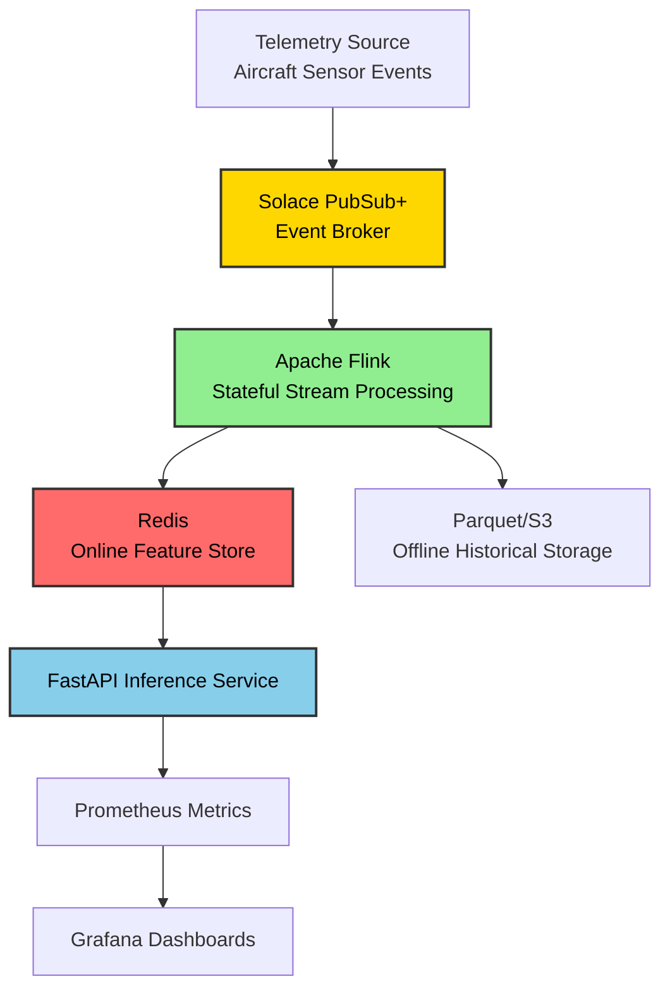
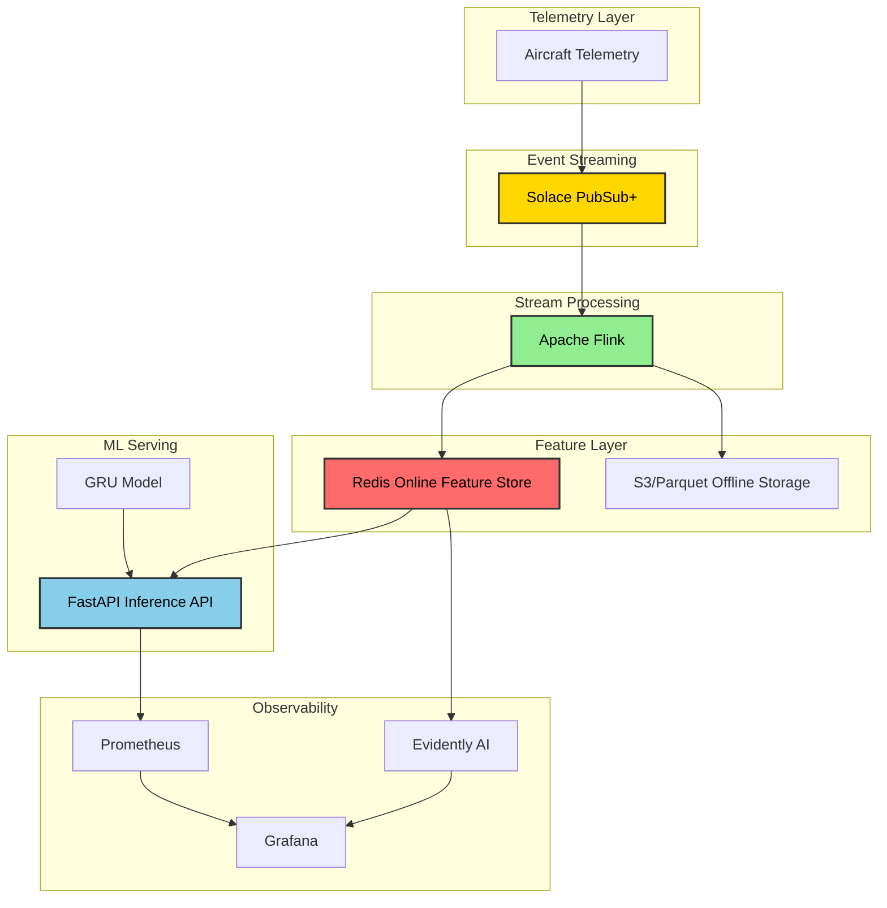

# Updated Production Streaming Architecture

## Architectural Direction Update

The project architecture has been updated from a Kafka-centric streaming pipeline toward a more enterprise-oriented event-driven ML infrastructure using:

* Apache Flink for stateful stream processing
* Solace PubSub+ as the event broker
* Redis as the online feature store
* FastAPI for model inference serving

This better aligns the system with modern real-time telemetry processing architectures commonly used in:

* Aerospace telemetry systems
* Industrial IoT platforms
* Real-time predictive maintenance
* High-throughput event-driven ML systems

---

# Updated Streaming Pipeline

## Overview

The streaming pipeline is designed as a real-time event-driven ML system.

Instead of directly using Kafka consumers for feature engineering, the architecture now uses:

* Solace PubSub+ for enterprise-grade event streaming
* Apache Flink for distributed stateful stream processing
* Redis as an online feature store for low-latency inference access



---

# Why Solace + Flink?

## Solace PubSub+

Solace acts as the enterprise event broker responsible for:

* Event routing
* Pub/Sub messaging
* Topic subscriptions
* Persistent queues
* Reliable delivery
* Replay capabilities
* High-throughput telemetry ingestion

The broker layer handles movement of events throughout the system.

---

## Apache Flink

Apache Flink is responsible for:

* Stateful stream processing
* Rolling telemetry windows
* Event-time processing
* Window aggregation
* Feature computation
* Fault-tolerant stream execution
* Distributed stream scaling

Flink is used because aircraft telemetry is:

* Sequential
* Stateful
* Continuous
* Time-sensitive
* High-frequency

This makes Flink a better architectural fit than manually managed Python consumers.

---

# Why Redis Is Still Required

Even though Solace handles event streaming and Flink manages stream state internally, Redis is still required as an online feature store.

Redis is NOT used merely as a cache.

It stores:

* Latest rolling telemetry sequences
* Latest prediction state
* Per-engine feature windows
* Recently computed inference-ready tensors
* Operational online serving state

Example Redis keys:

```text
engine:ENG-0042:window
engine:ENG-0042:last_prediction
engine:ENG-0042:risk
engine:ENG-0042:last_seen
```

The FastAPI inference service can fetch features instantly from Redis without querying the streaming system directly.

This keeps the architecture:

* Decoupled
* Low latency
* Scalable
* Fault tolerant

---

# Updated System Architecture



---

# Updated Component Responsibilities

| Component      | Responsibility                                     |
| -------------- | -------------------------------------------------- |
| Solace PubSub+ | Event ingestion and routing                        |
| Apache Flink   | Stateful stream processing and feature computation |
| Redis          | Online feature serving and operational state       |
| FastAPI        | Low-latency model inference                        |
| MLflow         | Model registry and experiment tracking             |
| Prometheus     | Metrics collection                                 |
| Grafana        | Visualization and dashboards                       |
| Evidently AI   | Drift and ML monitoring                            |

---

# Implementation Status

## Currently Implemented

* Data ingestion pipeline
* Data validation pipeline
* Data preprocessing pipeline
* Sequence feature engineering
* GRU model training
* MLflow integration
* FastAPI inference endpoints
* Prediction testing
* Artifact generation
* Modular project architecture

## Planned / In Progress

* Solace PubSub+ integration
* Apache Flink stream processing
* Redis online feature store
* Real-time telemetry simulation
* Prometheus instrumentation
* Grafana dashboards
* Container orchestration

---

# Recommended Final Production Architecture

```text
Telemetry Source
       ↓
Solace PubSub+
       ↓
Apache Flink
       ↓
Redis Online Feature Store
       ↓
FastAPI Inference Service
       ↓
Prometheus + Grafana
```

This architecture separates:

* Event transport
* Stream computation
* Online feature serving
* ML inference
* Monitoring

into independent scalable layers.

---

# Important Design Principle

The architecture intentionally separates:

## Event Streaming

Handled by:

* Solace PubSub+

## Stateful Stream Computation

Handled by:

* Apache Flink

## Online ML Feature Serving

Handled by:

* Redis

## ML Inference

Handled by:

* FastAPI + TensorFlow

This separation improves:

* Reliability
* Scalability
* Maintainability
* Fault isolation
* Independent deployment
* Production observability

---

# Future Scaling Possibilities

Potential future upgrades include:

* Kubernetes deployment
* GPU inference serving
* Multi-model routing
* Feature versioning
* Online retraining pipelines
* Canary model deployment
* Streaming drift detection
* Multi-region telemetry ingestion

These are intentionally future extensions and are not currently implemented.
