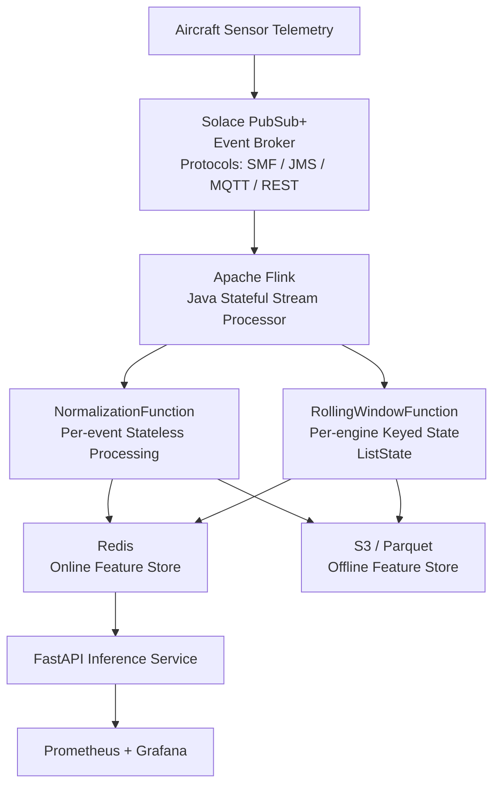

# Streaming Pipeline — Real-Time Telemetry & Feature Engineering

## Overview

This document describes the production streaming pipeline for the Real-Time Aircraft Engine Predictive Maintenance System. The pipeline ingests per-cycle sensor telemetry over **Solace PubSub+**, processes it statelessly-normalized and statelessly-built inside **Apache Flink**, writes inference-ready tensors to **Redis**, and archives to **S3/Parquet** — end-to-end fault-tolerant, exactly-once where semantics permit, and horizontally scalable.




---

## Technology Choices

| Component | Technology | Why |
|-----------|------------|-----|
| Event broker | Solace PubSub+ | Enterprise-grade, multi-protocol (SMF, JMS, MQTT, REST), hardware-accelerated routing, built-in message replay, wildcard subscriptions, no ZooKeeper dependency |
| Stream processor | Apache Flink (Java) | Stateful keyed streams, event-time processing, exactly-once checkpoint semantics, full DataStream API access |
| Online feature store | Redis | Sub-millisecond reads, TTL-based expiry, atomic pipelining |
| Offline store | Apache Parquet on S3 | Columnar, efficient batch reads for GRU retraining |
| Serialization | Solace Schema Registry + JSON/Avro | Solace natively integrates schema management; JSON works fine at aircraft telemetry volumes |
| Build tool | Apache Maven | Standard Java project toolchain |

### Why Solace over Kafka?

Kafka is an excellent log-based broker, but it carries real operational complexity: ZooKeeper (or KRaft), topic partition management, consumer group rebalancing lag, and the Confluent Schema Registry as a separate service. Solace PubSub+ offers a cleaner operational model for this use case:

**Multi-protocol out of the box.** Aircraft avionics and ground stations speak MQTT, AMQP, or REST — not Kafka's binary protocol. Solace acts as a universal protocol gateway. A ground station can POST sensor data via REST; a flight data recorder can publish over MQTT; Flink consumes over JMS or the native SMF protocol. No middleware translation layer needed.

**Hardware-accelerated routing.** The Solace appliance (and the software broker) does topic matching in hardware. Wildcard subscriptions like `aircraft/engine/+/telemetry` are resolved in nanoseconds regardless of fleet size.

**Built-in message replay.** Solace's replay log lets Flink replay events from an arbitrary timestamp — critical for backfilling features after a consumer outage or a model retrain. Kafka requires careful offset management for the same result.

**No ZooKeeper.** One fewer distributed system to operate and monitor.

**Flink-Solace integration.** The `flink-connector-solace` library (from Solace's official connector repo) provides a `SolaceSource` that maps directly to Flink's `Source` interface. Everything downstream of the source (keyed state, sinks, checkpoints) is identical to any other Flink pipeline.

---

## Solace Concepts You Need Before Proceeding

Solace uses different terminology from Kafka. These map directly:

| Kafka | Solace | Notes |
|-------|--------|-------|
| Topic | Topic (hierarchical) | Solace topics use `/` separators, not `.`. Wildcard `*` = one level, `>` = all levels below |
| Partition | Partition (on Queues) | Partitioned queues provide per-key ordering, mirroring Kafka partition semantics |
| Consumer Group | Queue + Consumer | Consumers bind to a named Queue; the broker handles load balancing |
| Offset commit | Acknowledgement (ACK) | Solace uses message ACK/NACK; Flink handles this via checkpoint-aligned ACKs |
| Log compaction | Replay log | Solace maintains a configurable replay log per queue |
| Schema Registry | Solace Schema Registry (SaaS) or AsyncAPI | Solace Cloud includes a schema registry; for self-hosted, AsyncAPI catalogs work |

**Queue types you'll use:**

- **Exclusive Queue**: Only one consumer receives each message. Use for the Flink source (Flink manages internal parallelism).
- **Non-Exclusive Queue**: Round-robin delivery to all bound consumers. Use for broadcast scenarios (monitoring, archiving).
- **Partitioned Queue**: Messages with the same partition key always go to the same consumer. Equivalent to Kafka's key-based partitioning — use this to guarantee per-engine ordering.

---

## Event Schema

Every telemetry event is one flight cycle from one engine. Use JSON for simplicity (Solace compresses over SMF natively; at aircraft telemetry volumes JSON overhead is negligible):

```json
{
  "engine_id": "ENG-042",
  "cycle": 187,
  "event_time_ms": 1705312800000,
  "sensors": {
    "s2":  641.82,
    "s3":  1590.64,
    "s4":  1408.23,
    "s7":  553.91,
    "s9":  9050.17,
    "s11": 47.47,
    "s12": 521.66,
    "s14": 2388.02,
    "s17": 392.0,
    "s20": 38.86,
    "s21": 23.3988
  }
}
```

**Topic hierarchy:**

```
aircraft/engine/{engine_id}/telemetry/cycle
```

Example: `aircraft/engine/ENG-042/telemetry/cycle`

Flink subscribes to the wildcard `aircraft/engine/*/telemetry/cycle` via a durable queue bound to that subscription. This means you can add a new engine fleet (`ENG-5000` through `ENG-5200`) and the pipeline receives their events without any configuration change.

**Register the schema** in Solace's AsyncAPI catalog or schema registry before going to production. For local development, JSON without schema enforcement is fine.

---

## Project Structure

```
streaming/
├── pom.xml
└── src/
    └── main/
        ├── resources/
        │   ├── solace.properties           ← broker connection config
        │   └── scaler_params.csv           ← exported MinMax scaler params
        └── java/
            └── com/predictivemaintenance/
                ├── producer/
                │   └── TelemetryProducer.java       ← Solace JCSMP producer
                ├── pipeline/
                │   ├── TelemetryPipeline.java       ← Flink job entry point
                │   ├── functions/
                │   │   ├── NormalizationFunction.java
                │   │   └── RollingWindowFunction.java
                │   ├── sinks/
                │   │   ├── RedisSink.java
                │   │   └── S3ParquetSink.java
                │   └── source/
                │       └── SolaceSourceFactory.java
                └── model/
                    ├── EngineEvent.java
                    └── FeatureVector.java
```

---

## Maven Configuration

```xml
<!-- pom.xml -->
<project>
  <groupId>com.predictivemaintenance</groupId>
  <artifactId>streaming-pipeline</artifactId>
  <version>1.0.0</version>

  <properties>
    <flink.version>1.19.0</flink.version>
    <solace.flink.version>1.1.0</solace.flink.version>
    <solace.jcsmp.version>10.24.0</solace.jcsmp.version>
    <jackson.version>2.16.1</jackson.version>
    <jedis.version>5.1.0</jedis.version>
    <java.version>17</java.version>
  </properties>

  <repositories>
    <!-- Solace publishes connectors to their own Maven repository -->
    <repository>
      <id>solace-releases</id>
      <url>https://repo.solace.com/artifactory/releases</url>
    </repository>
  </repositories>

  <dependencies>
    <!-- Flink core — provided: already on Flink cluster classpath -->
    <dependency>
      <groupId>org.apache.flink</groupId>
      <artifactId>flink-streaming-java</artifactId>
      <version>${flink.version}</version>
      <scope>provided</scope>
    </dependency>
    <dependency>
      <groupId>org.apache.flink</groupId>
      <artifactId>flink-clients</artifactId>
      <version>${flink.version}</version>
      <scope>provided</scope>
    </dependency>

    <!-- Solace Flink connector (Source API) -->
    <dependency>
      <groupId>com.solace.connector.flink</groupId>
      <artifactId>flink-connector-solace</artifactId>
      <version>${solace.flink.version}</version>
    </dependency>

    <!-- Solace JCSMP (for producer and direct messaging) -->
    <dependency>
      <groupId>com.solacesystems</groupId>
      <artifactId>sol-jcsmp</artifactId>
      <version>${solace.jcsmp.version}</version>
    </dependency>

    <!-- JSON deserialization -->
    <dependency>
      <groupId>com.fasterxml.jackson.core</groupId>
      <artifactId>jackson-databind</artifactId>
      <version>${jackson.version}</version>
    </dependency>

    <!-- Redis client -->
    <dependency>
      <groupId>redis.clients</groupId>
      <artifactId>jedis</artifactId>
      <version>${jedis.version}</version>
    </dependency>

    <!-- Parquet + S3 sink -->
    <dependency>
      <groupId>org.apache.flink</groupId>
      <artifactId>flink-parquet</artifactId>
      <version>${flink.version}</version>
    </dependency>
    <dependency>
      <groupId>org.apache.hadoop</groupId>
      <artifactId>hadoop-client</artifactId>
      <version>3.3.6</version>
    </dependency>

    <!-- Logging -->
    <dependency>
      <groupId>org.slf4j</groupId>
      <artifactId>slf4j-api</artifactId>
      <version>2.0.9</version>
    </dependency>
    <dependency>
      <groupId>ch.qos.logback</groupId>
      <artifactId>logback-classic</artifactId>
      <version>1.4.14</version>
    </dependency>
  </dependencies>

  <build>
    <plugins>
      <plugin>
        <groupId>org.apache.maven.plugins</groupId>
        <artifactId>maven-shade-plugin</artifactId>
        <version>3.5.1</version>
        <executions>
          <execution>
            <phase>package</phase>
            <goals><goal>shade</goal></goals>
            <configuration>
              <shadedArtifactAttached>false</shadedArtifactAttached>
              <filters>
                <filter>
                  <artifact>*:*</artifact>
                  <excludes>
                    <!-- Strip JAR signatures — they break when shaded -->
                    <exclude>META-INF/*.SF</exclude>
                    <exclude>META-INF/*.DSA</exclude>
                    <exclude>META-INF/*.RSA</exclude>
                  </excludes>
                </filter>
              </filters>
              <transformers>
                <transformer implementation="org.apache.maven.plugins.shade.resource.ManifestResourceTransformer">
                  <mainClass>com.predictivemaintenance.pipeline.TelemetryPipeline</mainClass>
                </transformer>
                <!-- Merge service loader files from Flink, Solace, Hadoop -->
                <transformer implementation="org.apache.maven.plugins.shade.resource.ServicesResourceTransformer"/>
              </transformers>
            </configuration>
          </execution>
        </executions>
      </plugin>
      <plugin>
        <groupId>org.apache.maven.plugins</groupId>
        <artifactId>maven-compiler-plugin</artifactId>
        <version>3.12.1</version>
        <configuration>
          <source>17</source>
          <target>17</target>
        </configuration>
      </plugin>
    </plugins>
  </build>
</project>
```

The `<scope>provided</scope>` on Flink core is non-negotiable. Including them in the fat JAR causes classpath conflicts with the Flink cluster's own runtime JARs. The Solace connector, Jedis, Jackson, and Parquet libraries must be in the fat JAR — they are not on the Flink classpath by default.

---

## Solace Broker Setup

### Local Development with Docker

Solace PubSub+ Standard is available as a free Docker image:

```yaml
# docker-compose.yml (Solace section)
solace:
  image: solace/solace-pubsub-standard:latest
  ports:
    - "8080:8080"    # Management UI (Solace Manager)
    - "55555:55555"  # SMF (Solace Message Format) — used by JCSMP/Flink connector
    - "8008:8008"    # SMF over WebSocket
    - "1883:1883"    # MQTT
    - "5672:5672"    # AMQP 1.0
    - "9000:9000"    # REST messaging
  environment:
    username_admin_globalaccesslevel: admin
    username_admin_password: admin
    system_scaling_maxconnectioncount: "1000"
  shm_size: "2g"
  ulimits:
    core: -1
    nofile:
      soft: 2448
      hard: 38048
  healthcheck:
    test: ["CMD", "curl", "-f", "http://localhost:8080/SEMP/v2/config"]
    interval: 15s
    retries: 5
```

Access the Solace Manager UI at `http://localhost:8080` (admin/admin). This gives you a visual view of queues, subscriptions, message rates, and consumer connections — far more observable than Kafka's CLI-only tooling.

### Provisioning the Queue and Subscription

Solace queues must be provisioned before the consumer binds. Do this via the SEMP v2 REST API (automatable in CI/CD):

```bash
BASE="http://localhost:8080/SEMP/v2/config/msgVpns/default"
AUTH="-u admin:admin"

# Create a durable, partitioned queue for Flink to consume from
# Partitioned = messages with the same partition key (engine_id) always
# go to the same Flink consumer subtask, preserving per-engine ordering
curl -s -X POST $BASE/queues $AUTH \
  -H "Content-Type: application/json" \
  -d '{
    "queueName": "flink.feature.processor",
    "accessType": "exclusive",
    "permission": "consume",
    "ingressEnabled": true,
    "egressEnabled": true,
    "maxMsgSpoolUsage": 5000,
    "replayStartLocation": "beginning",
    "partitionCount": 8,
    "partitionRebalanceDelay": 5,
    "partitionRebalanceMaxHandoffTime": 10
  }'

# Bind a wildcard subscription to the queue
# All engine telemetry topics → this queue
curl -s -X POST $BASE/queues/flink.feature.processor/subscriptions $AUTH \
  -H "Content-Type: application/json" \
  -d '{
    "subscriptionTopic": "aircraft/engine/*/telemetry/cycle"
  }'

# Also create a non-exclusive queue for broadcast consumers (Prometheus exporter, etc.)
curl -s -X POST $BASE/queues $AUTH \
  -H "Content-Type: application/json" \
  -d '{
    "queueName": "monitoring.telemetry.fanout",
    "accessType": "non-exclusive",
    "permission": "consume",
    "ingressEnabled": true,
    "egressEnabled": true,
    "maxMsgSpoolUsage": 1000
  }'

curl -s -X POST $BASE/queues/monitoring.telemetry.fanout/subscriptions $AUTH \
  -H "Content-Type: application/json" \
  -d '{"subscriptionTopic": "aircraft/engine/*/telemetry/cycle"}'

echo "Queue provisioning complete."
```

**Why a partitioned queue?** When Flink has multiple parallel source subtasks (say, parallelism 8), each subtask binds to the same queue. Without partitioning, Solace distributes messages round-robin — engine ENG-042's cycle 100 might go to subtask-3 while cycle 101 goes to subtask-6. `RollingWindowFunction`'s `ListState` is keyed by `engine_id`, so the same engine always lands on the same Flink parallel instance via `keyBy()`. But if cycles arrive out-of-order at the source level, the stateful `lastCycleState` guard in `RollingWindowFunction` catches and drops them. Partitioned queues prevent this before it reaches Flink.

---

## Solace Connection Configuration

```properties
# src/main/resources/solace.properties
solace.host=tcp://localhost:55555
solace.vpn=default
solace.username=admin
solace.password=admin

# For production (TLS):
# solace.host=tcps://solace-prod.internal:55443
# solace.ssl.trust-store=/opt/certs/truststore.jks
# solace.ssl.trust-store-password=changeit

# Queue name the Flink source binds to
solace.queue.name=flink.feature.processor

# Replay: set to "BEGINNING" to replay all spooled messages on restart
# Set to "DATE:2024-01-15T00:00:00Z" for point-in-time replay
# Set to "LATEST" to consume only new messages
solace.replay.start=LATEST
```

Load this in Java via `Properties` — never hardcode credentials. In production, pull from AWS Secrets Manager or HashiCorp Vault.

---

## Telemetry Producer (Simulator)

The producer replays C-MAPSS data into Solace using the JCSMP API, simulating real aircraft telemetry. In production, this is replaced by actual avionics feeds.

```java
// src/main/java/com/predictivemaintenance/producer/TelemetryProducer.java
package com.predictivemaintenance.producer;

import com.solacesystems.jcsmp.*;
import com.fasterxml.jackson.databind.ObjectMapper;
import com.fasterxml.jackson.databind.node.ObjectNode;
import java.nio.file.*;
import java.time.Instant;
import java.util.*;

public class TelemetryProducer {

    // Sensor column indices in the raw FD001 file (0-indexed)
    private static final int[] SENSOR_INDICES = {6, 7, 8, 11, 13, 15, 16, 18, 21, 24, 25};
    private static final String[] SENSOR_NAMES = {"s2","s3","s4","s7","s9","s11","s12","s14","s17","s20","s21"};
    private static final String TOPIC_PREFIX = "aircraft/engine/";
    private static final String TOPIC_SUFFIX = "/telemetry/cycle";

    public static void main(String[] args) throws Exception {
        // JCSMP session properties
        JCSMPProperties props = new JCSMPProperties();
        props.setProperty(JCSMPProperties.HOST,      "tcp://localhost:55555");
        props.setProperty(JCSMPProperties.VPN_NAME,  "default");
        props.setProperty(JCSMPProperties.USERNAME,  "admin");
        props.setProperty(JCSMPProperties.PASSWORD,  "admin");

        // Windowed acknowledgement: producer waits for broker ACK before
        // considering a message sent — equivalent to Kafka's acks=all
        props.setProperty(JCSMPProperties.PUB_ACK_WINDOW_SIZE, 50);

        JCSMPSession session = JCSMPFactory.onlyInstance().createSession(props);
        session.connect();

        // XMLMessageProducer with async ACK handler
        XMLMessageProducer producer = session.getMessageProducer(new JCSMPStreamingPublishCorrelatingEventHandler() {
            @Override
            public void responseReceivedEx(Object correlationKey) {
                // Message confirmed by broker — nothing to do for simulation
            }
            @Override
            public void handleErrorEx(Object correlationKey, JCSMPException ex, long timestamp) {
                System.err.printf("[%d] Publish failed for %s: %s%n",
                    timestamp, correlationKey, ex.getMessage());
                // In production: write to dead-letter queue or circuit-break
            }
        });

        ObjectMapper mapper = new ObjectMapper();
        List<String> lines = Files.readAllLines(Path.of("Dataset/train_FD001.txt"));
        int emitted = 0;

        for (String line : lines) {
            String[] parts = line.trim().split("\\s+");
            if (parts.length < 26) continue;

            String engineId = "ENG-" + parts[0];
            int    cycle    = Integer.parseInt(parts[1]);

            // Build JSON payload
            ObjectNode payload = mapper.createObjectNode();
            payload.put("engine_id",     engineId);
            payload.put("cycle",         cycle);
            payload.put("event_time_ms", Instant.now().toEpochMilli());

            ObjectNode sensors = payload.putObject("sensors");
            for (int i = 0; i < SENSOR_INDICES.length; i++) {
                sensors.put(SENSOR_NAMES[i], Float.parseFloat(parts[SENSOR_INDICES[i]]));
            }

            // Create Solace text message
            TextMessage msg = JCSMPFactory.onlyInstance().createMessage(TextMessage.class);
            msg.setText(mapper.writeValueAsString(payload));

            // Partition key = engine ID → guarantees per-engine ordering on partitioned queue
            msg.setHTTPContentType("application/json");
            SDTMap userProps = JCSMPFactory.onlyInstance().createMap();
            userProps.putString("engine_id", engineId);
            userProps.putInteger("cycle", cycle);
            msg.setProperties(userProps);

            // Correlation tag for async ACK tracking
            msg.setCorrelationKey(engineId + ":" + cycle);

            // Publish to the per-engine topic
            // Solace routes this to all queues with matching subscriptions
            Topic topic = JCSMPFactory.onlyInstance().createTopic(
                TOPIC_PREFIX + engineId + TOPIC_SUFFIX
            );
            producer.send(msg, topic);

            emitted++;

            // Throttle to simulate ~10 cycles/sec per engine (100 engines → 1000 events/sec)
            if (emitted % 1000 == 0) {
                Thread.sleep(1000);
                System.out.printf("Emitted %d events%n", emitted);
            }
        }

        // Drain the ACK window before closing
        Thread.sleep(2000);
        session.closeSession();
        System.out.printf("Done. Emitted %d total events.%n", emitted);
    }
}
```

**Key design points:**

The `PUB_ACK_WINDOW_SIZE` of 50 means the producer can have up to 50 unacknowledged messages in flight at once. The broker ACKs each message once it's spooled to the queue. This gives you high throughput without losing messages on retry — equivalent to Kafka's idempotent producer with `acks=all`.

Publishing to per-engine topics (`aircraft/engine/ENG-042/telemetry/cycle`) rather than a single flat topic gives Solace's router enough information to apply Quality of Service rules per-engine in the future — throttle low-priority engines, priority-route critical ones.

---

## Solace Source Factory

```java
// src/main/java/com/predictivemaintenance/pipeline/source/SolaceSourceFactory.java
package com.predictivemaintenance.pipeline.source;

import com.solace.connector.flink.SolaceSource;
import com.solace.connector.flink.SolaceSourceConfiguration;
import com.solace.connector.flink.SolaceSourceBuilder;
import com.solacesystems.jcsmp.JCSMPProperties;
import com.predictivemaintenance.model.EngineEvent;
import com.fasterxml.jackson.databind.ObjectMapper;
import org.apache.flink.api.common.serialization.DeserializationSchema;
import org.apache.flink.api.common.typeinfo.TypeInformation;

public class SolaceSourceFactory {

    public static SolaceSource<EngineEvent> build(String host, String vpn,
                                                   String user, String pass,
                                                   String queueName) {
        JCSMPProperties sessionProps = new JCSMPProperties();
        sessionProps.setProperty(JCSMPProperties.HOST,     host);
        sessionProps.setProperty(JCSMPProperties.VPN_NAME, vpn);
        sessionProps.setProperty(JCSMPProperties.USERNAME, user);
        sessionProps.setProperty(JCSMPProperties.PASSWORD, pass);

        return SolaceSource.<EngineEvent>builder()
            .setSessionProperties(sessionProps)
            .setQueueName(queueName)
            .setDeserializationSchema(new EngineEventDeserializer())
            // Flink commits ACKs to Solace on checkpoint completion.
            // Messages are re-delivered if the job fails before a checkpoint.
            // This gives at-least-once from Solace's perspective; exactly-once
            // is achieved by Flink's idempotent state (the lastCycleState guard).
            .setAckMode(SolaceSourceConfiguration.AckMode.ON_CHECKPOINT)
            .build();
    }

    /** Deserializes a Solace TextMessage (JSON) into an EngineEvent POJO. */
    public static class EngineEventDeserializer
            implements DeserializationSchema<EngineEvent> {

        private static final ObjectMapper MAPPER = new ObjectMapper();

        @Override
        public EngineEvent deserialize(byte[] message) throws Exception {
            return MAPPER.readValue(message, EngineEvent.class);
        }

        @Override
        public boolean isEndOfStream(EngineEvent event) {
            return false; // unbounded stream
        }

        @Override
        public TypeInformation<EngineEvent> getProducedType() {
            return TypeInformation.of(EngineEvent.class);
        }
    }
}
```

---

## EngineEvent POJO

```java
// src/main/java/com/predictivemaintenance/model/EngineEvent.java
package com.predictivemaintenance.model;

import com.fasterxml.jackson.annotation.JsonProperty;
import java.io.Serializable;

public class EngineEvent implements Serializable {

    @JsonProperty("engine_id")   private String engineId;
    @JsonProperty("cycle")       private int    cycle;
    @JsonProperty("event_time_ms") private long eventTimeMs;

    // Jackson maps the nested "sensors" object into these fields
    @JsonProperty("sensors")
    private void unpackSensors(java.util.Map<String, Float> sensors) {
        this.s2  = sensors.getOrDefault("s2",  0f);
        this.s3  = sensors.getOrDefault("s3",  0f);
        this.s4  = sensors.getOrDefault("s4",  0f);
        this.s7  = sensors.getOrDefault("s7",  0f);
        this.s9  = sensors.getOrDefault("s9",  0f);
        this.s11 = sensors.getOrDefault("s11", 0f);
        this.s12 = sensors.getOrDefault("s12", 0f);
        this.s14 = sensors.getOrDefault("s14", 0f);
        this.s17 = sensors.getOrDefault("s17", 0f);
        this.s20 = sensors.getOrDefault("s20", 0f);
        this.s21 = sensors.getOrDefault("s21", 0f);
    }

    private float s2, s3, s4, s7, s9, s11, s12, s14, s17, s20, s21;

    // No-arg constructor required by Jackson and Flink serializer
    public EngineEvent() {}

    public String getEngineId()    { return engineId; }
    public int    getCycle()       { return cycle; }
    public long   getEventTimeMs() { return eventTimeMs; }
    public float  getS2()          { return s2; }
    public float  getS3()          { return s3; }
    public float  getS4()          { return s4; }
    public float  getS7()          { return s7; }
    public float  getS9()          { return s9; }
    public float  getS11()         { return s11; }
    public float  getS12()         { return s12; }
    public float  getS14()         { return s14; }
    public float  getS17()         { return s17; }
    public float  getS20()         { return s20; }
    public float  getS21()         { return s21; }

    // Setters required by Flink's POJO serializer
    public void setEngineId(String v)    { engineId = v; }
    public void setCycle(int v)          { cycle = v; }
    public void setEventTimeMs(long v)   { eventTimeMs = v; }
    public void setS2(float v)           { s2 = v; }
    public void setS3(float v)           { s3 = v; }
    public void setS4(float v)           { s4 = v; }
    public void setS7(float v)           { s7 = v; }
    public void setS9(float v)           { s9 = v; }
    public void setS11(float v)          { s11 = v; }
    public void setS12(float v)          { s12 = v; }
    public void setS14(float v)          { s14 = v; }
    public void setS17(float v)          { s17 = v; }
    public void setS20(float v)          { s20 = v; }
    public void setS21(float v)          { s21 = v; }
}
```

---

## Flink Pipeline — Entry Point

```java
// src/main/java/com/predictivemaintenance/pipeline/TelemetryPipeline.java
package com.predictivemaintenance.pipeline;

import org.apache.flink.api.common.eventtime.*;
import org.apache.flink.streaming.api.environment.StreamExecutionEnvironment;
import org.apache.flink.streaming.api.datastream.DataStream;
import com.predictivemaintenance.model.EngineEvent;
import com.predictivemaintenance.model.FeatureVector;
import com.predictivemaintenance.pipeline.functions.*;
import com.predictivemaintenance.pipeline.sinks.*;
import com.predictivemaintenance.pipeline.source.SolaceSourceFactory;
import java.time.Duration;

public class TelemetryPipeline {

    public static void main(String[] args) throws Exception {

        StreamExecutionEnvironment env = StreamExecutionEnvironment.getExecutionEnvironment();

        // ── Checkpointing ──────────────────────────────────────────────────────
        // Flink checkpoints save all managed state (ListState, ValueState) and
        // Solace consumer offsets to S3. On failure, Flink restores from the
        // last completed checkpoint and Solace re-delivers uncommitted messages.
        env.enableCheckpointing(30_000);  // every 30 seconds
        env.getCheckpointConfig()
           .setCheckpointStorage("s3://aircraft-engine-data/flink-checkpoints/");
        env.getCheckpointConfig().setMinPauseBetweenCheckpoints(10_000);
        env.getCheckpointConfig().setTolerableCheckpointFailureNumber(2);

        // ── Parallelism ─────────────────────────────────────────────────────────
        // Match Solace queue partition count (8). Each Flink source subtask
        // consumes from one Solace queue consumer session.
        env.setParallelism(8);

        // ── Source: Solace PubSub+ ──────────────────────────────────────────────
        var solaceSource = SolaceSourceFactory.build(
            "tcp://localhost:55555", "default", "admin", "admin",
            "flink.feature.processor"
        );

        // ── Watermark Strategy ─────────────────────────────────────────────────
        // Bounded out-of-orderness: tolerate up to 5 seconds of late events.
        // withIdleness: if a Solace consumer session has no messages for 60s,
        // exclude it from global watermark calculation (prevents stalling).
        WatermarkStrategy<EngineEvent> watermarkStrategy =
            WatermarkStrategy.<EngineEvent>forBoundedOutOfOrderness(Duration.ofSeconds(5))
                .withTimestampAssigner((event, _) -> event.getEventTimeMs())
                .withIdleness(Duration.ofSeconds(60));

        DataStream<EngineEvent> rawStream = env
            .fromSource(solaceSource, watermarkStrategy, "Solace Telemetry Source")
            .name("solace-telemetry-source");

        // ── Register scaler params with Flink distributed cache ─────────────────
        // Flink ships this file to every TaskManager before the job starts.
        // NormalizationFunction reads it in open() — no file system access per event.
        env.registerCachedFile(
            "src/main/resources/scaler_params.csv", "scaler-params"
        );

        // ── Stage 1: Normalization (stateless) ─────────────────────────────────
        DataStream<EngineEvent> normalizedStream = rawStream
            .map(new NormalizationFunction())
            .name("minmax-normalization");

        // ── Stage 2: Rolling Window Feature Builder (stateful, keyed) ──────────
        // keyBy() guarantees all events for the same engine_id go to the same
        // parallel subtask. RollingWindowFunction maintains per-engine ListState.
        DataStream<FeatureVector> featureStream = normalizedStream
            .keyBy(EngineEvent::getEngineId)
            .process(new RollingWindowFunction(30))
            .name("rolling-window-feature-builder");

        // ── Sink 1: Redis (online feature store, low-latency inference) ─────────
        featureStream
            .addSink(new RedisSink("localhost", 6379))
            .name("redis-online-feature-sink");

        // ── Sink 2: S3 Parquet (offline store, periodic GRU retraining) ─────────
        featureStream
            .sinkTo(S3ParquetSink.build("s3://aircraft-engine-data/features/"))
            .name("s3-parquet-offline-sink");

        env.execute("Aircraft Telemetry Feature Pipeline v2 (Solace)");
    }
}
```

---

## Normalization Function

Sensor values arrive raw from the broker. The MinMaxScaler fitted on FD001 training data must be applied per-event before the rolling window is built.

```java
// src/main/java/com/predictivemaintenance/pipeline/functions/NormalizationFunction.java
package com.predictivemaintenance.pipeline.functions;

import org.apache.flink.api.common.functions.RichMapFunction;
import org.apache.flink.configuration.Configuration;
import com.predictivemaintenance.model.EngineEvent;
import java.io.*;
import java.nio.file.*;
import java.util.List;

public class NormalizationFunction extends RichMapFunction<EngineEvent, EngineEvent> {

    private float[] sensorMin;
    private float[] sensorMax;

    @Override
    public void open(Configuration params) throws Exception {
        // Distributed cache delivers the file to this TaskManager's local disk
        File f = getRuntimeContext().getDistributedCache().getFile("scaler-params");
        List<String> lines = Files.readAllLines(f.toPath());
        // scaler_params.csv format: row 0 = min values, row 1 = max values
        // comma-separated, one value per sensor in order: s2,s3,s4,s7,s9,s11,s12,s14,s17,s20,s21
        String[] mins = lines.get(0).split(",");
        String[] maxs = lines.get(1).split(",");
        sensorMin = new float[mins.length];
        sensorMax = new float[maxs.length];
        for (int i = 0; i < mins.length; i++) {
            sensorMin[i] = Float.parseFloat(mins[i].trim());
            sensorMax[i] = Float.parseFloat(maxs[i].trim());
        }
    }

    @Override
    public EngineEvent map(EngineEvent e) {
        e.setS2(norm(e.getS2(),   0));
        e.setS3(norm(e.getS3(),   1));
        e.setS4(norm(e.getS4(),   2));
        e.setS7(norm(e.getS7(),   3));
        e.setS9(norm(e.getS9(),   4));
        e.setS11(norm(e.getS11(), 5));
        e.setS12(norm(e.getS12(), 6));
        e.setS14(norm(e.getS14(), 7));
        e.setS17(norm(e.getS17(), 8));
        e.setS20(norm(e.getS20(), 9));
        e.setS21(norm(e.getS21(), 10));
        return e;
    }

    private float norm(float value, int i) {
        float range = sensorMax[i] - sensorMin[i];
        if (range == 0f) return 0f;
        return Math.max(0f, Math.min(1f, (value - sensorMin[i]) / range));
    }
}
```

**Exporting scaler parameters from Python:**

```python
# scripts/export_scaler_params.py
import joblib, numpy as np

scaler = joblib.load("artifacts/data_transformation/scaler.pkl")
mins = ",".join(f"{v:.8f}" for v in scaler.data_min_)
maxs = ",".join(f"{v:.8f}" for v in scaler.data_max_)

with open("streaming/src/main/resources/scaler_params.csv", "w") as f:
    f.write(mins + "\n")
    f.write(maxs + "\n")

print(f"Exported {len(scaler.data_min_)} sensor min/max values.")
```

Run this after every model training run that produces a new scaler. The values are stable across training runs on the same dataset but will differ if you add sensors or change the feature set.

---

## Rolling Window Function — Core of the Pipeline

`RollingWindowFunction` is the most critical class. It maintains a per-engine rolling buffer of the last 30 normalized sensor readings in Flink managed state. When the buffer reaches exactly 30 entries, it emits a `FeatureVector` ready for GRU inference.

```java
// src/main/java/com/predictivemaintenance/pipeline/functions/RollingWindowFunction.java
package com.predictivemaintenance.pipeline.functions;

import org.apache.flink.api.common.state.*;
import org.apache.flink.api.common.typeinfo.TypeInformation;
import org.apache.flink.configuration.Configuration;
import org.apache.flink.streaming.api.functions.KeyedProcessFunction;
import org.apache.flink.util.Collector;
import com.predictivemaintenance.model.EngineEvent;
import com.predictivemaintenance.model.FeatureVector;
import java.util.*;

public class RollingWindowFunction
        extends KeyedProcessFunction<String, EngineEvent, FeatureVector> {

    private final int windowSize;
    private transient ListState<float[]>  cycleBuffer;
    private transient ValueState<Integer> lastCycleState;

    public RollingWindowFunction(int windowSize) {
        this.windowSize = windowSize;
    }

    @Override
    public void open(Configuration params) {
        // ListState: Flink serializes this to RocksDB / heap state backend.
        // On checkpoint, it is persisted to S3. On recovery, Flink restores
        // it automatically — your buffer survives job failures.
        ListStateDescriptor<float[]> bufferDesc =
            new ListStateDescriptor<>("cycle-buffer", TypeInformation.of(float[].class));
        cycleBuffer = getRuntimeContext().getListState(bufferDesc);

        // ValueState: tracks the last seen cycle number per engine.
        // Used to drop duplicate or out-of-order events.
        ValueStateDescriptor<Integer> cycleDesc =
            new ValueStateDescriptor<>("last-cycle", Integer.class);
        lastCycleState = getRuntimeContext().getState(cycleDesc);
    }

    @Override
    public void processElement(EngineEvent event, Context ctx, Collector<FeatureVector> out)
            throws Exception {

        Integer lastCycle = lastCycleState.value();

        // Guard: drop events that are duplicates or arrive out of order.
        // This handles Solace at-least-once re-delivery on checkpoint recovery.
        if (lastCycle != null && event.getCycle() <= lastCycle) {
            return;
        }
        lastCycleState.update(event.getCycle());

        float[] sensorRow = extractSensors(event);
        cycleBuffer.add(sensorRow);

        // Materialize to a list to check size and trim the oldest entry
        List<float[]> buffer = new ArrayList<>();
        for (float[] row : cycleBuffer.get()) buffer.add(row);

        if (buffer.size() > windowSize) {
            // Trim to the last windowSize entries (sliding, not tumbling)
            buffer = buffer.subList(buffer.size() - windowSize, buffer.size());
            cycleBuffer.update(buffer);
        }

        // Only emit once we have a full window — never emit partial sequences
        if (buffer.size() == windowSize) {
            out.collect(buildFeatureVector(event.getEngineId(), event.getCycle(),
                                           buffer, ctx.timestamp()));
        }
    }

    private float[] extractSensors(EngineEvent e) {
        return new float[]{
            e.getS2(), e.getS3(), e.getS4(), e.getS7(),  e.getS9(),
            e.getS11(), e.getS12(), e.getS14(), e.getS17(), e.getS20(), e.getS21()
        };
    }

    private FeatureVector buildFeatureVector(String engineId, int cycle,
                                              List<float[]> buffer, long eventTime) {
        // Flatten (30, 11) → (330,) for serialization.
        // The inference service reshapes back to (1, 30, 11) before model.predict().
        float[] flat = new float[windowSize * 11];
        for (int t = 0; t < buffer.size(); t++) {
            System.arraycopy(buffer.get(t), 0, flat, t * 11, 11);
        }
        return new FeatureVector(engineId, cycle, eventTime, flat, windowSize, 11);
    }
}
```

**Why `ListState` and not a local `ArrayList`?**

A local field is an instance variable on the `RollingWindowFunction` object. When Flink restarts after a failure, it constructs a fresh instance — that field is gone. `ListState` is backed by Flink's state backend (heap or RocksDB), included in every checkpoint, and restored transparently. This is the core contract of stateful stream processing: state survives failures.

**Memory footprint.** 100 active engines × 30 cycles × 11 sensors × 4 bytes = 132 KB. Negligible in both heap and RocksDB backends.

---

## FeatureVector Model Class

```java
// src/main/java/com/predictivemaintenance/model/FeatureVector.java
package com.predictivemaintenance.model;

import java.io.Serializable;

// Must be Serializable: Flink shuffles FeatureVector across the network to sinks
public class FeatureVector implements Serializable {

    private String  engineId;
    private int     cycle;
    private long    eventTime;
    private float[] features;   // flattened: [windowSize * nSensors]
    private int     windowSize;
    private int     nSensors;

    public FeatureVector() {}

    public FeatureVector(String engineId, int cycle, long eventTime,
                         float[] features, int windowSize, int nSensors) {
        this.engineId   = engineId;
        this.cycle      = cycle;
        this.eventTime  = eventTime;
        this.features   = features;
        this.windowSize = windowSize;
        this.nSensors   = nSensors;
    }

    public String  getEngineId()   { return engineId; }
    public int     getCycle()      { return cycle; }
    public long    getEventTime()  { return eventTime; }
    public float[] getFeatures()   { return features; }
    public int     getWindowSize() { return windowSize; }
    public int     getNSensors()   { return nSensors; }

    public void setEngineId(String v)   { engineId = v; }
    public void setCycle(int v)         { cycle = v; }
    public void setEventTime(long v)    { eventTime = v; }
    public void setFeatures(float[] v)  { features = v; }
    public void setWindowSize(int v)    { windowSize = v; }
    public void setNSensors(int v)      { nSensors = v; }
}
```

---

## Redis Sink — Online Feature Store

```java
// src/main/java/com/predictivemaintenance/pipeline/sinks/RedisSink.java
package com.predictivemaintenance.pipeline.sinks;

import org.apache.flink.streaming.api.functions.sink.RichSinkFunction;
import org.apache.flink.configuration.Configuration;
import redis.clients.jedis.*;
import com.predictivemaintenance.model.FeatureVector;
import java.nio.ByteBuffer;
import java.util.*;

public class RedisSink extends RichSinkFunction<FeatureVector> {

    private static final int TTL_SECONDS = 3600; // evict engines inactive for 1 hour

    private final String host;
    private final int    port;
    private transient JedisPool pool;

    public RedisSink(String host, int port) {
        this.host = host;
        this.port = port;
    }

    @Override
    public void open(Configuration params) {
        JedisPoolConfig cfg = new JedisPoolConfig();
        cfg.setMaxTotal(32);
        cfg.setMaxIdle(8);
        cfg.setMinIdle(2);
        cfg.setTestOnBorrow(true);
        pool = new JedisPool(cfg, host, port);
    }

    @Override
    public void invoke(FeatureVector fv, Context ctx) {
        try (Jedis jedis = pool.getResource()) {
            String engineId  = fv.getEngineId();
            byte[] featureKey = ("engine:" + engineId + ":features").getBytes();
            String metaKey    = "engine:" + engineId + ":meta";

            // Atomic pipeline: both writes committed together, one RTT to Redis
            Pipeline pipe = jedis.pipelined();

            // Store the 330-float tensor as raw bytes (1320 bytes).
            // The Python inference service deserializes with struct.unpack(">330f", raw).
            pipe.set(featureKey, serializeFloats(fv.getFeatures()));
            pipe.expire(featureKey, TTL_SECONDS);

            // Human-readable metadata for the monitoring service and /health endpoint
            Map<String, String> meta = new HashMap<>();
            meta.put("engine_id",   engineId);
            meta.put("cycle",       String.valueOf(fv.getCycle()));
            meta.put("event_time",  String.valueOf(fv.getEventTime()));
            meta.put("window_size", String.valueOf(fv.getWindowSize()));
            meta.put("n_sensors",   String.valueOf(fv.getNSensors()));
            pipe.hset(metaKey, meta);
            pipe.expire(metaKey, TTL_SECONDS);

            pipe.sync();
        }
    }

    private byte[] serializeFloats(float[] values) {
        ByteBuffer buf = ByteBuffer.allocate(values.length * Float.BYTES);
        // Big-endian matches Python struct.pack(">Nf") convention
        for (float v : values) buf.putFloat(v);
        return buf.array();
    }

    @Override
    public void close() {
        if (pool != null) pool.close();
    }
}
```

**Redis key schema:**

```
engine:{id}:features  →  bytes  (1320 bytes = 330 float32 values = 30 × 11 window)
engine:{id}:meta      →  hash   { engine_id, cycle, event_time, window_size, n_sensors }
```

Both keys share the same TTL. If a broker connection drops and engine telemetry stops flowing, Redis automatically evicts the stale features after one hour — the inference service returns 404 for that engine, preventing predictions on stale data.

---

## S3 Parquet Sink

```java
// src/main/java/com/predictivemaintenance/pipeline/sinks/S3ParquetSink.java
package com.predictivemaintenance.pipeline.sinks;

import org.apache.flink.connector.file.sink.FileSink;
import org.apache.flink.core.fs.Path;
import org.apache.flink.formats.parquet.avro.AvroParquetWriters;
import org.apache.flink.streaming.api.functions.sink.filesystem.bucketassigners.DateTimeBucketAssigner;
import org.apache.flink.streaming.api.functions.sink.filesystem.rollingpolicies.OnCheckpointRollingPolicy;
import com.predictivemaintenance.model.FeatureVector;

public class S3ParquetSink {

    public static FileSink<FeatureVector> build(String basePath) {
        return FileSink
            .<FeatureVector>forBulkFormat(
                new Path(basePath),
                AvroParquetWriters.forReflectRecord(FeatureVector.class)
            )
            // Roll (close and commit) Parquet files on every Flink checkpoint.
            // In-progress files are invisible until committed — guarantees
            // no partial Parquet files land in S3.
            .withRollingPolicy(OnCheckpointRollingPolicy.build())
            // Partition output: s3://…/features/date=2024-01-15/hour=10/part-0.parquet
            .withBucketAssigner(new DateTimeBucketAssigner<>("'date='yyyy-MM-dd/'hour='HH"))
            .build();
    }
}
```

**Resulting S3 layout:**

```
s3://aircraft-engine-data/
  features/
    date=2024-01-15/
      hour=10/
        part-0-0.parquet      ← Flink subtask 0, first file of that hour
        part-1-0.parquet      ← Flink subtask 1
        ...
      hour=11/
        part-0-0.parquet
    date=2024-01-16/
      ...
  flink-checkpoints/
    job-{id}/
      chk-1/
      chk-2/
      ...
```

The retraining pipeline reads all Parquet files under `features/` using a date-range filter:

```python
import pyarrow.dataset as ds

dataset = ds.dataset(
    "s3://aircraft-engine-data/features/",
    format="parquet",
    partitioning="hive"  # interprets date=/hour= partitions automatically
)

# Read only the last 7 days for incremental retraining
table = dataset.to_table(filter=ds.field("date") >= "2024-01-10")
df = table.to_pandas()
```

---

## Watermarks and Event-Time Processing

Watermarks tell Flink where the stream's event-time frontier is. Without them, Flink cannot reason about "how late can events still arrive" and would never close event-time windows.

For this pipeline, `RollingWindowFunction` uses a count-based sliding window (maintained in `ListState`), not a Flink time window. Watermarks here serve a secondary purpose: they advance Flink's processing-time timers (used by Flink's internal cleanup and metric reporting) and prevent stalled watermarks from blocking operator progress when some Solace consumer sessions go idle.

**Idle consumer sessions:** If engine ENG-007 is on the ground and sends no telemetry for 10 minutes, the Solace consumer session bound to its queue partition has no messages. Without `withIdleness(60s)`, that session's watermark stays frozen at the last event from ENG-007, blocking the global watermark from advancing. `withIdleness(Duration.ofSeconds(60))` tells Flink to treat that consumer session as inactive after 60 seconds of silence, allowing other sessions to advance the global watermark normally.

---

## Docker Compose — Full Local Stack

```yaml
# docker-compose.yml
version: "3.9"

services:

  # ── Event Broker ───────────────────────────────────────────────────────────
  solace:
    image: solace/solace-pubsub-standard:latest
    hostname: solace
    ports:
      - "8080:8080"    # Solace Manager UI
      - "55555:55555"  # SMF (Flink connector)
      - "1883:1883"    # MQTT (avionics devices)
      - "9000:9000"    # REST messaging (ground station HTTP clients)
      - "5672:5672"    # AMQP 1.0
    environment:
      username_admin_globalaccesslevel: admin
      username_admin_password: admin
      system_scaling_maxconnectioncount: "1000"
    shm_size: "2g"
    ulimits:
      core: -1
      nofile:
        soft: 2448
        hard: 38048
    healthcheck:
      test: ["CMD", "curl", "-sf", "http://localhost:8080/SEMP/v2/config"]
      interval: 15s
      retries: 8

  # ── Online Feature Store ────────────────────────────────────────────────────
  redis:
    image: redis:7.2-alpine
    ports:
      - "6379:6379"
    command: >
      redis-server
      --maxmemory 512mb
      --maxmemory-policy allkeys-lru
      --save ""
    healthcheck:
      test: ["CMD", "redis-cli", "ping"]
      interval: 10s

  # ── S3-Compatible Local Storage ─────────────────────────────────────────────
  minio:
    image: minio/minio:latest
    ports:
      - "9001:9000"   # S3 API (Flink writes here)
      - "9002:9001"   # MinIO console UI
    command: server /data --console-address ":9001"
    environment:
      MINIO_ROOT_USER: minioadmin
      MINIO_ROOT_PASSWORD: minioadmin
    volumes:
      - minio_data:/data
    healthcheck:
      test: ["CMD", "mc", "ready", "local"]
      interval: 10s

  # ── Flink JobManager ────────────────────────────────────────────────────────
  flink-jobmanager:
    image: apache/flink:1.19-scala_2.12-java17
    ports:
      - "8082:8081"   # Flink Web UI
    command: jobmanager
    environment:
      FLINK_PROPERTIES: |
        jobmanager.rpc.address: flink-jobmanager
        state.backend: rocksdb
        state.backend.incremental: true
        state.checkpoints.dir: s3://aircraft-engine-data/flink-checkpoints/
        s3.access-key: minioadmin
        s3.secret-key: minioadmin
        s3.endpoint: http://minio:9000
        s3.path.style.access: true
        taskmanager.numberOfTaskSlots: 4
        execution.checkpointing.interval: 30000
    depends_on:
      solace:
        condition: service_healthy
      redis:
        condition: service_healthy
      minio:
        condition: service_healthy

  flink-taskmanager:
    image: apache/flink:1.19-scala_2.12-java17
    command: taskmanager
    depends_on:
      - flink-jobmanager
    deploy:
      replicas: 2  # 2 TaskManagers × 4 slots = 8 slots, matching parallelism 8
    environment:
      FLINK_PROPERTIES: |
        jobmanager.rpc.address: flink-jobmanager
        taskmanager.numberOfTaskSlots: 4
        taskmanager.memory.process.size: 2g
        state.backend: rocksdb
        state.backend.incremental: true
        state.checkpoints.dir: s3://aircraft-engine-data/flink-checkpoints/
        s3.access-key: minioadmin
        s3.secret-key: minioadmin
        s3.endpoint: http://minio:9000
        s3.path.style.access: true

volumes:
  minio_data:
```

**RocksDB state backend** is mandatory for production: it stores Flink state on disk rather than JVM heap, supports state larger than available memory, and produces incremental checkpoints (only changed RocksDB SST files go to S3, not the full state). For 100 engines at window size 30, heap backend works fine in development — switch to RocksDB before going to production.

---

## Build and Submit

```bash
# 1. Export scaler parameters from Python training artifacts
python scripts/export_scaler_params.py

# 2. Build the fat JAR (skip tests for speed during iteration)
mvn clean package -DskipTests

# Verify the JAR was built (should be ~150-200 MB with all dependencies)
ls -lh target/streaming-pipeline-1.0.0.jar

# 3. Start the infrastructure
docker-compose up -d

# 4. Wait for Solace to be fully up, then provision the queues
# (Solace takes ~30-60 seconds to start)
./scripts/provision_solace_queues.sh

# 5. Create the S3 bucket in MinIO
docker-compose exec minio mc alias set local http://localhost:9000 minioadmin minioadmin
docker-compose exec minio mc mb local/aircraft-engine-data

# 6. Upload the Flink JAR via the REST API
JAR_ID=$(curl -s -X POST http://localhost:8082/jars/upload \
  -H "Expect:" \
  -F "jarfile=@target/streaming-pipeline-1.0.0.jar" \
  | python3 -c "import sys,json; print(json.load(sys.stdin)['filename'].split('/')[-1])")

echo "JAR ID: $JAR_ID"

# 7. Submit the Flink job
curl -X POST "http://localhost:8082/jars/${JAR_ID}/run" \
  -H "Content-Type: application/json" \
  -d '{"entryClass": "com.predictivemaintenance.pipeline.TelemetryPipeline", "parallelism": 8}'

# 8. Run the telemetry producer
java -cp target/streaming-pipeline-1.0.0.jar \
  com.predictivemaintenance.producer.TelemetryProducer
```

---

## Observing the Running Pipeline

**Flink Web UI (`http://localhost:8082`):**

Check the job graph (DAG of operators), throughput per operator (records/sec), backpressure indicators (red = downstream sink is slower than upstream), and checkpoint history. Every checkpoint shows its duration and size — a checkpoint that takes longer than the interval (30s) indicates state is growing or S3 write speed is a bottleneck.

**Solace Manager UI (`http://localhost:8080`):**

Navigate to Queues → `flink.feature.processor`. You can see current queue depth (messages waiting to be consumed), consumer connections (should show 8 Flink subtasks), and message rate. Queue depth near 0 in steady state means Flink is keeping up. Growing queue depth means Flink's `RollingWindowFunction` or Redis sink is a bottleneck.

**Inspect Redis live:**

```bash
docker-compose exec redis redis-cli

# List all engines with features
KEYS engine:*:meta

# Inspect a specific engine
HGETALL engine:ENG-001:meta

# Verify feature tensor size (should be 1320 bytes = 330 floats × 4 bytes)
STRLEN engine:ENG-001:features

# Check TTL (should be counting down from 3600)
TTL engine:ENG-001:features
```

**Verify Parquet files in MinIO:**

```bash
# Install mc (MinIO client) or use the console at http://localhost:9002
docker-compose exec minio mc ls local/aircraft-engine-data/features/
```

---

## Exactly-Once Guarantees

| Layer | Mechanism | Guarantee |
|-------|-----------|-----------|
| Producer → Solace broker | Windowed ACK (`PUB_ACK_WINDOW_SIZE`) | At-least-once; broker persists before ACKing |
| Solace broker durability | Durable queue, message spool | Survives broker restart |
| Solace → Flink | `AckMode.ON_CHECKPOINT` | At-least-once delivery; messages re-delivered on failure |
| Flink internal state | Checkpoint-aligned barriers (Chandy-Lamport algorithm) | Exactly-once state |
| Flink → Redis | At-least-once (Redis has no transactional exactly-once) | Idempotent overwrites |
| Flink → S3 Parquet | `OnCheckpointRollingPolicy` (files committed on checkpoint) | Exactly-once files |

**Why Redis at-least-once is acceptable here:** The worst case is a duplicate write of the same feature vector for the same engine cycle. The inference service always reads the latest value from `engine:{id}:features` (not an accumulation), so a duplicate write just overwrites with identical data — idempotent. The `lastCycleState` guard in `RollingWindowFunction` prevents duplicate `FeatureVector` emission for the same cycle, making the Redis overwrite semantically correct.

---

## FastAPI Integration — Reading from Redis

The inference service reads feature vectors from Redis exactly as Flink wrote them:

```python
# src/inference/feature_store.py
import redis
import numpy as np
import struct
from typing import Optional

class RedisFeatureStore:
    def __init__(self, host: str = "localhost", port: int = 6379):
        self.client = redis.Redis(host=host, port=port, decode_responses=False)

    def get_feature_vector(self, engine_id: str) -> Optional[np.ndarray]:
        """
        Returns the latest (30, 11) feature window for the engine,
        or None if no features exist (engine not yet seen, or TTL expired).
        """
        raw = self.client.get(f"engine:{engine_id}:features")
        if raw is None:
            return None
        # Deserialize: 330 big-endian IEEE 754 floats
        values = struct.unpack(f">{len(raw) // 4}f", raw)
        return np.array(values, dtype=np.float32).reshape(30, 11)

    def get_engine_meta(self, engine_id: str) -> Optional[dict]:
        raw = self.client.hgetall(f"engine:{engine_id}:meta")
        if not raw:
            return None
        return {k.decode(): v.decode() for k, v in raw.items()}

    def list_active_engines(self) -> list[str]:
        """All engine IDs currently holding features in Redis."""
        return [k.decode().split(":")[1] for k in self.client.keys("engine:*:meta")]
```

**In the FastAPI predict endpoint:**

```python
feature_store = RedisFeatureStore()

@app.post("/predict")
async def predict(engine_id: str):
    features = feature_store.get_feature_vector(engine_id)
    if features is None:
        raise HTTPException(
            status_code=404,
            detail=f"No features for engine {engine_id}. "
                   f"Has telemetry been received in the last hour?"
        )
    X = features.reshape(1, 30, 11)
    rul_norm = float(model.predict(X, verbose=0)[0][0])
    rul = max(0.0, rul_norm * 125)
    risk = round(1.0 - (rul / 125), 3)
    return {"engine_id": engine_id, "rul": round(rul), "risk": risk}
```

---

## Scaling

| Parameter | Development | Production |
|-----------|------------|------------|
| Solace queue partitions | 4 | 16–32 |
| Flink parallelism | 4 | Match queue partition count |
| Flink TaskManagers | 1 | 4–8 (Kubernetes) |
| Redis | Single instance | Redis Cluster (3 primary + 3 replica) |
| State backend | Heap | RocksDB + incremental checkpoints |
| Checkpoint interval | 30s | 60–120s |
| Solace edition | Standard (free) | Enterprise or Appliance |

For a fleet of 1,000 aircraft sending one cycle every 10 seconds: ~100 events/sec — a 4-partition, 4-task Flink job handles this with headroom. For 10,000 aircraft: ~1,000 events/sec, scale to 16 partitions. The Solace broker itself is not a bottleneck at these volumes — it's rated for millions of messages per second on the appliance.

**Solace appliance vs. software broker:** For production, the Solace PS+ appliance (hardware) offers ~175 million messages/sec and built-in HA with sub-second failover. The software broker (Docker/VM) is appropriate for development and moderate production loads.

---

## Troubleshooting

**Flink job fails at startup (ClassNotFoundException or NoSuchMethodError):**

Check that `flink-streaming-java` and `flink-clients` are `<scope>provided</scope>` in `pom.xml`. If they're bundled in the fat JAR, they conflict with the Flink cluster's own runtime JARs. Run `jar tf target/streaming-pipeline-1.0.0.jar | grep flink-streaming` — if you see it there, the scope is wrong.

**Consumer sessions not showing in Solace Manager:**

The Flink source subtasks haven't bound to the queue yet. Check that the Flink job started successfully (`/jobs` endpoint on the JobManager REST API). Also verify that the Solace queue exists and the subscription (`aircraft/engine/*/telemetry/cycle`) is attached — if the queue wasn't provisioned before the Flink source tried to bind, the bind fails silently.

**Features not appearing in Redis:**

First verify the Flink job is emitting `FeatureVector` records by checking the operator throughput in the Web UI. If `RollingWindowFunction` shows output records > 0, the RedisSink is the issue. Run `redis-cli -h localhost -p 6379 PING` from within the Docker network to verify connectivity. Inside docker-compose, use `redis` as the hostname (not `localhost`).

**Queue depth growing (Flink falling behind):**

Check Flink's backpressure indicators in the Web UI. If `RollingWindowFunction` is backpressured (yellow/red), the bottleneck is state access — enable RocksDB's block cache tuning or reduce parallelism overhead. If `RedisSink` is backpressured, increase Redis connection pool size or switch to a Redis Cluster.

**Watermark not advancing:**

Usually caused by an idle Solace consumer session (no messages arriving on one partition). Check `withIdleness(60s)` is set in `TelemetryPipeline.java`. If the producer is running but some partitions have no engines assigned to them, those sessions are idle — `withIdleness` resolves this.

**Solace SEMP provisioning fails (409 Conflict):**

The queue already exists. Either delete it first or make the SEMP calls idempotent by adding `"accessType":"exclusive"` and catching 400 errors. For CI/CD, use the `--ifNotExists` pattern in the SEMP script.

---

## Implementation Checklist

- [ ] Export scaler parameters: `python scripts/export_scaler_params.py`
- [ ] `mvn clean package -DskipTests` — fat JAR builds without errors
- [ ] `docker-compose up -d` — all services healthy
- [ ] Run queue provisioning script (`provision_solace_queues.sh`)
- [ ] Verify queue + subscription in Solace Manager UI
- [ ] Create MinIO bucket `aircraft-engine-data`
- [ ] Upload JAR and submit Flink job
- [ ] Flink Web UI shows job RUNNING, all 3 operators green
- [ ] Run producer: emits events, no ACK errors in logs
- [ ] Solace Manager shows queue depth approaching 0
- [ ] `redis-cli KEYS "engine:*:meta"` returns engine IDs
- [ ] `redis-cli STRLEN engine:ENG-001:features` returns 1320
- [ ] MinIO console shows Parquet files under `features/`
- [ ] `POST /predict?engine_id=ENG-001` returns valid RUL and risk

---

## What's Next

**Schema evolution.** When you add sensors or change the JSON structure, update the `EngineEvent` POJO to handle both old and new message shapes (Jackson's `@JsonAnySetter` or `Optional` fields). Register the new schema in Solace's AsyncAPI catalog. Flink reads both old and new messages without restarting.

**Dead-letter handling.** Add a Flink side output in `RollingWindowFunction` that emits events failing validation (missing sensors, out-of-range values) to a Solace dead-letter queue (`aircraft/engine/dlt/validation-failure`). A separate consumer reads the DLT and writes to a monitoring dashboard or triggers an alert.

**Online retraining trigger.** Add a `KeyedProcessFunction` downstream of `RedisSink` that tracks a running average of predicted vs. true RUL per engine (if ground truth flows back via a separate Solace topic). When drift exceeds a threshold, emit a trigger event to a retraining queue, which kicks off a new GRU training run via the MLflow API.

**Multi-dataset support.** For FD002/FD004 (6 operating conditions), the `NormalizationFunction` must be condition-aware. Load the KMeans model and per-condition scalers via the Flink distributed cache alongside `scaler_params.csv`. Apply `kmeans.predict([os1, os2, os3])` per event, then select the correct scaler index. The `RollingWindowFunction` is unchanged.