# Streaming Pipeline

## Why This Architecture Changed

The original design used three separate transport options — Redis Streams (default), Solace PubSub+ direct, and PyFlink with Solace JCSMP connector JARs — and they created compounding problems:

- **PyFlink 2.0 broke the 1.x API** for `KeyedProcessFunction`, `ListState`, and checkpoint semantics in ways that were not backward-compatible. Pure Python SDK Flink connectors that worked on Flink 1.18 silently failed or required JVM-level JAR connectors that are not available as Python packages.
- **Solace message durability vs telemetry data lifetime mismatch** — Solace durable queues are designed for guaranteed delivery of business-critical messages that must survive broker restarts. High-frequency sensor telemetry (100 engines × sub-second cycles) creates massive queue backlog on restart and makes replay semantics undefined. Solace is the right entry point for the system boundary but the wrong internal transport for stateful stream processing.
- **The JAR connector gap** — The `flink-connector-solace` JAR is a JVM artifact. Using it from PyFlink requires placing it on the Flink classpath, configuring JNDI, and writing Java-style serialization bridges in Python. In practice this means the "pure Python ML stack" becomes a hybrid JVM/Python build that breaks on every minor version bump.

**The fix:** Keep Solace as the ingestion boundary (it is excellent at that), bridge to Kafka via the native Solace Kafka Connector, and let PyFlink consume from Kafka using the stable, well-maintained `pyflink-connector-kafka` which is a thin Python wrapper over the battle-tested Kafka connector JAR. PyFlink's Kafka source has stable exactly-once semantics across Flink 1.x and 2.x and requires zero custom JAR wiring.

---

## New Architecture Overview

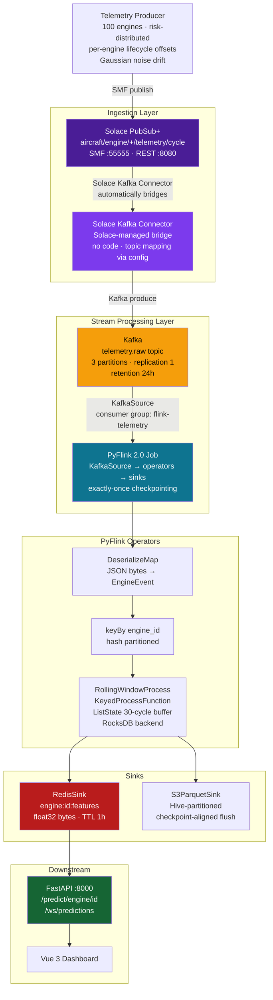

---

## Data Flow — Message Lifecycle

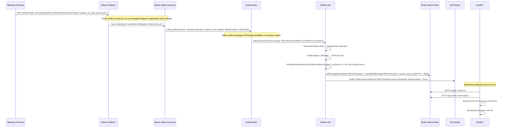

---

## Component Detail

### Telemetry Producer

Unchanged from previous design. Publishes per-engine sensor events to Solace using the JCSMP SDK. Risk-distributed lifecycle offsets ensure the simulated fleet maintains a realistic distribution of engine health states at all times.

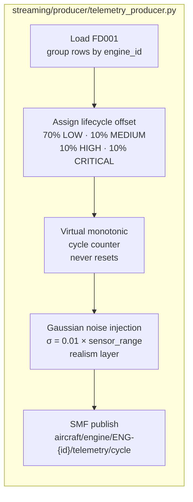

**Key design:** The sleep is applied **once per round-robin pass across all 100 engines**, not per engine. All 100 engines emit events in rapid succession before the sleep fires. This ensures every engine fills its 30-cycle rolling window quickly on startup rather than waiting 100× the inter-message delay.

**Topic schema:** `aircraft/engine/{engine_id}/telemetry/cycle`

**Payload schema:**
```json
{
  "engine_id": "ENG-042",
  "cycle": 1847,
  "event_time": "2024-01-15T10:23:45.123Z",
  "sensors": {
    "s2": 0.641, "s3": 0.723, "s4": 0.518,
    "s7": 0.892, "s9": 0.334, "s11": 0.771,
    "s12": 0.445, "s14": 0.623, "s17": 0.558,
    "s20": 0.712, "s21": 0.489
  }
}
```

---

### Solace PubSub+ — Ingestion Boundary

Solace is kept as the ingestion boundary because it provides:

- **SMF (Solace Message Format)** — binary protocol with hardware-accelerated routing on appliances
- **Wildcard topic subscriptions** — `aircraft/engine/+/telemetry/cycle` matches all 100 engine topics in a single subscription
- **REST microgateway** — external systems can POST events without an SMF client library
- **No ZooKeeper dependency** — unlike legacy Kafka setups

Solace does **not** do the stream processing. Its role ends at the Kafka Connector boundary.

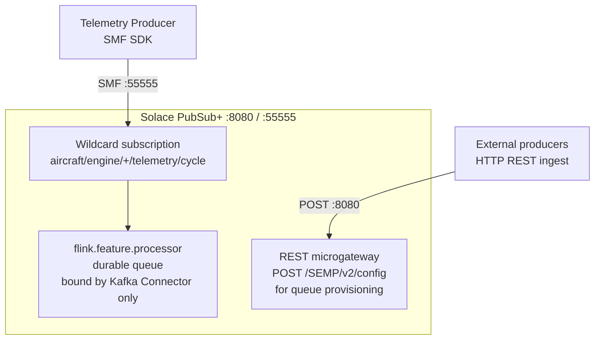

> **Solace queue durability note:** The durable queue `flink.feature.processor` is bound exclusively by the Solace Kafka Connector — not by PyFlink directly. The queue's durability window (max message age / max spool) should be set to match Kafka's retention (24h). This prevents Solace from accumulating unbounded backlog on connector restart while still providing the bridge with guaranteed delivery from producer to Kafka.

---

### Solace Kafka Connector — The Bridge

The Solace Kafka Connector is a Kafka Connect source connector maintained by Solace. It runs as a Kafka Connect worker, subscribes to Solace, and produces to Kafka. **No application code is required** — it is configured entirely via JSON/properties.

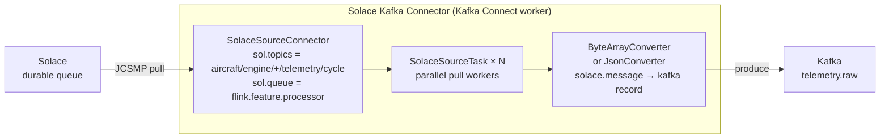

**Connector configuration** (`config/solace_kafka_connector.json`):

```json
{
  "name": "solace-telemetry-source",
  "config": {
    "connector.class": "com.solace.connector.kafka.connect.source.SolaceSourceConnector",
    "tasks.max": "3",
    "sol.host": "tcp://solace:55555",
    "sol.username": "admin",
    "sol.password": "admin",
    "sol.vpn_name": "default",
    "sol.topics": "aircraft/engine/+/telemetry/cycle",
    "sol.queue": "flink.feature.processor",
    "kafka.topic": "telemetry.raw",
    "sol.message_processor_class": "com.solace.connector.kafka.connect.source.msgprocessors.SolSampleSimpleMessageProcessor",
    "value.converter": "org.apache.kafka.connect.converters.ByteArrayConverter",
    "key.converter": "org.apache.kafka.connect.storage.StringConverter"
  }
}
```

**Partition key strategy:** The connector writes `engine_id` as the Kafka record key. Kafka hashes this key to assign a partition, meaning all events for a given engine land on the same partition — preserving per-engine ordering before PyFlink's `keyBy`.

---

### Kafka — The Durable Buffer

Kafka sits between the bridge and PyFlink. This decoupling is what solves the original durability mismatch: Kafka is designed for high-throughput append-only logs with configurable retention, exactly what telemetry data needs.

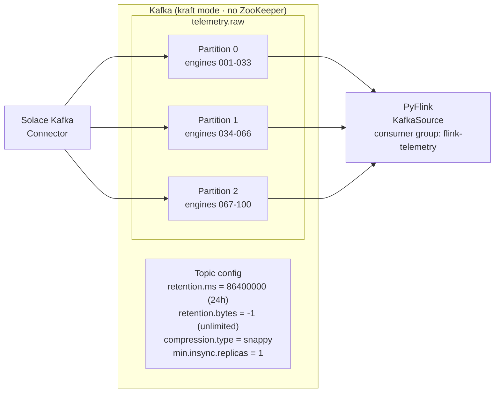

**Why 3 partitions:** Matches 3 Flink task slots (1 per partition). Each Flink task slot reads exactly one partition, eliminating inter-slot contention for the keyed state backend.

**Offset management:** PyFlink's KafkaSource commits offsets to Kafka on checkpoint completion. If the Flink job restarts, it resumes from the last committed offset — no data loss, no reprocessing beyond the checkpoint interval.

---

### PyFlink 2.0 Job — Stream Processing

The PyFlink job is the core processing engine. It reads from Kafka, normalizes sensor values, maintains per-engine rolling windows in managed state, and writes to Redis and S3.

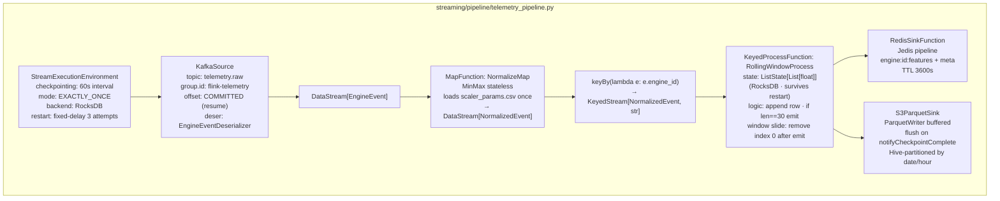

**Checkpoint configuration:**

```python
env = StreamExecutionEnvironment.get_execution_environment()
env.enable_checkpointing(60_000)  # 60s interval
env.get_checkpoint_config().set_checkpointing_mode(CheckpointingMode.EXACTLY_ONCE)
env.get_checkpoint_config().set_min_pause_between_checkpoints(30_000)
env.get_checkpoint_config().set_checkpoint_timeout(120_000)
env.get_checkpoint_config().set_max_concurrent_checkpoints(1)

# RocksDB for large keyed state (100 engines × 30 cycles)
from pyflink.datastream.state_backend import EmbeddedRocksDBStateBackend
env.set_state_backend(EmbeddedRocksDBStateBackend())
```

**RollingWindowProcess — state management:**

```python
class RollingWindowProcess(KeyedProcessFunction):
    def open(self, runtime_context: RuntimeContext):
        descriptor = ListStateDescriptor(
            "window_buffer",
            Types.LIST(Types.FLOAT())
        )
        self.buffer: ListState = runtime_context.get_list_state(descriptor)

    def process_element(self, event: NormalizedEvent, ctx: KeyedProcessFunction.Context):
        rows = list(self.buffer.get()) or []
        rows.append(event.sensor_row)          # List[float] of length 11

        if len(rows) > 30:
            rows = rows[-30:]                  # keep last 30 only

        self.buffer.update(rows)               # write back to RocksDB

        if len(rows) == 30:
            yield FeatureVector(
                engine_id=event.engine_id,
                cycle=event.cycle,
                event_time=event.event_time,
                tensor=rows                    # shape: (30, 11)
            )
```

**Why RocksDB:** The default heap-based state backend stores state in JVM heap. With 100 engines × 30 cycles × 11 sensors × 4 bytes = 132 KB of state, heap is technically fine, but RocksDB enables incremental checkpoints — only changed keys are written to checkpoint storage, not the full state. This makes checkpoint time nearly constant regardless of state size growth.

---

### NormalizationFunction

Stateless MinMax normalization. Loads `scaler_params.csv` once at operator construction — no file I/O per event, no shared mutable state.

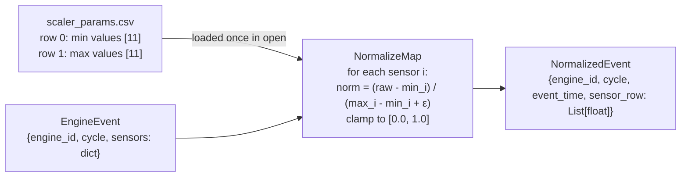

Export scaler parameters after any training run that produces a new scaler:

```bash
python scripts/export_scaler_params.py
# Output: streaming/src/main/resources/scaler_params.csv
```

The scaler CSV is baked into the Flink Docker image at build time. After a retraining run that changes sensor distributions, rebuild the Flink image:

```bash
docker compose build flink-jobmanager flink-taskmanager
docker compose restart flink-jobmanager flink-taskmanager
```

---

### RedisSink

Writes each `FeatureVector` atomically using a Jedis pipeline (batched Redis commands in a single round-trip):

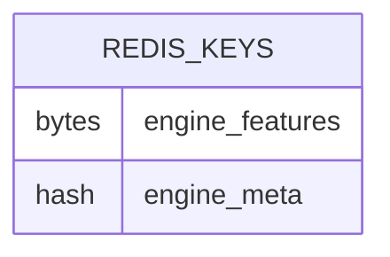

- `engine_features`
  - Key: `engine:ENG-042:features`
  - Value: 330 big-endian float32 values (30x11 = 1320 bytes)
  - TTL: 3600s

- `engine_meta`
  - Key: `engine:ENG-042:meta`
  - Fields:
    - engine_id
    - cycle
    - event_time
    - window_size
    - n_sensors
  - TTL: 3600s

**Write pattern:**

```python
pipe = jedis.pipeline()
pipe.set(f"engine:{engine_id}:features", struct.pack(">330f", *flat_tensor))
pipe.hset(f"engine:{engine_id}:meta", mapping={
    "engine_id": engine_id,
    "cycle": str(cycle),
    "event_time": event_time.isoformat(),
    "window_size": "30",
    "n_sensors": "11"
})
pipe.expire(f"engine:{engine_id}:features", 3600)
pipe.expire(f"engine:{engine_id}:meta", 3600)
pipe.execute()
```

**TTL expiry as health signal:** If telemetry stops for an engine (producer crash, engine offline), Redis automatically evicts both keys after 1 hour. FastAPI returns `404` for that engine, preventing the prediction loop from making inferences on stale 1-hour-old feature tensors.

---

### S3ParquetSink

Buffers `FeatureVector` records and flushes to S3 on Flink checkpoint completion. Checkpoint-aligned flush provides exactly-once semantics for the offline store.

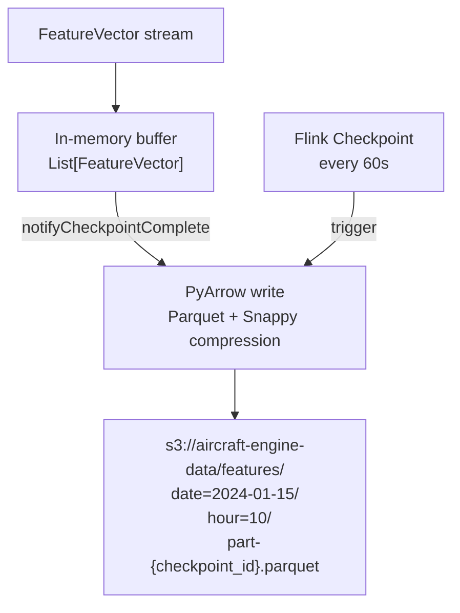

Hive-partitioned path enables efficient range scans during batch retraining:

```
s3://aircraft-engine-data/features/
  date=2024-01-15/
    hour=10/
      part-0000001.parquet    ← checkpoint 1
      part-0000002.parquet    ← checkpoint 2
    hour=11/
      part-0000003.parquet
```

---

## Exactly-Once Guarantees

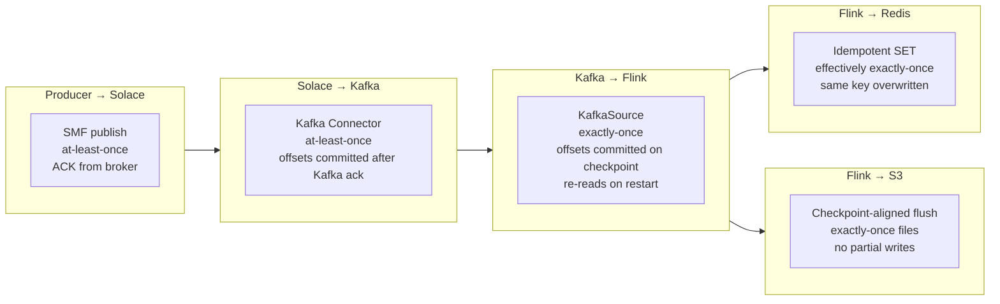

| Layer | Mechanism | Effective Guarantee |
|-------|-----------|---------------------|
| Producer → Solace | SMF ACK from broker | At-least-once |
| Solace → Kafka | Connector offset commit after Kafka ACK | At-least-once |
| Kafka → Flink state | KafkaSource offset on checkpoint | Exactly-once |
| Flink state → Redis | Idempotent SET (same key overwrites) | Effectively exactly-once |
| Flink state → S3 | `notifyCheckpointComplete` file flush | Exactly-once |

The pipeline as a whole is **end-to-end effectively exactly-once**: duplicate messages from producer or connector retries overwrite the same Redis key with the same value, so the inference service sees a consistent latest-window regardless of upstream retry behavior.

---

## Docker Services

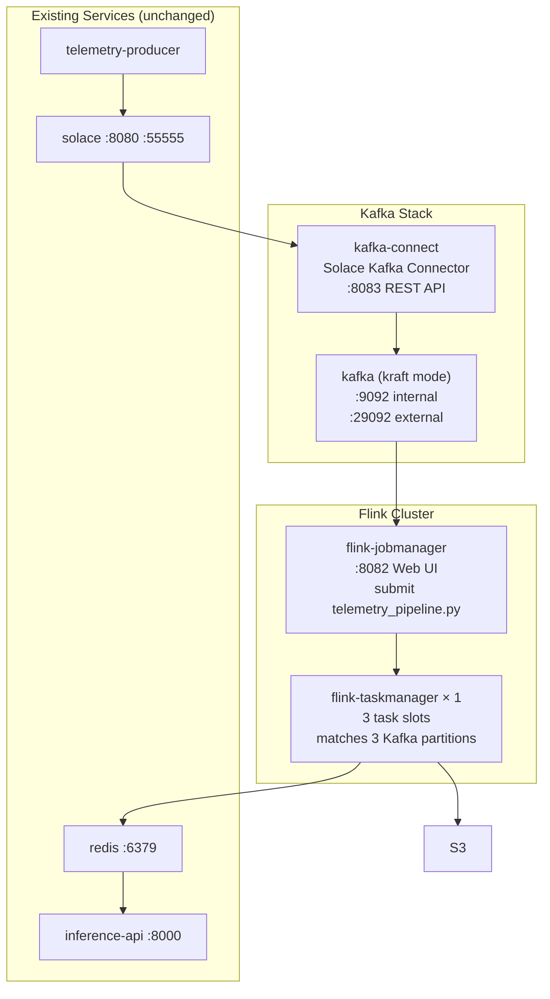

| Service | Image | Port | Notes |
|---------|-------|------|-------|
| `kafka` | `confluentinc/cp-kafka:7.6.0` | 9092, 29092 | KRaft mode — no ZooKeeper |
| `kafka-connect` | `confluentinc/cp-kafka-connect:7.6.0` | 8083 | Solace Kafka Connector loaded at startup |
| `flink-jobmanager` | `flink:2.0-scala_2.12` | 8082 | Submits `telemetry_pipeline.py` on startup |
| `flink-taskmanager` | `flink:2.0-scala_2.12` | — | 3 task slots |
| `solace` | `solace/solace-pubsub-standard` | 8080, 55555 | Unchanged |
| `telemetry-producer` | Custom (Dockerfile.streaming) | — | Unchanged |
| `standalone-consumer` | ~~Removed~~ | — | Replaced by PyFlink job |

> `standalone-consumer` is retired. The PyFlink job running on the Flink cluster replaces its functionality with proper managed state, checkpointing, and exactly-once semantics.

---

## Startup Sequence

The services have strict initialization ordering. Kafka must be healthy before the connector starts, and the Flink job must not submit until Kafka topics exist.

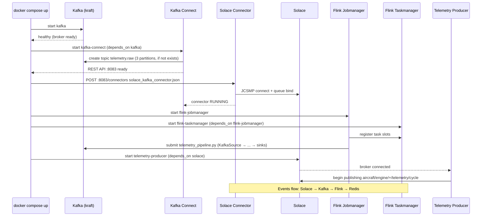

---

## Topic & Queue Provisioning

Before first run, provision the Solace queue and Kafka topic:

```bash
# Provision Solace queue (durable, bound by Kafka Connector)
./scripts/provision_solace_queues.sh

# Create Kafka topic (also done automatically by kafka-connect on connector start)
docker compose exec kafka kafka-topics.sh \
  --bootstrap-server localhost:9092 \
  --create --topic telemetry.raw \
  --partitions 3 \
  --replication-factor 1 \
  --config retention.ms=86400000 \
  --config compression.type=snappy

# Register Solace Kafka Connector
curl -X POST http://localhost:8083/connectors \
  -H "Content-Type: application/json" \
  -d @config/solace_kafka_connector.json

# Verify connector status
curl http://localhost:8083/connectors/solace-telemetry-source/status
```

---

## Quick Start

```bash
# Build updated images
docker compose build flink-jobmanager flink-taskmanager telemetry-producer

# Flush stale Redis state from previous run
docker compose exec redis redis-cli FLUSHDB

# Start full stack
docker compose up -d

# Verify pipeline health
# Kafka topic receiving messages:
docker compose exec kafka kafka-console-consumer.sh \
  --bootstrap-server localhost:9092 \
  --topic telemetry.raw --max-messages 5

# Flink job running:
# → http://localhost:8082  (Flink Web UI · should show 1 running job)

# Redis filling with features:
docker compose exec redis redis-cli KEYS "engine:*:features" | wc -l
# Expect: 100 (all engines) within ~30s of producer start

# Connector status:
curl -s http://localhost:8083/connectors/solace-telemetry-source/status | python -m json.tool
```

---

## Configuration Reference

| File | Key Settings |
|------|-------------|
| `config/solace_kafka_connector.json` | Connector class, topic mapping, queue name, partition key |
| `config/kafka.yaml` | Bootstrap servers, topic name, partition count, retention |
| `config/flink.yaml` | Checkpoint interval, parallelism, state backend |
| `config/features.yaml` | Window size (30), sensor list (11), flush interval |
| `config/redis.yaml` | TTL (3600s), connection pool size |
| `streaming/src/main/resources/scaler_params.csv` | MinMax bounds for 11 sensors — regenerate after retraining |

---

## Migration Notes from Previous Architecture

| Previous | New | Reason |
|----------|-----|--------|
| Redis Streams as default transport | Kafka as primary transport | Kafka has replay, retention, consumer group semantics; Redis Streams lacks checkpoint-aligned offset management |
| Standalone Consumer (pure Python) | PyFlink 2.0 job | Managed state, exactly-once, restartable |
| PyFlink + Solace JCSMP JAR | PyFlink + Kafka KafkaSource | KafkaSource is pure Python-compatible; no JVM connector JAR wiring |
| Solace → PyFlink direct | Solace → Kafka Connector → Kafka → PyFlink | Decouples broker protocol from processing; Kafka is the durable buffer between them |
| `standalone-consumer` Docker service | `flink-jobmanager` + `flink-taskmanager` | Proper cluster mode with Web UI, checkpoint storage, and task slot isolation |
| Redis Streams maxlen 50,000 | Kafka retention 24h | Time-based retention matches telemetry data lifetime; no manual maxlen tuning |
