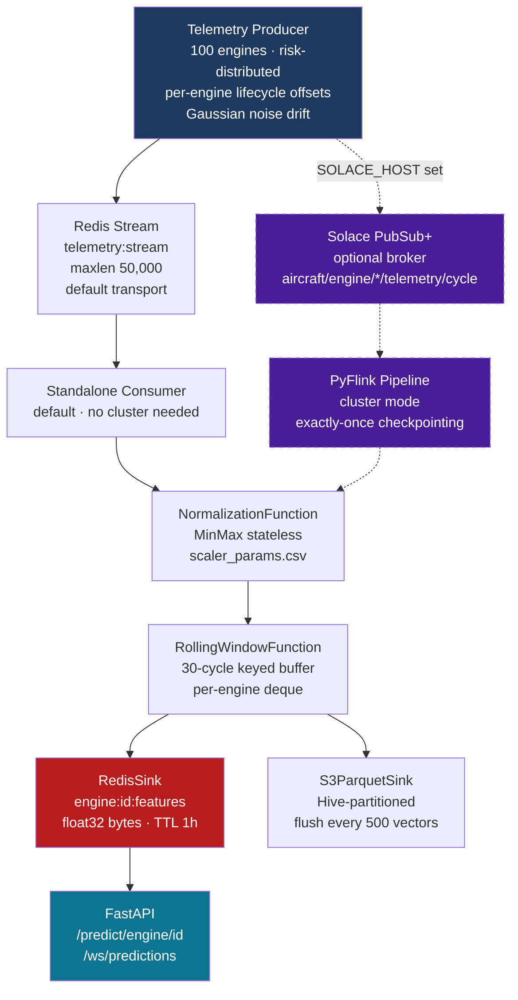
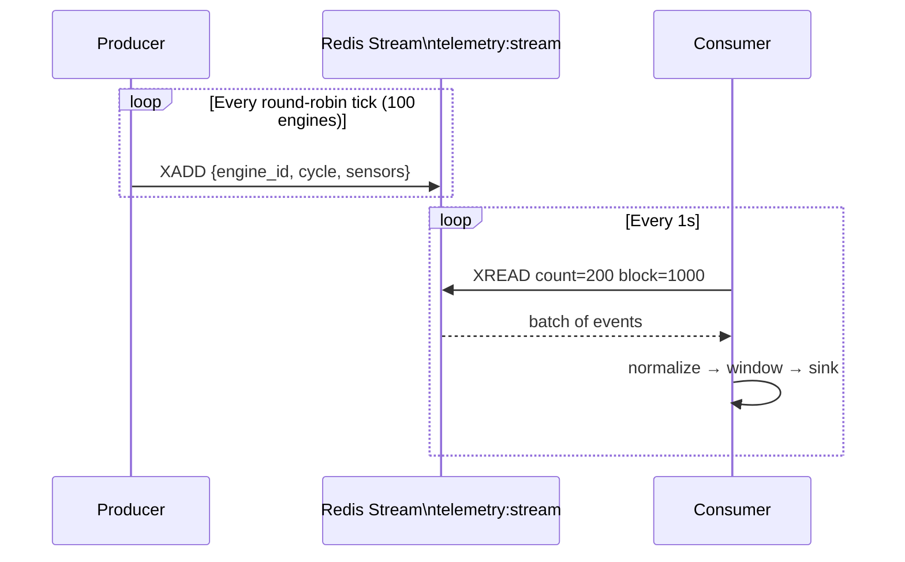
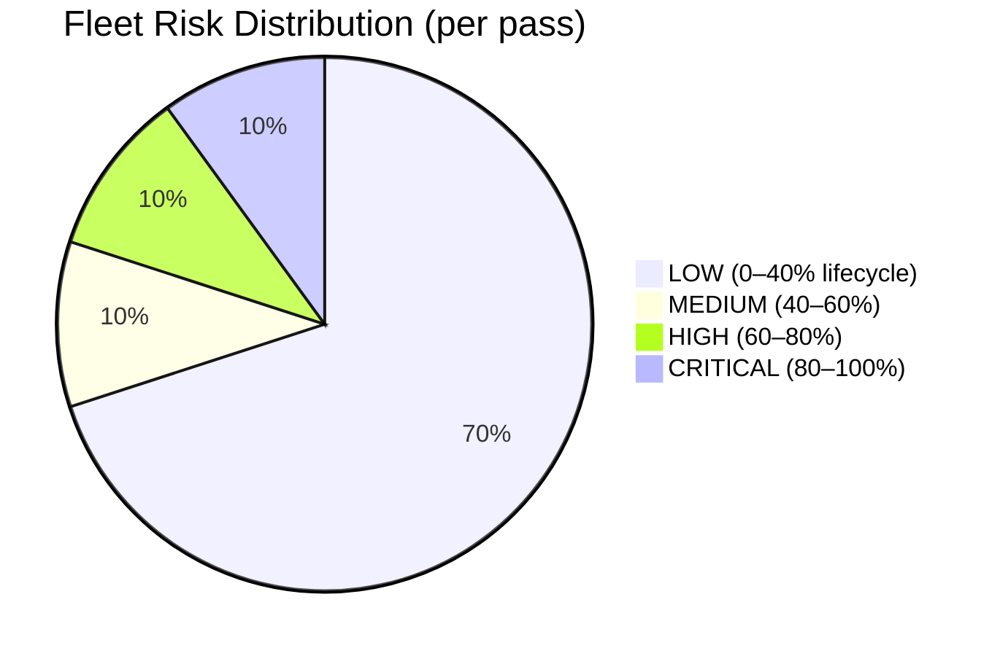
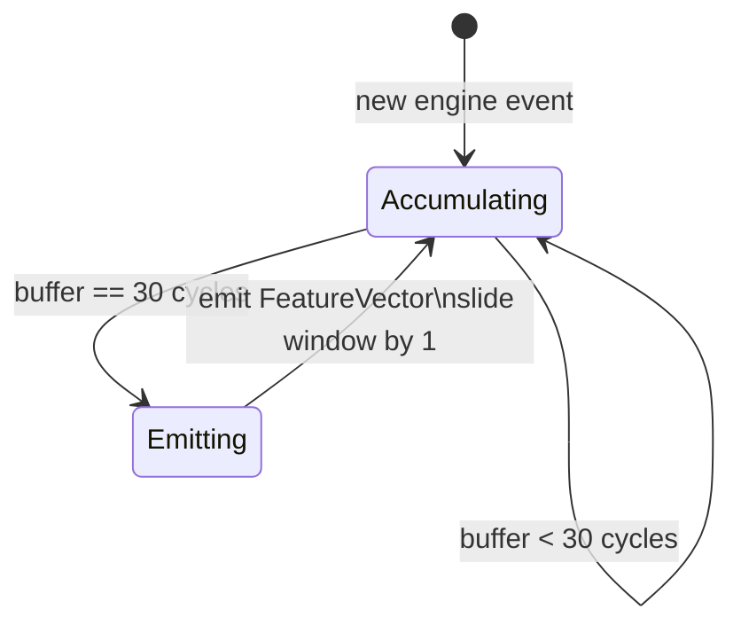
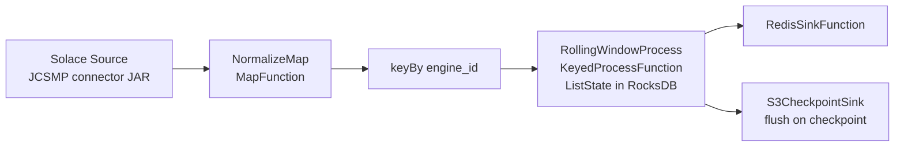

# Streaming Pipeline

## Overview

Real-time telemetry pipeline that ingests per-cycle sensor data, normalizes it, builds rolling windows, and writes inference-ready feature tensors to Redis.



---

## Transport: Redis Streams (Default)

Redis Streams is the default transport — no external broker needed. The producer `XADD`s events to `telemetry:stream` and the consumer `XREAD`s in batches of 200 with a 1-second block.



---

## Transport: Solace PubSub+ (Optional)

Set `SOLACE_HOST=tcp://solace:55555` in the environment to switch both producer and consumer to Solace. The producer publishes to per-engine topics (`aircraft/engine/ENG-042/telemetry/cycle`). The consumer binds to the `flink.feature.processor` durable queue.

Provision queues before first use:

```bash
./scripts/provision_solace_queues.sh
```

---

## Risk-Distributed Producer

The producer assigns each engine a random lifecycle start position each pass, drawn from a weighted distribution:



Each engine advances independently through its dataset rows. When it reaches end-of-life it wraps to a new random lifecycle position — engines never all pile up at CRITICAL together.

**Virtual monotonic cycle counter:** Each engine gets its own incrementing cycle number (never resets to 1), so the rolling window never stalls on duplicate/late-arrival guards.

**Throttle:** Sleep is applied **once per round-robin pass** (not per engine), so all 100 engines receive events in rapid succession before the sleep. This ensures all engines fill their 30-cycle windows quickly on startup.

---

## NormalizationFunction

Stateless MinMax normalization applied per event. Reads `scaler_params.csv` once at construction — no file I/O per event.

Export scaler parameters after any training run that produces a new scaler:

```bash
python scripts/export_scaler_params.py
```

Output: `streaming/src/main/resources/scaler_params.csv` (two rows: min values, max values for all 11 sensors).

---

## RollingWindowFunction

Maintains a per-engine deque of the last 30 normalized sensor rows. Emits a `FeatureVector` when the buffer reaches exactly 30 entries.



**Memory footprint:** 100 engines × 30 cycles × 11 sensors × 4 bytes = **132 KB** — negligible.

---

## RedisSink

Writes each `FeatureVector` atomically to two Redis keys:

| Key | Type | Content |
|-----|------|---------|
| `engine:{id}:features` | bytes | 330 big-endian float32 values (30×11 = 1320 bytes) |
| `engine:{id}:meta` | hash | engine_id, cycle, event_time, window_size, n_sensors |

Both keys have TTL = 3600s. If telemetry stops, Redis automatically evicts stale features — the inference service returns 404 for that engine, preventing predictions on stale data.

---

## S3ParquetSink

Buffers `FeatureVector` records and flushes to S3 as Snappy-compressed Parquet files, Hive-partitioned by date and hour:

```
s3://aircraft-engine-data/features/
  date=2024-01-15/
    hour=10/
      part-0.parquet
      part-1.parquet
    hour=11/
      part-0.parquet
```

Flush triggered every `FLUSH_EVERY` vectors (default 500, configurable via env var).

---

## PyFlink Pipeline (Cluster Mode)

`streaming/pipeline/telemetry_pipeline.py` is the PyFlink entry point for cluster deployment. It wraps `NormalizationFunction` and `RollingWindowFunction` as Flink operators with managed state and exactly-once checkpointing.



> **Note:** The PyFlink path requires `flink-connector-solace-1.1.0.jar` on the Flink classpath. The standalone consumer (Redis Streams) is the default and requires no JAR.

---

## Exactly-Once Guarantees

| Layer | Mechanism | Guarantee |
|-------|-----------|-----------|
| Producer → Redis Stream | XADD with maxlen | At-least-once |
| Redis Stream → Consumer | XREAD with last_id tracking | At-least-once |
| Consumer → Redis Feature Store | Idempotent SET overwrites | Effectively exactly-once |
| Consumer → S3 Parquet | Flush on shutdown / interval | At-least-once |
| PyFlink → Redis | Checkpoint-aligned | At-least-once (idempotent) |
| PyFlink → S3 | Checkpoint-aligned file flush | Exactly-once files |

---

## Docker Services

| Service | Image | Purpose |
|---------|-------|---------|
| `telemetry-producer` | Dockerfile.streaming | Streams FD001 → Redis Streams |
| `standalone-consumer` | Dockerfile.streaming | Normalize → Window → Redis feature store |
| `solace` | solace/solace-pubsub-standard | Optional event broker |
| `flink-jobmanager` | flink:2.0 | Flink Web UI + job coordination |
| `flink-taskmanager` | flink:2.0 | Task execution (PyFlink cluster mode) |

---

## Quick Start

```bash
# Rebuild after producer/consumer changes
docker compose build telemetry-producer standalone-consumer

# Flush stale Redis data and restart
docker compose exec redis redis-cli FLUSHDB
docker compose up -d telemetry-producer standalone-consumer
```
