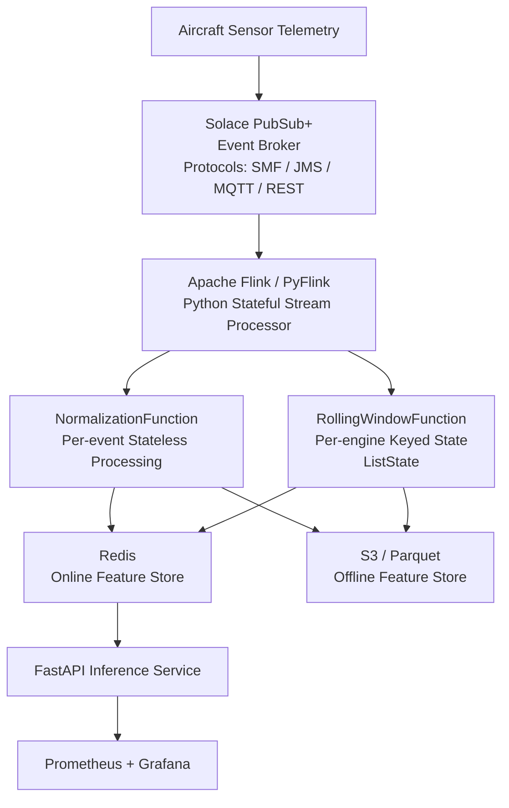

# Streaming Pipeline — Real-Time Telemetry & Feature Engineering

## Overview

This document describes the production streaming pipeline for the Real-Time Aircraft Engine Predictive Maintenance System. The pipeline ingests per-cycle sensor telemetry over **Solace PubSub+**, processes it statelessly-normalized and statelessly-built inside **Apache Flink (PyFlink)**, writes inference-ready tensors to **Redis**, and archives to **S3/Parquet** — end-to-end fault-tolerant, exactly-once where semantics permit, and horizontally scalable.




---

## Technology Choices

| Component | Technology | Why |
|-----------|------------|-----|
| Event broker | Solace PubSub+ | Enterprise-grade, multi-protocol (SMF, JMS, MQTT, REST), hardware-accelerated routing, built-in message replay, wildcard subscriptions, no ZooKeeper dependency |
| Stream processor | Apache Flink + PyFlink | Stateful keyed streams, event-time processing, exactly-once checkpoint semantics, full DataStream API access — now in Python |
| Online feature store | Redis | Sub-millisecond reads, TTL-based expiry, atomic pipelining |
| Offline store | Apache Parquet on S3 | Columnar, efficient batch reads for GRU retraining |
| Serialization | Solace Schema Registry + JSON | Solace natively integrates schema management; JSON works fine at aircraft telemetry volumes |
| Build tool | `uv` / `pip` | Standard Python dependency management |

### Why Solace over Kafka?

Kafka is an excellent log-based broker, but it carries real operational complexity: ZooKeeper (or KRaft), topic partition management, consumer group rebalancing lag, and the Confluent Schema Registry as a separate service. Solace PubSub+ offers a cleaner operational model for this use case:

**Multi-protocol out of the box.** Aircraft avionics and ground stations speak MQTT, AMQP, or REST — not Kafka's binary protocol. Solace acts as a universal protocol gateway. A ground station can POST sensor data via REST; a flight data recorder can publish over MQTT; PyFlink consumes over the Solace Python API. No middleware translation layer needed.

**Hardware-accelerated routing.** The Solace appliance (and the software broker) does topic matching in hardware. Wildcard subscriptions like `aircraft/engine/+/telemetry` are resolved in nanoseconds regardless of fleet size.

**Built-in message replay.** Solace's replay log lets Flink replay events from an arbitrary timestamp — critical for backfilling features after a consumer outage or a model retrain. Kafka requires careful offset management for the same result.

**No ZooKeeper.** One fewer distributed system to operate and monitor.

**Python-native integration.** The `solace-pubsubplus` Python library provides direct Solace messaging without a Java bridge. PyFlink's DataStream API exposes the same keyed-state and checkpoint semantics as the Java API, so the pipeline logic is identical — just in Python.

---

## Solace Concepts You Need Before Proceeding

Solace uses different terminology from Kafka. These map directly:

| Kafka | Solace | Notes |
|-------|--------|-------|
| Topic | Topic (hierarchical) | Solace topics use `/` separators, not `.`. Wildcard `*` = one level, `>` = all levels below |
| Partition | Partition (on Queues) | Partitioned queues provide per-key ordering, mirroring Kafka partition semantics |
| Consumer Group | Queue + Consumer | Consumers bind to a named Queue; the broker handles load balancing |
| Offset commit | Acknowledgement (ACK) | Solace uses message ACK/NACK; Flink handles this via checkpoint-aligned ACKs |
| Log compaction | Replay log | Solace maintains a configurable replay log per queue |
| Schema Registry | Solace Schema Registry (SaaS) or AsyncAPI | Solace Cloud includes a schema registry; for self-hosted, AsyncAPI catalogs work |

**Queue types you'll use:**

- **Exclusive Queue**: Only one consumer receives each message. Use for the Flink source (Flink manages internal parallelism).
- **Non-Exclusive Queue**: Round-robin delivery to all bound consumers. Use for broadcast scenarios (monitoring, archiving).
- **Partitioned Queue**: Messages with the same partition key always go to the same consumer. Equivalent to Kafka's key-based partitioning — use this to guarantee per-engine ordering.

---

## Event Schema

Every telemetry event is one flight cycle from one engine. Use JSON for simplicity (Solace compresses over SMF natively; at aircraft telemetry volumes JSON overhead is negligible):

```json
{
  "engine_id": "ENG-042",
  "cycle": 187,
  "event_time_ms": 1705312800000,
  "sensors": {
    "s2":  641.82,
    "s3":  1590.64,
    "s4":  1408.23,
    "s7":  553.91,
    "s9":  9050.17,
    "s11": 47.47,
    "s12": 521.66,
    "s14": 2388.02,
    "s17": 392.0,
    "s20": 38.86,
    "s21": 23.3988
  }
}
```

**Topic hierarchy:**

```
aircraft/engine/{engine_id}/telemetry/cycle
```

Example: `aircraft/engine/ENG-042/telemetry/cycle`

Flink subscribes to the wildcard `aircraft/engine/*/telemetry/cycle` via a durable queue bound to that subscription. This means you can add a new engine fleet (`ENG-5000` through `ENG-5200`) and the pipeline receives their events without any configuration change.

**Register the schema** in Solace's AsyncAPI catalog or schema registry before going to production. For local development, JSON without schema enforcement is fine.

---

## Project Structure

```
streaming/
├── requirements.txt
├── config/
│   └── solace.env                  ← broker connection config (never commit secrets)
├── resources/
│   └── scaler_params.csv           ← exported MinMax scaler params
├── producer/
│   └── telemetry_producer.py       ← Solace Python producer
├── pipeline/
│   ├── telemetry_pipeline.py       ← PyFlink job entry point
│   ├── functions/
│   │   ├── normalization.py
│   │   └── rolling_window.py
│   ├── sinks/
│   │   ├── redis_sink.py
│   │   └── s3_parquet_sink.py
│   └── source/
│       └── solace_source.py
└── model/
    ├── engine_event.py
    └── feature_vector.py
```

---

## Python Dependencies

```
# requirements.txt
solace-pubsubplus>=1.8.0        # Solace Python messaging API
apache-flink>=1.19.0            # PyFlink DataStream API
redis>=5.0.0                    # Redis client
pyarrow>=14.0.0                 # Parquet serialization
boto3>=1.34.0                   # S3 / MinIO client
numpy>=1.24.0                   # Tensor operations
joblib>=1.3.0                   # Scaler deserialization
pandas>=2.0.0                   # DataFrame utilities
```

Install:

```bash
uv pip install -r streaming/requirements.txt
# or
pip install -r streaming/requirements.txt
```

---

## Solace Broker Setup

### Local Development with Docker

Solace PubSub+ Standard is available as a free Docker image:

```yaml
# docker-compose.yml (Solace section)
solace:
  image: solace/solace-pubsub-standard:latest
  ports:
    - "8080:8080"    # Management UI (Solace Manager)
    - "55555:55555"  # SMF (Solace Message Format) — used by Python API / Flink connector
    - "8008:8008"    # SMF over WebSocket
    - "1883:1883"    # MQTT
    - "5672:5672"    # AMQP 1.0
    - "9000:9000"    # REST messaging
  environment:
    username_admin_globalaccesslevel: admin
    username_admin_password: admin
    system_scaling_maxconnectioncount: "1000"
  shm_size: "2g"
  ulimits:
    core: -1
    nofile:
      soft: 2448
      hard: 38048
  healthcheck:
    test: ["CMD", "curl", "-f", "http://localhost:8080/SEMP/v2/config"]
    interval: 15s
    retries: 5
```

Access the Solace Manager UI at `http://localhost:8080` (admin/admin). This gives you a visual view of queues, subscriptions, message rates, and consumer connections — far more observable than Kafka's CLI-only tooling.

### Provisioning the Queue and Subscription

Solace queues must be provisioned before the consumer binds. Do this via the SEMP v2 REST API (automatable in CI/CD):

```bash
BASE="http://localhost:8080/SEMP/v2/config/msgVpns/default"
AUTH="-u admin:admin"

# Create a durable, partitioned queue for Flink to consume from
curl -s -X POST $BASE/queues $AUTH \
  -H "Content-Type: application/json" \
  -d '{
    "queueName": "flink.feature.processor",
    "accessType": "exclusive",
    "permission": "consume",
    "ingressEnabled": true,
    "egressEnabled": true,
    "maxMsgSpoolUsage": 5000,
    "replayStartLocation": "beginning",
    "partitionCount": 8,
    "partitionRebalanceDelay": 5,
    "partitionRebalanceMaxHandoffTime": 10
  }'

# Bind a wildcard subscription to the queue
curl -s -X POST $BASE/queues/flink.feature.processor/subscriptions $AUTH \
  -H "Content-Type: application/json" \
  -d '{
    "subscriptionTopic": "aircraft/engine/*/telemetry/cycle"
  }'

# Also create a non-exclusive queue for broadcast consumers (Prometheus exporter, etc.)
curl -s -X POST $BASE/queues $AUTH \
  -H "Content-Type: application/json" \
  -d '{
    "queueName": "monitoring.telemetry.fanout",
    "accessType": "non-exclusive",
    "permission": "consume",
    "ingressEnabled": true,
    "egressEnabled": true,
    "maxMsgSpoolUsage": 1000
  }'

curl -s -X POST $BASE/queues/monitoring.telemetry.fanout/subscriptions $AUTH \
  -H "Content-Type: application/json" \
  -d '{"subscriptionTopic": "aircraft/engine/*/telemetry/cycle"}'

echo "Queue provisioning complete."
```

**Why a partitioned queue?** When Flink has multiple parallel source subtasks (say, parallelism 8), each subtask binds to the same queue. Without partitioning, Solace distributes messages round-robin — engine ENG-042's cycle 100 might go to subtask-3 while cycle 101 goes to subtask-6. PyFlink's `keyBy()` guarantees per-engine routing downstream, and the `last_cycle` guard in `RollingWindowFunction` catches and drops out-of-order arrivals. Partitioned queues prevent this at the broker level before it reaches Flink.

---

## Solace Connection Configuration

```bash
# config/solace.env  — load with python-dotenv or os.environ
SOLACE_HOST=tcp://localhost:55555
SOLACE_VPN=default
SOLACE_USERNAME=admin
SOLACE_PASSWORD=admin

# For production (TLS):
# SOLACE_HOST=tcps://solace-prod.internal:55443

# Queue name the Flink source binds to
SOLACE_QUEUE_NAME=flink.feature.processor

# Replay: BEGINNING | LATEST | DATE:2024-01-15T00:00:00Z
SOLACE_REPLAY_START=LATEST
```

Load credentials from environment variables — never hardcode them. In production, pull from AWS Secrets Manager or HashiCorp Vault.

---

## Data Model — Python Dataclasses

```python
# streaming/model/engine_event.py
from dataclasses import dataclass, field
from typing import Dict
import json

SENSOR_NAMES = ["s2", "s3", "s4", "s7", "s9", "s11", "s12", "s14", "s17", "s20", "s21"]

@dataclass
class EngineEvent:
    engine_id:    str
    cycle:        int
    event_time_ms: int
    sensors:      Dict[str, float] = field(default_factory=dict)

    @classmethod
    def from_json(cls, raw: bytes) -> "EngineEvent":
        data = json.loads(raw)
        return cls(
            engine_id=data["engine_id"],
            cycle=data["cycle"],
            event_time_ms=data["event_time_ms"],
            sensors=data["sensors"],
        )

    def sensor_array(self) -> list[float]:
        """Return sensors in canonical order for model input."""
        return [self.sensors.get(s, 0.0) for s in SENSOR_NAMES]
```

```python
# streaming/model/feature_vector.py
from dataclasses import dataclass
import struct
import numpy as np

@dataclass
class FeatureVector:
    engine_id:   str
    cycle:       int
    event_time:  int
    features:    list[float]   # flattened (window_size * n_sensors,)
    window_size: int
    n_sensors:   int

    def to_numpy(self) -> np.ndarray:
        """Reshape back to (window_size, n_sensors) for model input."""
        return np.array(self.features, dtype=np.float32).reshape(self.window_size, self.n_sensors)

    def to_bytes(self) -> bytes:
        """Serialize as big-endian IEEE 754 floats — matches struct.unpack('>Nf') in inference."""
        return struct.pack(f">{len(self.features)}f", *self.features)

    @property
    def redis_feature_key(self) -> str:
        return f"engine:{self.engine_id}:features"

    @property
    def redis_meta_key(self) -> str:
        return f"engine:{self.engine_id}:meta"
```

---

## Telemetry Producer (Python Simulator)

The producer replays C-MAPSS data into Solace using the `solace-pubsubplus` Python library, simulating real aircraft telemetry. In production this is replaced by actual avionics feeds.

```python
# streaming/producer/telemetry_producer.py
import os, json, time
from pathlib import Path
from datetime import datetime, timezone

from solace.messaging.messaging_service import MessagingService
from solace.messaging.resources.topic import Topic
from solace.messaging.config.solace_properties import (
    transport_layer_properties as TL,
    service_properties as SP,
    authentication_properties as AUTH,
)

from streaming.model.engine_event import SENSOR_NAMES

# ── Sensor column indices in the raw FD001 file (0-indexed) ──────────────────
SENSOR_INDICES = [6, 7, 8, 11, 13, 15, 16, 18, 21, 24, 25]
TOPIC_PREFIX   = "aircraft/engine/"
TOPIC_SUFFIX   = "/telemetry/cycle"


def build_messaging_service() -> MessagingService:
    broker_props = {
        TL.HOST:      os.environ.get("SOLACE_HOST",     "tcp://localhost:55555"),
        SP.VPN_NAME:  os.environ.get("SOLACE_VPN",      "default"),
        AUTH.SCHEME_BASIC_USER_NAME: os.environ.get("SOLACE_USERNAME", "admin"),
        AUTH.SCHEME_BASIC_PASSWORD:  os.environ.get("SOLACE_PASSWORD", "admin"),
    }
    return MessagingService.builder().from_properties(broker_props).build()


def run_producer(dataset_path: str = "Dataset/train_FD001.txt", throttle_ms: int = 1) -> None:
    """
    Replay C-MAPSS rows into Solace, one event per cycle row.

    Args:
        dataset_path: Path to the raw FD001 training file.
        throttle_ms:  Milliseconds to sleep between publishes (set 0 for max throughput).
    """
    service = build_messaging_service()
    service.connect()

    publisher = service.create_persistent_message_publisher_builder().build()
    publisher.start()

    lines   = Path(dataset_path).read_text().splitlines()
    emitted = 0

    print(f"[producer] Starting replay of {len(lines)} cycles → Solace")

    for line in lines:
        parts = line.strip().split()
        if len(parts) < 26:
            continue

        engine_id = f"ENG-{parts[0]}"
        cycle     = int(parts[1])
        now_ms    = int(datetime.now(timezone.utc).timestamp() * 1000)

        payload = {
            "engine_id":    engine_id,
            "cycle":        cycle,
            "event_time_ms": now_ms,
            "sensors": {
                name: float(parts[idx])
                for name, idx in zip(SENSOR_NAMES, SENSOR_INDICES)
            },
        }

        topic   = Topic.of(TOPIC_PREFIX + engine_id + TOPIC_SUFFIX)
        message = (
            service.message_builder()
            .with_application_message_id(f"{engine_id}:{cycle}")
            .with_property("engine_id", engine_id)
            .with_property("cycle",     str(cycle))
            .build(json.dumps(payload))
        )

        publisher.publish(message, topic)
        emitted += 1

        if throttle_ms > 0:
            time.sleep(throttle_ms / 1000)

        if emitted % 1_000 == 0:
            print(f"[producer] Emitted {emitted} events")

    # Drain the ACK window before closing
    publisher.terminate(grace_period=2000)
    service.disconnect()
    print(f"[producer] Done. Emitted {emitted} total events.")


if __name__ == "__main__":
    import dotenv
    dotenv.load_dotenv("config/solace.env")
    run_producer()
```

**Key design points:**

Publishing to per-engine topics (`aircraft/engine/ENG-042/telemetry/cycle`) rather than a single flat topic gives Solace's router enough information to apply Quality of Service rules per-engine in the future — throttle low-priority engines, priority-route critical ones. The persistent publisher waits for broker ACKs before advancing the window, equivalent to Kafka's `acks=all`.

---

## Normalization Function

Sensor values arrive raw from the broker. The `MinMaxScaler` fitted on FD001 training data must be applied per-event before the rolling window is built.

**Exporting scaler parameters from training artifacts:**

```python
# scripts/export_scaler_params.py
import joblib

scaler = joblib.load("artifacts/data_transformation/scaler.pkl")
mins = ",".join(f"{v:.8f}" for v in scaler.data_min_)
maxs = ",".join(f"{v:.8f}" for v in scaler.data_max_)

with open("streaming/resources/scaler_params.csv", "w") as f:
    f.write(mins + "\n")
    f.write(maxs + "\n")

print(f"Exported {len(scaler.data_min_)} sensor min/max values.")
```

Run this after every model training run that produces a new scaler. The values are stable across training runs on the same dataset but will differ if you add sensors or change the feature set.

```python
# streaming/pipeline/functions/normalization.py
import csv
from pathlib import Path
import numpy as np

from streaming.model.engine_event import EngineEvent, SENSOR_NAMES


class NormalizationFunction:
    """
    Stateless MinMax normalization applied per EngineEvent.

    Reads scaler_params.csv once at construction — no file I/O per event.
    Thread-safe: arrays are read-only after __init__.
    """

    def __init__(self, scaler_params_path: str = "streaming/resources/scaler_params.csv"):
        rows = Path(scaler_params_path).read_text().strip().splitlines()
        self.sensor_min = np.array([float(v) for v in rows[0].split(",")], dtype=np.float32)
        self.sensor_max = np.array([float(v) for v in rows[1].split(",")], dtype=np.float32)
        self._range = np.where(
            self.sensor_max - self.sensor_min == 0,
            1.0,                                    # avoid division by zero for constant sensors
            self.sensor_max - self.sensor_min,
        )

    def normalize(self, event: EngineEvent) -> EngineEvent:
        """
        Normalize all 11 sensor readings in-place and return the event.
        Clamps output to [0, 1].
        """
        raw = np.array(event.sensor_array(), dtype=np.float32)
        normed = np.clip((raw - self.sensor_min) / self._range, 0.0, 1.0)

        for i, name in enumerate(SENSOR_NAMES):
            event.sensors[name] = float(normed[i])

        return event
```

---

## Rolling Window Function — Core of the Pipeline

`RollingWindowFunction` maintains a per-engine rolling buffer of the last 30 normalized sensor readings. When the buffer reaches exactly 30 entries it emits a `FeatureVector` ready for GRU inference.

```python
# streaming/pipeline/functions/rolling_window.py
from collections import deque
from typing import Callable, Optional
from dataclasses import dataclass, field

from streaming.model.engine_event import EngineEvent, SENSOR_NAMES
from streaming.model.feature_vector import FeatureVector


@dataclass
class EngineBuffer:
    """Per-engine rolling state. Equivalent to Flink's ListState[float[]]."""
    window: deque = field(default_factory=deque)  # deque of List[float]
    last_cycle: int = -1


class RollingWindowFunction:
    """
    Maintains per-engine rolling buffers and emits FeatureVectors.

    In PyFlink this is wrapped as a KeyedProcessFunction.
    In pure-Python mode (standalone producer/consumer) it is used directly.

    Args:
        window_size:  Number of cycles in the sliding window (default 30).
        on_feature:   Callback invoked with each emitted FeatureVector.
    """

    def __init__(
        self,
        window_size: int = 30,
        on_feature: Optional[Callable[[FeatureVector], None]] = None,
    ):
        self.window_size = window_size
        self.on_feature  = on_feature
        # Per-engine state dict — in PyFlink this is backed by managed ListState.
        self._buffers: dict[str, EngineBuffer] = {}

    def process(self, event: EngineEvent) -> Optional[FeatureVector]:
        """
        Process one normalized EngineEvent.

        Returns a FeatureVector when the buffer is full, else None.
        Drops duplicate or out-of-order cycles (handles at-least-once re-delivery).
        """
        state = self._buffers.setdefault(event.engine_id, EngineBuffer())

        # Guard: drop duplicates and late arrivals
        if event.cycle <= state.last_cycle:
            return None
        state.last_cycle = event.cycle

        # Append normalized sensor row, evict oldest if over limit
        state.window.append(event.sensor_array())
        if len(state.window) > self.window_size:
            state.window.popleft()

        # Only emit when we have a full window — never emit partial sequences
        if len(state.window) == self.window_size:
            flat = [v for row in state.window for v in row]
            fv = FeatureVector(
                engine_id=event.engine_id,
                cycle=event.cycle,
                event_time=event.event_time_ms,
                features=flat,
                window_size=self.window_size,
                n_sensors=len(SENSOR_NAMES),
            )
            if self.on_feature:
                self.on_feature(fv)
            return fv

        return None
```

**Why `deque` and not a plain `list`?**

`collections.deque(maxlen=30)` could be used for automatic eviction, but an explicit deque gives clearer intent and allows inspection of buffer length before deciding to emit. In PyFlink's managed state equivalent, the buffer is stored as `ListState[List[float]]` on the RocksDB state backend — it survives job failures and is restored from checkpoints automatically.

**Memory footprint.** 100 active engines × 30 cycles × 11 sensors × 4 bytes = 132 KB. Negligible.

---

## Redis Sink — Online Feature Store

```python
# streaming/pipeline/sinks/redis_sink.py
import redis
from streaming.model.feature_vector import FeatureVector

TTL_SECONDS = 3_600  # evict engines inactive for 1 hour


class RedisSink:
    """
    Writes FeatureVectors to Redis as big-endian float32 byte arrays.

    Key schema:
        engine:{id}:features  → bytes  (1320 bytes = 330 float32 values = 30×11 window)
        engine:{id}:meta      → hash   { engine_id, cycle, event_time, window_size, n_sensors }

    The Python inference service reads these with:
        struct.unpack(f">{n}f", raw_bytes)
    """

    def __init__(self, host: str = "localhost", port: int = 6379, db: int = 0):
        self._pool = redis.ConnectionPool(
            host=host, port=port, db=db,
            max_connections=32,
            decode_responses=False,   # we store raw bytes for the feature tensor
        )

    @property
    def _client(self) -> redis.Redis:
        return redis.Redis(connection_pool=self._pool)

    def write(self, fv: FeatureVector) -> None:
        """Atomic pipeline write — one RTT to Redis for both keys."""
        r = self._client
        pipe = r.pipeline(transaction=False)

        # Feature tensor as raw bytes
        pipe.set(fv.redis_feature_key, fv.to_bytes())
        pipe.expire(fv.redis_feature_key, TTL_SECONDS)

        # Human-readable metadata for monitoring and /health endpoint
        pipe.hset(fv.redis_meta_key, mapping={
            "engine_id":   fv.engine_id,
            "cycle":       str(fv.cycle),
            "event_time":  str(fv.event_time),
            "window_size": str(fv.window_size),
            "n_sensors":   str(fv.n_sensors),
        })
        pipe.expire(fv.redis_meta_key, TTL_SECONDS)

        pipe.execute()

    def close(self) -> None:
        self._pool.disconnect()
```

**TTL design:** If a broker connection drops and engine telemetry stops flowing, Redis automatically evicts stale features after one hour. The inference service returns 404 for that engine, preventing predictions on stale data.

---

## S3 Parquet Sink

```python
# streaming/pipeline/sinks/s3_parquet_sink.py
import io
from datetime import datetime, timezone
from typing import List

import boto3
import pyarrow as pa
import pyarrow.parquet as pq

from streaming.model.feature_vector import FeatureVector


# PyArrow schema for FeatureVector — matches the training pipeline's Parquet schema
FEATURE_SCHEMA = pa.schema([
    pa.field("engine_id",   pa.string()),
    pa.field("cycle",       pa.int32()),
    pa.field("event_time",  pa.int64()),
    pa.field("features",    pa.list_(pa.float32())),
    pa.field("window_size", pa.int32()),
    pa.field("n_sensors",   pa.int32()),
    pa.field("date",        pa.string()),   # Hive partition key
    pa.field("hour",        pa.string()),   # Hive partition key
])


class S3ParquetSink:
    """
    Buffers FeatureVectors and flushes to S3 as Parquet files.

    Output layout (Hive-partitioned, compatible with PyArrow dataset reader):
        s3://{bucket}/features/date=YYYY-MM-DD/hour=HH/part-{n}.parquet

    In PyFlink, this sink is invoked per-checkpoint to match exactly-once semantics.
    In standalone mode, call flush() periodically or on shutdown.
    """

    def __init__(
        self,
        bucket:    str = "aircraft-engine-data",
        prefix:    str = "features",
        endpoint:  str = "http://localhost:9001",   # MinIO for local dev
        aws_key:   str = "minioadmin",
        aws_secret: str = "minioadmin",
    ):
        self._bucket  = bucket
        self._prefix  = prefix
        self._buffer:  List[FeatureVector] = []
        self._s3 = boto3.client(
            "s3",
            endpoint_url=endpoint,
            aws_access_key_id=aws_key,
            aws_secret_access_key=aws_secret,
        )
        self._part_index = 0

    def add(self, fv: FeatureVector) -> None:
        """Buffer one FeatureVector for the next flush."""
        self._buffer.append(fv)

    def flush(self) -> int:
        """
        Write buffered FeatureVectors to S3 as a Parquet file.
        Returns the number of rows written. Clears the buffer.
        """
        if not self._buffer:
            return 0

        now  = datetime.now(timezone.utc)
        date = now.strftime("%Y-%m-%d")
        hour = now.strftime("%H")

        rows = {
            "engine_id":   [fv.engine_id          for fv in self._buffer],
            "cycle":       [fv.cycle               for fv in self._buffer],
            "event_time":  [fv.event_time          for fv in self._buffer],
            "features":    [fv.features            for fv in self._buffer],
            "window_size": [fv.window_size         for fv in self._buffer],
            "n_sensors":   [fv.n_sensors           for fv in self._buffer],
            "date":        [date] * len(self._buffer),
            "hour":        [hour] * len(self._buffer),
        }

        table  = pa.Table.from_pydict(rows, schema=FEATURE_SCHEMA)
        buf    = io.BytesIO()
        pq.write_table(table, buf, compression="snappy")
        buf.seek(0)

        key = f"{self._prefix}/date={date}/hour={hour}/part-{self._part_index}.parquet"
        self._s3.put_object(Bucket=self._bucket, Key=key, Body=buf.getvalue())

        n = len(self._buffer)
        self._buffer.clear()
        self._part_index += 1
        return n

    def close(self) -> None:
        """Flush any remaining buffered records on shutdown."""
        self.flush()
```

**Resulting S3 layout:**

```
s3://aircraft-engine-data/
  features/
    date=2024-01-15/
      hour=10/
        part-0.parquet
        part-1.parquet
      hour=11/
        part-0.parquet
    date=2024-01-16/
      ...
  flink-checkpoints/
    job-{id}/
      chk-1/
      chk-2/
```

The retraining pipeline reads all Parquet files using a date-range filter:

```python
import pyarrow.dataset as ds

dataset = ds.dataset(
    "s3://aircraft-engine-data/features/",
    format="parquet",
    partitioning="hive"  # interprets date=/hour= partitions automatically
)

# Read only the last 7 days for incremental retraining
table = dataset.to_table(filter=ds.field("date") >= "2024-01-10")
df = table.to_pandas()
```

---

## PyFlink Pipeline — Entry Point

Apache Flink's Python API (PyFlink) exposes the same DataStream operators, keyed state, and checkpoint semantics as the Java API. The Solace source uses the Python wrapper around the JCSMP connector via `pyflink.datastream.connectors`.

```python
# streaming/pipeline/telemetry_pipeline.py
"""
PyFlink entry point for the Aircraft Telemetry Feature Pipeline.

Run with:
    flink run -py streaming/pipeline/telemetry_pipeline.py \
              --parallelism 8 \
              -pyfs streaming/
"""
import os
from pyflink.datastream import StreamExecutionEnvironment, CheckpointingMode
from pyflink.datastream.connectors.kafka import (
    # PyFlink uses the Flink-Kafka connector as the generic source bridge;
    # for Solace, pass the Solace JCSMP JAR as an external dependency
    # and use the SolaceSource Java class via add_jars().
)
from pyflink.common import WatermarkStrategy, Duration
from pyflink.datastream.functions import MapFunction, KeyedProcessFunction, RuntimeContext
from pyflink.datastream.state import ListStateDescriptor, ValueStateDescriptor
from pyflink.common.typeinfo import Types

from streaming.model.engine_event import EngineEvent, SENSOR_NAMES
from streaming.model.feature_vector import FeatureVector
from streaming.pipeline.functions.normalization import NormalizationFunction
from streaming.pipeline.sinks.redis_sink import RedisSink
from streaming.pipeline.sinks.s3_parquet_sink import S3ParquetSink


# ── PyFlink wrapper for NormalizationFunction ─────────────────────────────────
class NormalizeMap(MapFunction):
    def __init__(self, scaler_path: str):
        self._path   = scaler_path
        self._fn     = None

    def open(self, runtime_context: RuntimeContext):
        # Loaded once per TaskManager — not per event
        self._fn = NormalizationFunction(self._path)

    def map(self, event: EngineEvent) -> EngineEvent:
        return self._fn.normalize(event)


# ── PyFlink wrapper for RollingWindowFunction (stateful, keyed) ───────────────
class RollingWindowProcess(KeyedProcessFunction):
    """
    Maintains per-engine ListState[List[float]] in Flink's managed state backend.
    State is checkpointed to S3 every 30 seconds and restored on failure.
    """
    WINDOW_SIZE = 30

    def open(self, runtime_context: RuntimeContext):
        # ListState: one list of sensor rows per engine key
        buffer_desc = ListStateDescriptor("cycle-buffer", Types.PICKLED_BYTE_ARRAY())
        self._buffer = runtime_context.get_list_state(buffer_desc)

        last_cycle_desc = ValueStateDescriptor("last-cycle", Types.INT())
        self._last_cycle = runtime_context.get_state(last_cycle_desc)

    def process_element(self, event: EngineEvent, ctx, out):
        last = self._last_cycle.value()

        # Drop duplicate or out-of-order events (at-least-once re-delivery guard)
        if last is not None and event.cycle <= last:
            return
        self._last_cycle.update(event.cycle)

        # Append to managed state
        self._buffer.add(event.sensor_array())

        # Materialize to check length
        rows = list(self._buffer.get())
        if len(rows) > self.WINDOW_SIZE:
            rows = rows[-self.WINDOW_SIZE:]
            self._buffer.clear()
            for row in rows:
                self._buffer.add(row)

        # Emit only when we have a full window
        if len(rows) == self.WINDOW_SIZE:
            flat = [v for row in rows for v in row]
            fv = FeatureVector(
                engine_id=event.engine_id,
                cycle=event.cycle,
                event_time=event.event_time_ms,
                features=flat,
                window_size=self.WINDOW_SIZE,
                n_sensors=len(SENSOR_NAMES),
            )
            out.collect(fv)


# ── PyFlink Redis sink wrapper ─────────────────────────────────────────────────
class RedisSinkFunction(MapFunction):
    def open(self, _):
        self._sink = RedisSink(
            host=os.environ.get("REDIS_HOST", "localhost"),
            port=int(os.environ.get("REDIS_PORT", "6379")),
        )

    def map(self, fv: FeatureVector) -> FeatureVector:
        self._sink.write(fv)
        return fv   # pass-through for the S3 branch

    def close(self):
        self._sink.close()


def build_pipeline():
    env = StreamExecutionEnvironment.get_execution_environment()

    # ── Checkpointing ──────────────────────────────────────────────────────────
    env.enable_checkpointing(30_000)   # every 30 seconds
    env.get_checkpoint_config().set_checkpointing_mode(CheckpointingMode.EXACTLY_ONCE)
    env.get_checkpoint_config().set_min_pause_between_checkpoints(10_000)
    env.get_checkpoint_config().set_tolerable_checkpoint_failure_number(2)

    # RocksDB state backend — required for production (state > heap)
    from pyflink.datastream.state_backend import RocksDBStateBackend
    env.set_state_backend(RocksDBStateBackend(
        "s3://aircraft-engine-data/flink-checkpoints/",
        incremental_checkpoints=True,
    ))

    env.set_parallelism(8)   # match Solace queue partition count

    # ── Source: Solace via external JAR ───────────────────────────────────────
    # Add the Solace Flink connector JAR to the classpath:
    env.add_jars("file:///opt/flink/lib/flink-connector-solace-1.1.0.jar")

    # The SolaceSource is configured via Java interop (JVM bridge in PyFlink).
    # For a fully Python source (local dev / testing), use the standalone consumer below.
    # In production, keep the Solace connector JAR for exactly-once ACK semantics.
    solace_source = _build_solace_source()

    raw_stream = (
        env.from_source(solace_source, WatermarkStrategy.no_watermarks(), "Solace Source")
           .name("solace-telemetry-source")
    )

    # ── Stage 1: Normalization (stateless) ─────────────────────────────────────
    normalized = (
        raw_stream
        .map(NormalizeMap("streaming/resources/scaler_params.csv"))
        .name("minmax-normalization")
    )

    # ── Stage 2: Rolling Window (stateful, keyed by engine_id) ─────────────────
    features = (
        normalized
        .key_by(lambda e: e.engine_id)
        .process(RollingWindowProcess())
        .name("rolling-window-feature-builder")
    )

    # ── Sink 1: Redis (online feature store) ───────────────────────────────────
    features.map(RedisSinkFunction()).name("redis-online-feature-sink")

    # ── Sink 2: S3 Parquet (offline store) — handled by checkpoint-aligned flush
    features.add_sink(_build_s3_sink()).name("s3-parquet-offline-sink")

    env.execute("Aircraft Telemetry Feature Pipeline (PyFlink + Solace)")


def _build_solace_source():
    """
    Builds the Solace source using the Java connector via PyFlink's JVM bridge.
    Requires flink-connector-solace JAR on the classpath.
    """
    from pyflink.java_gateway import get_gateway
    gw = get_gateway()

    jvm = gw.jvm
    props = jvm.com.solacesystems.jcsmp.JCSMPProperties()
    props.setProperty("HOST",     os.environ.get("SOLACE_HOST",     "tcp://localhost:55555"))
    props.setProperty("VPN_NAME", os.environ.get("SOLACE_VPN",      "default"))
    props.setProperty("USERNAME", os.environ.get("SOLACE_USERNAME",  "admin"))
    props.setProperty("PASSWORD", os.environ.get("SOLACE_PASSWORD",  "admin"))

    return (
        jvm.com.solace.connector.flink.SolaceSource.builder()
        .setSessionProperties(props)
        .setQueueName(os.environ.get("SOLACE_QUEUE_NAME", "flink.feature.processor"))
        .setAckMode(
            jvm.com.solace.connector.flink.SolaceSourceConfiguration.AckMode.ON_CHECKPOINT
        )
        .build()
    )


def _build_s3_sink():
    """Returns a Flink SinkFunction that batches and flushes to S3 Parquet on checkpoint."""
    from pyflink.datastream.functions import SinkFunction

    class S3CheckpointSink(SinkFunction):
        def open(self, _):
            self._sink = S3ParquetSink(
                bucket=os.environ.get("S3_BUCKET",      "aircraft-engine-data"),
                endpoint=os.environ.get("MINIO_ENDPOINT", "http://localhost:9001"),
                aws_key=os.environ.get("MINIO_USER",    "minioadmin"),
                aws_secret=os.environ.get("MINIO_PASS", "minioadmin"),
            )

        def invoke(self, fv: FeatureVector, _):
            self._sink.add(fv)

        def finish(self):
            # Called on checkpoint — flush buffered Parquet rows to S3
            n = self._sink.flush()
            if n:
                print(f"[s3-sink] Flushed {n} records to Parquet")

        def close(self):
            self._sink.close()

    return S3CheckpointSink()


if __name__ == "__main__":
    import dotenv
    dotenv.load_dotenv("config/solace.env")
    build_pipeline()
```

---

## Standalone Python Consumer (No Flink — Development Mode)

For local development, testing, or environments where Flink is not available, a pure Python consumer replicates the same pipeline logic:

```python
# streaming/pipeline/standalone_consumer.py
"""
Standalone Python consumer — same logic as PyFlink, without the cluster.
Use for local development and integration tests.

Run:
    python -m streaming.pipeline.standalone_consumer
"""
import os, json, signal, sys
from solace.messaging.messaging_service import MessagingService
from solace.messaging.receiver.persistent_message_receiver import PersistentMessageReceiver
from solace.messaging.resources.queue import Queue
from solace.messaging.config.solace_properties import (
    transport_layer_properties as TL,
    service_properties as SP,
    authentication_properties as AUTH,
)

from streaming.model.engine_event import EngineEvent
from streaming.pipeline.functions.normalization import NormalizationFunction
from streaming.pipeline.functions.rolling_window import RollingWindowFunction
from streaming.pipeline.sinks.redis_sink import RedisSink
from streaming.pipeline.sinks.s3_parquet_sink import S3ParquetSink

FLUSH_EVERY = 500   # write to S3 every N FeatureVectors
_running    = True


def _shutdown(signum, frame):
    global _running
    print("\n[consumer] Shutting down…")
    _running = False


def run_consumer():
    signal.signal(signal.SIGINT,  _shutdown)
    signal.signal(signal.SIGTERM, _shutdown)

    # ── Messaging service ─────────────────────────────────────────────────────
    service = MessagingService.builder().from_properties({
        TL.HOST:      os.environ.get("SOLACE_HOST",     "tcp://localhost:55555"),
        SP.VPN_NAME:  os.environ.get("SOLACE_VPN",      "default"),
        AUTH.SCHEME_BASIC_USER_NAME: os.environ.get("SOLACE_USERNAME", "admin"),
        AUTH.SCHEME_BASIC_PASSWORD:  os.environ.get("SOLACE_PASSWORD", "admin"),
    }).build()
    service.connect()

    queue    = Queue.durable_exclusive_queue(
        os.environ.get("SOLACE_QUEUE_NAME", "flink.feature.processor")
    )
    receiver: PersistentMessageReceiver = (
        service.create_persistent_message_receiver_builder()
        .build(queue)
    )
    receiver.start()

    # ── Pipeline components ───────────────────────────────────────────────────
    normalizer = NormalizationFunction("streaming/resources/scaler_params.csv")
    windower   = RollingWindowFunction(window_size=30)
    redis_sink = RedisSink(
        host=os.environ.get("REDIS_HOST", "localhost"),
        port=int(os.environ.get("REDIS_PORT", "6379")),
    )
    s3_sink = S3ParquetSink(
        bucket=os.environ.get("S3_BUCKET",       "aircraft-engine-data"),
        endpoint=os.environ.get("MINIO_ENDPOINT", "http://localhost:9001"),
        aws_key=os.environ.get("MINIO_USER",      "minioadmin"),
        aws_secret=os.environ.get("MINIO_PASS",   "minioadmin"),
    )

    processed  = 0
    fv_emitted = 0

    print("[consumer] Listening for telemetry events…")

    while _running:
        msg = receiver.receive_message(timeout=1_000)   # 1-second poll
        if msg is None:
            continue

        try:
            event = EngineEvent.from_json(msg.get_payload_as_bytes())

            # Stage 1 — normalize
            event = normalizer.normalize(event)

            # Stage 2 — rolling window
            fv = windower.process(event)

            # Sinks
            if fv is not None:
                redis_sink.write(fv)
                s3_sink.add(fv)
                fv_emitted += 1

                if fv_emitted % FLUSH_EVERY == 0:
                    n = s3_sink.flush()
                    print(f"[consumer] {fv_emitted} FeatureVectors emitted, {n} flushed to S3")

            receiver.ack(msg)   # ACK after successful processing
            processed += 1

        except Exception as exc:
            print(f"[consumer] Error processing message: {exc}", file=sys.stderr)
            receiver.nack(msg)  # NACK — Solace will redeliver

    # Graceful shutdown
    s3_sink.close()
    redis_sink.close()
    receiver.terminate()
    service.disconnect()
    print(f"[consumer] Stopped. Processed {processed} events, emitted {fv_emitted} FeatureVectors.")


if __name__ == "__main__":
    import dotenv
    dotenv.load_dotenv("config/solace.env")
    run_consumer()
```

---

## FastAPI Integration — Reading from Redis

The inference service reads feature vectors from Redis exactly as the consumer wrote them:

```python
# src/inference/feature_store.py
import redis
import numpy as np
import struct
from typing import Optional

class RedisFeatureStore:
    def __init__(self, host: str = "localhost", port: int = 6379):
        self.client = redis.Redis(host=host, port=port, decode_responses=False)

    def get_feature_vector(self, engine_id: str) -> Optional[np.ndarray]:
        """
        Returns the latest (30, 11) feature window for the engine,
        or None if no features exist (engine not yet seen, or TTL expired).
        """
        raw = self.client.get(f"engine:{engine_id}:features")
        if raw is None:
            return None
        # Deserialize: 330 big-endian IEEE 754 floats
        values = struct.unpack(f">{len(raw) // 4}f", raw)
        return np.array(values, dtype=np.float32).reshape(30, 11)

    def get_engine_meta(self, engine_id: str) -> Optional[dict]:
        raw = self.client.hgetall(f"engine:{engine_id}:meta")
        if not raw:
            return None
        return {k.decode(): v.decode() for k, v in raw.items()}

    def list_active_engines(self) -> list[str]:
        """All engine IDs currently holding features in Redis."""
        return [k.decode().split(":")[1] for k in self.client.keys("engine:*:meta")]
```

**In the FastAPI predict endpoint:**

```python
feature_store = RedisFeatureStore()

@app.post("/predict")
async def predict(engine_id: str):
    features = feature_store.get_feature_vector(engine_id)
    if features is None:
        raise HTTPException(
            status_code=404,
            detail=f"No features for engine {engine_id}. "
                   f"Has telemetry been received in the last hour?"
        )
    X = features.reshape(1, 30, 11)
    rul_norm = float(model.predict(X, verbose=0)[0][0])
    rul = max(0.0, rul_norm * 125)
    risk = round(1.0 - (rul / 125), 3)
    return {"engine_id": engine_id, "rul": round(rul), "risk": risk}
```

---

## Watermarks and Event-Time Processing

Watermarks tell Flink where the stream's event-time frontier is. Without them, Flink cannot reason about "how late can events still arrive" and would never close event-time windows.

For this pipeline, `RollingWindowProcess` uses a count-based sliding window maintained in `ListState`, not a Flink time window. Watermarks serve a secondary purpose: they advance Flink's processing-time timers and prevent stalled watermarks from blocking operator progress when some Solace consumer sessions go idle.

**Idle consumer sessions:** If engine ENG-007 is on the ground and sends no telemetry for 10 minutes, the Solace consumer session bound to its queue partition has no messages. Configure idleness tolerance in the WatermarkStrategy to exclude that session from global watermark calculation after 60 seconds of silence.

```python
from pyflink.common import WatermarkStrategy, Duration

watermark_strategy = (
    WatermarkStrategy
    .for_bounded_out_of_orderness(Duration.of_seconds(5))
    .with_timestamp_assigner(lambda event, _: event.event_time_ms)
    .with_idleness(Duration.of_seconds(60))
)
```

---

## Docker Compose — Full Local Stack

```yaml
# docker-compose.yml
version: "3.9"

services:

  # ── Event Broker ───────────────────────────────────────────────────────────
  solace:
    image: solace/solace-pubsub-standard:latest
    hostname: solace
    ports:
      - "8080:8080"    # Solace Manager UI
      - "55555:55555"  # SMF (Flink connector / Python API)
      - "1883:1883"    # MQTT (avionics devices)
      - "9000:9000"    # REST messaging (ground station HTTP clients)
      - "5672:5672"    # AMQP 1.0
    environment:
      username_admin_globalaccesslevel: admin
      username_admin_password: admin
      system_scaling_maxconnectioncount: "1000"
    shm_size: "2g"
    ulimits:
      core: -1
      nofile:
        soft: 2448
        hard: 38048
    healthcheck:
      test: ["CMD", "curl", "-sf", "http://localhost:8080/SEMP/v2/config"]
      interval: 15s
      retries: 8

  # ── Online Feature Store ────────────────────────────────────────────────────
  redis:
    image: redis:7.2-alpine
    ports:
      - "6379:6379"
    command: >
      redis-server
      --maxmemory 512mb
      --maxmemory-policy allkeys-lru
      --save ""
    healthcheck:
      test: ["CMD", "redis-cli", "ping"]
      interval: 10s

  # ── S3-Compatible Local Storage ─────────────────────────────────────────────
  minio:
    image: minio/minio:latest
    ports:
      - "9001:9000"   # S3 API
      - "9002:9001"   # MinIO console UI
    command: server /data --console-address ":9001"
    environment:
      MINIO_ROOT_USER: minioadmin
      MINIO_ROOT_PASSWORD: minioadmin
    volumes:
      - minio_data:/data
    healthcheck:
      test: ["CMD", "mc", "ready", "local"]
      interval: 10s

  # ── Flink JobManager ────────────────────────────────────────────────────────
  flink-jobmanager:
    image: apache/flink:1.19-scala_2.12-java17
    ports:
      - "8082:8081"   # Flink Web UI
    command: jobmanager
    environment:
      FLINK_PROPERTIES: |
        jobmanager.rpc.address: flink-jobmanager
        state.backend: rocksdb
        state.backend.incremental: true
        state.checkpoints.dir: s3://aircraft-engine-data/flink-checkpoints/
        s3.access-key: minioadmin
        s3.secret-key: minioadmin
        s3.endpoint: http://minio:9000
        s3.path.style.access: true
        taskmanager.numberOfTaskSlots: 4
        execution.checkpointing.interval: 30000
        python.executable: /usr/bin/python3
    depends_on:
      solace:
        condition: service_healthy
      redis:
        condition: service_healthy
      minio:
        condition: service_healthy

  flink-taskmanager:
    image: apache/flink:1.19-scala_2.12-java17
    command: taskmanager
    depends_on:
      - flink-jobmanager
    deploy:
      replicas: 2  # 2 TaskManagers × 4 slots = 8 slots, matching parallelism 8
    environment:
      FLINK_PROPERTIES: |
        jobmanager.rpc.address: flink-jobmanager
        taskmanager.numberOfTaskSlots: 4
        taskmanager.memory.process.size: 2g
        state.backend: rocksdb
        state.backend.incremental: true
        state.checkpoints.dir: s3://aircraft-engine-data/flink-checkpoints/
        s3.access-key: minioadmin
        s3.secret-key: minioadmin
        s3.endpoint: http://minio:9000
        s3.path.style.access: true
        python.executable: /usr/bin/python3

volumes:
  minio_data:
```

**RocksDB state backend** is mandatory for production: it stores Flink state on disk rather than JVM heap, supports state larger than available memory, and produces incremental checkpoints (only changed RocksDB SST files go to S3, not the full state). For 100 engines at window size 30, heap backend works fine in development — switch to RocksDB before going to production.

---

## Build and Run

```bash
# 1. Export scaler parameters from Python training artifacts
python scripts/export_scaler_params.py

# 2. Install Python dependencies
uv pip install -r streaming/requirements.txt

# 3. Start the infrastructure
docker-compose up -d

# 4. Wait for Solace to be fully up, then provision the queues (~30-60 seconds)
./scripts/provision_solace_queues.sh

# 5. Create the S3 bucket in MinIO
docker-compose exec minio mc alias set local http://localhost:9000 minioadmin minioadmin
docker-compose exec minio mc mb local/aircraft-engine-data

# ── Option A: PyFlink cluster mode ────────────────────────────────────────────
# 6a. Submit the PyFlink job to the Flink cluster
flink run -py streaming/pipeline/telemetry_pipeline.py \
          --parallelism 8 \
          -pyfs streaming/ \
          -j  /opt/flink/lib/flink-connector-solace-1.1.0.jar

# ── Option B: Standalone Python consumer (no Flink cluster needed) ───────────
# 6b. Run the pure Python consumer directly
python -m streaming.pipeline.standalone_consumer

# 7. In a separate terminal, run the telemetry producer
python -m streaming.producer.telemetry_producer
```

---

## Observing the Running Pipeline

**Flink Web UI (`http://localhost:8082`):**

Check the job graph (DAG of operators), throughput per operator (records/sec), backpressure indicators (red = downstream sink is slower than upstream), and checkpoint history. Every checkpoint shows its duration and size — a checkpoint that takes longer than the interval (30s) indicates state is growing or S3 write speed is a bottleneck.

**Solace Manager UI (`http://localhost:8080`):**

Navigate to Queues → `flink.feature.processor`. You can see current queue depth (messages waiting to be consumed), consumer connections (should show 8 Flink subtasks), and message rate. Queue depth near 0 in steady state means Flink is keeping up. Growing queue depth means `RollingWindowProcess` or the Redis sink is a bottleneck.

**Inspect Redis live:**

```bash
docker-compose exec redis redis-cli

# List all engines with features
KEYS engine:*:meta

# Inspect a specific engine
HGETALL engine:ENG-001:meta

# Verify feature tensor size (should be 1320 bytes = 330 floats × 4 bytes)
STRLEN engine:ENG-001:features

# Check TTL (should be counting down from 3600)
TTL engine:ENG-001:features
```

**Verify Parquet files in MinIO:**

```bash
# Install mc (MinIO client) or use the console at http://localhost:9002
docker-compose exec minio mc ls local/aircraft-engine-data/features/
```

---

## Exactly-Once Guarantees

| Layer | Mechanism | Guarantee |
|-------|-----------|-----------|
| Producer → Solace broker | Persistent publisher with ACK window | At-least-once; broker persists before ACKing |
| Solace broker durability | Durable queue, message spool | Survives broker restart |
| Solace → Flink / Consumer | `AckMode.ON_CHECKPOINT` / manual ACK | At-least-once delivery; messages re-delivered on failure |
| Flink internal state | Checkpoint-aligned barriers (Chandy-Lamport algorithm) | Exactly-once state |
| Flink → Redis | At-least-once (Redis has no transactional exactly-once) | Idempotent overwrites |
| Flink → S3 Parquet | Files flushed on checkpoint completion | Exactly-once files |

**Why Redis at-least-once is acceptable here:** The worst case is a duplicate write of the same feature vector for the same engine cycle. The inference service always reads the latest value from `engine:{id}:features` (not an accumulation), so a duplicate write just overwrites with identical data — idempotent. The `last_cycle` guard in `RollingWindowFunction` prevents duplicate `FeatureVector` emission for the same cycle, making the Redis overwrite semantically correct.

---

## Scaling

| Parameter | Development | Production |
|-----------|------------|------------|
| Solace queue partitions | 4 | 16–32 |
| Flink parallelism | 4 | Match queue partition count |
| Flink TaskManagers | 1 | 4–8 (Kubernetes) |
| Redis | Single instance | Redis Cluster (3 primary + 3 replica) |
| State backend | Heap | RocksDB + incremental checkpoints |
| Checkpoint interval | 30s | 60–120s |
| Solace edition | Standard (free) | Enterprise or Appliance |

For a fleet of 1,000 aircraft sending one cycle every 10 seconds: ~100 events/sec — a 4-partition, 4-task Flink job handles this with headroom. For 10,000 aircraft: ~1,000 events/sec, scale to 16 partitions. The Solace broker itself is not a bottleneck at these volumes — it's rated for millions of messages per second on the appliance.

**Solace appliance vs. software broker:** For production, the Solace PS+ appliance (hardware) offers ~175 million messages/sec and built-in HA with sub-second failover. The software broker (Docker/VM) is appropriate for development and moderate production loads.

---

## Troubleshooting

**PyFlink job fails with `ModuleNotFoundError`:**

Ensure the `streaming/` directory is on the PyFlink search path via `-pyfs streaming/` in the `flink run` command. For Docker-based clusters, mount the Python source into each TaskManager container or package it into a ZIP via `--pyArchives`.

**Consumer sessions not showing in Solace Manager:**

The Flink source subtasks haven't bound to the queue yet. Check that the Flink job started successfully (`/jobs` endpoint on the JobManager REST API). Verify that the Solace queue exists and the subscription (`aircraft/engine/*/telemetry/cycle`) is attached — if the queue wasn't provisioned before the source tried to bind, the bind fails silently.

**Features not appearing in Redis:**

First verify the pipeline is emitting `FeatureVector` records by adding `print(fv)` inside `RollingWindowProcess.process_element`. If records are emitted, check Redis connectivity: `redis-cli -h localhost -p 6379 PING`. Inside docker-compose, use `redis` as the hostname (not `localhost`).

**Queue depth growing (Flink falling behind):**

Check Flink's backpressure indicators in the Web UI. If `RollingWindowProcess` is backpressured (yellow/red), the bottleneck is state access — enable RocksDB's block cache tuning or reduce parallelism overhead. If the Redis sink is backpressured, increase Redis connection pool size or switch to a Redis Cluster.

**Watermark not advancing:**

Usually caused by an idle Solace consumer session (no messages arriving on one partition). Check that `with_idleness(Duration.of_seconds(60))` is set in the `WatermarkStrategy`. If the producer is running but some partitions have no engines assigned, those sessions are idle — `with_idleness` resolves this.

**Solace SEMP provisioning fails (409 Conflict):**

The queue already exists. Either delete it first or make the SEMP calls idempotent by catching 400 errors. For CI/CD, check for existence before creating.

---

## Implementation Checklist

- [ ] Export scaler parameters: `python scripts/export_scaler_params.py`
- [ ] `uv pip install -r streaming/requirements.txt` — all dependencies install cleanly
- [ ] `docker-compose up -d` — all services healthy
- [ ] Run queue provisioning script (`./scripts/provision_solace_queues.sh`)
- [ ] Verify queue + subscription in Solace Manager UI
- [ ] Create MinIO bucket `aircraft-engine-data`
- [ ] Start pipeline (PyFlink or standalone consumer)
- [ ] Flink Web UI shows job RUNNING, all operators green (PyFlink mode)
- [ ] Run producer: `python -m streaming.producer.telemetry_producer` — no ACK errors
- [ ] Solace Manager shows queue depth approaching 0
- [ ] `redis-cli KEYS "engine:*:meta"` returns engine IDs
- [ ] `redis-cli STRLEN engine:ENG-001:features` returns 1320
- [ ] MinIO console shows Parquet files under `features/`
- [ ] `POST /predict?engine_id=ENG-001` returns valid RUL and risk

---

## What's Next

**Schema evolution.** When you add sensors or change the JSON structure, update the `EngineEvent` dataclass and `SENSOR_NAMES` list. `NormalizationFunction` reads the scaler CSV — re-export it after adding sensors. The consumer handles both old and new messages by using `.get(name, 0.0)` on the sensors dict.

**Dead-letter handling.** Wrap the consumer loop's `except` block to publish failed messages to a Solace dead-letter queue (`aircraft/engine/dlt/validation-failure`). A separate Python consumer reads the DLT and writes to a monitoring dashboard or triggers an alert.

**Online retraining trigger.** Add logic inside `RollingWindowFunction` that tracks a running average of predicted vs. true RUL per engine (if ground truth flows back via a separate Solace topic). When drift exceeds a threshold, call the MLflow REST API to trigger a new GRU training run.

**Multi-dataset support.** For FD002/FD004 (6 operating conditions), make `NormalizationFunction` condition-aware. Load the KMeans model from `artifacts/` and per-condition scalers. Apply `kmeans.predict([[os1, os2, os3]])` per event, then select the correct scaler. `RollingWindowFunction` is unchanged.
