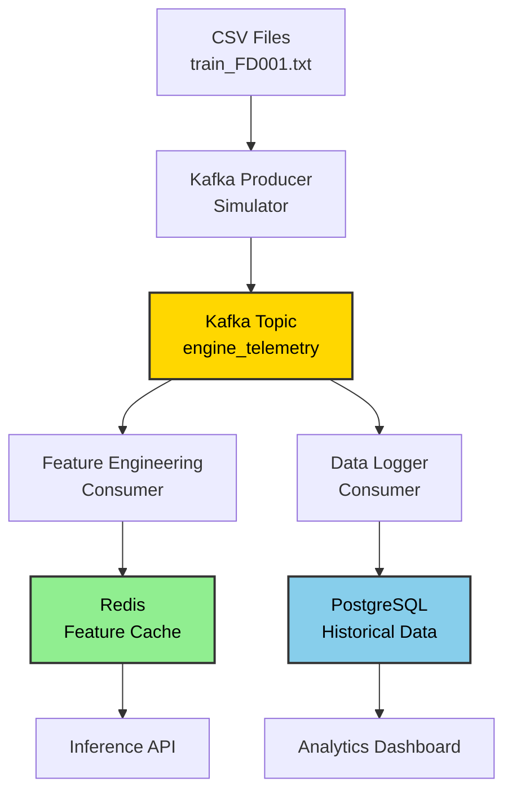

# Streaming Pipeline

## Overview

The streaming pipeline simulates real-time engine telemetry and processes it for inference. This implementation uses **Apache Kafka** for message streaming and **Redis** for feature caching.



---

## Architecture Components

### 1. Kafka Producer (Telemetry Simulator)

Reads CSV data and publishes events to Kafka, simulating real-time sensor streams.

```python
# src/streaming/producer.py
from confluent_kafka import Producer
import pandas as pd
import json
import time
from pathlib import Path

class TelemetryProducer:
    def __init__(self, bootstrap_servers='localhost:9092'):
        self.producer = Producer({
            'bootstrap.servers': bootstrap_servers,
            'client.id': 'engine-telemetry-producer'
        })
        self.topic = 'engine_telemetry'
    
    def delivery_callback(self, err, msg):
        if err:
            print(f'Message delivery failed: {err}')
        else:
            print(f'Message delivered to {msg.topic()} [{msg.partition()}]')
    
    def simulate_from_csv(self, csv_path: Path, delay_ms: int = 100):
        """
        Read CSV and publish events with delay to simulate real-time streaming.
        
        Args:
            csv_path: Path to train_FD001.txt
            delay_ms: Delay between events in milliseconds
        """
        # Load data
        cols = ['unit', 'cycle', 'os1', 'os2', 'os3'] + [f's{i}' for i in range(1, 22)]
        df = pd.read_csv(csv_path, sep=r'\s+', header=None, names=cols)
        
        # Sort by cycle to simulate time progression
        df = df.sort_values(['cycle', 'unit'])
        
        print(f"Starting simulation: {len(df)} events")
        
        for idx, row in df.iterrows():
            event = {
                'engine_id': f"ENG-{int(row['unit']):04d}",
                'cycle': int(row['cycle']),
                'timestamp': time.time(),
                'sensors': {
                    f's{i}': float(row[f's{i}']) for i in range(1, 22)
                },
                'operational_settings': {
                    'os1': float(row['os1']),
                    'os2': float(row['os2']),
                    'os3': float(row['os3'])
                }
            }
            
            # Publish to Kafka
            self.producer.produce(
                topic=self.topic,
                key=event['engine_id'],
                value=json.dumps(event),
                callback=self.delivery_callback
            )
            
            # Poll for delivery reports
            self.producer.poll(0)
            
            # Simulate delay
            time.sleep(delay_ms / 1000.0)
            
            if (idx + 1) % 1000 == 0:
                print(f"Published {idx + 1} events")
        
        # Wait for all messages to be delivered
        self.producer.flush()
        print("Simulation complete")

if __name__ == '__main__':
    producer = TelemetryProducer()
    producer.simulate_from_csv(
        csv_path=Path('Dataset/train_FD001.txt'),
        delay_ms=100  # 10 events per second
    )
```

---

### 2. Kafka Consumer (Feature Engineering)

Consumes telemetry events, maintains rolling windows, and caches features in Redis.

```python
# src/streaming/feature_consumer.py
from confluent_kafka import Consumer, KafkaError
import redis
import json
import numpy as np
from collections import deque
from typing import Dict, List
import joblib

class FeatureEngineeringConsumer:
    def __init__(
        self, 
        bootstrap_servers='localhost:9092',
        redis_host='localhost',
        redis_port=6379
    ):
        self.consumer = Consumer({
            'bootstrap.servers': bootstrap_servers,
            'group.id': 'feature-engineering-group',
            'auto.offset.reset': 'earliest',
            'enable.auto.commit': True
        })
        
        self.redis_client = redis.Redis(
            host=redis_host, 
            port=redis_port, 
            decode_responses=True
        )
        
        # Load scaler
        self.scaler = joblib.load('artifacts/data_transformation/scaler.pkl')
        
        # Load config
        with open('artifacts/data_feature_engineering/feature_config.json') as f:
            self.config = json.load(f)
        
        self.window_size = self.config['window_size']
        self.sensor_cols = self.config['features']
        
        # In-memory buffers per engine
        self.buffers: Dict[str, deque] = {}
    
    def extract_sensors(self, event: dict) -> np.ndarray:
        """Extract and normalize sensor values."""
        sensor_values = [event['sensors'][s] for s in self.sensor_cols]
        sensor_array = np.array(sensor_values).reshape(1, -1)
        normalized = self.scaler.transform(sensor_array)
        return normalized.flatten()
    
    def update_buffer(self, engine_id: str, sensor_data: np.ndarray):
        """Maintain rolling window buffer for each engine."""
        if engine_id not in self.buffers:
            self.buffers[engine_id] = deque(maxlen=self.window_size)
        
        self.buffers[engine_id].append(sensor_data.tolist())
    
    def get_feature_sequence(self, engine_id: str) -> np.ndarray:
        """Get current feature sequence for inference."""
        buffer = self.buffers.get(engine_id)
        
        if buffer is None or len(buffer) == 0:
            return None
        
        # Pad if less than window_size
        if len(buffer) < self.window_size:
            padding = np.zeros((self.window_size - len(buffer), len(self.sensor_cols)))
            sequence = np.vstack([padding, np.array(buffer)])
        else:
            sequence = np.array(buffer)
        
        return sequence
    
    def cache_features(self, engine_id: str, sequence: np.ndarray):
        """Store feature sequence in Redis."""
        key = f"engine:{engine_id}:features"
        
        # Store as JSON
        self.redis_client.set(
            key,
            json.dumps(sequence.tolist()),
            ex=3600  # Expire after 1 hour
        )
    
    def process_event(self, event: dict):
        """Process a single telemetry event."""
        engine_id = event['engine_id']
        
        # Extract and normalize sensors
        sensor_data = self.extract_sensors(event)
        
        # Update rolling buffer
        self.update_buffer(engine_id, sensor_data)
        
        # Get feature sequence
        sequence = self.get_feature_sequence(engine_id)
        
        if sequence is not None:
            # Cache in Redis
            self.cache_features(engine_id, sequence)
            
            # Store metadata
            metadata_key = f"engine:{engine_id}:metadata"
            self.redis_client.hset(metadata_key, mapping={
                'last_cycle': event['cycle'],
                'last_update': event['timestamp'],
                'buffer_size': len(self.buffers[engine_id])
            })
    
    def run(self):
        """Start consuming messages."""
        self.consumer.subscribe(['engine_telemetry'])
        
        print("Feature engineering consumer started...")
        
        try:
            while True:
                msg = self.consumer.poll(timeout=1.0)
                
                if msg is None:
                    continue
                
                if msg.error():
                    if msg.error().code() == KafkaError._PARTITION_EOF:
                        continue
                    else:
                        print(f"Consumer error: {msg.error()}")
                        break
                
                # Parse event
                event = json.loads(msg.value())
                
                # Process
                self.process_event(event)
                
        except KeyboardInterrupt:
            print("Shutting down consumer...")
        finally:
            self.consumer.close()

if __name__ == '__main__':
    consumer = FeatureEngineeringConsumer()
    consumer.run()
```

---

### 3. Data Logger Consumer

Stores all events in PostgreSQL for historical analysis.

```python
# src/streaming/data_logger.py
from confluent_kafka import Consumer, KafkaError
import psycopg2
import json
from datetime import datetime

class DataLoggerConsumer:
    def __init__(
        self,
        bootstrap_servers='localhost:9092',
        db_config=None
    ):
        self.consumer = Consumer({
            'bootstrap.servers': bootstrap_servers,
            'group.id': 'data-logger-group',
            'auto.offset.reset': 'earliest'
        })
        
        # PostgreSQL connection
        self.db_config = db_config or {
            'host': 'localhost',
            'port': 5432,
            'database': 'aircraft_engine',
            'user': 'postgres',
            'password': 'postgres'
        }
        
        self.conn = psycopg2.connect(**self.db_config)
        self.create_table()
    
    def create_table(self):
        """Create telemetry table if not exists."""
        with self.conn.cursor() as cur:
            cur.execute("""
                CREATE TABLE IF NOT EXISTS telemetry (
                    id SERIAL PRIMARY KEY,
                    engine_id VARCHAR(50),
                    cycle INTEGER,
                    timestamp TIMESTAMP,
                    sensors JSONB,
                    operational_settings JSONB,
                    created_at TIMESTAMP DEFAULT NOW()
                )
            """)
            
            # Create index
            cur.execute("""
                CREATE INDEX IF NOT EXISTS idx_engine_cycle 
                ON telemetry(engine_id, cycle)
            """)
            
            self.conn.commit()
    
    def store_event(self, event: dict):
        """Store event in PostgreSQL."""
        with self.conn.cursor() as cur:
            cur.execute("""
                INSERT INTO telemetry (engine_id, cycle, timestamp, sensors, operational_settings)
                VALUES (%s, %s, %s, %s, %s)
            """, (
                event['engine_id'],
                event['cycle'],
                datetime.fromtimestamp(event['timestamp']),
                json.dumps(event['sensors']),
                json.dumps(event['operational_settings'])
            ))
            self.conn.commit()
    
    def run(self):
        """Start consuming and logging."""
        self.consumer.subscribe(['engine_telemetry'])
        
        print("Data logger consumer started...")
        
        try:
            while True:
                msg = self.consumer.poll(timeout=1.0)
                
                if msg is None:
                    continue
                
                if msg.error():
                    if msg.error().code() == KafkaError._PARTITION_EOF:
                        continue
                    else:
                        print(f"Consumer error: {msg.error()}")
                        break
                
                # Parse and store
                event = json.loads(msg.value())
                self.store_event(event)
                
        except KeyboardInterrupt:
            print("Shutting down logger...")
        finally:
            self.consumer.close()
            self.conn.close()

if __name__ == '__main__':
    logger = DataLoggerConsumer()
    logger.run()
```

---

## Docker Compose Setup

```yaml
# docker-compose.yml
version: '3.8'

services:
  zookeeper:
    image: confluentinc/cp-zookeeper:7.5.0
    environment:
      ZOOKEEPER_CLIENT_PORT: 2181
      ZOOKEEPER_TICK_TIME: 2000
    ports:
      - "2181:2181"

  kafka:
    image: confluentinc/cp-kafka:7.5.0
    depends_on:
      - zookeeper
    ports:
      - "9092:9092"
    environment:
      KAFKA_BROKER_ID: 1
      KAFKA_ZOOKEEPER_CONNECT: zookeeper:2181
      KAFKA_ADVERTISED_LISTENERS: PLAINTEXT://localhost:9092
      KAFKA_OFFSETS_TOPIC_REPLICATION_FACTOR: 1
      KAFKA_TRANSACTION_STATE_LOG_MIN_ISR: 1
      KAFKA_TRANSACTION_STATE_LOG_REPLICATION_FACTOR: 1

  redis:
    image: redis:7-alpine
    ports:
      - "6379:6379"
    command: redis-server --appendonly yes
    volumes:
      - redis-data:/data

  postgres:
    image: postgres:15-alpine
    environment:
      POSTGRES_DB: aircraft_engine
      POSTGRES_USER: postgres
      POSTGRES_PASSWORD: postgres
    ports:
      - "5432:5432"
    volumes:
      - postgres-data:/var/lib/postgresql/data

  kafka-ui:
    image: provectuslabs/kafka-ui:latest
    depends_on:
      - kafka
    ports:
      - "8080:8080"
    environment:
      KAFKA_CLUSTERS_0_NAME: local
      KAFKA_CLUSTERS_0_BOOTSTRAPSERVERS: kafka:9092

volumes:
  redis-data:
  postgres-data:
```

---

## Running the Pipeline

### 1. Start Infrastructure

```bash
docker-compose up -d
```

### 2. Create Kafka Topic

```bash
docker exec -it <kafka-container-id> kafka-topics \
  --create \
  --topic engine_telemetry \
  --bootstrap-server localhost:9092 \
  --partitions 3 \
  --replication-factor 1
```

### 3. Start Consumers

```bash
# Terminal 1: Feature engineering consumer
python src/streaming/feature_consumer.py

# Terminal 2: Data logger consumer
python src/streaming/data_logger.py
```

### 4. Start Producer

```bash
# Terminal 3: Telemetry simulator
python src/streaming/producer.py
```

---

## Event Schema

```json
{
  "engine_id": "ENG-0001",
  "cycle": 104,
  "timestamp": 1705320225.123,
  "sensors": {
    "s1": 518.67,
    "s2": 641.82,
    "s3": 1589.70,
    "s4": 1400.60,
    "s5": 14.62,
    "s6": 21.61,
    "s7": 554.36,
    "s8": 2388.06,
    "s9": 9046.19,
    "s10": 1.30,
    "s11": 47.47,
    "s12": 521.66,
    "s13": 2388.02,
    "s14": 8138.62,
    "s15": 8.4195,
    "s16": 0.03,
    "s17": 392,
    "s18": 2388,
    "s19": 100.00,
    "s20": 39.06,
    "s21": 23.419
  },
  "operational_settings": {
    "os1": -0.0007,
    "os2": -0.0004,
    "os3": 100.0
  }
}
```

---

## Redis Data Structure

```
# Feature sequence for inference
engine:ENG-0001:features → JSON array (30, 11)

# Metadata
engine:ENG-0001:metadata → Hash
  - last_cycle: 104
  - last_update: 1705320225.123
  - buffer_size: 30
```

---

## PostgreSQL Schema

```sql
CREATE TABLE telemetry (
    id SERIAL PRIMARY KEY,
    engine_id VARCHAR(50),
    cycle INTEGER,
    timestamp TIMESTAMP,
    sensors JSONB,
    operational_settings JSONB,
    created_at TIMESTAMP DEFAULT NOW()
);

CREATE INDEX idx_engine_cycle ON telemetry(engine_id, cycle);
```

---

## Monitoring Kafka

Access Kafka UI at `http://localhost:8080` to monitor:
- Topics and partitions
- Consumer groups and lag
- Message throughput
- Broker health

---

## Scaling Considerations

### Kafka Partitioning

Partition by `engine_id` to ensure all events for one engine go to the same consumer:

```python
self.producer.produce(
    topic=self.topic,
    key=event['engine_id'],  # Partition key
    value=json.dumps(event)
)
```

### Consumer Groups

Run multiple consumer instances for parallel processing:

```bash
# Instance 1
python src/streaming/feature_consumer.py

# Instance 2
python src/streaming/feature_consumer.py

# Instance 3
python src/streaming/feature_consumer.py
```

Each instance will process a subset of partitions.

---

## Testing

### Verify Kafka

```bash
# List topics
docker exec -it <kafka-container> kafka-topics --list --bootstrap-server localhost:9092

# Consume messages
docker exec -it <kafka-container> kafka-console-consumer \
  --topic engine_telemetry \
  --bootstrap-server localhost:9092 \
  --from-beginning
```

### Verify Redis

```bash
redis-cli
> KEYS engine:*
> GET engine:ENG-0001:features
> HGETALL engine:ENG-0001:metadata
```

### Verify PostgreSQL

```bash
psql -h localhost -U postgres -d aircraft_engine
> SELECT COUNT(*) FROM telemetry;
> SELECT engine_id, MAX(cycle) FROM telemetry GROUP BY engine_id;
```

---

## Dependencies

```txt
confluent-kafka>=2.3.0
redis>=5.0.0
psycopg2-binary>=2.9.0
pandas>=2.0.0
numpy>=1.24.0
joblib>=1.3.0
```

---

## Next Steps

1. Implement producer and consumers
2. Test with sample data
3. Integrate with inference API
4. Add error handling and retry logic
5. Implement monitoring (see 07_monitoring.md)
