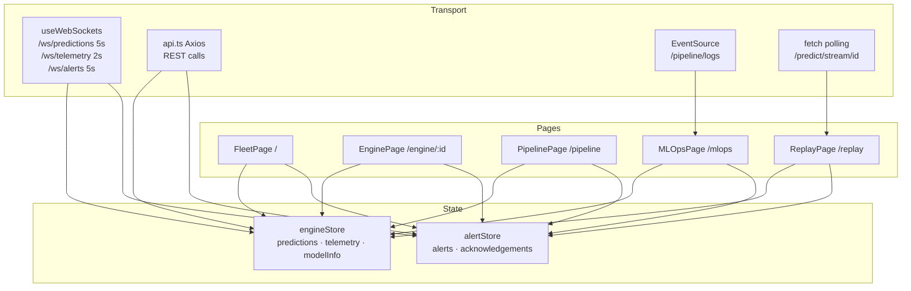
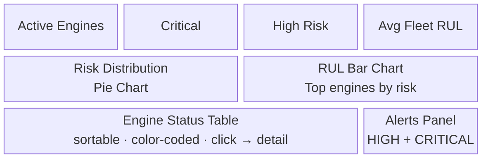
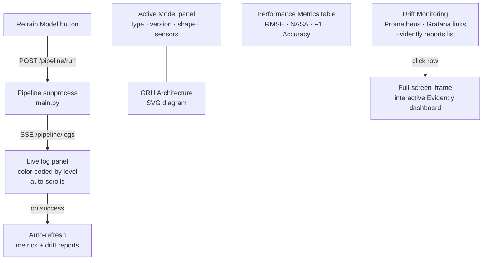
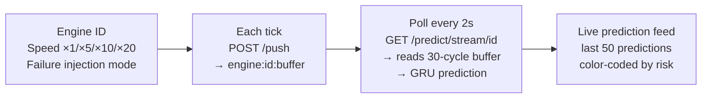
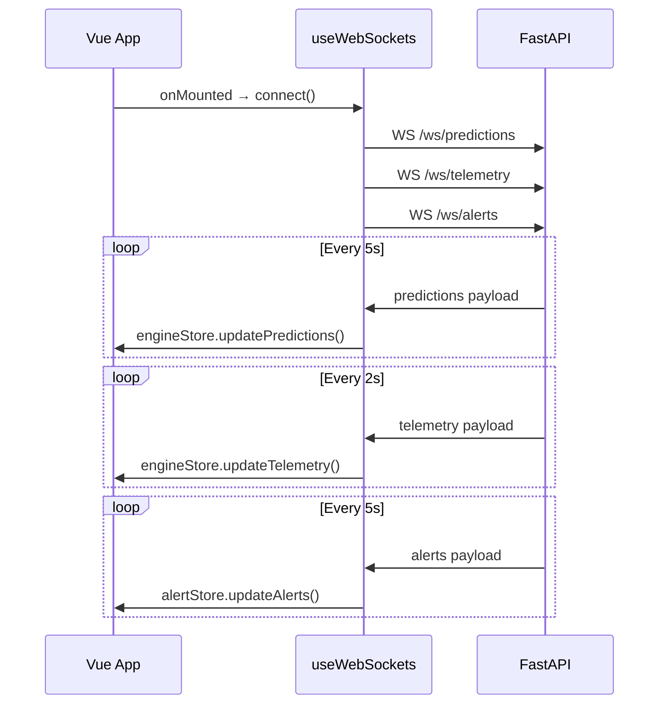

# Dashboard UI

## Stack: Vue 3 + Vite + TypeScript + TailwindCSS + ECharts

---

## Overview

5-page real-time ML operations platform. All live data flows through three WebSocket streams managed by a single `useWebSockets` composable. REST calls handle one-off queries and actions.



---

## Technology Stack

| Layer | Technology | Purpose |
|-------|------------|---------| 
| Framework | Vue 3 | Reactive UI |
| Build Tool | Vite | Fast development/build |
| Language | TypeScript | Type safety |
| Styling | TailwindCSS | Dashboard UI |
| Charts | Apache ECharts | Real-time telemetry charts |
| Routing | Vue Router | Multi-page dashboard |
| State | Pinia | Lightweight state management |
| Realtime | WebSockets + SSE | Live telemetry + log streaming |
| HTTP Client | Axios | API communication |

---

## Pages

### PAGE 1 — Fleet Command Center (`/`)

Live fleet overview powered by `/ws/predictions` and `/ws/alerts`.



---

### PAGE 2 — Engine Detail (`/engine/:id`)

Per-engine deep dive. Navigated to by clicking any row in the fleet table.

- Risk gauge, RUL cycles, confidence score, prediction timestamp
- Sensor tag display (all 11 sensor values)
- Engine metadata: source (redis_stream / push_buffer), buffer size, last prediction time

---

### PAGE 3 — Streaming Pipeline Monitor (`/pipeline`)

Live pipeline and infrastructure status.

- 4 live counters from `engineStore`: Active Engines, Telemetry Engines (Redis), Avg Cycle, Critical
- Live telemetry feed table: engine ID, cycle, window size, last event time
- Service health checks (FastAPI, Redis, Solace, Flink, Prometheus, Grafana) — polled every 30s
- Pipeline topology diagram with colour-coded stage cards
- Quick start commands

---

### PAGE 4 — ML Observability (`/mlops`)

Model registry, metrics, drift monitoring, and retraining.



---

### PAGE 5 — Replay & Simulation Lab (`/replay`)

Synthetic telemetry simulation for testing and demos.



**Failure injection modes:**

| Mode | Effect |
|------|--------|
| None | Normal sensor values |
| 🔥 Overheating | Temperature sensors s3, s4 spiked +25% |
| 📉 Pressure Drop | Pressure sensors s9, s11 dropped −30% |
| 📳 Vibration Spike | s14, s17 spiked +35% with high variance |

Injected values push sensors outside the training distribution → model predicts higher risk.

---

## State Management (Pinia)

| Store | File | Purpose |
|-------|------|---------| 
| `engineStore` | `stores/engineStore.ts` | Predictions map, telemetry map, model info, WS connection state |
| `alertStore` | `stores/alertStore.ts` | Alert list, acknowledgement state |

`engineStore` is the single source of truth for all live data — populated by `useWebSockets` which connects all three WS streams on mount.

---

## WebSocket Architecture



---

## API Services (`services/api.ts`)

| Function | Endpoint |
|----------|----------|
| `getHealth()` | `GET /health` |
| `getModelInfo()` | `GET /model/info` |
| `getModelEvaluation()` | `GET /model/evaluation` |
| `getEngines()` | `GET /engines` |
| `getEngine(id)` | `GET /engines/{id}` |
| `getAlerts(minRisk)` | `GET /alerts` |
| `predictEngine(id)` | `GET /predict/engine/{id}` |
| `getDriftReports()` | `GET /drift/reports` |
| `triggerPipeline()` | `POST /pipeline/run` |
| `getPipelineStatus()` | `GET /pipeline/status` |

Pipeline logs are consumed via native `EventSource` (SSE), not Axios.

---

## Development Setup

```bash
cd frontend
npm install
npm run dev    # → http://localhost:5173

# Backend must be running:
docker compose up -d inference-api redis
```

## Deployment

Built as a static site served by nginx. The `nginx.conf` proxies all API and WebSocket routes to the inference API container. Frontend container: `Dockerfile.frontend` (Vue build + nginx).

```bash
docker compose build frontend
docker compose up -d frontend
```
