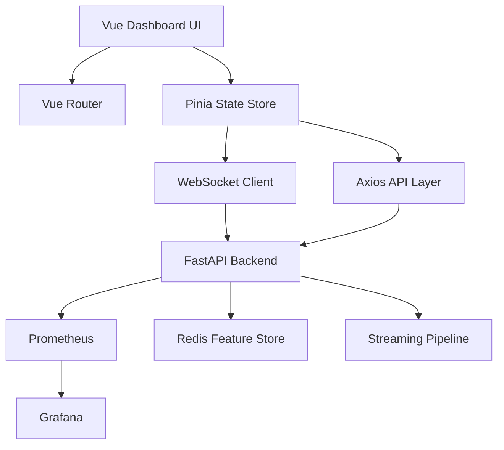
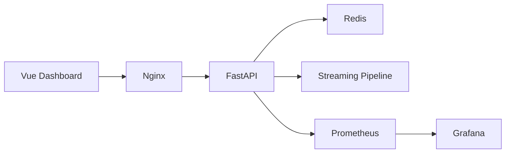

# Aircraft Engine Predictive Maintenance Dashboard

## Frontend Architecture & Implementation Guide

### Stack: Vue 3 + Vite + TypeScript + TailwindCSS + ECharts

---

# 1. Overview

This document defines the frontend architecture for the **Real-Time Aircraft Engine Predictive Maintenance System**.

The dashboard is not a generic CRUD application.
It is a **real-time ML operations platform** focused on:

* fleet monitoring
* telemetry visualization
* prediction observability
* streaming pipeline monitoring
* ML model operations
* anomaly and failure tracking

The frontend communicates with the FastAPI backend through:

* REST APIs
* WebSockets
* Prometheus/Grafana integrations

---

# 2. Technology Stack

| Layer       | Technology       | Purpose                      |
| ----------- | ---------------- | ---------------------------- |
| Framework   | Vue 3            | Reactive UI                  |
| Build Tool  | Vite             | Fast development/build       |
| Language    | TypeScript       | Type safety                  |
| Styling     | TailwindCSS      | Rapid dashboard UI           |
| Charts      | Apache ECharts   | Real-time telemetry charts   |
| Routing     | Vue Router       | Multi-page dashboard         |
| State       | Pinia            | Lightweight state management |
| Realtime    | WebSockets       | Live telemetry updates       |
| HTTP Client | Axios            | API communication            |
| Icons       | Lucide Vue       | Clean icons                  |
| Animations  | Motion One / CSS | UI transitions               |

---

# 3. Frontend Goals

The dashboard must:

✅ visualize real-time telemetry
✅ display live RUL predictions
✅ monitor fleet-wide health
✅ show streaming infrastructure status
✅ expose ML observability metrics
✅ support replay/simulation workflows
✅ look operational and enterprise-grade

---

# 4. Frontend Architecture



---

# 5. Recommended Pages

---

# PAGE 1 — Fleet Command Center

Route:

```bash
/
```

Purpose:

* operational overview
* fleet health
* live monitoring

---

## Components

### Fleet Statistics

Cards:

* Active Engines
* Healthy Engines
* Critical Engines
* Avg Fleet RUL
* Prediction Throughput
* API Latency

---

### Engine Status Table

Columns:

| Engine | RUL | Risk | Status | Last Seen |
| ------ | --- | ---- | ------ | --------- |

Features:

* sorting
* filtering
* color-coded risk
* click to open engine details

---

### Live Risk Distribution

Visualizations:

* pie chart
* histogram
* stacked bar

---

### Fleet Telemetry Overview

Mini live charts:

* temperature
* pressure
* vibration
* fuel efficiency

---

### Active Alerts Panel

Examples:

* Engine ENG-042 critical
* Redis latency spike
* Drift detected

---

# PAGE 2 — Engine Detail View

Route:

```bash
/engine/:engineId
```

Purpose:

* deep engine diagnostics
* telemetry analysis
* ML prediction transparency

---

## Components

### Engine Health Summary

Displays:

* current RUL
* failure risk
* confidence
* prediction timestamp
* degradation trend

---

### Live Sensor Charts

11 synchronized charts:

```text
s2
s3
s4
s7
s9
s11
s12
s14
s17
s20
s21
```

---

### GRU Sliding Window Visualization

Visual representation of:

```text
(30 timesteps × 11 sensors)
```

Shows:

* active inference window
* normalized values
* sequence progression

---

### Prediction Trend Timeline

Charts:

* RUL over time
* risk score over time
* anomaly score timeline

---

### Engine Event Timeline

Events:

* telemetry anomalies
* maintenance warnings
* model alerts
* prediction spikes

---

# PAGE 3 — Streaming Pipeline Monitor

Route:

```bash
/pipeline
```

Purpose:

* distributed systems monitoring
* event flow visibility

---

## Components

### Pipeline Topology Diagram

Visual flow:

```text
Telemetry Producer
   ↓
Solace/Kafka
   ↓
Flink Processing
   ↓
Redis
   ↓
FastAPI
   ↓
Predictions
```

Animated with:

* message throughput
* latency
* queue depth

---

### Broker Metrics

Displays:

* messages/sec
* consumer lag
* dropped messages
* partition health

---

### Flink Metrics

Displays:

* checkpoint health
* processing latency
* state size
* event throughput

---

### Redis Metrics

Displays:

* memory usage
* hit rate
* connected clients
* response latency

---

### Replay Controls

Buttons:

* start
* stop
* pause
* speed x1/x10/x100
* inject anomaly

---

# PAGE 4 — ML Observability

Route:

```bash
/mlops
```

Purpose:

* monitor model quality
* monitor drift
* monitor predictions

---

## Components

### Active Model Panel

Displays:

* model version
* training date
* RMSE
* dataset
* deployment status

---

### Drift Monitoring

Visualizations:

* feature drift
* prediction drift
* sensor distribution shifts

---

### Prediction Distribution

Charts:

* prediction histogram
* risk score distribution
* outlier frequency

---

### Retraining Status

Displays:

* last retraining
* scheduled retraining
* retraining trigger status

---

# PAGE 5 — Replay & Simulation Lab

Route:

```bash
/replay
```

Purpose:

* demos
* telemetry simulation
* testing

---

## Features

### Telemetry Replay

Controls:

* replay speed
* cycle skipping
* rewind

---

### Failure Injection

Simulate:

* overheating
* pressure anomalies
* vibration spikes

---

### Real-Time Visualization

Observe:

* live predictions
* risk escalation
* pipeline reactions

---

# 6. Folder Structure

```bash
frontend/
├── public/
│
├── src/
│   ├── assets/
│   │
│   ├── components/
│   │   ├── cards/
│   │   ├── charts/
│   │   ├── telemetry/
│   │   ├── alerts/
│   │   ├── pipeline/
│   │   ├── engine/
│   │   └── ui/
│   │
│   ├── layouts/
│   │   ├── DashboardLayout.vue
│   │   └── AuthLayout.vue
│   │
│   ├── pages/
│   │   ├── Dashboard.vue
│   │   ├── EngineDetail.vue
│   │   ├── Pipeline.vue
│   │   ├── MLOps.vue
│   │   └── Replay.vue
│   │
│   ├── router/
│   │   └── index.ts
│   │
│   ├── stores/
│   │   ├── engineStore.ts
│   │   ├── telemetryStore.ts
│   │   ├── alertStore.ts
│   │   └── pipelineStore.ts
│   │
│   ├── services/
│   │   ├── api.ts
│   │   ├── websocket.ts
│   │   └── metrics.ts
│   │
│   ├── composables/
│   │   ├── useTelemetry.ts
│   │   ├── useWebSocket.ts
│   │   └── useCharts.ts
│   │
│   ├── types/
│   │   ├── engine.ts
│   │   ├── telemetry.ts
│   │   ├── prediction.ts
│   │   └── metrics.ts
│   │
│   ├── App.vue
│   ├── main.ts
│   └── style.css
│
├── tailwind.config.js
├── vite.config.ts
├── tsconfig.json
└── package.json
```

---

# 7. WebSocket Architecture

---

## Purpose

Real-time updates without polling.

Used for:

* telemetry
* prediction updates
* alerts
* pipeline status

---

## WebSocket Endpoints

### Telemetry Stream

```bash
/ws/telemetry
```

---

### Prediction Stream

```bash
/ws/predictions
```

---

### Alert Stream

```bash
/ws/alerts
```

---

# Example Vue WebSocket Client

```typescript
const socket = new WebSocket(
  "ws://localhost:8000/ws/telemetry"
)

socket.onmessage = (event) => {
  const data = JSON.parse(event.data)
  telemetryStore.update(data)
}
```

---

# 8. State Management (Pinia)

---

## Why Pinia?

Better than Vuex for this project because:

* simpler
* lightweight
* modern
* less boilerplate

---

## Recommended Stores

| Store          | Purpose          |
| -------------- | ---------------- |
| engineStore    | engine state     |
| telemetryStore | live telemetry   |
| alertStore     | alerts           |
| pipelineStore  | infra metrics    |
| modelStore     | ML observability |

---

# 9. Charting Strategy

---

# Use Apache ECharts

Reason:

* excellent real-time performance
* telemetry-focused visualizations
* supports large datasets
* enterprise dashboard feel

---

## Recommended Charts

| Chart      | Usage              |
| ---------- | ------------------ |
| Line Chart | telemetry          |
| Gauge      | risk score         |
| Heatmap    | fleet risk         |
| Timeline   | predictions        |
| Sankey     | pipeline flow      |
| Pie        | alert distribution |

---

# 10. Theme Design

---

# Recommended Theme

Dark operations-center theme.

Colors:

| Element    | Color     |
| ---------- | --------- |
| Background | #0B1020   |
| Cards      | #111827   |
| Healthy    | Green     |
| Warning    | Yellow    |
| Critical   | Red       |
| Charts     | Cyan/Blue |

---

# UI Style Inspiration

Inspired by:

* Grafana
* Datadog
* Kibana
* Splunk
* Air Traffic Control dashboards

---

# 11. Backend API Integration

---

# REST APIs

| Endpoint    | Purpose            |
| ----------- | ------------------ |
| /predict    | predictions        |
| /health     | health             |
| /model/info | model metadata     |
| /metrics    | Prometheus metrics |

---

# Additional Recommended APIs

| Endpoint         | Purpose           |
| ---------------- | ----------------- |
| /engines         | fleet overview    |
| /engines/:id     | engine details    |
| /alerts          | active alerts     |
| /pipeline/status | streaming metrics |

---

# 12. Authentication (Optional)

Initially skip authentication.

Later:

* JWT auth
* RBAC
* operator/admin roles

---

# 13. Deployment Architecture



---

# 14. Development Setup

---

# Create Project

```bash
npm create vite@latest frontend
```

Select:

* Vue
* TypeScript

---

# Install Dependencies

```bash
npm install

npm install vue-router pinia axios echarts vue-echarts

npm install -D tailwindcss postcss autoprefixer
```

---

# Start Dev Server

```bash
npm run dev
```

---

# 15. Recommended Development Order

---

# Phase 1

Build:

* dashboard layout
* sidebar
* routing
* stat cards

---

# Phase 2

Build:

* live telemetry charts
* engine detail page
* WebSocket integration

---

# Phase 3

Build:

* pipeline monitoring
* replay controls
* ML observability

---

# Phase 4

Polish:

* animations
* responsive UI
* alerts
* dark theme

---

# 16. Final Architectural Philosophy

This frontend is NOT:

* a marketing website
* a CRUD admin panel
* a generic SaaS app

It is:

✅ a real-time ML operations console
✅ a telemetry visualization system
✅ an observability platform
✅ a streaming systems dashboard
✅ an MLOps interface

The UI should emphasize:

* live systems
* telemetry
* predictions
* infrastructure
* observability
* operational awareness

