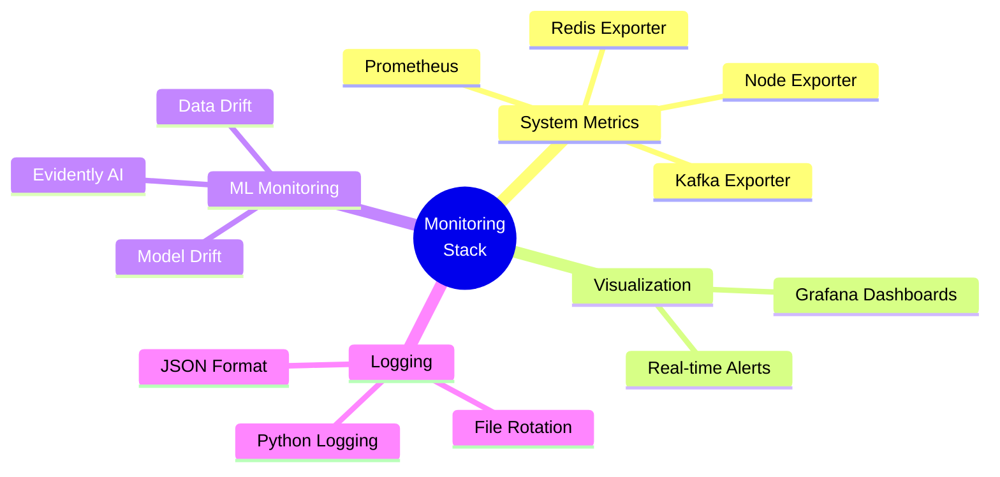

# Monitoring and Observability

## Overview

Production ML systems require comprehensive monitoring across three layers:
1. **System Health** - Infrastructure metrics (CPU, memory, latency)
2. **Data Health** - Input data quality and drift
3. **Model Health** - Prediction quality and performance

This implementation uses open-source tools: **Prometheus**, **Grafana**, and **Evidently AI**.



---

## Monitoring Stack

| Component | Purpose | Port |
|-----------|---------|------|
| Prometheus | Metrics collection and storage | 9090 |
| Grafana | Dashboards and visualization | 3000 |
| Node Exporter | System metrics (CPU, memory, disk) | 9100 |
| Kafka Exporter | Kafka broker and topic metrics | 9308 |
| Redis Exporter | Redis performance metrics | 9121 |
| Evidently | ML-specific drift detection | - |

---

## 1. Prometheus Setup

### Instrumentation in FastAPI

```python
# src/inference/metrics.py
from prometheus_client import Counter, Histogram, Gauge, generate_latest, CONTENT_TYPE_LATEST
from fastapi import Response
import time

# Request metrics
prediction_requests_total = Counter(
    'prediction_requests_total',
    'Total prediction requests',
    ['engine_id', 'risk_level']
)

prediction_latency_seconds = Histogram(
    'prediction_latency_seconds',
    'Prediction latency in seconds',
    buckets=[0.001, 0.005, 0.01, 0.025, 0.05, 0.1, 0.25, 0.5, 1.0]
)

active_engines = Gauge(
    'active_engines_total',
    'Number of engines with recent telemetry'
)

# ML metrics
predicted_rul_cycles = Histogram(
    'predicted_rul_cycles',
    'Distribution of predicted RUL values',
    buckets=[0, 10, 20, 30, 50, 75, 100, 125]
)

failure_risk_score = Histogram(
    'failure_risk_score',
    'Distribution of failure risk scores',
    buckets=[i/10 for i in range(11)]
)

critical_engines_total = Counter(
    'critical_engines_total',
    'Total engines flagged as critical'
)

# Model metrics
model_load_time_seconds = Gauge(
    'model_load_time_seconds',
    'Time taken to load model at startup'
)

prediction_errors_total = Counter(
    'prediction_errors_total',
    'Total prediction errors',
    ['error_type']
)

# Add to FastAPI app
from fastapi import FastAPI

app = FastAPI()

@app.get("/metrics")
async def metrics():
    """Prometheus metrics endpoint."""
    return Response(
        content=generate_latest(),
        media_type=CONTENT_TYPE_LATEST
    )

# Middleware to track latency
@app.middleware("http")
async def track_latency(request, call_next):
    start_time = time.time()
    response = await call_next(request)
    latency = time.time() - start_time
    
    if request.url.path == "/predict":
        prediction_latency_seconds.observe(latency)
    
    return response
```

### Instrumented Prediction Endpoint

```python
@app.post("/predict")
async def predict(data: SensorData):
    try:
        # Predict
        result = await _predict_internal(data)
        
        # Record metrics
        prediction_requests_total.labels(
            engine_id=data.engine_id,
            risk_level=result['risk_level']
        ).inc()
        
        predicted_rul_cycles.observe(result['remaining_cycles'])
        failure_risk_score.observe(result['failure_risk'])
        
        if result['risk_level'] == 'CRITICAL':
            critical_engines_total.inc()
        
        return result
    
    except Exception as e:
        prediction_errors_total.labels(error_type=type(e).__name__).inc()
        raise
```

---

## 2. Prometheus Configuration

### prometheus.yml

```yaml
global:
  scrape_interval: 15s
  evaluation_interval: 15s

scrape_configs:
  # Inference API
  - job_name: 'inference-api'
    static_configs:
      - targets: ['localhost:8000']
    metrics_path: '/metrics'
  
  # System metrics
  - job_name: 'node-exporter'
    static_configs:
      - targets: ['localhost:9100']
  
  # Kafka metrics
  - job_name: 'kafka'
    static_configs:
      - targets: ['localhost:9308']
  
  # Redis metrics
  - job_name: 'redis'
    static_configs:
      - targets: ['localhost:9121']
  
  # Prometheus itself
  - job_name: 'prometheus'
    static_configs:
      - targets: ['localhost:9090']
```

---

## 3. Grafana Dashboards

### Dashboard 1: Fleet Overview

**Panels:**

1. **Active Engines** (Gauge)
   ```promql
   active_engines_total
   ```

2. **Risk Level Distribution** (Pie Chart)
   ```promql
   sum by (risk_level) (rate(prediction_requests_total[5m]))
   ```

3. **Critical Engines** (Stat)
   ```promql
   rate(critical_engines_total[5m]) * 60
   ```

4. **Prediction Throughput** (Graph)
   ```promql
   rate(prediction_requests_total[1m])
   ```

5. **Average RUL by Engine** (Table)
   ```promql
   avg_over_time(predicted_rul_cycles[5m])
   ```

### Dashboard 2: API Performance

**Panels:**

1. **Request Latency (p50, p95, p99)** (Graph)
   ```promql
   histogram_quantile(0.50, rate(prediction_latency_seconds_bucket[5m]))
   histogram_quantile(0.95, rate(prediction_latency_seconds_bucket[5m]))
   histogram_quantile(0.99, rate(prediction_latency_seconds_bucket[5m]))
   ```

2. **Error Rate** (Graph)
   ```promql
   rate(prediction_errors_total[5m])
   ```

3. **Requests per Second** (Stat)
   ```promql
   sum(rate(prediction_requests_total[1m]))
   ```

4. **CPU Usage** (Graph)
   ```promql
   100 - (avg by (instance) (irate(node_cpu_seconds_total{mode="idle"}[5m])) * 100)
   ```

5. **Memory Usage** (Graph)
   ```promql
   (node_memory_MemTotal_bytes - node_memory_MemAvailable_bytes) / node_memory_MemTotal_bytes * 100
   ```

### Dashboard 3: Kafka Monitoring

**Panels:**

1. **Messages per Second** (Graph)
   ```promql
   rate(kafka_topic_partition_current_offset[1m])
   ```

2. **Consumer Lag** (Graph)
   ```promql
   kafka_consumergroup_lag
   ```

3. **Broker Health** (Stat)
   ```promql
   kafka_brokers
   ```

### Dashboard 4: Redis Monitoring

**Panels:**

1. **Connected Clients** (Graph)
   ```promql
   redis_connected_clients
   ```

2. **Memory Usage** (Graph)
   ```promql
   redis_memory_used_bytes / redis_memory_max_bytes * 100
   ```

3. **Commands per Second** (Graph)
   ```promql
   rate(redis_commands_processed_total[1m])
   ```

4. **Hit Rate** (Graph)
   ```promql
   rate(redis_keyspace_hits_total[1m]) / (rate(redis_keyspace_hits_total[1m]) + rate(redis_keyspace_misses_total[1m]))
   ```

---

## 4. Alerting Rules

### alerting_rules.yml

```yaml
groups:
  - name: aircraft_engine_alerts
    interval: 30s
    rules:
      # Critical engine detected
      - alert: CriticalEngineDetected
        expr: rate(critical_engines_total[5m]) > 0
        for: 1m
        labels:
          severity: critical
        annotations:
          summary: "Engine with critical failure risk detected"
          description: "{{ $value }} engines flagged as critical in the last 5 minutes"
      
      # High prediction latency
      - alert: HighPredictionLatency
        expr: histogram_quantile(0.95, rate(prediction_latency_seconds_bucket[5m])) > 0.1
        for: 5m
        labels:
          severity: warning
        annotations:
          summary: "High prediction latency detected"
          description: "P95 latency is {{ $value }}s (threshold: 0.1s)"
      
      # High error rate
      - alert: HighErrorRate
        expr: rate(prediction_errors_total[5m]) > 0.01
        for: 5m
        labels:
          severity: warning
        annotations:
          summary: "High prediction error rate"
          description: "Error rate is {{ $value }} errors/sec"
      
      # Kafka consumer lag
      - alert: KafkaConsumerLag
        expr: kafka_consumergroup_lag > 10000
        for: 5m
        labels:
          severity: warning
        annotations:
          summary: "Kafka consumer falling behind"
          description: "Consumer lag is {{ $value }} messages"
      
      # Redis memory high
      - alert: RedisMemoryHigh
        expr: (redis_memory_used_bytes / redis_memory_max_bytes) > 0.8
        for: 5m
        labels:
          severity: warning
        annotations:
          summary: "Redis memory usage high"
          description: "Redis memory usage is {{ $value }}%"
      
      # API down
      - alert: InferenceAPIDown
        expr: up{job="inference-api"} == 0
        for: 1m
        labels:
          severity: critical
        annotations:
          summary: "Inference API is down"
          description: "The inference API has been down for more than 1 minute"
```

---

## 5. ML Monitoring with Evidently

### Data Drift Detection

```python
# src/monitoring/drift_detector.py
from evidently.report import Report
from evidently.metric_preset import DataDriftPreset, DataQualityPreset
from evidently.metrics import DatasetDriftMetric, ColumnDriftMetric
import pandas as pd
import numpy as np
from pathlib import Path
import json
from datetime import datetime

class DriftDetector:
    def __init__(self, reference_data_path: Path):
        """
        Args:
            reference_data_path: Path to training data (reference distribution)
        """
        self.reference_df = pd.read_parquet(reference_data_path)
        self.sensor_cols = [f's{i}' for i in [2, 3, 4, 7, 9, 11, 12, 14, 17, 20, 21]]
    
    def check_drift(self, current_data: pd.DataFrame) -> dict:
        """
        Compare current data against reference distribution.
        
        Returns:
            dict with drift metrics and alerts
        """
        # Create report
        report = Report(metrics=[
            DataDriftPreset(),
            DataQualityPreset()
        ])
        
        # Run report
        report.run(
            reference_data=self.reference_df[self.sensor_cols],
            current_data=current_data[self.sensor_cols]
        )
        
        # Extract results
        result = report.as_dict()
        
        # Parse drift metrics
        drift_metrics = result['metrics'][0]['result']
        
        drifted_features = [
            col for col, stats in drift_metrics['drift_by_columns'].items()
            if stats['drift_detected']
        ]
        
        drift_share = drift_metrics['share_of_drifted_columns']
        
        return {
            'timestamp': datetime.now().isoformat(),
            'drift_detected': drift_share > 0.3,
            'drift_share': drift_share,
            'drifted_features': drifted_features,
            'total_features': len(self.sensor_cols),
            'alert_level': self._get_alert_level(drift_share)
        }
    
    def _get_alert_level(self, drift_share: float) -> str:
        if drift_share > 0.5:
            return 'CRITICAL'
        elif drift_share > 0.3:
            return 'WARNING'
        else:
            return 'OK'
    
    def save_report(self, current_data: pd.DataFrame, output_path: Path):
        """Generate and save HTML report."""
        report = Report(metrics=[DataDriftPreset()])
        report.run(
            reference_data=self.reference_df[self.sensor_cols],
            current_data=current_data[self.sensor_cols]
        )
        report.save_html(str(output_path))
```

### Scheduled Drift Monitoring

```python
# src/monitoring/drift_monitor.py
import schedule
import time
import psycopg2
import pandas as pd
from pathlib import Path
from drift_detector import DriftDetector

class DriftMonitor:
    def __init__(self):
        self.detector = DriftDetector(
            reference_data_path=Path('artifacts/data_transformation/processed/train_processed.parquet')
        )
        
        self.db_config = {
            'host': 'localhost',
            'database': 'aircraft_engine',
            'user': 'postgres',
            'password': 'postgres'
        }
    
    def fetch_recent_data(self, hours: int = 1) -> pd.DataFrame:
        """Fetch telemetry from last N hours."""
        conn = psycopg2.connect(**self.db_config)
        
        query = f"""
            SELECT 
                sensors->>'s2' as s2,
                sensors->>'s3' as s3,
                sensors->>'s4' as s4,
                sensors->>'s7' as s7,
                sensors->>'s9' as s9,
                sensors->>'s11' as s11,
                sensors->>'s12' as s12,
                sensors->>'s14' as s14,
                sensors->>'s17' as s17,
                sensors->>'s20' as s20,
                sensors->>'s21' as s21
            FROM telemetry
            WHERE created_at > NOW() - INTERVAL '{hours} hours'
        """
        
        df = pd.read_sql(query, conn)
        conn.close()
        
        # Convert to float
        for col in df.columns:
            df[col] = df[col].astype(float)
        
        return df
    
    def run_drift_check(self):
        """Run drift detection and log results."""
        print(f"[{datetime.now()}] Running drift check...")
        
        # Fetch recent data
        current_data = self.fetch_recent_data(hours=1)
        
        if len(current_data) < 100:
            print("Not enough data for drift detection")
            return
        
        # Check drift
        result = self.detector.check_drift(current_data)
        
        # Log results
        print(f"Drift Share: {result['drift_share']:.2%}")
        print(f"Alert Level: {result['alert_level']}")
        
        if result['drifted_features']:
            print(f"Drifted Features: {', '.join(result['drifted_features'])}")
        
        # Save report
        if result['drift_detected']:
            output_path = Path(f"reports/drift_report_{datetime.now().strftime('%Y%m%d_%H%M%S')}.html")
            output_path.parent.mkdir(exist_ok=True)
            self.detector.save_report(current_data, output_path)
            print(f"Report saved: {output_path}")
    
    def start(self):
        """Start scheduled monitoring."""
        # Run every hour
        schedule.every(1).hours.do(self.run_drift_check)
        
        print("Drift monitor started. Running every hour...")
        
        while True:
            schedule.run_pending()
            time.sleep(60)

if __name__ == '__main__':
    monitor = DriftMonitor()
    monitor.start()
```

---

## 6. Structured Logging

```python
# src/logging/structured_logger.py
import logging
import json
from datetime import datetime
from pathlib import Path

class JSONFormatter(logging.Formatter):
    """Format logs as JSON for easy parsing."""
    
    def format(self, record):
        log_data = {
            'timestamp': datetime.utcnow().isoformat(),
            'level': record.levelname,
            'logger': record.name,
            'message': record.getMessage(),
            'module': record.module,
            'function': record.funcName,
            'line': record.lineno
        }
        
        # Add extra fields
        if hasattr(record, 'engine_id'):
            log_data['engine_id'] = record.engine_id
        if hasattr(record, 'rul'):
            log_data['rul'] = record.rul
        if hasattr(record, 'risk'):
            log_data['risk'] = record.risk
        if hasattr(record, 'latency_ms'):
            log_data['latency_ms'] = record.latency_ms
        
        return json.dumps(log_data)

def setup_logger(name: str, log_file: Path = None):
    """Setup structured logger."""
    logger = logging.getLogger(name)
    logger.setLevel(logging.INFO)
    
    # Console handler
    console_handler = logging.StreamHandler()
    console_handler.setFormatter(JSONFormatter())
    logger.addHandler(console_handler)
    
    # File handler
    if log_file:
        log_file.parent.mkdir(parents=True, exist_ok=True)
        file_handler = logging.FileHandler(log_file)
        file_handler.setFormatter(JSONFormatter())
        logger.addHandler(file_handler)
    
    return logger

# Usage in inference API
logger = setup_logger('inference', Path('logs/inference.log'))

@app.post("/predict")
async def predict(data: SensorData):
    start_time = time.time()
    
    result = await _predict_internal(data)
    
    latency_ms = (time.time() - start_time) * 1000
    
    logger.info(
        "Prediction completed",
        extra={
            'engine_id': data.engine_id,
            'rul': result['remaining_cycles'],
            'risk': result['failure_risk'],
            'latency_ms': latency_ms
        }
    )
    
    return result
```

---

## 7. Docker Compose for Monitoring Stack

```yaml
# docker-compose.monitoring.yml
version: '3.8'

services:
  prometheus:
    image: prom/prometheus:latest
    ports:
      - "9090:9090"
    volumes:
      - ./monitoring/prometheus.yml:/etc/prometheus/prometheus.yml
      - ./monitoring/alerting_rules.yml:/etc/prometheus/alerting_rules.yml
      - prometheus-data:/prometheus
    command:
      - '--config.file=/etc/prometheus/prometheus.yml'
      - '--storage.tsdb.path=/prometheus'

  grafana:
    image: grafana/grafana:latest
    ports:
      - "3000:3000"
    environment:
      - GF_SECURITY_ADMIN_PASSWORD=admin
      - GF_USERS_ALLOW_SIGN_UP=false
    volumes:
      - grafana-data:/var/lib/grafana
      - ./monitoring/grafana/dashboards:/etc/grafana/provisioning/dashboards
      - ./monitoring/grafana/datasources:/etc/grafana/provisioning/datasources

  node-exporter:
    image: prom/node-exporter:latest
    ports:
      - "9100:9100"
    command:
      - '--path.rootfs=/host'
    volumes:
      - '/:/host:ro,rslave'

  kafka-exporter:
    image: danielqsj/kafka-exporter:latest
    ports:
      - "9308:9308"
    command:
      - '--kafka.server=kafka:9092'

  redis-exporter:
    image: oliver006/redis_exporter:latest
    ports:
      - "9121:9121"
    environment:
      - REDIS_ADDR=redis:6379

volumes:
  prometheus-data:
  grafana-data:
```

---

## Running the Monitoring Stack

```bash
# Start monitoring services
docker-compose -f docker-compose.monitoring.yml up -d

# Access Grafana
open http://localhost:3000
# Login: admin / admin

# Access Prometheus
open http://localhost:9090

# Start drift monitor
python src/monitoring/drift_monitor.py
```

---

## Monitoring Checklist

- [ ] Prometheus scraping all endpoints
- [ ] Grafana dashboards configured
- [ ] Alerting rules defined
- [ ] Drift detection running hourly
- [ ] Structured logging enabled
- [ ] Log rotation configured
- [ ] Exporters running (Node, Kafka, Redis)
- [ ] Alert notifications configured (email/Slack)

---

## Next Steps

1. Configure Prometheus and Grafana
2. Import dashboard templates
3. Set up alert notifications
4. Implement drift monitoring
5. Test alert triggers
6. Document runbooks for common alerts
