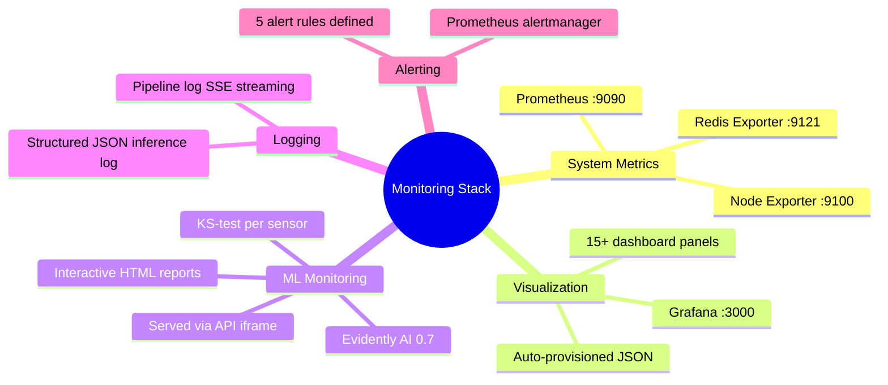
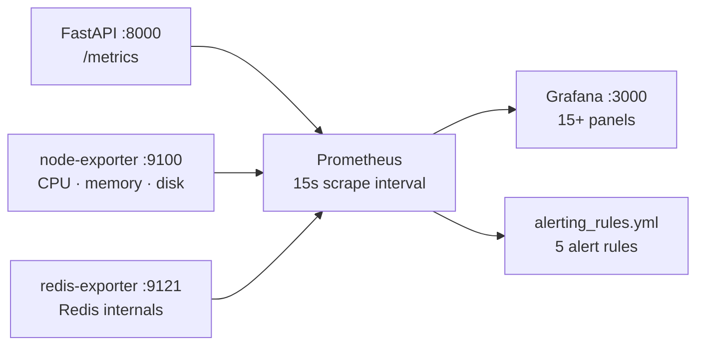
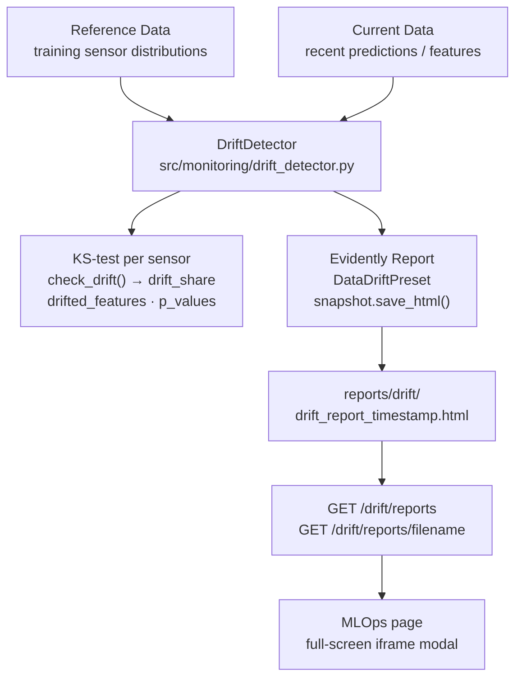

# Monitoring and Observability

## Overview

Three-layer monitoring: system health, data health, and model health.



---

## Stack Components

| Component | Purpose | Port |
|-----------|---------|------|
| Prometheus | Metrics collection and storage | 9090 |
| Grafana | Dashboards and visualization | 3000 |
| Node Exporter | System metrics (CPU, memory, disk) | 9100 |
| Redis Exporter | Redis performance metrics | 9121 |
| Evidently AI 0.7 | ML-specific drift detection + HTML reports | — |

---

## Prometheus Scrape Targets



---

## Prometheus Metrics

All metrics defined in `src/inference/metrics.py` and exposed at `GET /metrics`. Populated by the WebSocket batch prediction loop (every 5s) — not just REST endpoint calls.

| Metric | Type | Labels | Description |
|--------|------|--------|-------------|
| `active_engines_total` | Gauge | — | Current engines with feature tensors in Redis |
| `prediction_requests_total` | Counter | `engine_id`, `risk_level` | Total predictions made |
| `prediction_latency_seconds` | Histogram | — | Batch forward pass duration |
| `predicted_rul_cycles` | Histogram | — | Distribution of predicted RUL values |
| `failure_risk_score` | Histogram | — | Distribution of risk scores |
| `prediction_confidence` | Histogram | — | Distribution of confidence scores |
| `critical_engines_total` | **Gauge** | — | Current CRITICAL engine count (set each WS cycle) |
| `prediction_errors_total` | Counter | `error_type` | Inference errors by type |
| `model_load_time_seconds` | Gauge | — | Startup model load time |

> `critical_engines_total` is a **Gauge** — it reflects the current snapshot of CRITICAL engines, not a running total. This keeps the Grafana panel showing a believable number (e.g. 12) rather than an ever-growing counter.

---

## Grafana Dashboard

Auto-provisioned from `monitoring/grafana/dashboards/aircraft_engine_monitoring.json` on startup. 15+ panels across 4 rows:

```mermaid
block-beta
    columns 6
    P1["Active Engines\nGauge"]:1
    P2["Prediction\nThroughput req/s"]:1
    P3["Critical Engines\nGauge"]:1
    P4["Model Load\nTime"]:1
    P5["Error Rate\nerrors/s"]:1
    P6["Avg Confidence\np50"]:1
    P7["Prediction Latency\np50 / p95 / p99"]:3
    P8["Requests by\nRisk Level"]:3
    P9["RUL Distribution\nHistogram"]:3
    P10["Risk Score\nDistribution"]:3
    P11["CPU Usage %"]:4
    P12["Memory Usage %"]:4 %% wrong, but block-beta is limited
```

Key panel queries:

| Panel | Query |
|-------|-------|
| Active Engines | `active_engines_total` |
| Prediction Throughput | `sum(rate(prediction_requests_total[1m]))` |
| Critical Engines | `critical_engines_total` |
| Error Rate | `sum(rate(prediction_errors_total[5m])) or vector(0)` |
| Avg Confidence | `histogram_quantile(0.50, sum(rate(prediction_confidence_bucket[5m])) by (le))` |
| Latency p50/p95/p99 | `histogram_quantile(0.X, sum(rate(prediction_latency_seconds_bucket[5m])) by (le))` |
| Redis Memory % | `redis_memory_used_bytes / (redis_memory_max_bytes > 0 or redis_memory_used_bytes) * 100` |

---

## Alerting Rules

Defined in `monitoring/prometheus/alerting_rules.yml`:

| Alert | Condition | Severity |
|-------|-----------|----------|
| `CriticalEngineDetected` | `rate(critical_engines_total[5m]) > 0` for 1m | critical |
| `HighPredictionLatency` | p95 latency > 0.1s for 5m | warning |
| `HighErrorRate` | error rate > 0.01/s for 5m | warning |
| `RedisMemoryHigh` | Redis memory > 80% for 5m | warning |
| `InferenceAPIDown` | `up{job="inference-api"} == 0` for 1m | critical |

> Alert notifications (email/Slack) are not yet wired to an Alertmanager receiver. Rules fire in Prometheus but routing is not configured.

---

## Evidently AI 0.7 Drift Detection



**Evidently 0.7 API note:** `report.run()` returns a `Snapshot` object. Call `snapshot.save_html()` on the snapshot — not on the report. This changed from earlier Evidently versions.

Run drift detection manually:

```bash
python src/monitoring/drift_monitor.py
# Reports saved to reports/drift/drift_report_<timestamp>.html
```

> Scheduled drift monitoring (hourly cron) is not yet configured. Run manually as needed.

---

## Structured Logging

Inference API uses JSON-formatted structured logging (`src/inference/structured_logger.py`).

Log fields per prediction: `timestamp`, `level`, `message`, `engine_id`, `rul`, `risk`, `risk_level`, `confidence`, `latency_ms`.

Log files:
- `logs/inference.log` — inference API predictions
- `logs/pipeline_<timestamp>.log` — retraining pipeline runs (streamed live via SSE)

---

## Running the Stack

```bash
# Start everything
docker compose up -d

# Access
# Grafana:    http://localhost:3000  (admin/admin)
# Prometheus: http://localhost:9090

# Reload Grafana dashboard after JSON changes
docker compose restart grafana

# Run drift check manually
python src/monitoring/drift_monitor.py
```
