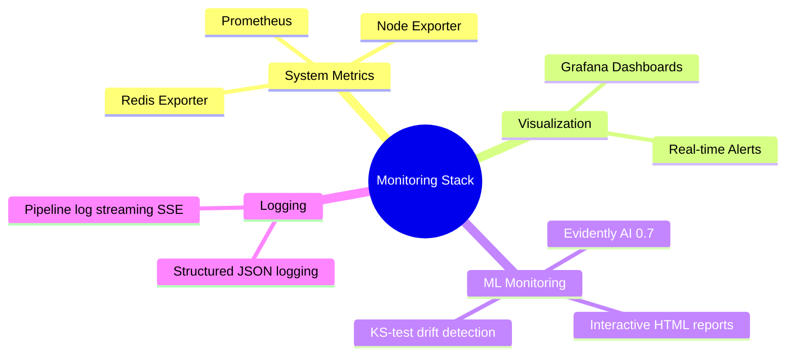

# Monitoring and Observability

## Overview

Production ML systems require comprehensive monitoring across three layers:
1. **System Health** — Infrastructure metrics (CPU, memory, latency)
2. **Data Health** — Input data quality and drift
3. **Model Health** — Prediction quality and performance

This implementation uses: **Prometheus**, **Grafana**, and **Evidently AI 0.7**.



---

## Monitoring Stack

| Component | Purpose | Port |
|-----------|---------|------|
| Prometheus | Metrics collection and storage | 9090 |
| Grafana | Dashboards and visualization | 3000 |
| Node Exporter | System metrics (CPU, memory, disk) | 9100 |
| Redis Exporter | Redis performance metrics | 9121 |
| Evidently AI | ML-specific drift detection + HTML reports | — |

> Note: The project uses **Solace PubSub+ and Redis Streams** as the event broker — not Kafka. There is no Kafka Exporter in this stack.

---

## 1. Prometheus Setup

All metrics are defined in `src/inference/metrics.py` and exposed at `GET /metrics`.

```python
from prometheus_client import Counter, Histogram, Gauge

prediction_requests_total  = Counter('prediction_requests_total', '...', ['engine_id', 'risk_level'])
prediction_latency_seconds = Histogram('prediction_latency_seconds', '...', buckets=[0.001,0.005,0.01,0.025,0.05,0.1,0.25,0.5,1.0])
predicted_rul_cycles       = Histogram('predicted_rul_cycles', '...', buckets=[0,10,20,30,50,75,100,125])
failure_risk_score         = Histogram('failure_risk_score', '...', buckets=[i/10 for i in range(11)])
prediction_confidence      = Histogram('prediction_confidence', '...', buckets=[i/10 for i in range(11)])
critical_engines_total     = Counter('critical_engines_total', '...')
prediction_errors_total    = Counter('prediction_errors_total', '...', ['error_type'])
model_load_time_seconds    = Gauge('model_load_time_seconds', '...')
active_engines_total       = Gauge('active_engines_total', '...')
```

### prometheus.yml

```yaml
global:
  scrape_interval: 15s
  evaluation_interval: 15s

rule_files:
  - "alerting_rules.yml"

scrape_configs:
  - job_name: "inference-api"
    metrics_path: /metrics
    static_configs:
      - targets: ["inference-api:8000"]

  - job_name: "node-exporter"
    static_configs:
      - targets: ["node-exporter:9100"]

  - job_name: "redis-exporter"
    static_configs:
      - targets: ["redis-exporter:9121"]

  - job_name: "prometheus"
    static_configs:
      - targets: ["localhost:9090"]
```

---

## 2. Grafana Dashboard

The dashboard JSON is at `monitoring/grafana/dashboards/aircraft_engine_monitoring.json` and is auto-provisioned on startup.

Panels included:

| Panel | Query |
|-------|-------|
| Active Engines | `active_engines_total` |
| Prediction Throughput | `sum(rate(prediction_requests_total[1m]))` |
| Critical Engines | `rate(critical_engines_total[5m]) * 60` |
| Model Load Time | `model_load_time_seconds` |
| Error Rate | `sum(rate(prediction_errors_total[5m]))` |
| Avg Confidence | `histogram_quantile(0.50, sum(rate(prediction_confidence_bucket[5m])) by (le))` |
| Latency p50/p95/p99 | `histogram_quantile(0.X, sum(rate(prediction_latency_seconds_bucket[5m])) by (le))` |
| Requests by Risk Level | `sum by (risk_level) (rate(prediction_requests_total[1m]))` |
| RUL Distribution | `sum(rate(predicted_rul_cycles_bucket[5m])) by (le)` |
| CPU Usage | `100 - (avg by (instance) (irate(node_cpu_seconds_total{mode="idle"}[5m])) * 100)` |
| Memory Usage | `(node_memory_MemTotal_bytes - node_memory_MemAvailable_bytes) / node_memory_MemTotal_bytes * 100` |
| Redis Clients | `redis_connected_clients` |
| Redis Memory | `redis_memory_used_bytes / redis_memory_max_bytes * 100` |
| Redis Commands/s | `rate(redis_commands_processed_total[1m])` |
| Inference API Up | `up{job="inference-api"}` |

---

## 3. Alerting Rules

Defined in `monitoring/prometheus/alerting_rules.yml`:

```yaml
groups:
  - name: aircraft_engine_alerts
    interval: 30s
    rules:
      - alert: CriticalEngineDetected
        expr: rate(critical_engines_total[5m]) > 0
        for: 1m
        labels:
          severity: critical

      - alert: HighPredictionLatency
        expr: histogram_quantile(0.95, rate(prediction_latency_seconds_bucket[5m])) > 0.1
        for: 5m
        labels:
          severity: warning

      - alert: HighErrorRate
        expr: rate(prediction_errors_total[5m]) > 0.01
        for: 5m
        labels:
          severity: warning

      - alert: RedisMemoryHigh
        expr: (redis_memory_used_bytes / redis_memory_max_bytes) > 0.8
        for: 5m
        labels:
          severity: warning

      - alert: InferenceAPIDown
        expr: up{job="inference-api"} == 0
        for: 1m
        labels:
          severity: critical
```

---

## 4. Evidently AI Drift Detection (v0.7)

### Important: Evidently 0.7 API

Evidently 0.7 changed the API significantly. `report.run()` returns a `Snapshot` object — `save_html()` must be called on the snapshot, not the report:

```python
from evidently import Report
from evidently.presets import DataDriftPreset

report   = Report(metrics=[DataDriftPreset()])
snapshot = report.run(reference_data=ref_df, current_data=cur_df)  # returns Snapshot
snapshot.save_html(str(output_path))                                # call on snapshot
```

### DriftDetector (`src/monitoring/drift_detector.py`)

Uses Kolmogorov-Smirnov test per sensor column for `check_drift()`, and Evidently's full `DataDriftPreset` for `save_report()`:

```python
from evidently import Report
from evidently.presets import DataDriftPreset
from scipy.stats import ks_2samp

class DriftDetector:
    def check_drift(self, current_data: pd.DataFrame) -> dict:
        # KS test per sensor — returns drift_share, drifted_features, p_values
        ...

    def save_report(self, current_data: pd.DataFrame, output_path: Path):
        report   = Report(metrics=[DataDriftPreset()])
        snapshot = report.run(
            reference_data=self.reference_df[available_cols],
            current_data=current_data[available_cols],
        )
        snapshot.save_html(str(output_path))
```

### DriftMonitor (`src/monitoring/drift_monitor.py`)

```bash
# Run once
python src/monitoring/drift_monitor.py

# Reports saved to reports/drift/drift_report_<timestamp>.html
```

### Viewing Reports

Drift reports are served by the inference API and viewable directly in the MLOps dashboard:

```bash
# List available reports
curl http://localhost:8000/drift/reports

# Serve a specific report
curl http://localhost:8000/drift/reports/drift_report_20260528_202723.html
```

In the dashboard: **MLOps → Drift Monitoring → click any report row** → full-screen interactive Evidently dashboard opens in an iframe.

---

## 5. Structured Logging

Inference API uses JSON-formatted structured logging (`src/inference/structured_logger.py`):

```json
{
  "timestamp": "2026-05-28T20:27:23Z",
  "level": "INFO",
  "message": "Prediction completed",
  "engine_id": "ENG-042",
  "rul": 38,
  "risk": 0.695,
  "risk_level": "HIGH",
  "confidence": 0.91,
  "latency_ms": 12.4
}
```

Log files: `logs/inference.log` (inference API), `logs/pipeline_<timestamp>.log` (retraining runs).

Pipeline logs are streamed live via SSE at `GET /pipeline/logs` during retraining.

---

## 6. Running the Stack

```bash
# Start everything
docker compose up -d

# Access services
# Grafana:    http://localhost:3000  (admin/admin)
# Prometheus: http://localhost:9090
# Inference:  http://localhost:8000

# Run drift check manually
python src/monitoring/drift_monitor.py
```

---

## Monitoring Checklist

- [x] Prometheus scraping inference-api, node-exporter, redis-exporter
- [x] Grafana dashboard auto-provisioned with 15+ panels
- [x] Alerting rules defined (CriticalEngine, HighLatency, HighErrorRate, RedisMemory, APIDown)
- [x] Evidently drift detector using KS-test (Evidently 0.7 API)
- [x] Drift HTML reports served via API and viewable in MLOps dashboard iframe
- [x] Structured JSON logging on inference API
- [x] Pipeline log streaming via SSE during retraining
- [ ] Alert notifications configured (email/Slack) — not yet wired
- [ ] Scheduled drift monitoring (hourly cron) — run manually for now
