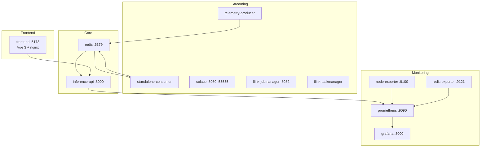

# Project Structure

## Directory Layout

```
Real-Time-Aircraft-Engine-Predictive-Maintenance-System/
│
├── Dataset/                        # Raw C-MAPSS files (read-only reference)
│   ├── train_FD001.txt
│   ├── test_FD001.txt
│   ├── RUL_FD001.txt
│   └── Damage Propagation Modeling.pdf
│
├── docs/                           # This documentation (11 files)
│
├── config/                         # YAML pipeline configs
│   ├── config.yaml                 # Paths and artifact locations
│   ├── features.yaml               # Sensor columns, window size
│   ├── model.yaml                  # GRU hyperparameters (3-layer: 128→64→32)
│   ├── params.yaml                 # Training parameters (epochs, batch size, LR)
│   ├── redis.yaml                  # Redis connection + TTL
│   ├── registor.yaml               # MLflow registry + promotion thresholds
│   ├── schema.yaml                 # Data schema validation
│   └── transform.yaml              # Scaler and transformation config
│
├── src/
│   ├── components/                 # 7-stage ML pipeline components
│   │   ├── data_ingestion.py
│   │   ├── data_validation.py
│   │   ├── data_transformation.py
│   │   ├── feature_engineering.py
│   │   ├── model_training.py
│   │   ├── model_evaluation.py
│   │   └── model_registry.py
│   │
│   ├── pipeline/                   # Pipeline stage orchestrators
│   │   ├── data_ingestion_pipeline.py
│   │   ├── data_validation_pipeline.py
│   │   ├── data_transformation_pipeline.py
│   │   ├── feature_engineering_pipeline.py
│   │   ├── model_trainer_pipeline.py
│   │   ├── model_evaluation_pipeline.py
│   │   └── model_registry_pipeline.py
│   │
│   ├── inference/                  # FastAPI inference service
│   │   ├── app.py                  # FastAPI entry point + middleware
│   │   ├── routes.py               # All REST endpoints incl. pipeline + drift
│   │   ├── ws.py                   # WebSocket endpoints + batch prediction loop
│   │   ├── predictor.py            # MC Dropout inference logic
│   │   ├── preprocessor.py         # Raw sensor → normalized window
│   │   ├── loader.py               # Artifact loading at startup
│   │   ├── buffer.py               # Redis-backed + in-memory push buffer
│   │   ├── feature_store.py        # Redis feature store client
│   │   ├── metrics.py              # Prometheus metric definitions
│   │   └── structured_logger.py    # JSON structured logger
│   │
│   ├── monitoring/
│   │   ├── drift_detector.py       # KS-test drift + Evidently 0.7 HTML reports
│   │   └── drift_monitor.py        # Manual drift monitoring runner
│   │
│   ├── cloud/
│   │   └── s3.py                   # S3 client wrapper
│   │
│   ├── metrics/
│   │   ├── scores.py               # RMSE, NASA score
│   │   └── plot.py                 # Evaluation plots
│   │
│   ├── config/
│   │   └── configuration.py        # Config loader (reads YAML files)
│   │
│   ├── entity/
│   │   └── config_entity.py        # Config + request/response dataclasses
│   │
│   ├── utils/
│   │   ├── common.py               # Helper functions
│   │   ├── mlflow_setup.py         # DagsHub + MLflow initialization
│   │   └── suppress_warnings.py
│   │
│   ├── logging/
│   │   └── logger.py               # Pipeline logger
│   │
│   └── exception/
│       └── exception.py            # CustomException with file + line info
│
├── streaming/
│   ├── producer/
│   │   └── telemetry_producer.py   # Risk-distributed producer · Redis Streams + Solace
│   │
│   ├── pipeline/
│   │   ├── standalone_consumer.py  # Pure Python consumer (default · no Flink needed)
│   │   ├── telemetry_pipeline.py   # PyFlink entry point (cluster mode)
│   │   ├── functions/
│   │   │   ├── normalization.py    # Stateless MinMax per event
│   │   │   └── rolling_window.py   # Per-engine 30-cycle keyed buffer
│   │   └── sinks/
│   │       ├── redis_sink.py       # Writes engine:{id}:features + meta
│   │       └── s3_parquet_sink.py  # Hive-partitioned Parquet flush
│   │
│   ├── model/
│   │   ├── engine_event.py         # EngineEvent dataclass
│   │   └── feature_vector.py       # FeatureVector dataclass + serialization
│   │
│   └── config/
│       └── solace.env              # Solace broker connection config
│
├── frontend/                       # Vue 3 + Vite + TypeScript dashboard
│   └── src/
│       ├── pages/
│       │   ├── FleetPage.vue       # / — Fleet Command Center
│       │   ├── EnginePage.vue      # /engine/:id — Engine Detail
│       │   ├── PipelinePage.vue    # /pipeline — Pipeline Monitor
│       │   ├── MLOpsPage.vue       # /mlops — ML Observability + Retraining
│       │   └── ReplayPage.vue      # /replay — Simulation Lab
│       ├── components/
│       │   ├── ModelArchDiagram.vue  # SVG GRU architecture diagram
│       │   ├── cards/              # StatCard, EngineTable, AlertsPanel
│       │   └── charts/             # RiskDistributionChart, RulBarChart
│       ├── stores/
│       │   ├── engineStore.ts      # Predictions, telemetry, model info
│       │   └── alertStore.ts       # Alert list + acknowledgement
│       ├── composables/
│       │   └── useWebSockets.ts    # Connects all 3 WS streams
│       ├── services/
│       │   ├── api.ts              # Axios REST + pipeline/drift API calls
│       │   └── websocket.ts        # WS factory
│       └── types/
│           └── index.ts            # TypeScript interfaces
│
├── monitoring/
│   ├── prometheus/
│   │   ├── prometheus.yml          # Scrape config (inference-api, node, redis)
│   │   └── alerting_rules.yml      # 5 alert rules
│   └── grafana/
│       ├── dashboards/
│       │   └── aircraft_engine_monitoring.json   # 15+ panel dashboard
│       └── provisioning/           # Auto-provisioning config
│
├── scripts/
│   ├── export_scaler_params.py     # Exports scaler min/max to CSV for streaming consumer
│   ├── install_flink.sh            # PyFlink installation helper
│   └── provision_solace_queues.sh  # Creates Solace queues via SEMP API
│
├── reports/
│   └── drift/                      # Evidently HTML drift reports (mounted into container)
│
├── artifacts/                      # Generated by pipeline (mounted read-write)
│   ├── data_ingestion/data/
│   ├── data_validation/status.json
│   ├── data_transformation/
│   │   ├── processed/
│   │   └── scaler.pkl
│   ├── data_feature_engineering/
│   │   ├── X_train.npy · y_train.npy · X_val.npy · y_val.npy · X_test.npy · y_test.npy
│   │   └── feature_config.json
│   ├── model_trainer/
│   │   ├── model.keras
│   │   └── history.json
│   └── model_evaluation/
│       ├── metrics.json
│       ├── confusion_matrix.png
│       ├── pred_vs_true.png
│       └── error_distribution.png
│
├── logs/                           # Pipeline + inference logs (mounted into container)
├── main.py                         # 7-stage ML pipeline runner
├── app.py                          # Uvicorn entry point
├── Dockerfile                      # Inference API image (Python 3.12-slim)
├── Dockerfile.streaming            # Producer + consumer image
├── Dockerfile.frontend             # Vue build + nginx image
├── nginx.conf                      # Reverse proxy (API + WS + drift + pipeline routes)
├── docker-compose.yml              # Full 13-service stack
├── pyproject.toml                  # uv dependency management
└── .env                            # AWS, DagsHub, MLflow credentials
```

---

## 7-Stage ML Pipeline

```mermaid
flowchart LR
    S1["1\nData Ingestion\nS3 Bronze → local"] -->
    S2["2\nData Validation\nSchema checks"] -->
    S3["3\nData Transformation\nParquet + scaler.pkl"] -->
    S4["4\nFeature Engineering\n30×11 NumPy sequences"] -->
    S5["5\nModel Training\n3-layer GRU + MLflow"] -->
    S6["6\nModel Evaluation\nRMSE · NASA · F1"] -->
    S7["7\nModel Registry\nMLflow + S3 upload"]

    style S1 fill:#1e3a5f,color:#fff,stroke:#00d9ff
    style S2 fill:#1e3a5f,color:#fff,stroke:#00d9ff
    style S3 fill:#1e3a5f,color:#fff,stroke:#00d9ff
    style S4 fill:#1e3a5f,color:#fff,stroke:#00d9ff
    style S5 fill:#1e3a5f,color:#fff,stroke:#00d9ff
    style S6 fill:#1e3a5f,color:#fff,stroke:#00d9ff
    style S7 fill:#1e3a5f,color:#fff,stroke:#00d9ff
```



---

## Docker Stack



| Service | Image | Port |
|---------|-------|------|
| `inference-api` | Custom (Dockerfile) | 8000 |
| `redis` | redis:7-alpine | 6379 |
| `solace` | solace/solace-pubsub-standard | 8080, 55555 |
| `flink-jobmanager` | flink:2.0 | 8082 |
| `flink-taskmanager` | flink:2.0 | — |
| `telemetry-producer` | Custom (Dockerfile.streaming) | — |
| `standalone-consumer` | Custom (Dockerfile.streaming) | — |
| `node-exporter` | prom/node-exporter | 9100 |
| `redis-exporter` | oliver006/redis_exporter | 9121 |
| `prometheus` | prom/prometheus | 9090 |
| `grafana` | grafana/grafana | 3000 |
| `frontend` | Custom (Dockerfile.frontend) | 5173 |

---

## Key Design Decisions

| Decision | Choice | Reason |
|----------|--------|--------|
| Model architecture | 3-layer GRU (128→64→32) | Third layer adds compression before dense head |
| Confidence estimation | MC Dropout (30 passes) | Uncertainty without separate ensemble |
| RUL clip | 125 cycles | Standard in literature, focuses on degradation window |
| Window size | 30 cycles | Balances temporal context vs. noise |
| Stream transport | Redis Streams (default) | No external broker needed in Docker stack |
| Event broker | Solace PubSub+ (optional) | Multi-protocol, no ZooKeeper, hardware routing |
| Online feature store | Redis | Sub-millisecond reads, TTL-based expiry |
| Offline store | S3 Parquet (Hive-partitioned) | Columnar, efficient for batch retraining reads |
| Model registry | MLflow + DagsHub | Open source, remote tracking, versioning |
| `critical_engines_total` | Gauge (not Counter) | Reflects current snapshot, not running total |
| Producer throttle | Once per round (not per engine) | All 100 engines fill windows quickly on startup |
| Dependency management | uv | Fast, modern Python package manager |

---

## Environment Setup

```bash
# Install dependencies
uv sync

# Configure credentials in .env
AWS_ACCESS_KEY_ID=...
AWS_SECRET_ACCESS_KEY=...
AWS_DEFAULT_REGION=us-east-1
AWS_S3_BUCKET=aircraft-engine-data
DAGSHUB_TOKEN=...
MLFLOW_TRACKING_URI=https://dagshub.com/...

# Run pipeline locally
python main.py

# Or trigger from dashboard
curl -X POST http://localhost:8000/pipeline/run
```
