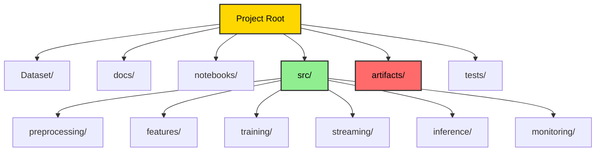
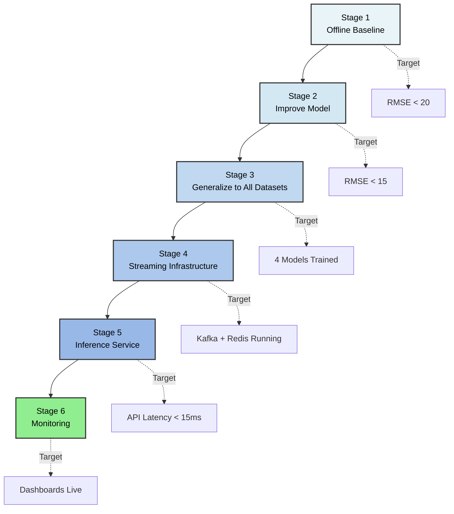

# Project Structure and Build Order

## Recommended Directory Layout



```
Real-Time-Aircraft-Engine-Predictive-Maintenance-System/
│
├── Dataset/                        # Raw C-MAPSS files (read-only)
│   ├── train_FD001.txt
│   ├── test_FD001.txt
│   ├── RUL_FD001.txt
│   └── ...
│
├── docs/                           # This documentation
│   ├── 01_dataset.md
│   ├── 02_preprocessing.md
│   ├── 03_feature_engineering.md
│   ├── 04_model_training.md
│   ├── 05_inference_service.md
│   ├── 06_streaming_pipeline.md
│   ├── 07_monitoring.md
│   └── 08_project_structure.md
│
├── notebooks/                      # Exploratory analysis
│   ├── 01_eda.ipynb
│   ├── 02_feature_analysis.ipynb
│   └── 03_model_experiments.ipynb
│
├── src/
│   ├── preprocessing/
│   │   ├── __init__.py
│   │   ├── loader.py               # load_data()
│   │   ├── cleaner.py              # drop sensors, clip RUL
│   │   └── normalizer.py           # scalers, condition clustering
│   │
│   ├── features/
│   │   ├── __init__.py
│   │   ├── rolling.py              # rolling mean/std/slope
│   │   ├── deviation.py            # baseline deviation features
│   │   └── sequences.py            # sliding window builder for LSTM
│   │
│   ├── training/
│   │   ├── __init__.py
│   │   ├── train_xgboost.py
│   │   ├── train_lstm.py
│   │   └── evaluate.py             # rmse, nasa_score
│   │
│   ├── streaming/
│   │   ├── __init__.py
│   │   ├── producer.py             # Kafka CSV simulator
│   │   └── feature_consumer.py     # Kafka → Redis feature writer
│   │
│   ├── inference/
│   │   ├── __init__.py
│   │   ├── app.py                  # FastAPI application
│   │   ├── predictor.py            # model loading and prediction logic
│   │   └── feature_store.py        # Redis read/write helpers
│   │
│   └── monitoring/
│       ├── __init__.py
│       ├── metrics.py              # Prometheus metrics definitions
│       └── drift_detector.py       # Evidently drift reports
│
├── artifacts/                      # Saved models and scalers (gitignored)
│   ├── scaler_FD001.pkl
│   ├── feature_cols.json
│   └── model_FD001/
│
├── tests/
│   ├── test_preprocessing.py
│   ├── test_features.py
│   └── test_inference.py
│
├── docker-compose.yml
├── requirements.txt
└── README.md
```

---

## Build Order

Follow this sequence. Each stage validates the previous one before adding complexity.



### Stage 1 — Offline Baseline (No Streaming)

Goal: Prove the model works on FD001 before touching infrastructure.

1. Load `train_FD001.txt` and `test_FD001.txt`
2. Drop constant sensors, compute RUL, clip at 125
3. Normalize with MinMaxScaler
4. Add rolling mean/std features (windows 10, 20, 30)
5. Train XGBoost regressor
6. Evaluate on test set using `RUL_FD001.txt` ground truth
7. Target: RMSE < 20 cycles

Deliverable: working notebook in `notebooks/03_model_experiments.ipynb`

---

### Stage 2 — Improve Model Quality

Goal: Push RMSE below 15 cycles.

1. Add degradation slope features
2. Add cumulative deviation from baseline
3. Tune XGBoost with Optuna (50 trials)
4. Try LightGBM, compare RMSE
5. Implement LSTM with 30-cycle window
6. Log all runs to MLflow
7. Register best model in MLflow Model Registry

Deliverable: MLflow experiment with tracked runs, best model in registry

---

### Stage 3 — Generalize to All Datasets

Goal: Model works on FD002, FD003, FD004.

1. Add operating condition clustering for FD002/FD004
2. Per-condition normalization
3. Retrain and evaluate on all 4 datasets
4. Document RMSE per dataset

Deliverable: 4 trained models (one per dataset) in MLflow registry

---

### Stage 4 — Streaming Infrastructure

Goal: Kafka + Redis pipeline running locally.

1. Start Kafka and Redis via docker-compose
2. Implement and test `producer.py` — verify events appear in topic
3. Implement `feature_consumer.py` — verify features written to Redis
4. Verify feature values match offline-computed features for same engine/cycle

Deliverable: `docker-compose up` starts full pipeline, features visible in Redis

---

### Stage 5 — Inference Service

Goal: REST API serving predictions from Redis features.

1. Implement FastAPI app with `/predict` endpoint
2. Load model from MLflow registry
3. Test with curl against Redis-populated features
4. Add `/health` and `/engines/{id}/history` endpoints
5. Containerize with Docker

Deliverable: `POST /predict` returns RUL and risk in < 15ms

---

### Stage 6 — Monitoring

Goal: Visibility into system and model health.

1. Add Prometheus metrics to inference service
2. Set up Grafana with fleet overview dashboard
3. Implement Evidently drift detection job
4. Configure alerting rules for critical engines

Deliverable: Grafana dashboard showing live predictions and risk levels

---

## Dependencies

```
# requirements.txt
pandas>=2.0
numpy>=1.24
scikit-learn>=1.3
xgboost>=2.0
lightgbm>=4.0
torch>=2.0
optuna>=3.0
mlflow>=2.8
fastapi>=0.104
uvicorn>=0.24
pydantic>=2.0
confluent-kafka>=2.3
redis>=5.0
evidently>=0.4
prometheus-client>=0.19
pyarrow>=14.0
joblib>=1.3
```

---

## Environment Setup

```bash
python -m venv .venv
source .venv/bin/activate
pip install -r requirements.txt

# Start infrastructure
docker-compose up -d kafka redis mlflow

# Run offline training (Stage 1)
python src/training/train_xgboost.py --dataset FD001

# Start streaming pipeline (Stage 4+)
python src/streaming/producer.py --dataset Dataset/train_FD001.txt &
python src/streaming/feature_consumer.py &

# Start inference service (Stage 5+)
uvicorn src.inference.app:app --reload --port 8000
```

---

## Key Design Decisions

| Decision | Choice | Reason |
|----------|--------|--------|
| Start dataset | FD001 | Simplest: 1 condition, 1 fault mode |
| Baseline model | XGBoost | Fast iteration, interpretable, strong baseline |
| RUL clip | 125 cycles | Standard in literature, focuses model on degradation window |
| Window size | 30 cycles | Captures ~15% of average engine life; balances context vs. noise |
| Feature store | Redis | Sub-millisecond reads, simple key-value interface |
| Offline store | Parquet on S3 | Columnar format, cheap storage, compatible with pandas/spark |
| Model registry | MLflow | Open source, integrates with training code, supports staging/production |
| Normalization split | Per-condition for FD002/FD004 | Global normalization fails with 6 operating conditions |
