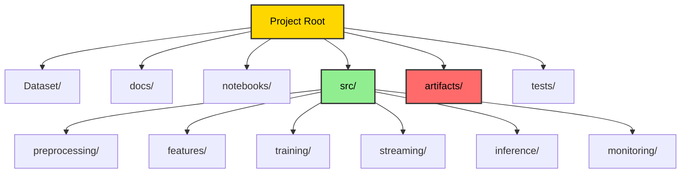
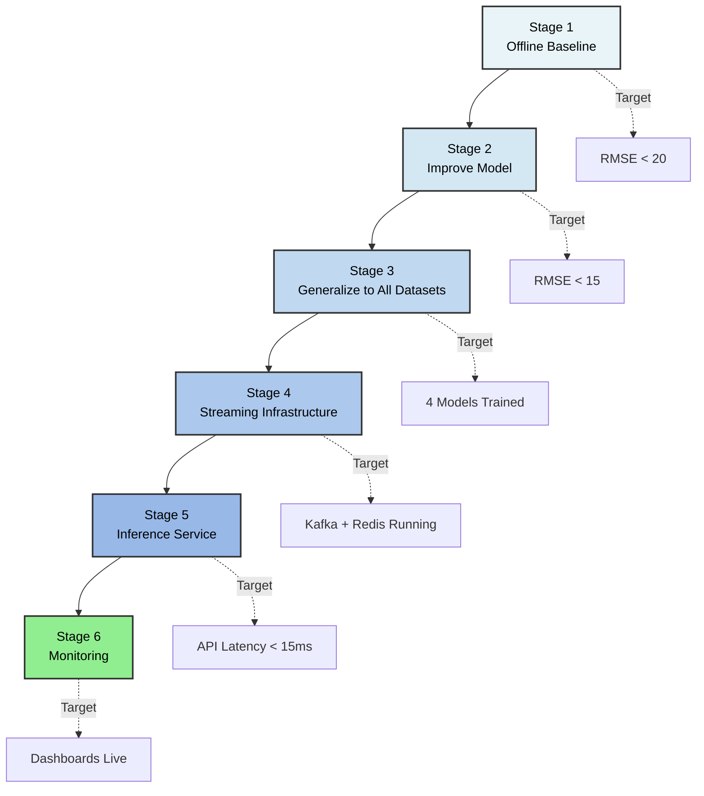

# Project Structure and Build Order

## Recommended Directory Layout



```
Real-Time-Aircraft-Engine-Predictive-Maintenance-System/
│
├── Dataset/                        # Raw C-MAPSS files (read-only)
│   ├── train_FD001.txt
│   ├── test_FD001.txt
│   ├── RUL_FD001.txt
│   ├── readme.txt
│   └── Damage Propagation Modeling.pdf
│
├── docs/                           # This documentation
│   ├── 00_index.md
│   ├── 01_dataset.md
│   ├── 02_preprocessing.md
│   ├── 03_feature_engineering.md
│   ├── 04_model_training.md
│   ├── 05_inference_service.md
│   ├── 06_streaming_pipeline.md
│   ├── 07_monitoring.md
│   ├── 08_project_structure.md
│   └── 09_architecture.md
│
├── notebook/                       # Exploratory analysis
│   └── test-rul.ipynb
│
├── config/                         # Configuration files
│   ├── config.yaml                 # Main pipeline config
│   ├── features.yaml               # Feature engineering params
│   ├── model.yaml                  # Model hyperparameters
│   ├── params.yaml                 # Training parameters
│   ├── schema.yaml                 # Data schema
│   └── transform.yaml              # Transformation config
│
├── src/
│   ├── components/                 # Core pipeline components
│   │   ├── __init__.py
│   │   ├── data_ingestion.py       # S3 data download
│   │   ├── data_validation.py      # Schema validation
│   │   ├── data_transformation.py  # Preprocessing & scaling
│   │   ├── feature_engineering.py  # Sequence building
│   │   ├── model_training.py       # GRU model training
│   │   └── model_evaluation.py     # Metrics & plots
│   │
│   ├── pipeline/                   # Pipeline orchestration
│   │   ├── __init__.py
│   │   ├── data_ingestion_pipeline.py
│   │   ├── data_validation_pipeline.py
│   │   ├── data_transformation_pipeline.py
│   │   ├── feature_engineering_pipeline.py
│   │   ├── model_trainer_pipeline.py
│   │   └── model_evaluation_pipeline.py
│   │
│   ├── config/
│   │   ├── __init__.py
│   │   └── configuration.py         # Config loader
│   │
│   ├── entity/
│   │   ├── __init__.py
│   │   └── config_entity.py        # Config dataclasses
│   │
│   ├── cloud/
│   │   ├── __init__.py
│   │   └── s3.py                   # S3 client wrapper
│   │
│   ├── metrics/
│   │   ├── __init__.py
│   │   ├── scores.py               # RMSE, NASA score
│   │   └── plot.py                 # Visualization
│   │
│   ├── utils/
│   │   ├── common.py               # Helper functions
│   │   └── mlflow_setup.py         # MLflow configuration
│   │
│   ├── logging/
│   │   ├── __init__.py
│   │   └── logger.py               # Structured logging
│   │
│   ├── exception/
│   │   ├── __init__.py
│   │   └── exception.py            # Custom exceptions
│   │
│   ├── constants/
│   │   └── __init__.py             # Global constants
│   │
│   ├── features/
│   │   └── __init__.py
│   │
│   └── __init__.py
│
├── artifacts/                      # Generated artifacts (gitignored)
│   ├── data_ingestion/
│   │   └── data/                   # Downloaded raw data
│   ├── data_validation/
│   │   └── status.json
│   ├── data_transformation/
│   │   ├── processed/              # Parquet files
│   │   └── scaler.pkl
│   ├── data_feature_engineering/
│   │   ├── X_train.npy
│   │   ├── y_train.npy
│   │   ├── X_val.npy
│   │   ├── y_val.npy
│   │   ├── X_test.npy
│   │   ├── y_test.npy
│   │   └── feature_config.json
│   ├── model_trainer/
│   │   ├── model.keras
│   │   └── history.json
│   ├── model_evaluation/
│   │   ├── metrics.json
│   │   ├── results.parquet
│   │   ├── confusion_matrix.png
│   │   ├── pred_vs_true.png
│   │   └── error_distribution.png
│   ├── config.json
│   ├── model.keras
│   └── scaler.pkl
│
├── assets/                         # Documentation images
│   ├── EDA.png
│   ├── eval.png
│   ├── eval2.png
│   ├── model.png
│   └── train-curve.png
│
├── logs/                           # Execution logs
│
├── main.py                         # Main pipeline runner
├── pyproject.toml                  # Project metadata
├── uv.lock                         # Dependency lock file
├── .env                            # Environment variables
├── .gitignore
├── .python-version
└── README.md
```

---

## Build Order

Follow this sequence. Each stage validates the previous one before adding complexity.



### Stage 1 — Offline Baseline (No Streaming)

Goal: Prove the model works on FD001 before touching infrastructure.

1. Load `train_FD001.txt` and `test_FD001.txt`
2. Drop constant sensors, compute RUL, clip at 125
3. Normalize with MinMaxScaler
4. Add rolling mean/std features (windows 10, 20, 30)
5. Train XGBoost regressor
6. Evaluate on test set using `RUL_FD001.txt` ground truth
7. Target: RMSE < 20 cycles

Deliverable: working notebook in `notebooks/03_model_experiments.ipynb`

---

### Stage 2 — Improve Model Quality

Goal: Push RMSE below 15 cycles.

1. Add degradation slope features
2. Add cumulative deviation from baseline
3. Tune XGBoost with Optuna (50 trials)
4. Try LightGBM, compare RMSE
5. Implement LSTM with 30-cycle window
6. Log all runs to MLflow
7. Register best model in MLflow Model Registry

Deliverable: MLflow experiment with tracked runs, best model in registry

---

### Stage 3 — Generalize to All Datasets

Goal: Model works on FD002, FD003, FD004.

1. Add operating condition clustering for FD002/FD004
2. Per-condition normalization
3. Retrain and evaluate on all 4 datasets
4. Document RMSE per dataset

Deliverable: 4 trained models (one per dataset) in MLflow registry

---

### Stage 4 — Streaming Infrastructure

Goal: Kafka + Redis pipeline running locally.

1. Start Kafka and Redis via docker-compose
2. Implement and test `producer.py` — verify events appear in topic
3. Implement `feature_consumer.py` — verify features written to Redis
4. Verify feature values match offline-computed features for same engine/cycle

Deliverable: `docker-compose up` starts full pipeline, features visible in Redis

---

### Stage 5 — Inference Service

Goal: REST API serving predictions from Redis features.

1. Implement FastAPI app with `/predict` endpoint
2. Load model from MLflow registry
3. Test with curl against Redis-populated features
4. Add `/health` and `/engines/{id}/history` endpoints
5. Containerize with Docker

Deliverable: `POST /predict` returns RUL and risk in < 15ms

---

### Stage 6 — Monitoring

Goal: Visibility into system and model health.

1. Add Prometheus metrics to inference service
2. Set up Grafana with fleet overview dashboard
3. Implement Evidently drift detection job
4. Configure alerting rules for critical engines

Deliverable: Grafana dashboard showing live predictions and risk levels

---

## Dependencies

Project uses `uv` for dependency management. Key dependencies:

```
pandas>=2.0
numpy>=1.24
scikit-learn>=1.3
tensorflow>=2.15
mlflow>=2.8
boto3>=1.34
pyarrow>=14.0
joblib>=1.3
matplotlib>=3.8
seaborn>=0.13
```

For streaming (future):
```
fastapi>=0.104
uvicorn>=0.24
confluent-kafka>=2.3
redis>=5.0
evidently>=0.4
prometheus-client>=0.19
```

---

## Environment Setup

```bash
# Install uv (if not already installed)
curl -LsSf https://astral.sh/uv/install.sh | sh

# Install dependencies
uv sync

# Configure AWS credentials
aws configure
# OR set environment variables in .env:
# AWS_ACCESS_KEY_ID=your_key
# AWS_SECRET_ACCESS_KEY=your_secret
# AWS_DEFAULT_REGION=us-east-1

# Run the complete pipeline
python main.py
```

## Pipeline Execution

The `main.py` orchestrates all stages:

1. **Data Ingestion** - Downloads from S3
2. **Data Validation** - Schema checks
3. **Data Transformation** - Preprocessing & scaling
4. **Feature Engineering** - Sequence building
5. **Model Training** - GRU training (commented out in main.py)
6. **Model Evaluation** - Metrics & visualization

---

## Key Design Decisions

| Decision | Choice | Reason |
|----------|--------|--------|
| Start dataset | FD001 | Simplest: 1 condition, 1 fault mode |
| Model architecture | GRU (RNN) | Handles temporal sequences, lighter than LSTM |
| RUL clip | 125 cycles | Standard in literature, focuses model on degradation window |
| Window size | 30 cycles | Captures ~15% of average engine life; balances context vs. noise |
| Data storage | S3 (Bronze/Silver/Gold) | Medallion architecture for data lake |
| Offline store | Parquet | Columnar format, efficient for ML workloads |
| Model registry | MLflow | Open source, integrates with training code |
| Normalization | MinMaxScaler | Scales to [0,1], works well with sigmoid output |
| Loss function | MSE | Standard for regression, normalized RUL target |
| Dependency management | uv | Fast, modern Python package manager |
