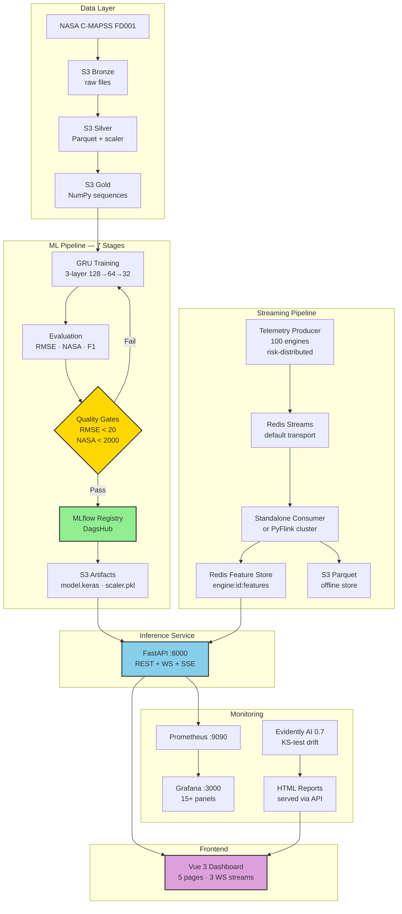
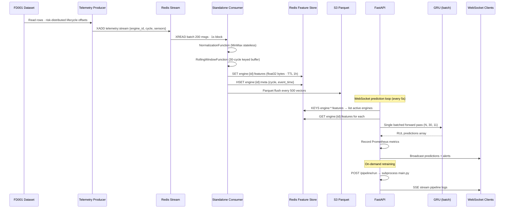
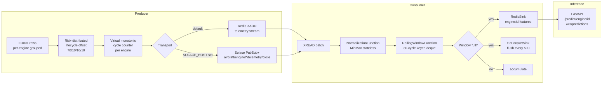
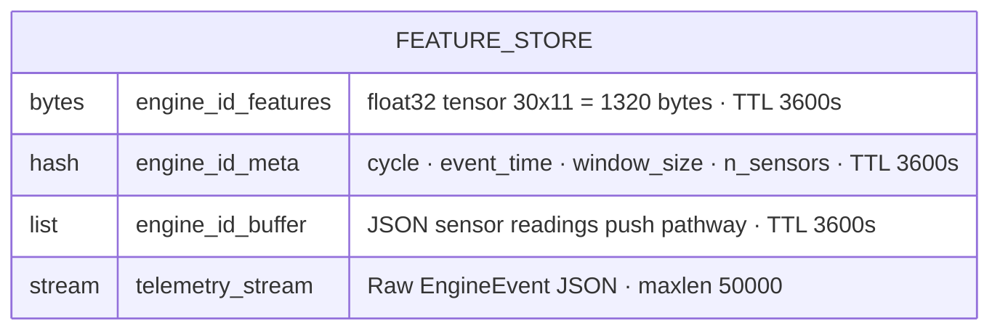
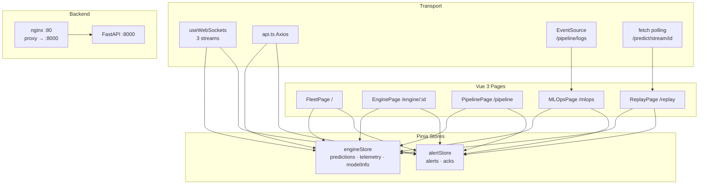
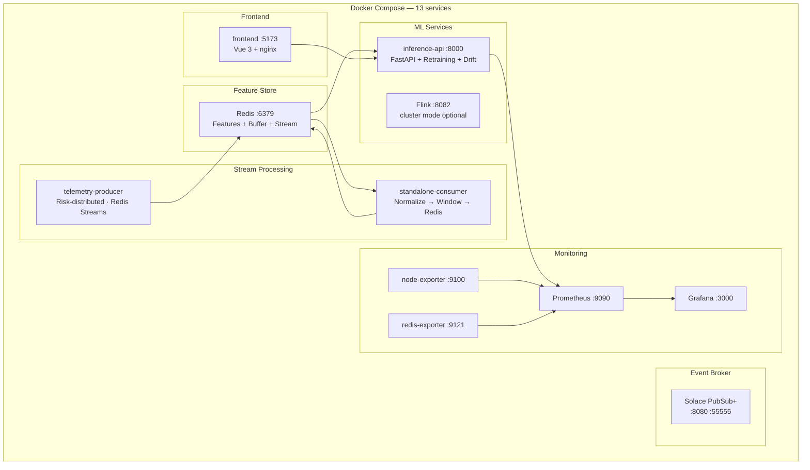
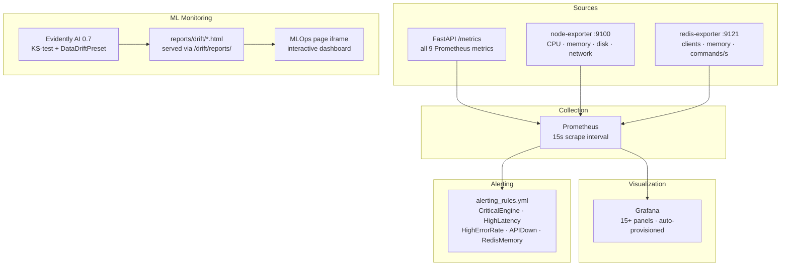

# System Architecture

## High-Level Architecture



---

## Data Flow



---

## Streaming Pipeline Detail



---

## Inference Service Architecture

```mermaid
flowchart TB
    subgraph Pathways["Prediction Pathways"]
        A[POST /predict\nnormalized 30×11] --> D
        B[POST /predict/raw\nraw sensor dicts] --> E[InferencePreprocessor\nscaler.transform] --> D
        C[GET /predict/engine/id\nRedis feature store] --> D
        F[POST /push → buffer\nGET /predict/stream/id] --> D
        D[GRU Model\nbatch forward pass\ntraining=False]
    end

    subgraph WS["WebSocket Streams"]
        G[/ws/predictions\n5s · all Redis engines\nbatched inference]
        H[/ws/telemetry\n2s · engine metadata]
        I[/ws/alerts\n5s · HIGH+CRITICAL only]
    end

    subgraph Retrain["Pipeline Retraining"]
        J[POST /pipeline/run\nnon-blocking subprocess]
        K[GET /pipeline/status\nidle/running/success/failed]
        L[GET /pipeline/logs\nSSE line stream]
    end

    D --> G & I
    G --> PROM[Prometheus metrics\nactive_engines · requests\nlatency · critical_gauge]
```

---

## Redis Key Schema



---

## Frontend Architecture



---

## Deployment Architecture



---

## Monitoring Architecture


