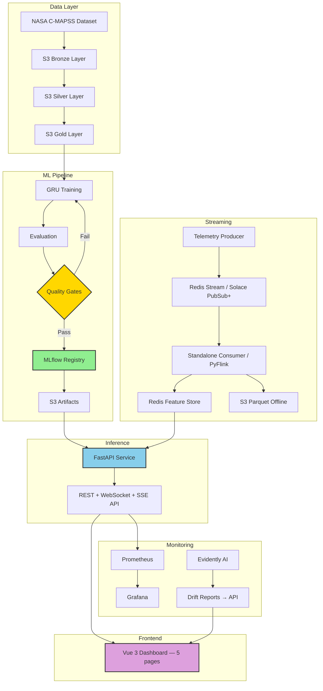
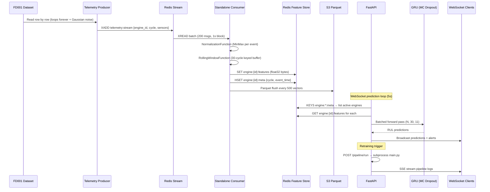
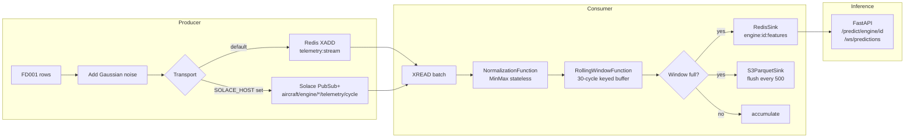
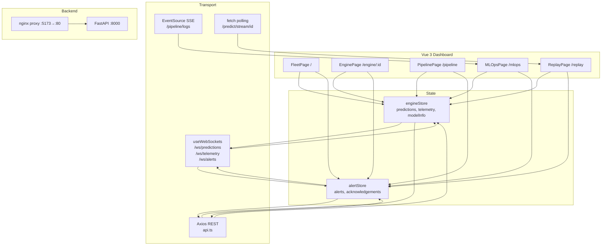
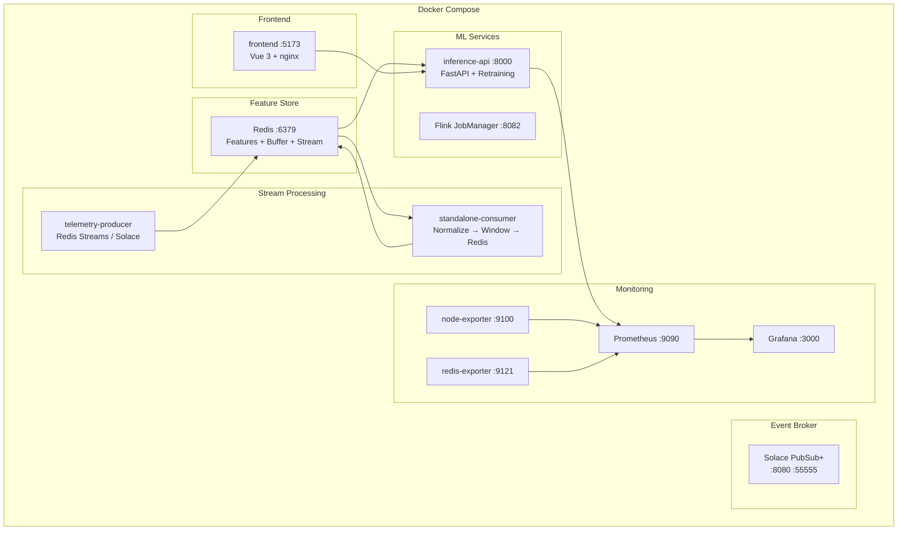
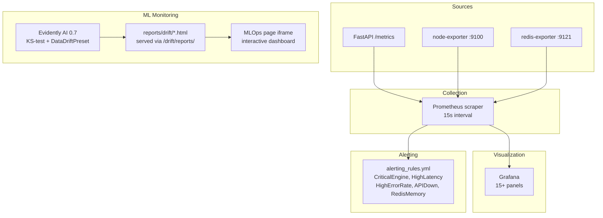

# System Architecture

## High-Level Architecture



---

## Data Flow Architecture



---

## Streaming Pipeline Detail



**Standalone consumer** (`streaming/pipeline/standalone_consumer.py`) — pure Python, no Flink cluster needed. Default mode.

**PyFlink pipeline** (`streaming/pipeline/telemetry_pipeline.py`) — cluster mode with exactly-once checkpointing, RocksDB state backend, Solace JCSMP connector.

---

## Inference Service Architecture

```mermaid
flowchart TB
    subgraph Prediction Pathways
        A[POST /predict\nnormalized 30×11 array] --> D
        B[POST /predict/raw\nraw sensor dicts] --> E[InferencePreprocessor\nscaler.transform] --> D
        C[GET /predict/engine/id\nRedis feature store] --> D
        F[POST /push → buffer\nGET /predict/stream/id] --> D
        D[MC Dropout\n30 forward passes\nmean + confidence]
    end

    subgraph WebSocket Streams
        G[/ws/predictions\n5s — all Redis engines]
        H[/ws/telemetry\n2s — engine metadata]
        I[/ws/alerts\n5s — HIGH+CRITICAL only]
    end

    subgraph Pipeline Retraining
        J[POST /pipeline/run\nnon-blocking subprocess]
        K[GET /pipeline/status\nidle/running/success/failed]
        L[GET /pipeline/logs\nSSE line stream]
    end

    subgraph Drift Reports
        M[GET /drift/reports\nlist HTML files]
        N[GET /drift/reports/filename\nserve HTML]
    end

    D --> G
    D --> I
```

---

## Redis Key Schema

```
engine:{id}:features   bytes     float32 tensor (30×11 = 1320 bytes)   TTL 3600s
engine:{id}:meta       hash      {cycle, event_time, window_size}       TTL 3600s
engine:{id}:buffer     list      JSON sensor readings (push pathway)    TTL 3600s
telemetry:stream       stream    Raw EngineEvent JSON (maxlen 50000)
```

---

## Frontend Architecture



---

## Deployment Architecture



---

## Monitoring Architecture


