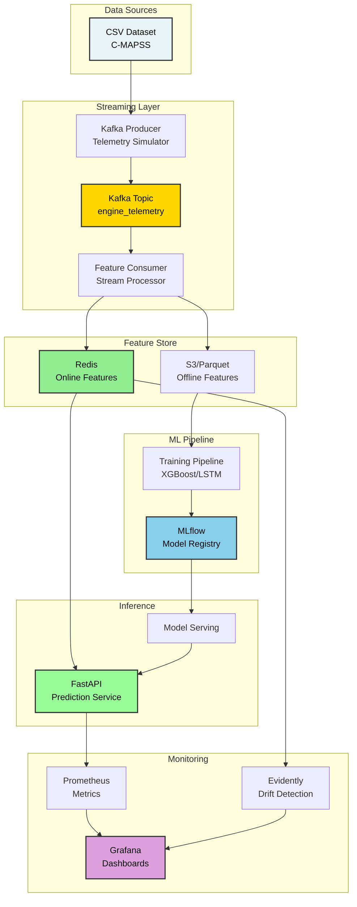
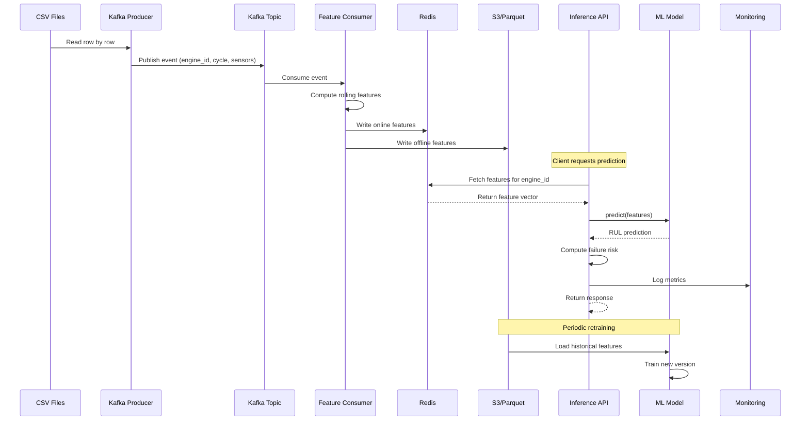
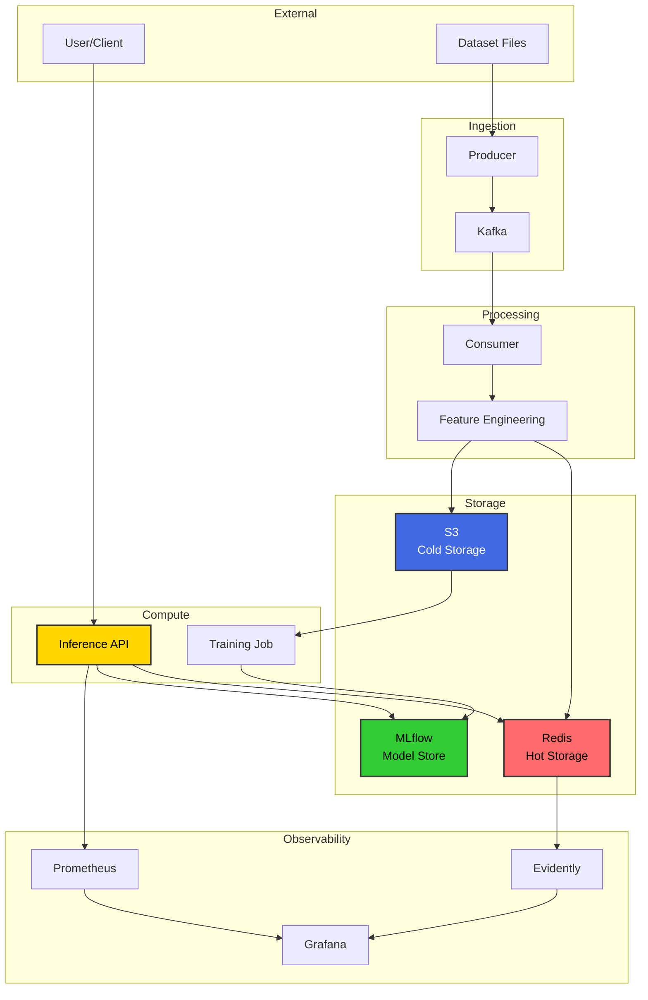
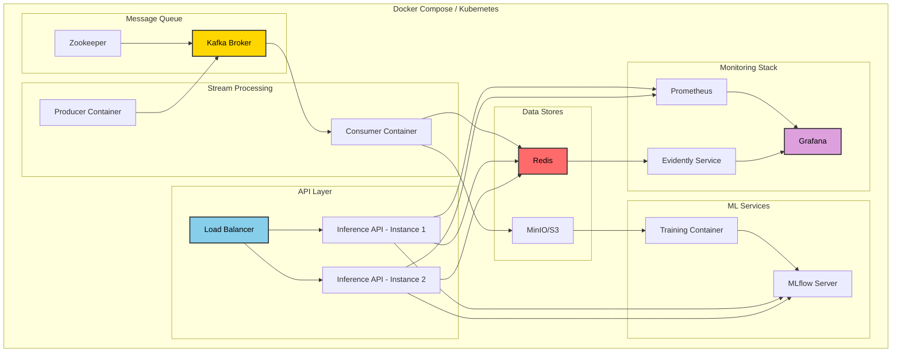
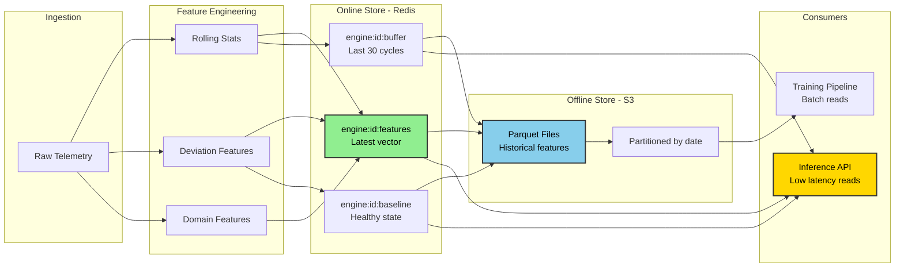
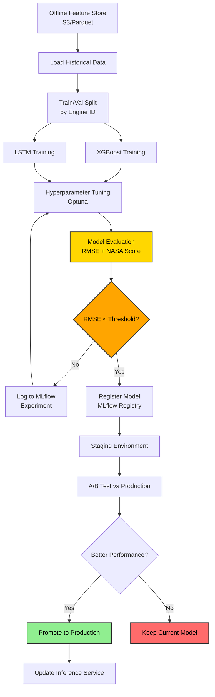
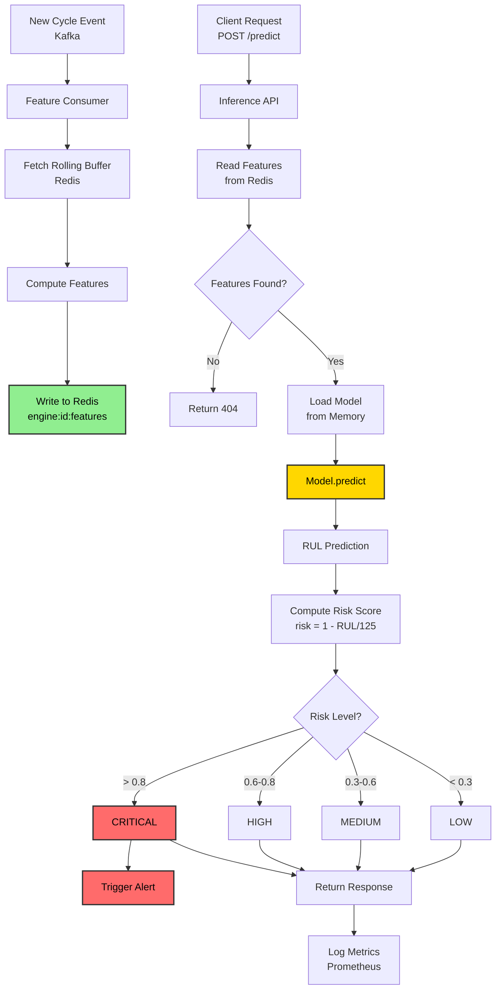
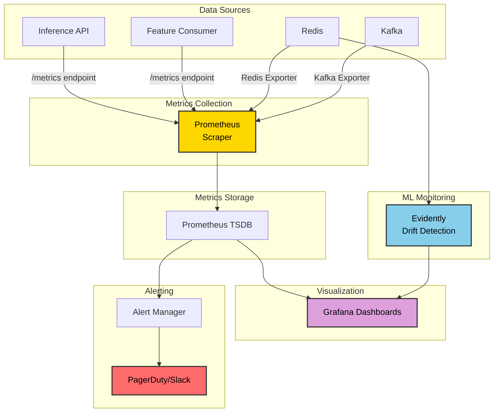

# System Architecture

## High-Level Architecture

---

## Data Flow Architecture

---

## Component Interaction Map

---

## Deployment Architecture

---

## Feature Store Architecture

---

## Model Training Pipeline

---

## Real-Time Inference Flow

---

## Monitoring Architecture

