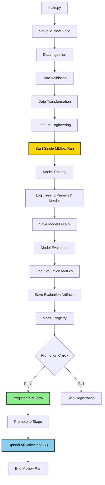

# MLflow and Model Registry Fixes

## Issues Fixed

### 1. **Two Separate MLflow Experiments**
**Problem**: Training and Evaluation were creating separate MLflow runs, resulting in fragmented experiment tracking.

**Solution**: 
- Wrapped Training, Evaluation, and Registry stages in a **single MLflow run** in `main.py`
- Removed `mlflow.start_run()` from individual components
- All metrics, parameters, and artifacts now logged to one unified experiment

### 2. **S3 Upload in Wrong Component**
**Problem**: Model and artifacts were being uploaded to S3 in the Training component, which violates separation of concerns.

**Solution**:
- **Removed** S3 upload logic from `model_training.py`
- **Removed** S3 upload logic from `model_evaluation.py`
- **Added** all S3 upload logic to `model_registry.py`
- Model Registry now handles all artifact uploads after promotion

### 3. **Model Logging Duplication**
**Problem**: Model was being logged to MLflow in both Evaluation and Registry components.

**Solution**:
- **Removed** `mlflow.tensorflow.log_model()` from `model_evaluation.py`
- **Kept** model logging only in `model_registry.py`
- Model is now registered to MLflow Model Registry only once

---

## Updated Architecture



---

## Component Responsibilities

### `model_training.py`
**Responsibilities**:
- Load training data
- Build and compile GRU model
- Train model with callbacks
- **Log training parameters to MLflow** (within existing run)
- **Log training metrics to MLflow** (within existing run)
- **Log training artifacts to MLflow** (history.json, training curves)
- **Save model locally** to `artifacts/model_trainer/model.keras`

**Does NOT**:
- ❌ Start MLflow run
- ❌ Upload to S3
- ❌ Register model

---

### `model_evaluation.py`
**Responsibilities**:
- Load trained model
- Generate predictions on test set
- Compute evaluation metrics (RMSE, NASA score, classification metrics)
- **Log evaluation metrics to MLflow** (within existing run)
- **Log evaluation artifacts to MLflow** (plots, results)
- **Save metrics locally** to `artifacts/model_evaluation/metrics.json`

**Does NOT**:
- ❌ Start MLflow run
- ❌ Upload to S3
- ❌ Log model to MLflow
- ❌ Register model

---

### `model_registry.py`
**Responsibilities**:
- Load evaluation metrics
- Check promotion thresholds (RMSE, NASA score)
- **Register model to MLflow Model Registry** (if passed)
- **Promote model to stage** (Staging/Production)
- **Upload ALL artifacts to S3**:
  - Model file (`model.keras`)
  - Training history (`history.json`)
  - Evaluation metrics (`metrics.json`)
  - Evaluation results (`results.parquet`)
  - Evaluation plots (confusion matrix, pred vs true, error distribution)

**Does NOT**:
- ❌ Start MLflow run (uses existing run from main.py)
- ❌ Train model
- ❌ Evaluate model

---

## MLflow Experiment Structure

### Single Run Contains:

```
Run: aircraft-engine-rul-pipeline
│
├── Parameters (from Training)
│   ├── epochs: 100
│   ├── batch_size: 256
│   ├── learning_rate: 0.001
│   ├── gru_units: [128, 64]
│   ├── dense_units: [32, 16]
│   ├── dropout_rates: [0.3, 0.3]
│   ├── l2_regularization: 0.001
│   ├── window_size: 30
│   └── n_features: 11
│
├── Metrics (from Training)
│   ├── train_loss: 0.0234
│   ├── train_rmse: 15.32
│   ├── val_loss: 0.0256
│   └── val_rmse: 16.01
│
├── Metrics (from Evaluation)
│   ├── test_rmse: 16.45
│   ├── test_nasa_score: 1234.56
│   ├── precision_critical: 0.85
│   ├── recall_critical: 0.78
│   └── f1_critical: 0.81
│
├── Artifacts (from Training)
│   └── training/
│       ├── history.json
│       └── training_curves.png
│
├── Artifacts (from Evaluation)
│   └── evaluation/
│       ├── metrics.json
│       ├── results.parquet
│       ├── confusion_matrix.png
│       ├── pred_vs_true.png
│       └── error_distribution.png
│
└── Model (from Registry)
    └── model/
        └── Registered to MLflow Model Registry
```

---

## S3 Upload Structure

All uploads happen in `model_registry.py` after promotion:

```
s3://aircraft-engine-data/artifacts/
├── model.keras                    # Trained model
├── history.json                   # Training history
├── metrics.json                   # Evaluation metrics
├── results.parquet                # Prediction results
├── confusion_matrix.png           # Confusion matrix plot
├── pred_vs_true.png              # Prediction vs true plot
└── error_distribution.png        # Error distribution plot
```

---

## Code Changes Summary

### `main.py`
```python
# NEW: Single MLflow run for training, evaluation, and registry
with mlflow.start_run(run_name="aircraft-engine-rul-pipeline"):
    # Training
    obj = ModelTrainingPipeline()
    obj.initiate_model_training()
    
    # Evaluation
    obj = ModelEvaluationPipeline()
    obj.initiate_model_evaluation()
    
    # Registry
    obj = ModelRegistryPipeline()
    obj.initiate_model_registry()
```

### `model_training.py`
```python
# REMOVED: mlflow.start_run()
# REMOVED: S3 upload logic
# KEPT: mlflow.log_params(), mlflow.log_metrics(), mlflow.log_artifact()
```

### `model_evaluation.py`
```python
# REMOVED: mlflow.start_run()
# REMOVED: mlflow.tensorflow.log_model()
# REMOVED: S3 upload logic
# KEPT: mlflow.log_metrics(), mlflow.log_artifact()
```

### `model_registry.py`
```python
# ADDED: mlflow.tensorflow.log_model() with signature
# ADDED: mlflow.register_model()
# ADDED: S3 upload for all artifacts
# REMOVED: mlflow.start_run() (uses existing run)
```

---

## Configuration Updates

### `config.yaml`
```yaml
model_registry:
  root_dir: artifacts/model_registry
  model_path: artifacts/model_trainer/model.keras
  gold_dir: artifacts/data_feature_engineering  # NEW
  metrics_path: artifacts/model_evaluation/metrics.json
  s3_artifact_prefix: artifacts/  # NEW
```

### `config_entity.py`
```python
@dataclass
class ModelRegistryConfig:
    root_dir: Path
    model_path: Path
    gold_dir: Path  # NEW - for loading test data
    metrics_path: Path
    registered_model_name: str
    rmse_threshold: float
    nasa_threshold: float
    stage: str
    s3_bucket: str  # NEW
    s3_artifact_prefix: str  # NEW
```

---

## Benefits of This Architecture

### ✅ **Single Source of Truth**
- One MLflow run contains all training, evaluation, and registry information
- Easy to compare experiments
- Clear lineage from training to deployment

### ✅ **Separation of Concerns**
- Training: Trains model, logs training metrics
- Evaluation: Evaluates model, logs evaluation metrics
- Registry: Registers model, uploads to S3

### ✅ **Proper Model Lifecycle**
- Model is only registered if it passes promotion thresholds
- S3 upload happens only after successful registration
- Clear promotion path: None → Staging → Production

### ✅ **No Duplication**
- Model logged to MLflow only once
- Artifacts uploaded to S3 only once
- Metrics logged in appropriate stages

---

## Testing the Fixed Pipeline

```bash
# Run the complete pipeline
python main.py
```

### Expected MLflow Output:
```
Experiment: aircraft-engine-rul
├── Run: aircraft-engine-rul-pipeline
    ├── Status: FINISHED
    ├── Parameters: 9 params (training config)
    ├── Metrics: 8 metrics (training + evaluation)
    ├── Artifacts: 7 files (training + evaluation)
    └── Model: Registered to "aircraft-engine-rul-model"
```

### Expected S3 Output:
```
s3://aircraft-engine-data/artifacts/
├── model.keras (uploaded)
├── history.json (uploaded)
├── metrics.json (uploaded)
├── results.parquet (uploaded)
└── *.png (3 plots uploaded)
```

---

## Troubleshooting

### Issue: "Model already registered"
**Solution**: MLflow Model Registry tracks versions. Each run creates a new version.

### Issue: "S3 upload failed"
**Solution**: Check AWS credentials and bucket permissions in model_registry.py

### Issue: "Metrics not showing in MLflow"
**Solution**: Ensure all components are called within the `with mlflow.start_run()` block in main.py

---

## Next Steps

1. ✅ Run `python main.py` to test the fixed pipeline
2. ✅ Check MLflow UI for single unified experiment
3. ✅ Verify S3 bucket has all artifacts
4. ✅ Check MLflow Model Registry for registered model
5. ✅ Test model promotion to Production stage
